# Related Technologies for Multiplatform Applications

# 420-731-AB
Instructor: Talib Hussain

Day 1: Introduction

# Objectives

* Meet and Greet
* Course Outline
* Intro to Kotlin Multiplatform Mobile and Compose Multiplatform
* Kotlin Basics
  * Functions
  * Variables
  * Types

# Welcome!

* You'll be learning:
  * How to program in a new language – Kotlin – that is based on Java but uses a more concise syntax
  * How to use a new multiplatform technology – Kotlin Multiplatform Mobile \(in beta\) \- to create projects that use a single codebase and can be deployed on both Android and iOS
  * How to create user interfaces in a very new multiplatform technology \- Compose Multiplatform \(in alpha\) – to produce app UIs that work in both Android and iOS
  * How to use appropriate design principles\, tools and techniques to produce robust mobile code
  * How to work together in groups to design and create a multi\-platform app
* You’ll be learning both individually and together
  * Encourage critical thinking\, exploratory learning\-by\-doing\, and collaborative learning
  * You’ll be making many design decisions of your own

# Critical Thinking Challenge for CourseHow do I efficiently build something that is useful, usable and effective?

# Do you love:

_Helping others be productive_

How could you help make their life easier?  What kinds of assistance could you provide?  What tools could help with keeping organized\, performing tasks\, staying on top of things\, etc\.?

_Helping others connect?_

How would they meet each other? What type of activities would they be involved in? How would they communicate with each other? How could you help them collaborate better?

_Running a business?_

How would you attract customers? What information and services would you provide? How would you maintain the interest of your customers? How would you make money?

_Having fun?_

What kind of entertainment could you provide? How would they interact and stay interested? How would they be able to choose or influence what happens?

_Keeping others informed?_

How would you get the information they need?  How would you display the information so it is easy to understand quickly?  How would they explore that information?

_What is the purpose\, how is it relevant to the end user\, and how do you ensure it is appealing and works well?_

# Meet and Greet

* Cameras on\, please\.
* Introduce yourselves
  * What excites you about learning about multiplatform mobile development?
  * What's the main thing you hope to learn/achieve in this course \(or program\)?
* Tell me something interesting about you
  * One \(or more\) cool/interesting fact\(s\) about you \(e\.g\.\, a hobby\, life experience\, favourite food/movie/song/other\, places visited\, sport played\, etc\.\)
* Describe an activity you'd love to build an app around
  * We'll try to use this activity \(or another preferred one\) to give focus to your assignments and your final project

# A little bit about me

* A little bit about me
  * [https://www\.talibhussain\.com](https://www.talibhussain.com/)
  * Wanted to be a "Computerist" when I grew up \(My mother was a Systems Analyst\)
  * Did Pure & Applied Science at JAC \(graduated 1988\) and Ph\.D\. in Computer Science at Queen's University
  * Where I worked: [https://en\.wikipedia\.org/wiki/BBN\_Technologies](https://en.wikipedia.org/wiki/BBN_Technologies)
    * Worked on Artificial Intelligence\, Serious Games\, Logistics and more
  * Where I've taught: JAC\, McGill\, Queen's\, Tufts\, Various workshops
  * Play Ultimate Frisbee/Badminton/Soccer/Curling; Am a Singer\.
  * Cool fact: Worked with the person who invented e\-mail\! Ray Tomlinson [https://en\.wikipedia\.org/wiki/Ray\_Tomlinson](https://en.wikipedia.org/wiki/Ray_Tomlinson)
  * Any Questions?

# Course Outline

* Course Outline posted on Teams Class Materials folder
* My email: [talib\.hussain@johnabbott\.qc\.ca](mailto:talib.hussain@johnabbott.qc.ca)
* Contact via Teams or email \(more urgent\) or MIO messaging \(less urgent or "official"\)
* Official Ponderation: 2 hours lecture \+ 4 hours lab \+ 3 hours homework
  * At ContEd speed\, that means 2\.5 hours of homework per weeknight on average…\!

# Go Over Course Outline…

# Weekly Goals

* Week 1: Build a simple single\-screen app in Kotlin with a UI
  * Android or iOS
  * Exercises: Learn Kotlin\, get completely setup & with git\, initial app
  * Assignment 1: Basic App
  * Project: Form Teams & Determine type of app
* Week 2: Build a multi\-screen app that connects to a database
  * Android & iOS
  * Exercises: Navigate\, Connect to database\, Integrated App
  * Assignment 2: Multi\-screen App
  * Milestone 1: Design Document & Design Presentation
* Week 3: Build an app with error handling\, user authentication\, 3rd party api\, and good UI layout
  * Android & iOS
  * Self\-guided exercises\, Test prep & Test
  * Milestone 2: Preliminary demo
* Week 4: Complete project & demo in Android & iOS
  * Final project: Final demo

# Class Format

Important to learn on your own too\!  Look up things you’re not sure about\, explore concepts introduced in class\, and try to find out more about techniques discussed in class\.

* Introduce new concepts/techniques
  * Expectation: Cameras on while teaching new content so I can detect quickly when people are confused or having issues\.
  * I will poll for progress/issues using the Teams “Raise Hand” feature
* Walk\-through code examples and/or Try It\! Exercises
  * Walkthroughs: Students code along on your systems too while I share my screen
  * Try It\!: Short coding exercise on your own \(e\.g\.\, 5 – 10 min\)
  * Expectation: Cameras optional for walkthroughs/Try It\! \(Teacher too\)\.
  * I will ask for submission of your exercise content – Important that you do all activities and keep up\.  Class is too fast\-paced\!
* Lab Exercises
  * Larger exercises to complete individually \(Some worth marks as indicated\)
* We will use all classtime\.  If you finish an activity earlier than the rest of the class\, then…
  * Work on making your solution more elaborate/creative and try new things out\.
  * Research more details about technique online \(often some links will be provided\)
  * Work on the assignment/project
  * Or\, help a friend – you can learn a lot by teaching
* Collaborative sessions
  * Work together in groups in meeting rooms on group assignments/project
* Test / Review sessions
* _30 minute break \(no work assigned during break\) plus short breaks to move around as needed \(~1 to 1\.5 hours apart\)\._

Learning by Doing\!

# Tools

* We’ll be using several tools to learn\, coordinate and collaborate
* Teams \- For classes and for communication \(time\-critical\) outside of class
  * We'll use screen share to show your work
  * Class slides will be posted to Teams\.  Sometimes beforehand\, always after\.
* MIO \- For communicating \(non\-time\-critical\)
* Email \- For communicating \(time\-critical\)\.  Will aim for <24hr response\.
* Lea \- For receiving & submitting exercises/assignments/project and getting marks
* Google Forms – For test
* Android Studio
  * We use this for development and debugging\.
* Github – For maintaining and sharing codebase
* Online document share \(e\.g\.\, Google Docs\) for shared project documentation

# AI, Stack Overflow, Help, etc.

* There are lots of cool tools and resources out there to help us as programmers\.
* Recently\, AI tools are in focus\.  Here\, for example\, we have autocomplete/code generation tools in our IDEs\.  ChatGPT and other such tools are also available\.
* Bottom\-line – you're here to learn\.  You learn by doing things yourself\, not by having them done for you or told to you\.  It is best to think of these tools as aids for speeding up doing what you already know\.
* So\, for example\, if you find yourself looking for an autocomplete suggestion or code generation in order to figure out what you're supposed to do… stop yourself\.
  * save yourself typing \- ok
  * save yourself thinking – not ok
* As for other resources online or getting help from someone else\, they are all great for researching solutions for how to do things\. But\, in the end\, you need to be able to do it yourself\.
  * Don't: Borrow solutions you don't understand\.
  * Don't: Copy lots of code and expect it to all work out\.
  * Do: If you get an idea or suggestions from a source \(including another person\)\, put a reference to it in your comments
  * Do: If you do happen to copy a portion of code exactly\, put a clear indication of what isn't yours in the comments  otherwise cheating/plagiarism \(which = mark of 0 and reported to college\)\.
  * You don't have to give a source for my code provided in class/slides\.  But\, if I or another student help you figure out how to do something complex\, always nice to given a shout out in the comments\.

# Poll

Who's usually on PC?

Who's usually on Mac?

# Useful Links

* Intro to Kotlin
  * [https://developer\.android\.com/teach\#teach\-a\-class](https://developer.android.com/teach#teach-a-class)
  * [https://www\.w3schools\.com/KOTLIN/index\.php](https://www.w3schools.com/KOTLIN/index.php)
  * [https://eecs441\.eecs\.umich\.edu/](https://eecs441.eecs.umich.edu/)
  * [https://www\.slideshare\.net/GoogleDevelopersLeba/android\-development\-with\-kotlin\-course](https://www.slideshare.net/GoogleDevelopersLeba/android-development-with-kotlin-course)
  * [https://kotlinlang\.org/docs/home\.html](https://kotlinlang.org/docs/home.html)
  * [https://student\.cs\.uwaterloo\.ca/~cs346/1231/learning\-kotlin/index\.html](https://student.cs.uwaterloo.ca/~cs346/1231/learning-kotlin/index.html)
  * Null safety: [https://developer\.android\.com/codelabs/basic\-android\-kotlin\-compose\-nullability](https://developer.android.com/codelabs/basic-android-kotlin-compose-nullability)
  * Lambdas: [https://www\.baeldung\.com/kotlin/lambda\-expressions](https://www.baeldung.com/kotlin/lambda-expressions)
  * Data classes: [https://antonioleiva\.com/data\-classes\-kotlin/](https://antonioleiva.com/data-classes-kotlin/)
* Kotlin Multiplatform
  * [https://lp\.jetbrains\.com/kmm\-for\-crossplatform\-developers/](https://lp.jetbrains.com/kmm-for-crossplatform-developers/)
  * [https://kotlinlang\.org/docs/multiplatform\.html](https://kotlinlang.org/docs/multiplatform.html)
  * Expects vs actual: [https://medium\.com/@uwaisalqadri/kotlin\-multiplatform\-mobile\-concept\-of\-expect\-actual\-f967d2e948ce](https://medium.com/@uwaisalqadri/kotlin-multiplatform-mobile-concept-of-expect-actual-f967d2e948ce)
* Compose Multiplatform
  * Now in alpha: hot off the presses: [https://blog\.jetbrains\.com/kotlin/2023/05/compose\-multiplatform\-for\-ios\-is\-in\-alpha/](https://blog.jetbrains.com/kotlin/2023/05/compose-multiplatform-for-ios-is-in-alpha/)
  * Getting started: [https://www\.jetbrains\.com/lp/compose\-multiplatform/](https://www.jetbrains.com/lp/compose-multiplatform/)
  * Component\-Based UI
  * @Composable: [https://medium\.com/androiddevelopers/composable\-functions\-a505ab20b523](https://medium.com/androiddevelopers/composable-functions-a505ab20b523)
  * Modifiers: [https://developer\.android\.com/jetpack/compose/modifiers](https://developer.android.com/jetpack/compose/modifiers)
  * [https://medium\.com/@dheerubhadoria/compose\-multi\-platform\-login\-screen\-android\-ios\-desktop\-app\-1df1dd424932](https://medium.com/@dheerubhadoria/compose-multi-platform-login-screen-android-ios-desktop-app-1df1dd424932)
  * [https://developer\.android\.com/jetpack/compose/tutorial](https://developer.android.com/jetpack/compose/tutorial)
  * [https://github\.com/JetBrains/compose\-multiplatform/tree/master/tutorials/Image\_And\_Icons\_Manipulations\#loading\-images\-from\-device\-storage\-or\-network\-asynchronously](https://github.com/JetBrains/compose-multiplatform/tree/master/tutorials/Image_And_Icons_Manipulations#loading-images-from-device-storage-or-network-asynchronously)
  * [https://www\.kodeco\.com/books/kotlin\-multiplatform\-by\-tutorials/v1\.0/chapters/5\-developing\-ui\-compose\-multiplatform](https://www.kodeco.com/books/kotlin-multiplatform-by-tutorials/v1.0/chapters/5-developing-ui-compose-multiplatform)

* Gradle
  * [https://www\.kodeco\.com/books/kotlin\-multiplatform\-by\-tutorials/v1\.0/chapters/2\-getting\-started](https://www.kodeco.com/books/kotlin-multiplatform-by-tutorials/v1.0/chapters/2-getting-started)
  * [https://kotlinlang\.org/docs/multiplatform\-mobile\-dependencies\.html\#add\-a\-multiplatform\-dependency](https://kotlinlang.org/docs/multiplatform-mobile-dependencies.html#add-a-multiplatform-dependency)
* Navigating between screens
  * [https://developer\.android\.com/codelabs/basic\-android\-kotlin\-compose\-navigation\#0](https://developer.android.com/codelabs/basic-android-kotlin-compose-navigation#0)
  * Using intents? [https://developer\.android\.com/codelabs/basic\-android\-kotlin\-training\-activities\-intents\#0](https://developer.android.com/codelabs/basic-android-kotlin-training-activities-intents#0)
* Connect to Database
  * [https://www\.mongodb\.com/developer/products/realm/getting\-started\-kmm\-flexiable\-sync/](https://www.mongodb.com/developer/products/realm/getting-started-kmm-flexiable-sync/)
  * [https://medium\.com/realm/getting\-started\-with\-kotlin\-multiplatform\-mobile\-kmm\-with\-flexible\-sync\-a6b7cbdd56f3](https://medium.com/realm/getting-started-with-kotlin-multiplatform-mobile-kmm-with-flexible-sync-a6b7cbdd56f3)
  * [https://michaelstromer\.nyc/books/kotlin\-multiplatform\-mobile/koin\-and\-kmongo](https://michaelstromer.nyc/books/kotlin-multiplatform-mobile/koin-and-kmongo)
    * Koin = dependency injection
    * [https://medium\.com/@mukuljangir372/dependency\-injection\-in\-kotlin\-multiplatform\-mobile\-5e60c45c5010](https://medium.com/@mukuljangir372/dependency-injection-in-kotlin-multiplatform-mobile-5e60c45c5010)
    * [https://insert\-koin\.io/docs/quickstart/android\-annotations/](https://insert-koin.io/docs/quickstart/android-annotations/)
  * [https://michaelstromer\.nyc/books/kotlin\-multiplatform\-mobile/koin\-and\-kmongo](https://michaelstromer.nyc/books/kotlin-multiplatform-mobile/koin-and-kmongo)
* Event Handling
  * Sealed classes
  * [https://www\.freecodecamp\.org/news/how\-to\-handle\-ui\-events\-in\-jetpack\-compose/](https://www.freecodecamp.org/news/how-to-handle-ui-events-in-jetpack-compose/)
  * [https://medium\.com/swlh/simplify\-your\-ui\-interactions\-with\-events\-java\-kotlin\-any\-language\-5062c1b1e0e4](https://medium.com/swlh/simplify-your-ui-interactions-with-events-java-kotlin-any-language-5062c1b1e0e4)

* Design/Architecture
  * [https://developer\.android\.com/jetpack/compose/architecture](https://developer.android.com/jetpack/compose/architecture)
  * Single Activity:
    * [https://levelup\.gitconnected\.com/modernize\-your\-android\-app\-with\-the\-single\-activity\-pattern\-1526407a7d4](https://levelup.gitconnected.com/modernize-your-android-app-with-the-single-activity-pattern-1526407a7d4)
    * [https://betterprogramming\.pub/single\-activity\-apps\-with\-jetpack\-compose\-bba4938ad630](https://betterprogramming.pub/single-activity-apps-with-jetpack-compose-bba4938ad630)
  * Unidirectional Data Flow: [https://developer\.android\.com/topic/architecture](https://developer.android.com/topic/architecture)
  * [https://developer\.android\.com/design](https://developer.android.com/design)
  * [https://m3\.material\.io/develop/android/jetpack\-compose](https://m3.material.io/develop/android/jetpack-compose)
  * [https://developer\.android\.com/courses/pathways/android\-development\-with\-kotlin\-13](https://developer.android.com/courses/pathways/android-development-with-kotlin-13)
* Authenticate users
  * [https://www\.mongodb\.com/docs/realm/sdk/kotlin/users/authenticate\-users/](https://www.mongodb.com/docs/realm/sdk/kotlin/users/authenticate-users/)
  * [https://auth0\.com/blog/android\-authentication\-jetpack\-compose\-part\-1/](https://auth0.com/blog/android-authentication-jetpack-compose-part-1/)
  * [https://auth0\.com/blog/android\-authentication\-jetpack\-compose\-part\-2/](https://auth0.com/blog/android-authentication-jetpack-compose-part-2/)
* Kotlin Misc:
  * Error handling: [https://www\.baeldung\.com/kotlin/exception\-handling](https://www.baeldung.com/kotlin/exception-handling)
  * [https](https://kotlinlang.org/docs/java-interop.html#how-to-enable-java-synthetic-property-references)[://kotlinlang\.org/docs/java\-interop\.html\#how\-to\-enable\-java\-synthetic\-property\-references](https://kotlinlang.org/docs/java-interop.html#how-to-enable-java-synthetic-property-references)
  * Extensions: [https://kotlinlang\.org/docs/extensions\.html\#extensions\-are\-resolved\-statically](https://kotlinlang.org/docs/extensions.html#extensions-are-resolved-statically)
  * Coroutines\, async: [https://www\.simplilearn\.com/tutorials/kotlin\-tutorial/ultimate\-guide\-on\-kotlin\-coroutines](https://www.simplilearn.com/tutorials/kotlin-tutorial/ultimate-guide-on-kotlin-coroutines)
  * Destructuring: [https://www\.tutorialspoint\.com/kotlin/kotlin\_destructuring\_declarations\.htm](https://www.tutorialspoint.com/kotlin/kotlin_destructuring_declarations.htm)
  * [https://proandroiddev\.com/zero\-to\-hero\-in\-kmm\-with\-compose\-and\-swiftui\-d8951f7d80b7](https://proandroiddev.com/zero-to-hero-in-kmm-with-compose-and-swiftui-d8951f7d80b7)
  * [https://cesarmorigaki\.medium\.com/replace\-livedata\-with\-stateflow\-4f3c89214b04](https://cesarmorigaki.medium.com/replace-livedata-with-stateflow-4f3c89214b04)
  * Async [https://student\.cs\.uwaterloo\.ca/~cs346/1231/building\-software/async\-programming/index\.html](https://student.cs.uwaterloo.ca/~cs346/1231/building-software/async-programming/index.html)
  * Calling Java from Kotlin: [https://www\.javatpoint\.com/kotlin\-java\-interoperability\-calling\-java\-from\-kotlin](https://www.javatpoint.com/kotlin-java-interoperability-calling-java-from-kotlin)

# Kotlin Multiplatform & Compose Multiplatform

Hot off the presses: [https://blog\.jetbrains\.com/kotlin/2023/05/compose\-multiplatform\-for\-ios\-is\-in\-alpha/](https://blog.jetbrains.com/kotlin/2023/05/compose-multiplatform-for-ios-is-in-alpha/)

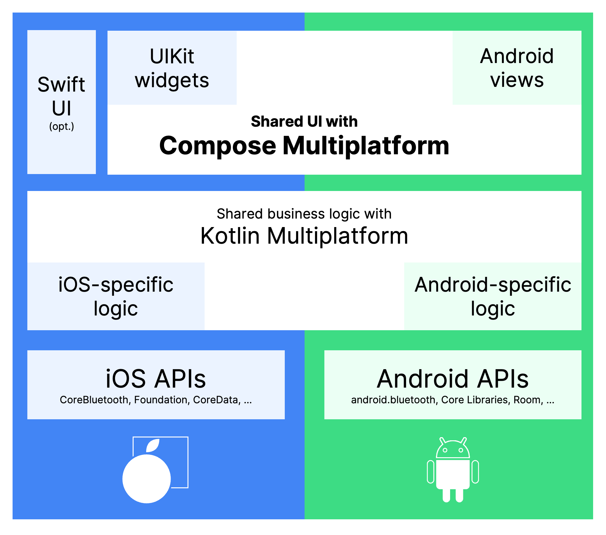

# Let's jump right in

😱But I don't know Kotlin…\.\!

No worries – just getting a feel for things\.

# Lab #1

Worth 0\.5%

At key points\, capture screenshots as indicated\.  Zip those up and upload to Lea\.

# Setup

* [https://kotlinlang\.org/docs/multiplatform\-mobile\-setup\.html](https://kotlinlang.org/docs/multiplatform-mobile-setup.html)
  * Just Step 1\.
* Install Android Studio
  * [https://developer\.android\.com/studio](https://developer.android.com/studio)
  * Choose standard setup when asked
* Install JDK
  * [https://www\.oracle\.com/ca\-en/java/technologies/downloads/](https://www.oracle.com/ca-en/java/technologies/downloads/)
* In Android Studio\, install these plugins:
  * Kotlin Multiplatform Mobile Plugin \(then Restart IDE\)
  * Compose Multiplatform Plugin
* On Mac at home: Xcode\, Homebrew\, kdoctor\, cocoapods \(see next slide\)
  * Macs at JAC should be properly setup…
* Make sure you have a GitHub account and are signed in\.

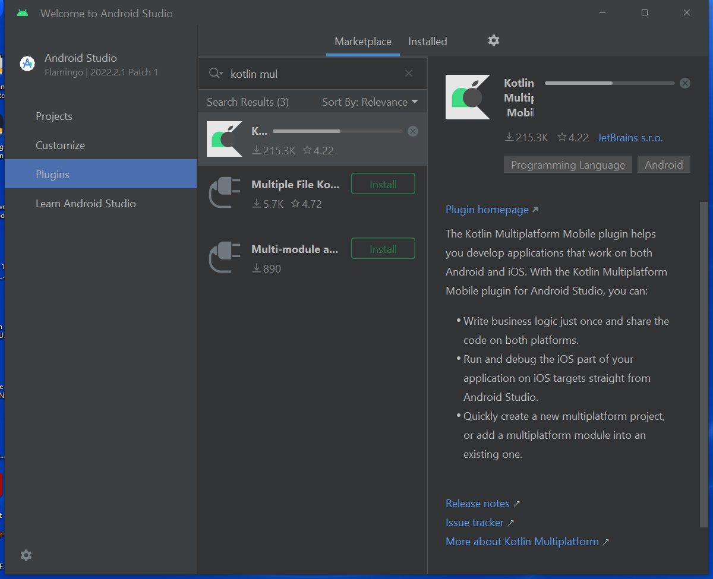

Mac instructions \(Only on your own home machine\)

* Install Java JDK: [https://www\.oracle\.com/ca\-en/java/technologies/downloads/](https://www.oracle.com/ca-en/java/technologies/downloads/)
* Install Homebrew from terminal:
  * /bin/bash \-c "$\(curl \-fsSL [https://raw\.githubusercontent\.com/Homebrew/install/HEAD/install\.sh\)"](https://raw.githubusercontent.com/Homebrew/install/HEAD/install.sh)%22)
* Optional: Run a recommended sudo command \(shown on screen after homebrew install\)
* Install kdoctor from terminal
  * brew install kdoctor
* Optional if you are on your own Mac: Run recommended sudo/setup commands \(shown on screen after kdoctor command\)
  * sudo chown \-R $\(whoami\) /usr/local/share/zsh /usr/local/share/zsh/site\-functions /usr/local/var/homebrew/locks
  * chmod u\+w /usr/local/share/zsh /usr/local/share/zsh/site\-functions /usr/local/var/homebrew/locks
  * sudo chown \-R $\(whoami\) /usr/local/var/homebrew
* Open Xcode \(because it needs to be launched at least once\)
* Run the following sudo command in a terminal to get rid of "first launch" warning in kdoctor if it still appears:
  * sudo xcode\-select \-s /Applications/Xcode\.app/Contents/Developer
  * \(from [https://github\.com/JetBrains/compose\-multiplatform/issues/3186\)](https://github.com/JetBrains/compose-multiplatform/issues/3186))
* sudo gem install activesupport \-v 6\.1\.7\.3
* sudo gem install cocoapods
* Run kdoctor in the terminal\.  You will probably get the following notice
  * ✖ CocoaPods requires your terminal to be using UTF\-8 encoding\.    Consider adding the following to ~/\.bash\_profile    export LC\_ALL=en\_US\.UTF\-8
* In your user folder \(cd ~\)\, create a \.bash\_profile with the contents:    export LC\_ALL=en\_US\.UTF\-8
* Upgrade Android Studio to the latest version \(Flamingo 2022\.2\.1\) if you have an older version installed\.

On a Mac with M1 chip\, you need to use rvm:

[https://jeffreymorgan\.io/articles/ruby\-on\-macos\-with\-rvm/](https://jeffreymorgan.io/articles/ruby-on-macos-with-rvm/)

[https://rvm\.io/rvm/install](https://rvm.io/rvm/install)

[https://kotlinlang\.org/docs/native\-cocoapods\.html\#22e3fe9e](https://kotlinlang.org/docs/native-cocoapods.html#22e3fe9e)

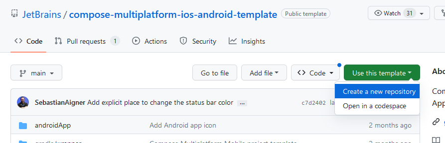

# Compose Multiplatform

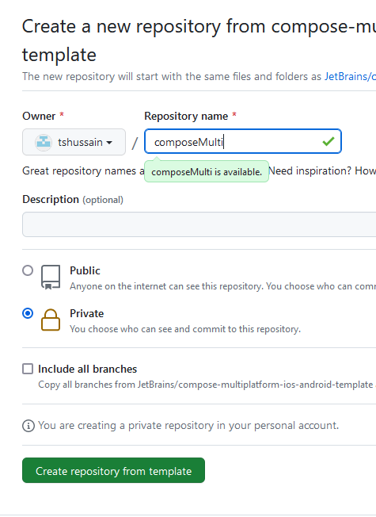

* [https://www\.jetbrains\.com/lp/compose\-multiplatform/](https://www.jetbrains.com/lp/compose-multiplatform/)
* Since Compose Multiplatform is in Alpha for iOS\, we'll grab a template project that JetBrains has created for us\.
* Go to [https://github\.com/JetBrains/compose\-multiplatform\-ios\-android\-template\#readme](https://github.com/JetBrains/compose-multiplatform-ios-android-template#readme)
  * Choose "Use this Template"
  * Then "Create a new repository"
  * Give the repository a name
  * Suggest you make it "Private"

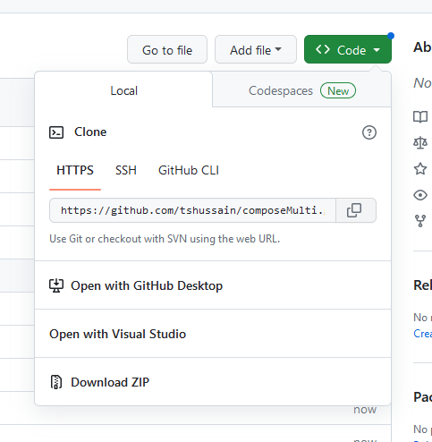

# Load project in Studio

Copy the git clone link for your project\.

In Android Studio\, create a new project by "Get Project from Version Control"

It will take some time to build the project

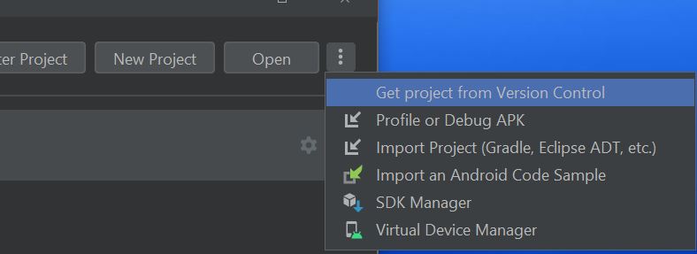

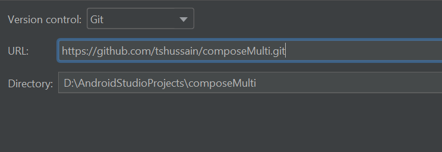

# Let's Explore

* Open the Project pane and explore the directory structure
* Notice the 'shared' folder – This will hold our code that will be in common for both platforms \(Android and iOS\)
* If you are all setup properly\,you should be able to click thegreen Run arrow\.
  * Note: You need to have anemulator installed
  * If not\, load Device Manager paneand "Create Device"
* You should see your app runningin the emulator in the "Running Devices" tab
* Click the "Hello World" button

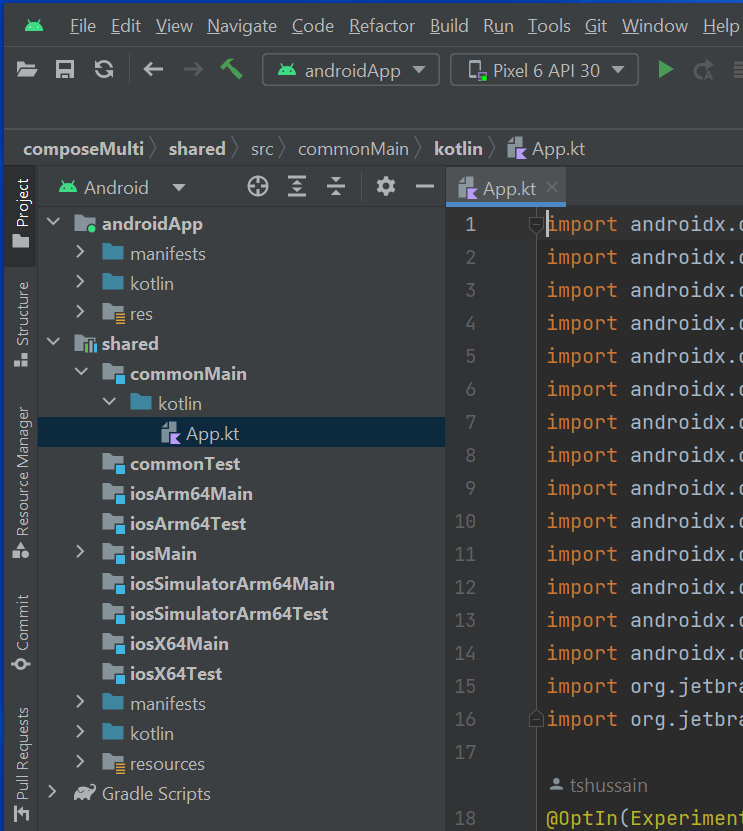

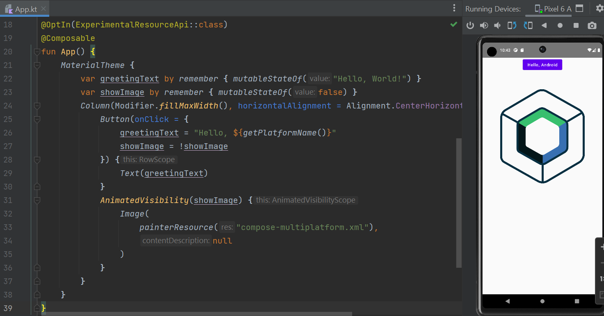

# 

# Similarity to React

* Notice the rough similarity to React JSX
  * Nested UI components
    * @Composable indicates a UI component much like a JSK component
  * Named "properties" on components
    * Really are named parameters to functions in Kotlin
  * "Single Activity" design pattern
    * Similar in rough concept to single page app design of React
  * State management and re\-render UI when state changes

# 

* That sure doesn't look like Java…
* fun?
* var?
* Where are the semi\-colons?
* … ExperimentalResourceApi – yikes\!
  * Welcome to alpha/beta…

# Let's also run it as a Desktop App!

* Device Manager – Create Device
* Pick a desktop and complete the steps\.
  * It may take a while to download\.
* Then Change the run target and run\.

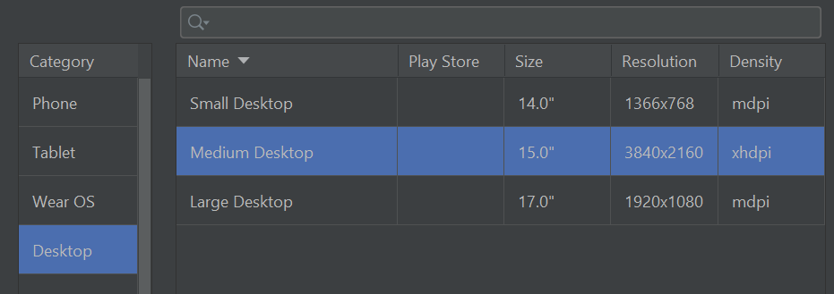

# 

Capture screenshot showing both the desktop and Android emulator running\.

Save with a name like "Lab1\_a"

# Let's run it as an iOS App…

* If you're running a PC\, sign in to a Mac computer online using Splashtop
  * Use chat to say which computer you are using so no 2 people are on the same machine\.
  * Teacher is on BH408\-01\.
* Open a terminal and run kdoctor
* It should give you all green checkmarks except perhaps the following:
  * ✖ CocoaPods requires your terminal to be using UTF\-8 encoding\.    Consider adding the following to ~/\.bash\_profile    export LC\_ALL=en\_US\.UTF\-8
  * If so\, then in your user folder \(cd ~\)\, create a \.bash\_profile with the contents:    export LC\_ALL=en\_US\.UTF\-8
* Open Android Studio and follow the earlier instructions to pull down the sample project\.  Run against an iPhone device\.

# 

* Capture screenshot showing the iOS emulator
  * If you can\, try to get all 3 emulators running on the same screen… cool\.
* Save with a name like "Lab1\_b"
* Upload Lab1\_a & Lab1\_b to Lea\.

# Kotlin

* General\-purpose\, statically\-typed\, open\-source language
* Created by JetBrains – the company who built IntelliJ IDEA and Android Studio
  * v1\.0 released 2016
* It runs on a Java Virtual Machine \(JVM\) and can be used anywhere Java is used
* Somewhat similar to Java\, but has many simplifications in syntax and a variety of modern capabilities\, such as null safety
  * Avoid boilerplate code
  * Avoid specifying types when unnecessary
* Android mobile development has been "Kotlin\-first" since 2019
* Over 95% of the top thousand Android apps use Kotlin\.
  * [https://kotlinlang\.org/docs/android\-overview\.html](https://kotlinlang.org/docs/android-overview.html)
* Used by over 60% of professional Android developers
  * [https://developer\.android\.com/kotlin](https://developer.android.com/kotlin)
* 100% Java interoperable
  * Can call Java code from Kotlin and Kotlin code from Java
  * [https://kotlinlang\.org/docs/java\-interop\.html](https://kotlinlang.org/docs/java-interop.html)
  * [https://kotlinlang\.org/docs/java\-to\-kotlin\-interop\.html](https://kotlinlang.org/docs/java-to-kotlin-interop.html)

# Concepts

Null safety

Composable UI design

Declarative UI

# Intro to Kotlin

* [https://play\.kotlinlang\.org/byExample/overview](https://play.kotlinlang.org/byExample/overview)
* [https://developer\.android\.com/teach\#teach\-a\-class](https://developer.android.com/teach#teach-a-class)
* [https://www\.w3schools\.com/KOTLIN/index\.php](https://www.w3schools.com/KOTLIN/index.php)
* [https://kotlinlang\.org/docs/home\.html](https://kotlinlang.org/docs/home.html)
* [https://eecs441\.eecs\.umich\.edu/](https://eecs441.eecs.umich.edu/)
* [https://www\.slideshare\.net/GoogleDevelopersLeba/android\-development\-with\-kotlin\-course](https://www.slideshare.net/GoogleDevelopersLeba/android-development-with-kotlin-course)
* Codelabs:
  * [https://developer\.android\.com/codelabs/basic\-android\-kotlin\-compose\-functions\#0](https://developer.android.com/codelabs/basic-android-kotlin-compose-functions#0)

# Some basics that are the same as in Java

* Comments //  or /\*  \*/
* Operators: \+ \- \* / % \+\+ \-\- = \+= \-= \*= /= %= == \!= > \< >= <= && || \!
* if / if\-else / if\-else\-if
* while / do\-while
* break / continue / return
  * \(Though Kotlin adds ability to use labels\)
* Index arrays/strings starting at 0
* How to access an array element

# Some basics that differ from Java

* Semicolons are optional
* Declaring functions\, parameters\, return types
* Declaring variables / constants
  * Specifying types is optional
* No primitive types \- All types are objects \(hence capitalized\)
* Using Strings varies in some ways – can use ==  \(\!\!\)
* Easy string interpolation using $
* How to create an array\,  list\, etc\.
  * Use arrayOf\(\)\,  listOf\(\)\, arrayListOf\(\)\, etc

# Functions

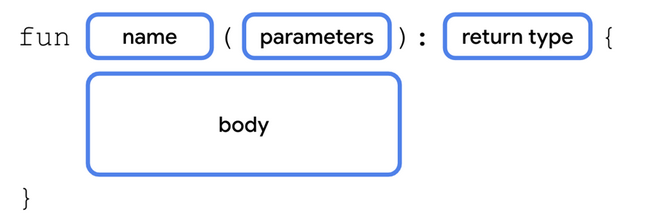

* The  __fun__  keyword is used to declare a function
  * fun main\(\) \{
  * println\("Hello World"\)
  * \}
  * We don't need to add 'public' since public is the default visibility in Kotlin
  * Semicolons are optional\!\!  But\, this means that line breaks are significant\.
* When a function has parameters\, you must specify the type\.
  * The type is written after the parameter name and preceded by a colon
  * fun greeting\(message: String\) \{
  * println\(message\)
  * \}
* If a function returns something\, you must specify the return type
  * The return type is written after the parentheses containing the parameters and preceded by a colon \(and is before the brace\)
  * fun augmentMessage\(message: String\) : String \{
  * return "This is the message: " \+ message;
  * \}
* If a function returns nothing\, you can omit the type or use the special return type  __Unit__
  * No 'void'

# Try it as we go…

In App\.kt\, replace "Hello World" with a call to greeting\(\) with an appropriate argument

In the App\.kt file\, define a function called greeting\.

As we learn more about functions and variables\, play around with the function definition and the function call to try variations out\.

To see the results of a println in Android Studio\, select View > Tool Windows > Logcat

# Functions: Named arguments

  * fun greeting\(name: String\, age: Int\) \{
  * println \("Hello $name\, you are now $age old"\)
  * \}
  * Note: That's string interpolation – cool\.
* Kotlin functions can be called using named arguments
  * A named argument provides the name of the parameter in the calling line with an = sign and the value being passed in
    * greeting\(name="Xing"\, age=15\)
  * Order of named parameters doesn't matter
    * greeting\(age=15\, name="Xing"\) also works
  * Named and positional parameters cannot be mixed unless you retain order

# Functions: Default arguments

* A parameter in a function can be specified with a default value by using the assignment operator and provided the value
  * fun greeting\(name: String = "Unknown"\, age: Int = 10\) \{
  * println \("Hello $name\, you are now $age old"\)
  * \}
  * Some\, all or none may have default values\.
* When calling a function\, a parameter with a default argument may be omitted\.  In that case\, the default value will be used\.
  * Typically\, you will use named parameters when omitting a parameter
  * But\, as long as the omitted parameters are last in the parameter list\, you can use positional parameters as well\.  The following are all valid
    * greeting \(age=5\)
    * greeting\(name="Joe"\)
    * greeting\("Jane"\)
  * These are not valid
    * greeting\(5\)
    * greeting\(age=5\, "Juan"\)

# Single Expression Functions (or "One-Line Functions")

* If you have a function that has just a single expression\, the curly braces are optional
  * fun convertToFahrenheit\(degree : Float\) : Float \{
  * return \(degree \* 9 / 5\) \+ 32
  * \}
* can be simplified to
  * fun convertToFahrenheit\(degree : Float\) = \(degree \* 9 / 5\) \+ 32
* Applies for almost every type of expression:
  * fun getResult\(percentage : Int\) = if \(percentage > 40\) "Pass" else "Fail"

# Variables

* The  __var__  keyword is used to declare a variable that may change in value
* The  __val__  keyword is used to declare a constant
  * var name = "Joe"
  * val birthyear = 1985
* Use of val is recommended where possible\.
* Cool feature  We don't have to specify a type – Kotlin will figure it out based on the first assignment\.
  * Once a type is assigned\, it can't be changed\.
* But\, we can still specify a type if we wish\.  Unlike Java\, the type is written after the variable name and preceded by a colon
  * var name: String = "Joe"
  * val birthyear: Int = 1985

# Types

* Main types are:
  * Int
  * Double
  * Char
  * Boolean
  * String
  * Also: Float\, Long\, Short
  * Note: All capitalized\.
* Conversion:
  * You can convert one type to another using a toXXX\(\) method on the object
    * value1\.toInt\(\)
    * value2\.toString\(\)
* Still have Double\.MIN\_VALUE\, etc\.

# Note: Similarity to other languages

* Notice how using optional named parameters with default values in Kotlin results in an effect similar to JSX specifying a component with only some props specified
* Functions: Similarity to Swift
  * Note: There is a lot of similarity of syntax with Swift here
  * Use of "fun" is close to "func" in Swift
  * Specification of type using colon after the parameter name
  * Specification of return type after parameter list \(but with colon instead of arrow\)
  * Named parameters \(but some rules are a bit different\)
    * In Kotlin\, don't have to use names of parameters when calling the function \(in Swift\, need to add underscore in order avoid using name\, and then can't use name at all\)
    * No argument labels
* Variables: Similarity to Swift
  * Same use of colon notation with type after variable name
  * Same use of var
  * val instead of let for constants
* Types: Similarity to Swift
  * Most type names are the same \(Char instead of Character\)
* [https://www\.kodeco\.com/6754\-a\-comparison\-of\-swift\-and\-kotlin\-languages](https://www.kodeco.com/6754-a-comparison-of-swift-and-kotlin-languages)

