# Related Technologies for Multiplatform Applications

# 420-731-AB
Instructor: Talib Hussain

Day 7: Database

# Objectives

Connecting up to MongoDb

MVVM \(Model\-View\-ViewModel\)

Coroutines

# Navigation Bar

[https://itnext\.io/navigation\-bar\-bottom\-app\-bar\-in\-jetpack\-compose\-with\-material\-3\-c57ae317bd00](https://itnext.io/navigation-bar-bottom-app-bar-in-jetpack-compose-with-material-3-c57ae317bd00)

Let's build a navigation bar\, similar to the one in the article above\, but using Voyager navigation\.

# MVVM – Model-View-ViewModel

* MVVM is an architectural pattern that seeks to separate the presentation of data in an application from the data itself\.
  * A general approach used across many systems/languages
  * Also is a specific approach used in Android \(with an actual ViewModel class\)
* A ViewModel plays a key role of getting data from the model and organizing it in the way that is needed by the View\.
* The View simply displays the data in the ViewModel
* The Model contains any business logic regarding the data\, as well as provides access to the stored data\.

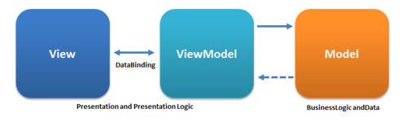

# ScreenModel

* ScreenModel is just like a ViewModel \(from Android approach\)\.
  * It is designed to store and manage UI\-related data in a lifecycle conscious way\.
  * It also allows data to survive configuration changes such as screen rotations\.
* ScreenModel is Android independent and doesn't require an Activity or Fragment to work\.
* By design\, it's only possible to create a ScreenModel instance inside a Screen\. Call rememberScreenModel and provide a factory lambda\.
* [https://voyager\.adriel\.cafe/screenmodel](https://voyager.adriel.cafe/screenmodel)

# High-Level Idea

class HomeScreenModel : ScreenModel \{

\}

class HomeScreen : Screen \{

@Composable

override fun Content\(\) \{

val screenModel = rememberScreenModel \{ HomeScreenModel\(\) \}

// \.\.\.

\}

\}

# Walkthrough

Take a look at PersonsListScreenModel and PersonRepository in detail to get an idea of the distinction between "ViewModel" and "Model"

# MongoDb Plugin Installation

* In order to use MongoDb with our app\, we need to install "Realm"\, MongoDb's plugin to support Kotlin Multiplatform
  * Installation instructions at this link\.  Relevant instructions for us are below\.  [https://www\.mongodb\.com/docs/realm/sdk/kotlin/install/\#installation](https://www.mongodb.com/docs/realm/sdk/kotlin/install/#installation)
* Add the following to the "plugins" section in build\.gradle\.kts in shared/commonMain
  * id\("io\.realm\.kotlin"\) version "1\.9\.1"
* If you scroll down further\, you will see a section in the build\.gradle\.kts that starts with the following
  * sourceSets \{
  * val commonMain by getting \{
  * dependencies \{
* Add the following to that  __commonMain__  "dependencies" section \(make sure not to put it in a different dependencies section\)
  * implementation\("io\.realm\.kotlin:library\-sync:1\.9\.1"\)
* From the File menu\, choose option "Sync Project with Gradle Files"
* This article has lots of information\, but not everything is relevant directly since we are using the Voyager ScreenModel approach\.
  * [https://www\.mongodb\.com/developer/products/realm/getting\-started\-kmm\-flexiable\-sync/\#building\-a\-more\-complex\-app](https://www.mongodb.com/developer/products/realm/getting-started-kmm-flexiable-sync/#building-a-more-complex-app)

# Realm

* Realm Database is a reactive\, object\-oriented\, cross\-platform\, mobile database:
  * __Reactive__ : query the current state of data and subscribe to state changes like the result of a query\, or even changes to a single object\.
  * __Object\-oriented__ : organizes data as objects\, rather than rows\, documents\, or columns\.
  * __Cross\-platform__ : use the same database on iOS\, Android\, Linux\, macOS\, or Windows\. Just define a schema for each SDK you use\.
  * __Mobile__ : designed for the low\-power\, battery\-sensitive\, real\-time environment of a mobile device\.
* You can also synchronize data between Realm Database and MongoDB Atlas using Atlas Device Sync\.
* [https://www\.mongodb\.com/docs/realm/sdk/kotlin/realm\-database/](https://www.mongodb.com/docs/realm/sdk/kotlin/realm-database/)

# Schema

* Every realm object has a schema\.
* The Schema maps Realm objects directly to native Kotlin objects\.
  * Realm objects are regular Kotlin classes\, and you can work with them as you would any other class instance\.
* The following schema defines a Car object type with make\, model\, and miles properties
  * class Car : RealmObject \{
  * var \_id: ObjectId = ObjectId\(\)
  * var make: String = ""
  * var model: String = ""
  * var miles: Int = 0
  * \}
* __There __  _must be_  __ a primary key property named '\_id' on a __  _synchronized Realm_
  * Synchronized means you are storing information in the cloud not on your device\.
* [https://www\.mongodb\.com/docs/realm/sdk/kotlin/realm\-database/schemas/define\-realm\-object\-model/\#std\-label\-kotlin\-define\-object\-model](https://www.mongodb.com/docs/realm/sdk/kotlin/realm-database/schemas/define-realm-object-model/#std-label-kotlin-define-object-model)

# Realm Object

* To define a Realm object type:
  * Create a uniquely named Kotlin class that implements the RealmObject or EmbeddedRealmObject interface\.
  * Add fields to your class\. You can add any supported data types as a field in your class\.
  * Add any property annotations to give Realm additional information about a property\, including whether Realm should ignore the property or should be indexed\.
    * [https://www\.mongodb\.com/docs/realm/sdk/kotlin/realm\-database/schemas/property\-annotations/\#std\-label\-kotlin\-property\-annotations](https://www.mongodb.com/docs/realm/sdk/kotlin/realm-database/schemas/property-annotations/#std-label-kotlin-property-annotations)
* [https://www\.mongodb\.com/docs/realm/sdk/kotlin/realm\-database/schemas/define\-realm\-object\-model/\#std\-label\-kotlin\-define\-object\-model](https://www.mongodb.com/docs/realm/sdk/kotlin/realm-database/schemas/define-realm-object-model/#std-label-kotlin-define-object-model)

# @PrimaryKey

* Realm Database treats fields marked with the @PrimaryKey annotation as primary keys for their corresponding object schema\.
  * The primary key is a unique identifier for an object in a realm\.
  * No other objects of the same type may share an object's primary key\.
  * There must be a primary key property named '\_id' on a synchronized Realm
* You can create a primary key with any of the following types:
    * String\, Byte\, Char\, Short\, Int\, Long\, ObjectId\, RealmUUID
* Important aspects of primary keys:
  * You can define only one primary key per object schema\.
  * You cannot change the primary key field for an object type after adding any object of that type to a realm\.
  * Primary key values must be unique across all instances of an object in a realm\. Attempting to insert a duplicate primary key value results in an error\.
  * Primary key values are immutable\. To change the primary key value of an object\, you must delete the original object and insert a new object with a different primary key value\.
  * Primary keys are nullable\. null can only be the primary key of one object in a collection\.
  * Realm automatically indexes primary keys\, so you can efficiently read and modify objects based on their primary key\.

# e.g., Frog class

class Frog\(\) : RealmObject \{

@PrimaryKey

var \_id: ObjectId = ObjectId\(\)

var name: String = ""

var age: Int = 0

var species: String = ""

var owner: String = ""

\}

# Open a Realm

* When you open the realm\, you must provide a list of object schemas as an argument\.
* If a realm already contains data when you open it\, Realm Database validates each object to ensure that an object schema was provided for its type and that it meets all of the constraints specified in the schema\.
* To open a realm that runs entirely in memory without being written to a file use \.inMemory property
  * val config = RealmConfiguration\.Builder\(setOf\(Frog::class\)\)
  * \.inMemory\(\)
  * \.build\(\)
  * val realm = Realm\.open\(config\)
  * println\("Successfully opened an in memory realm"\)
* To open a realm that writes to file\, omit the inMemory property\.
* [https://www\.mongodb\.com/docs/realm/sdk/kotlin/realm\-database/realm\-files/open\-and\-close\-a\-realm/\#std\-label\-kotlin\-open\-a\-realm](https://www.mongodb.com/docs/realm/sdk/kotlin/realm-database/realm-files/open-and-close-a-realm/#std-label-kotlin-open-a-realm)

# Writes

* Because the create\, update\, and delete operations modify the state of the realm\, we call them writes\.
* Realm handles writes in terms of  __transactions__ \.
* A transaction is a list of read and write operations that Realm treats as a single indivisible operation\.
  * In other words\, a transaction is  _all or nothing_ : either all of the operations in the transaction succeed or none of the operations in the transaction take effect\.
* A realm allows only one open write transaction at a time\.
  * Realm blocks other writes on other threads until the open transaction is complete\.
  * Consequently\, there is no race condition when reading values from the realm within a transaction\.
* [https://www\.mongodb\.com/docs/realm/sdk/kotlin/realm\-database/write\-transactions/](https://www.mongodb.com/docs/realm/sdk/kotlin/realm-database/write-transactions/)

# "Create"

* Sample syntax
  * realm\.write \{
  * // create a frog object in the realm
  * val frog = this\.copyToRealm\(Frog\(\)\.apply \{
  * name = "Kermit"
  * age = 45
  * species = "Green"
  * owner = "Jim"
  * \}\)

# Find

* find\(\) is Synchronous
  * find\(\) runs a synchronous query on the thread it is called from\.
* As a result\, avoid using find\(\) on the UI thread or in logic that could delay the UI thread\.
* Find Object by Primary Key
  * To find an object with a specific primary key value\, open a realm and query the primary key field for the desired primary key value using realm\.query\(\)\. Specify the object type as a type parameter passed to query\(\):
    * // Search equality on the primary key field name
    * val frogs: Frog? = realm\.query\<Frog>\(Frog::class\, "\_id == $0"\, PRIMARY\_KEY\_VALUE\)\.first\(\)\.find\(\)
* Query Language:
  * https://www\.mongodb\.com/docs/realm/realm\-query\-language/
* [https://www\.mongodb\.com/docs/realm/sdk/kotlin/realm\-database/crud/read/\#std\-label\-kotlin\-read\-objects](https://www.mongodb.com/docs/realm/sdk/kotlin/realm-database/crud/read/#std-label-kotlin-read-objects)

# Kotlin Coroutine

* Coroutines offer asynchronous programming support at the language level in Kotlin\.
* A  _coroutine_  is an instance of suspendable computation\.
  * It is conceptually similar to a thread\, in the sense that it takes a block of code to run that works concurrently with the rest of the code\.
  * However\, a coroutine is not bound to any particular thread\. It may suspend its execution in one thread and resume in another one\.
  * Coroutines can be thought of as light\-weight threads\.
* Compose offers APIs that make using coroutines safe within the UI layer
* The rememberCoroutineScope function returns a CoroutineScope with which you can create coroutines in event handlers and call Compose suspend APIs\.
* Try this:
  * fun main\(\) = runBlocking \{ // this: CoroutineScope
  * launch \{ // launch a new coroutine and continue
  * delay\(1000L\) // non\-blocking delay for 1 second \(default time unit is ms\)
  * println\("World\!"\) // print after delay
  * \}
  * println\("Hello"\) // main coroutine continues while a previous one is delayed
  * \}

# Voyager – Screen model and Coroutine Scope

* The ScreenModel provides a coroutineScope property\.
  * It's cancelled automatically when the ScreenModel is disposed\.
* [https://voyager\.adriel\.cafe/screenmodel/coroutines\-integration](https://voyager.adriel.cafe/screenmodel/coroutines-integration)
  * class PostDetailsScreenModel\(
  * private val repository: PostRepository
  * \) : StateScreenModel<PostDetailsScreenModel\.State>\(State\.Init\) \{
  * sealed class State \{
  * object Init : State\(\)
  * object Loading : State\(\)
  * data class Result\(val post: Post\) : State\(\)
  * \}
  * fun getPost\(id: String\) \{
  * coroutineScope\.launch \{
  * mutableState\.value = State\.Loading
  * mutableState\.value = State\.Result\(post = repository\.getPost\(id\)\)
  * \}
  * \}
  * \}

# Update

* Find followed by change to object\, all in a write block
  * realm\.write \{
  * // fetch a frog from the realm by primary key
  * val frog: Frog? =
  * this\.query\<Frog>\("\_id == $0"\, PRIMARY\_KEY\_VALUE\)\.first\(\)\.find\(\)
  * // modify the frog's age in the write transaction to persist the new age to the realm
  * frog?\.age = 42
  * \}
* [https://www\.mongodb\.com/docs/realm/sdk/kotlin/realm\-database/crud/update/](https://www.mongodb.com/docs/realm/sdk/kotlin/realm-database/crud/update/)

# Delete

* Inside a write block\, find the object\, then call delete\(object\)
* [https://www\.mongodb\.com/docs/realm/sdk/kotlin/realm\-database/crud/delete/](https://www.mongodb.com/docs/realm/sdk/kotlin/realm-database/crud/delete/)
  * realm\.write \{
  * // fetch the frog by primary key value\, passed in as argument number 0
  * val frog: Frog =
  * this\.query\<Frog>\("\_id == $0"\, PRIMARY\_KEY\_VALUE\)\.find\(\)\.first\(\)
  * // call delete on the results of a query to delete the object permanently
  * delete\(frog\)
  * \}

# Later

Sync [https://www\.mongodb\.com/docs/realm/sdk/kotlin/sync/](https://www.mongodb.com/docs/realm/sdk/kotlin/sync/)

Authentication: [https://www\.mongodb\.com/docs/realm/sdk/kotlin/users/authenticate\-users/](https://www.mongodb.com/docs/realm/sdk/kotlin/users/authenticate-users/)

Notifications / Change listeners / Flows: [https://www\.mongodb\.com/docs/realm/sdk/kotlin/realm\-database/react\-to\-changes/](https://www.mongodb.com/docs/realm/sdk/kotlin/realm-database/react-to-changes/)

Handle Errors: [https://www\.mongodb\.com/docs/realm/sdk/kotlin/realm\-database/errors/](https://www.mongodb.com/docs/realm/sdk/kotlin/realm-database/errors/)

User Authentication

[https://www\.mongodb\.com/docs/realm/sdk/kotlin/users/authenticate\-users/](https://www.mongodb.com/docs/realm/sdk/kotlin/users/authenticate-users/)

# Sign in to MongoDb

If you don't have one already\, create an account on MongoDb

Go to [www\.mongodb\.com](http://www.mongodb.com/) and sign up \(click on "Try Free"\)

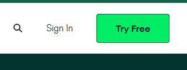

# Setup MongoDb

* First\, let's get started with MongoDB
* Go to [www\.mongodb\.com](http://www.mongodb.com/) and sign up \(click on "Try Free"\)
* Once signed up and signed in\, create a free tier cluster in 3 steps
  * Click "Build a Database"\, then select the free tier and click "Create"\, and finally select "Create Cluster"

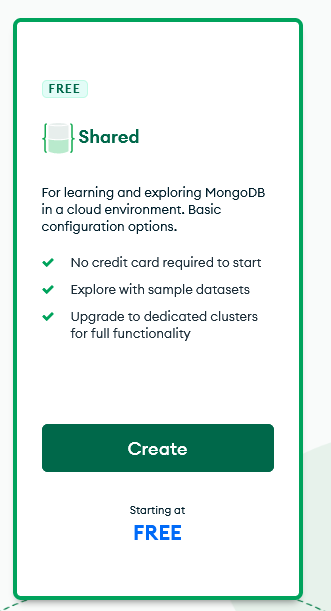

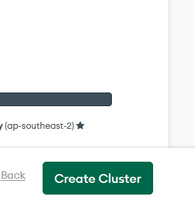

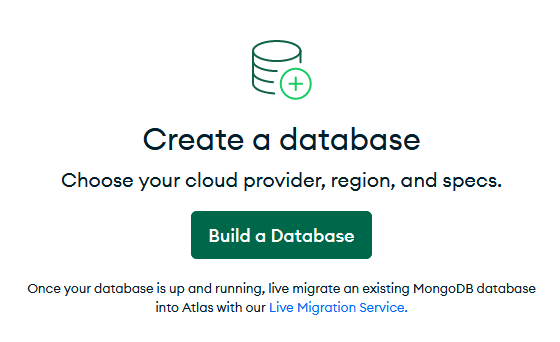

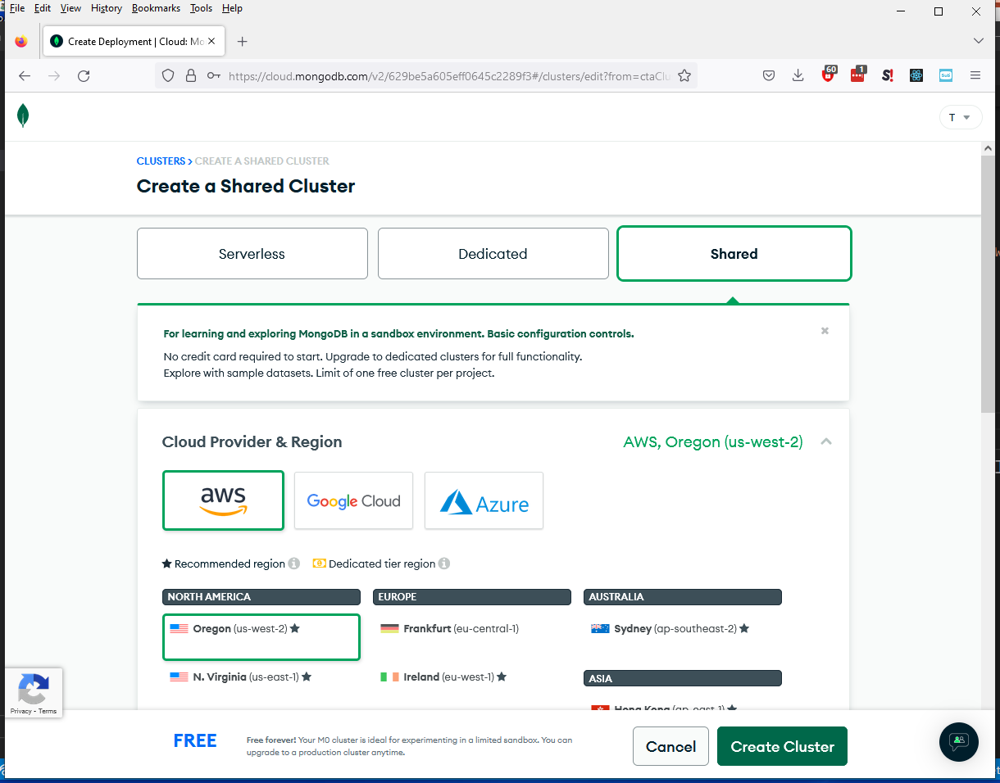

# 

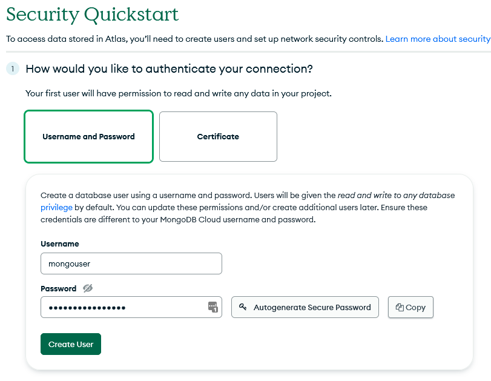

* Create a User
  * Enter username \(e\.g\.\, mongouser\)
    * This should not be the same as your MongoDb username\.  This is for accessing the new database remotely\.
  * Enter or generate a secure password
    * Do not use @ % or :
    * Make sure to hit the copy button
    * Then\, go to VS code and store the password as follows in your \.env file and save the file
      * MONGODB\_PWD="\<pasted\-password>"
  * Click "Create User"
* Enter 0\.0\.0\.0 in the IP address section and click "Add Entry"
* Click "Finish and Close"

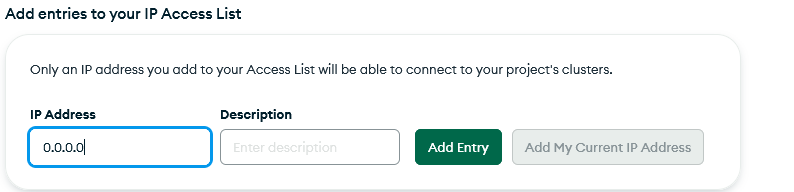

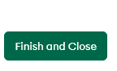

# Mongo Atlas: Create Project

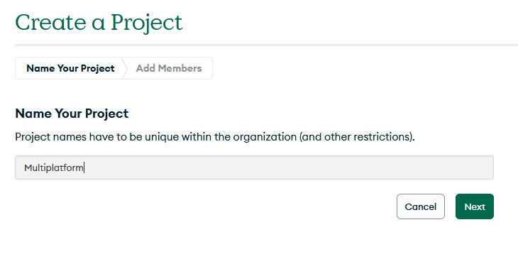

# 

Click on App services tab and select "Real\-time Sync" template

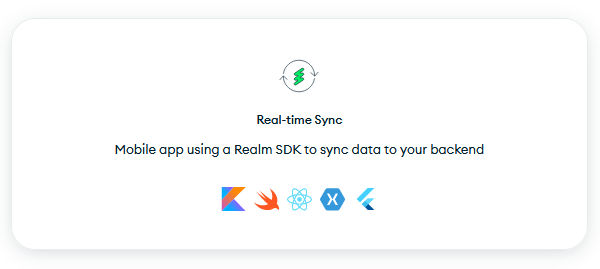

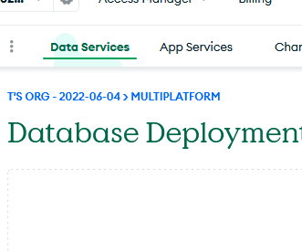

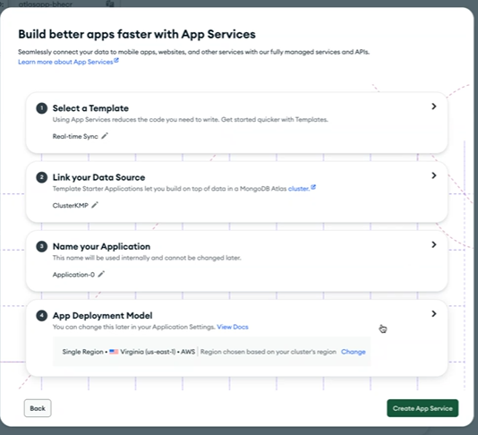

If you want\, in step 3\, changethe default name of the application

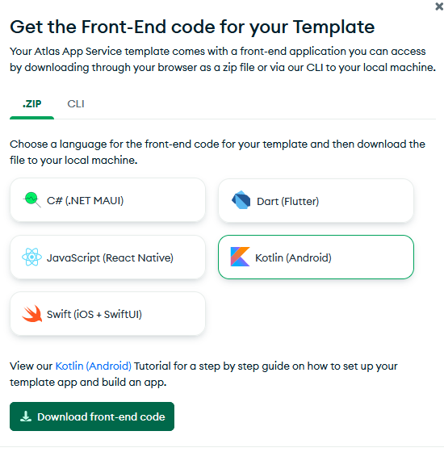

When prompted\, choose "Kotlin \(Android\)" front\-end code and download

Note: You don't need this \(and the code is complicated\)\, but you can use it to explore\.

# Create an API key

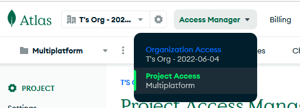

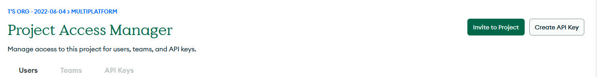

Or\, you might see this green icon\, depending where you go in the web site

# Create API Key

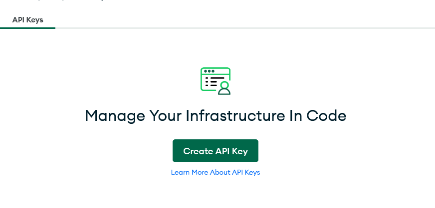

* Store the private key somewhere for the future \(we won't really use it yet\)
  * XXXXXXXX\-XXXX\-XXXX\-XXXX\-XXXXXXXXX
* Store the public keyfor the future
  * XXXXXXXX

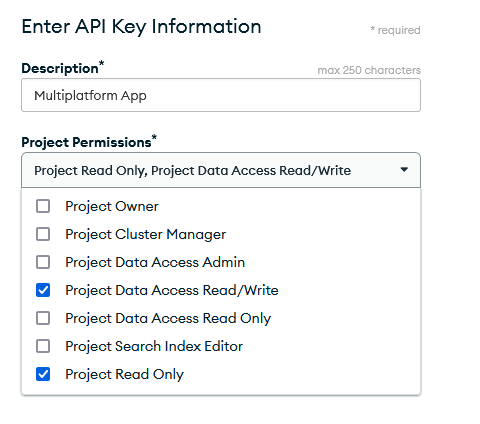

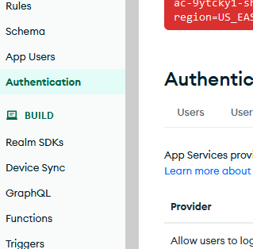

# Turn on API key authentication

Go back to app services\, and click on the authentication menu item on the left

Copy and store this API key – We will actually use this one in our code

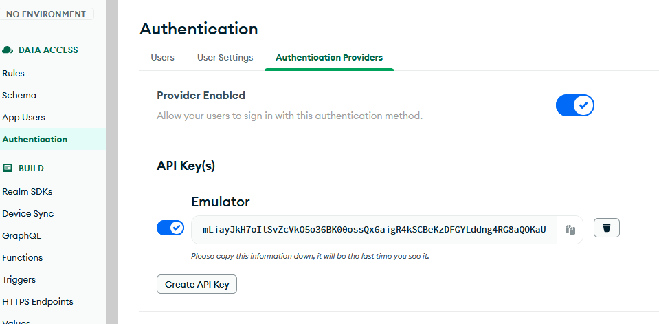

# App ID

* Copy and store your Application ID \(e\.g\.\, application\-0\-xvssy\)
  * We will actually use this one in our code

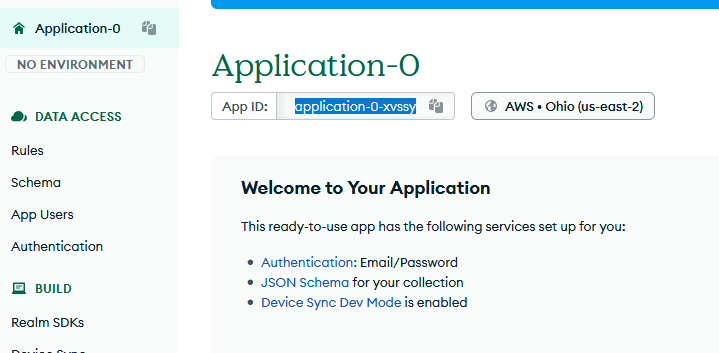

# 

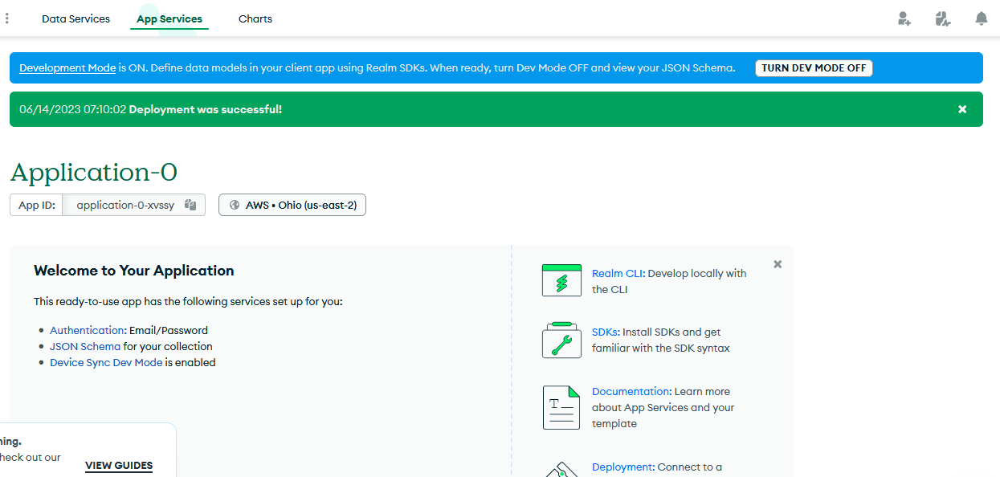

# Afternoon Exercise

* Look through the Frog / FrogRepository\* / FrogScreenModel and FrogScreen files posted to Teams\.
  * These show an end\-to\-end MVVM for storing and retrieving Frogs\.
  * To "hook these up" for now and run them\, just replace the Screen that is used in your MainApp\.kt to use be FrogScreen instead\.
  * Caveat: There are some errors connecting to MongoDb in the sync version\.  The Local version should work\.
* Based on this\, write a set of appropriate MVVM files for your own project\.
* These will form the basis for your next assignment\.
* To be continued tomorrow…

