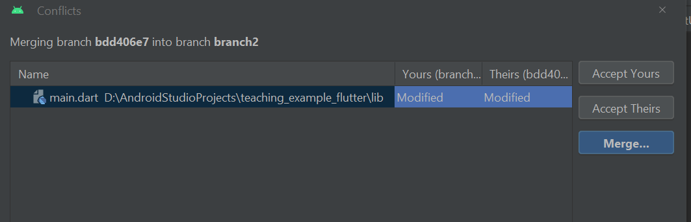

# Related Technologies for Multiplatform Applications

# 420-731-AB
Instructor: Talib Hussain

Day 15: Projects & Git

# Objectives

Milestone 2 Demos

Exercise 12 \- Git

Work on Projects

# Some Config Fixes

* Here are a few fixes to avoid misc\. compile/build issues when using a device \(Note: using Chrome Web doesn't have these issues\, but we do want to be able to use devices\.\) With A&B\, I was able to get the sample code I shared with you Friday to run on both iOS and Android \- quickly and with no issues\.
* You should do a flutter clean after making the changes below\. You will then need to do a "pub get" by opening up your pubspec\.yaml file and clicking the pub get button near the top\. \(Or run "flutter pub get" from the terminal\)
* A\. There are a couple issues due to the minimum sdk being too low\. We need to change that to 21\. The simplest way to do that is to change a line in your flutter install\. Go to the folder where you installed flutter and edit the following file: flutter/packages/flutter\_tools/gradle/flutter\.gradle\. Change midSdkVersion from 16 to 21\.
* B\. Seriously long build times on iOS \(like half an hour\!\) You can change that to ~3 minutes as follows:
  * Following the suggestion of [https://joshuamdeguzman\.com/blog/improve\-flutter\-firestore\-build/](https://joshuamdeguzman.com/blog/improve-flutter-firestore-build/)
  * 1\. in the ios folder of your project\, delete the Podfile\.lock
  * 2\. Then\, edit Podfile to add the following line in the Runner target \(see the link above for specific guidance on location of edit\)\. This will install a precompiled pod that saves build time\.
  * pod 'FirebaseFirestore'\, :git => '[https://github\.com/invertase/](https://github.com/invertase/firestore-ios-sdk-frameworks.git%27)[firestore\-ios\-sdk\-frameworks\.git](https://github.com/invertase/firestore-ios-sdk-frameworks.git%27)['](https://github.com/invertase/firestore-ios-sdk-frameworks.git%27)\, :tag => '10\.10\.0'
  * Note: We should be using version 4\.8\.1 of cloud\_firestore \(in pubspec\.yaml\) so that means we need 10\.10\.0 of firebaseFirestore in the tag above\. If you have a different version of cloud\_firestore\, that tag number may need to be changed\.
* C\. There is one more error that sometimes occurs regarding the need for Google Play store on Android \(This is a spurious error \- it is not needed for the firebase capabilities we are using\. It is sometimes needed for some other firebase capabilities\)\. Try doing A above\, followed by flutter clean & pub get\. The next time you run\, the issue may go away \(it did for me\)\. If it still remains\, this is probably most easily resolved by installing a device that actually has the playstore\. If you want to try to fix the underlying issue\, this link has a suggestion\, but I did not try it out: [https://stackoverflow\.com/questions/69693097/flutter\-firestore\-throwing\-google\-playstore\-exception\-on\-emulator](https://stackoverflow.com/questions/69693097/flutter-firestore-throwing-google-playstore-exception-on-emulator)

# Groupwork Setup

* Share Firebase project with teammates
  * Probably best to give everyone "owner" status\.
  * [https://support\.google\.com/firebase/answer/7000272?hl=en](https://support.google.com/firebase/answer/7000272?hl=en)
* Share a GitHub repository
  * Make sure all the firebase setup files \(which may show up as "unversioned files"\) in the commit window have been added to git\, committed and pushed\.
  * All team members are responsible for ensuring that the main branch remains "healthy"\.
* Do not work in main\.  Only work in branches\.
  * Merge when your code is in a working state\, not when it has issues\.
  * Be careful to test changes before merging into main\.
  * Be careful to communicate properly when merging into main\.
* Choose a shared approach for tracking tasks & task progress
  * Shared document \(e\.g\.\, Google Sheet\)
  * GitHub Issues
  * Variety of other online task/issue tracker software available
  * Keep this up\-to\-date\.  Consult this tracker periodically when you meet as a group to make sure nothing "falls through the cracks"
* At least one team member should have a working Mac setup and be responsible for testing that your project works on an iOS device/emulator\.

# Some Git Basics

* These links provide additional details\.  The first one has easier to understand images
  * [https://www\.atlassian\.com/git/tutorials/using\-branches/git\-merge](https://www.atlassian.com/git/tutorials/using-branches/git-merge)
  * [https://www\.varonis\.com/blog/git\-branching](https://www.varonis.com/blog/git-branching)
  * [https://git\-scm\.com/book/en/v2/Git\-Branching\-Basic\-Branching\-and\-Merging](https://git-scm.com/book/en/v2/Git-Branching-Basic-Branching-and-Merging)
* Creating Branches
  * Essentially creates a "fork" so you can make changes that don't affect the original
  * You usually branch off of "main"\, but you can also branch off of a branch or an old commit\.
  * Why create a branch  so you can work on a task without affecting other people or even other tasks you are working on\.
  * How long should you work on a branch  Usually until the task is complete or until a key milestone/subtask for a larger task is complete
  * Naming \-> Use branch names that are meaningful and related to the task\.  You can also create exploratory branches and name them accordingly\.
* Making commits on a branch
  * Commit as usual\.  Will only affect local branch until pushed\.  Then the remote branch with the same name will be updated too \(and created remotely if not already there\)\.
* Switching to a different branch
  * You can explicitly "Check out" a branch\. \[Git \-> Branches \-> Select local or remote branch\]
  * This means all the files in Android Studio are now in the state they were as of that branches last commit\.
  * Any new changes you make and commit will happen only on that branch
  * You will want to commit any changes you have made before switching to a branch or they will be lost\.
* Exploring an old commit
  * Implicitly: "Checking out" a commit\.
  * You can then create a branch from that commit explicitly \[Git \-> Branches \-> New Branch\]

* History
  * You can access the Git log to view the history of commits \[Git \-> Show Git Log\]
* Comparisons
  * At any time\, you can get details on past version of a given file\.
  * Most often\, you want to see the changes you made in that file since the last commit\.
    * In Project Explorer or editor tab name\, right\-click on file name\, choose Git \-> Show Diff
  * But\, you can also
    * "Show History" to see the history of changes for a particular file \(only those commits where you changed that file will appear\)
    * "Compare with Branch" or "Compare with Revision" to compare it to an earlier version\.  "Revision" here means an earlier commit\.
* Merging your branch with main
  * "Fast forward" merge when main hasn't changed in the meantime
  * When main has changed since you created your branch\, first merge main into your branch\, then resolve conflicts\.  Commit those changes in your branch\.  Then switch to main and merge your branch into main\.  This is a 3\-way merge done the safest way\.
* Resolving merge conflicts
  * When changes have been made to the same file in your branch and on main
  * Git tries to auto merge where possible \(e\.g\.\, a new function introduced here and a different new function there don't conflict\, so add both functions into the merged version\)
  * Git will flag a conflict when it cannot resolve it automatically\.  The IDE will then provide you with a merge conflict view where you can see both original versions and the merged version\.  You can use the UI to keep the changes you want\, delete the changes you don't want and/or edit in place\. \(e\.g\.\, both added a new parameter to a function\, so keep both parameters since they are different\, or both added a parameter to do the same thing but named it differently – just keep one parameter and choose one name to use\)
* Everything in GIT can also be done in a terminal at a command line\, but probably easiest to stick with Android Studio UI approach for now\.

# Exercise 12 - Git

Worth 0\.5%

Let's learn about making and merging branches in Git\.

# Exercise 12

* Create a branch \[Git \-> New Branch\]  Call it Branch1\.
* Create another branch\.  Call it Branch2\.
* Make some changes in Branch2 and commit them\.  When done\, push your changes\.
  * Make several changes and several commits\.  Name the commits something like "branch 2 – change 1"\, etc\.
* Switch to Branch1 \[Git \-> Branches \-> Choose Branch1 \-> "Checkout"\]
* Make some changes in Branch1 and commit them\.  When done\, push your changes\.
  * Make some changes in the exact same place as the changes you made in branch 2\, and some that are in different places\.
  * Again\, make multiple commits with naming like "branch 1 – change 1"\, etc\.
* Merge your Branch1 into main \(may be called master\)\.  This will be a "fast\-forward merge"\.
  * Switch to main \[Git \-> Branches \-> Main/Master \-> Checkout\]
  * Pull to make sure you have all the latest \(there should be no changes\)
  * Merge your Branch1 into main \[Git \-> Merge \-> Select Branch1 from pull\-down and click Merge\]
* Since this is a "fast\-forward"\, there should be no issues\.  If you click commit\, it will say there are no files to commit\.  Why?  Because main now includes the last committed changes from Branch1 – there are no uncommitted changes\.
  * It is still a good idea to run your code to make sure everything works and that you didn't introduce an unintentional error in your branch or in the merge\.
  * If there are issues\, then fix the issues\, commit the changes\.
* Assuming no issues \(code compiles and runs\)\, push main
  * We want the remote repository to be updated with the merge\.
  * Note: Do NOT push until issues are resolved – All your edits to main are still local and you can still "fix" things without affecting your teammates\.

* Now\, switch to Branch2 \("checkout" that branch\)
* Merge main into branch 2 \[Git \-> Merge \-> Choose Main/Master from pull\-down and click merge\]
* You should see a popup indicating that there are some conflicts
* Resolve the merge conflicts by choosing the "Merge" button in the pop\-up window
* This will bring up 3 files in an editor view showing the changes from your branch on one side\, the changes in main on the other\, and a merged view in the middle\.  Use the >> and/or << \(in green below\) to bring the conflicted lines into the merged version\.  Or\, just type what you really want to have in the merged code and dismiss the conflicting changes using the X \(in red below\)
  * Capture a screenshot of your 3\-way merge editor view \(should look similar to the next slide but with your code changes\)

# 

# Exercise 12

* When you have resolved all conflicts in the files\, click "Apply"
* Commit the merges \(still in Branch2\)
  * Provide a meaningful commit message \(e\.g\. "Merged branch2 with main"\)
* Verify the code compiles and runs
  * This is particularly important here since it was not a fast\-forward merge\.
  * Commit \(but don't push\) changes until issues are resolved\.
* Assuming no issues \(code compiles and runs\)\, push Branch2
  * Note: Do NOT push until issues are resolved – All your edits to main are still local and you can still "fix" things without affecting your teammates\.
* Merge your Branch2 into main
  * Switch to main
  * Pull to make sure you have all the latest \(there should be no changes\)
  * Merge your Branch2 into main
* Verify your code works\.  Assuming no issues\, push main
* Explore the git history \[Git \-> Show Git Log\]
  * You should see the two different sets of commits as nodes in "branches" that have "merged" back together\.
  * The specific commit messages from each branch will align with the corresponding "node"\.

# Exercise 12 Wrap-Up

* Capture a screenshot of your Git History from Android Studio
* Go to your Github page\.  Click on the "branches" icon \(circled in red\)\.
* Capture a screenshot showing the list of branches
* Finally\, click the "View Branch Activity" icon \(circled in green above\) on that branches page
* Take a screenshot of the list of commits\.  These should be the same as what you saw in Android Studio\.
  * If they are not\, then you forgot to push\!
* Zip up your screenshots and submit to Lea\.

# Main…

* It is possible that your local git setup may still default to using "master"\.  You can change that default to use "main" if you wish\.  You would need to do this before creating your team's project\.
* Type the following into the terminal:
  * git config \-\-global init\.defaultBranch main
* If you've already setup the project in GitHub\, you can rename the branch\.
  * In GitHub\, Click the "edit button" next to the "master" branch name on the branches page\.
  * Enter "main" as the new name\.
* Then\, the easiest thing to do is to re\-clone your entire project in Android Studio
  * Move your old project to a temporary location
  * In Android Studio\, File –> New Project from Version Control and enter the clone URL from GitHub\.
  * Pub get and rebuild\.
  * Alternatively\, you can try deleting local branches\, but it might not work out…
    * [https://stackoverflow\.com/questions/65606404/can\-i\-change\-the\-default\-git\-branch\-in\-android\-studio](https://stackoverflow.com/questions/65606404/can-i-change-the-default-git-branch-in-android-studio)

