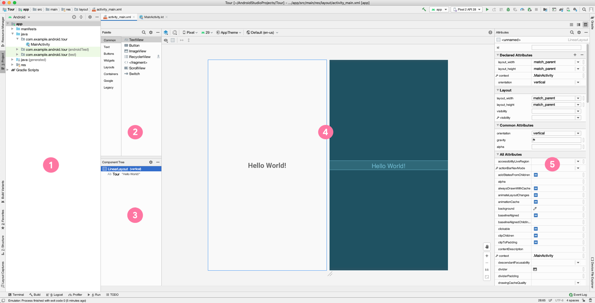
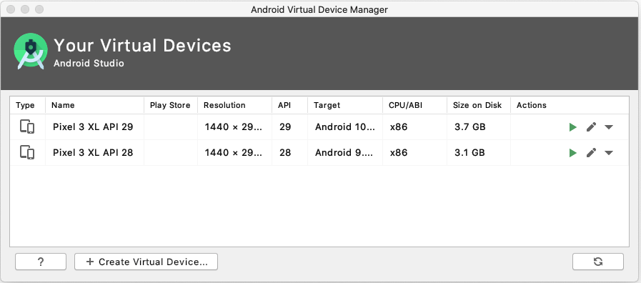
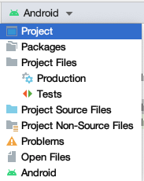
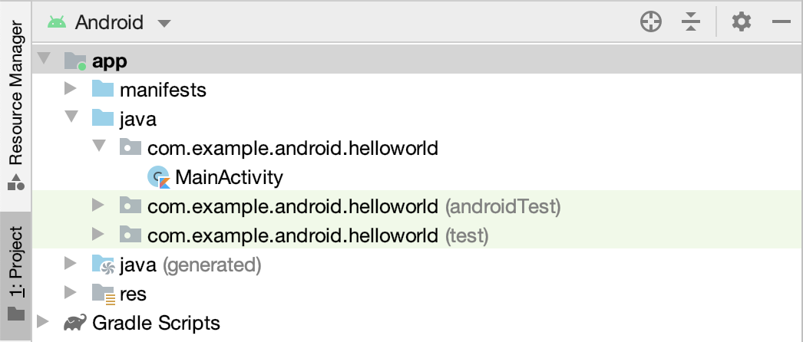

### Project Metadata

- **Name**: Enter a name for your application.
- **Package name**: A globally unique name that represents your app, similar to a web address. This often is the company web domain (defaults to android.example.com) plus the name of the app. If you are not planning to publish your app, you can use the default. You can change this later, but it's extra work.  This will also be the default Java and Kotlin package for your source code.
- **Save location**: This is where your app is stored on your computer. 
- **Language**: Kotlin and the Java programming language are both supported.  For this lesson, select Kotlin.  You can mix Kotlin and Java in different source files in the same project as needed.
- **Minimum SDK**: For this project, make sure the Minimum SDK is API 19: Android 4.4 (KitKat). (Click Help me choose, to see information about API levels.)

Android devices may be running different versions of Android. Each Android release has a:
- Platform Version
- API level (for developers)
- Version Code

When you create an Android project, you'll need to define three API levels: The minimum required for a user to install your app, the user version you are targeting, and the version to use to compile your app:

- **Minimum SDK**: Device needs at least this API level to install
- **Target SDK**: API version and highest Android version tested
- **Compile SDK**: Android OS library version  compiled such that `minSdkVersion <= targetSdkVersion <= compileSdkVersion`

Note that the minimum SDK version has to be less than or equal to the target SDK version, which has to be less than or equal to the compile SDK version. 

As new releases of Android come out, it is good practice to compile and test your app against the latest version of the platform, and increment the compileSdk and targetSdk levels.

### Tour of Android Studio



In this view of Android Studio, you can see the Project window and the Layout Editor. The Layout Editor includes a Palette, a Component Tree, a Design Editor, and an Attributes window.

- Project window shows the files and folders for your project.
- Palette shows the components and layouts that you can drag into your project, such as TextViews, ImageViews, and Buttons.
- Component Tree shows the view hierarchy for your layout. Click a component or layout to show it in the Design Editor.
- Design Editor displays a Design view and a Blueprint view to give you a visual representation of your layout. 
- Attributes window contains a list of properties you can set for your component. 

### Android Virtual Device (AVD) Manager

In addition to running your app on a physical device, you can use the emulator to emulate many different Android form factors with the help of the Android Virtual Device (AVD) Manager. 



Note that you’ll need to download each system image that you want to emulate, since there are many possible options.

## Anatomy of a basic Android app 

- Activity (the source code)
- Resources (layout files, images, audio files, themes, and colors)
- Gradle files

In a basic app project, the main parts to know about are the Activity, the app’s resources, and the gradle files. We’ll cover each topic in more depth in this lesson, but briefly: 

An Activity handles user input and creates a window on the screen to display your user interface. 
Resources are additional files that your code uses, such as layout files, images, audio files, themes, colors, and more. 
Gradle files are scripts that control how your app is built, so that it can be installed on a device. 

### Project structure

```bash
MyApplication
├── app
│   ├── libs
│   └── src
│       ├── androidTest
│       ├── main
│       │   ├── java
│       │   ├── res
│       │   │   ├── drawable
│       │   │   ├── layout
│       │   │   ├── mipmap
│       │   │   └── values
│       │   └── AndroidManifest.xml
│       └── test
├── build.gradle
└── gradlew
```

When you create your first app from a project template, Android Studio generates a project structure similar to this. 

Here’s what each file or directory does: 
- `app`: stores source code, tests, and resources for your app 
- `libs`: stores local libraries your app depends on 
- `androidTest`: test code that’s specific to Android 
- `main`: Source code files
  - `java`: Java and Kotlin source code
  - `res`: Resources directory containing user interface files
- `test`: local unit tests that will execute on your computer
- `AndroidManifest.xml`: declares essential information for your app 
- `build.gradle`: controls how your application builds, tests, and deploys itself 
- `gradlew`: an executable to run gradle, even if it is not already installed

Recommended reading: [App resources in Android](https://developer.android.com/guide/topics/resources/providing-resources)

## File browsing 





Using Android Studio’s Project window, you can browse project files for your app. The Android view, which shows by default (image on the left), is structured for easy access to the files you need for app development. However, the Android view doesn’t reflect the actual file structure of your app (what you would see using the file explorer on your computer). To see how the folders and files actually look on your computer, switch to the Project view in the drop down menu (shown on the right). Feel free to use whichever view you prefer. 

## The View Model

* Views are the user interface building blocks in Android
  * Bounded by a rectangular area on the screen
  * Responsible for drawing and event handling
  * Examples: `TextView`, `ImageView`, `Button`
* Can be grouped to form more complex user interfaces

Android comes with a large set of built-in classes for views (sometimes called widgets). For example, `TextView`, `ImageView`, and `Button` are commonly used views. Each View has different attributes depending on the type of View it is. Example attributes include `width`, `height`, whether it is visible, and more. For a `TextView`, example attributes include font size, font family, and the text to display.  

### XML for View Content

```xml
<TextView
    android:layoutwidth= "wrapcontent"
    android:layoutheight= "wrapcontent"
    android:text= "Hello World!"/>
```

Here’s the XML for displaying a `TextView` in the layout. We see three attributes on the `TextView`: `width`, `height`, and `text`. These attributes are provided by either the base View class (width and height) or by the specific TextView class.

### XML for View Layout

The View Model makes use of XML to specify the layout of user interfaces (including View attributes). Each View in XML corresponds to a class in Kotlin that controls how that View functions.

Android has several ways to specify the width and height of a View. These examples are for the layout_width of a View, but the same applies for the layout_height attribute of a View.

```xml
android:layoutwidth= "wrapcontent"
android:layoutwidth= "matchparent"
android:layoutwidth= "48dp"
```

Use wrapcontent to use only as much space as needed to display the content within the View. For example, if you want the View to be as wide as the text within the TextView, use wrapcontent.

Use matchparent to use the dimension of the parent (such as matching the width of the parent View). For example, if you want the ImageView to take up the full size of the parent, set matchparent for its width and height. 

Lastly, if you want a fixed size for the View, then set a specific dp (density-independent pixels) value. We will be revisiting the concept of dps in the next lesson when we learn more about layouts.

### ViewGroups

A ViewGroup is a container that determines how views are displayed. A ViewGroup is a container for views, and controls how views are organized and laid out on screen.

- Use a `FrameLayout` if you have only one child View. 
- Use a `LinearLayout` to display views in a row or column. 
- Use a `ConstraintLayout` for more complex layouts. 

In general, choose the ViewGroup that meets your needs without being overly complex. For example, if you can get the job done with a `LinearLayout`, then there is no need to use a `ConstraintLayout`.

Let’s look at the XML for some of these ViewGroups:

#### FrameLayout example

A FrameLayout generally holds a single child View:

```xml
<FrameLayout
  android:layoutwidth=   "matchparent" 
  android:layoutheight=   "matchparent">
  <TextView
    android:layoutwidth= "matchparent"
    android:layoutheight= "matchparent"
    android:text= "Hello World!" />
</FrameLayout>
```

In this example, the `FrameLayout` holds a single `TextView`. Note that the closing tag of the `FrameLayout` comes after the child `TextView`.

You can think of `FrameLayout` as a picture frame. It’s only meant to show one thing, so use it to hold a single child View. If you add more than one child within it, the views would overlap, which may be the desired behavior in some cases. 

#### LinearLayout example

`LinearLayout` aligns child views in a row or column using the property `android:orientation`, which can be set to horizontal or vertical.

Here’s an XML example for the `LinearLayout` ViewGroup. `LinearLayout` is the parent for the three child views (two `TextViews` and a `Button`).

```xml
<LinearLayout
  android:layoutwidth="matchparent" 
  android:layoutheight="matchparent" 
  android:orientation="vertical">
  <TextView ... />
  <TextView ... />
  <Button ... />
</LinearLayout>
```

A `LinearLayout` lays out child views in a row or column. The layout direction is determined by the orientation attribute on the `LinearLayout`. In this case, the `LinearLayout` has a “vertical”  orientation, so the layout will look like this diagram. Change the orientation to “horizontal” to have the views grouped in a horizontal row.

### View hierarchy

We’ve talked about how views can have parent - child relationships if they’re placed within a ViewGroup. ViewGroups can also contain other ViewGroups. This creates a hierarchy of views that represent the layout of what’s displayed on the screen.

## App resources

Static content or additional files that your code uses

- Layout files
- Images
- Audio files
- User interface strings
- App icon

In addition to defining your own layouts, you can also add your own images, audio files, strings, app icon, and other resources to the app.

### Common resource directories

Add resources to your app by including them in the appropriate resource directory under the parent res folder.

- The drawable directory stores all files related to drawing images and related assets.
- The layout directory contains all the layout XML files for your application. There may be more than one if your app needs to handle different orientations or densities.
- The mipmap directory contains files for your app icon (known as your launcher icon) at different screen densities.
- The values directory contains files related to simple collections of strings, colors, integers, and styles. If you are localizing your app, you might have more than one values directory.

There are more subdirectories that may appear in the resources directory, but these are the ones that will be present in almost every Android project. 

### Resource IDs

Each resource has a resource ID to access it. When naming resources, the convention is to use all lowercase with underscores (for example, `activitymain.xml`).

Android autogenerates a class file named `R.java` with references to all resources in the app. Individual items are referenced with: `R.<resourcetype>.<resourcename>`

Examples:
- `R.drawable.iclauncher` (`res/drawable/iclauncher.xml`)
- `R.layout.activitymain` (`res/layout/activitymain.xml`)

### Resource IDs for views

Individual views can also have resource IDs.

Add the `android:id` attribute to the View in XML. Use `@+id/name` syntax.

```xml
<TextView
  android:id="@+id/helloTextView" 
  android:layoutwidth="wrapcontent"
  android:layoutheight="wrapcontent"
  android:text="Hello World!"/>
```

If you assign IDs to the views in your layout, you can access them using `R.id.<resourcename>`. For example, this `TextView` has the resource ID name “helloTextView” and you can refer to it in your app using `R.id.helloTextView.` Be sure to use unique resource names so it is clear which element you want to refer to.

## What’s an Activity?

An **Activity** is a means for the user to accomplish one main goal. **All Android apps are composed of one or more activities**.

Examples of activities: 
- Displaying a list of emails
- Displaying details of one specific item
- Taking a photo using the camera 

### MainActivity.kt

Let’s look at the code in `MainActivity.kt`. This was automatically generated because we selected the Empty Activity template in the new project wizard. 

import { Tabs, TabItem } from '@astrojs/starlight/components';

<Tabs>
  <TabItem label="Jetpack Compose">
    ```kotlin
    class MainActivity : AppCompatActivity() {
      override fun onCreate(savedInstanceState: Bundle?) {
        super .onCreate(savedInstanceState)
        setContentView(R.layout.activitymain)
      }
    }
    ```
  </TabItem>
  <TabItem label="View Model">
    ```kotlin
    class MainActivity : AppCompatActivity() {
      override fun onCreate(savedInstanceState: Bundle?) {
        super .onCreate(savedInstanceState)
        setContentView(R.layout.activitymain)
      }
    }
    ```
  </TabItem>
</Tabs>

`MainActivity` extends a base class, inheriting behavior from the Android framework about how an Activity works. AppCompat for app compatibility ensures that newer features are available to legacy versions of Android.

Within the class, we have one function that is overriding the onCreate function that was defined in the superclass. 

### How an Activity runs

Instead of launching a program through the `main()` function as in a normal Kotlin program, Android starts your app through an Activity instance.

- Activity launched
- Activity shut down

Once the user taps your app icon on the device, Android opens your app by launching the main Activity of your app. Specifically, the `onCreate()` method is called when your Activity is created. The `onCreate()` method is just one of the Activity **callback methods** that is invoked from the system at certain stages of the Activity lifecycle. We’ll talk more about the lifecycle in a future lesson. For now, know that your Activity continues to run until the user or system takes action to shut it down. 

## Gradle: Building an Android app 

Building an app is complex, and there are specific tasks that have a sequence they must run in. Android uses Gradle to manage these tasks and build your app. 

### What is Gradle?

- Build automation system
- Manages the build cycle via a series of tasks (for example, compiles Kotlin sources, runs tests, installs app to device)
- Determines the proper order of tasks to run
- Manages dependencies between projects and third-party libraries

Gradle uses a [directed acyclic graph]() to determine which tasks are required for the intended tasks, what order to run them in, and then runs them.

### Gradle build file

- Declare plugins
- Define Android properties
- Handle dependencies
- Connect to repositories

### Repositories

Out on the web, there are collections of libraries organized in repositories. Use the repositories block to specify where to look for them. Gradle will start at the first listed repository and fall through to each subsequent one if it doesn’t find the resource.

```kotlin
repositories {
  google()
  jcenter()
  maven {
    url  "https://maven.example.com"
  }
}
```
