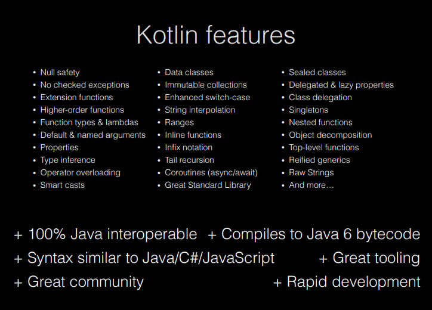

## Kotlin

- General\-purpose, statically\-typed, open\-source language
- Created by JetBrains – the company who built IntelliJ IDEA and Android Studio
  - v1.0 released 2016
- It runs on a Java Virtual Machine (JVM) and can be used anywhere Java is used
- Somewhat similar to Java, but has many simplifications in syntax and a variety of modern capabilities, such as null safety
  - Avoid boilerplate code
  - Avoid specifying types when unnecessary
- Android mobile development has been "Kotlin\-first" since 2019
- Over 95% of the top thousand Android apps use Kotlin.
  - [https://kotlinlang.org/docs/android\-overview.html](https://kotlinlang.org/docs/android-overview.html)
- Used by over 60% of professional Android developers
  - [https://developer.android.com/kotlin](https://developer.android.com/kotlin)
- 100% Java interoperable
  - Can call Java code from Kotlin and Kotlin code from Java
  - [https://kotlinlang.org/docs/java\-interop.html](https://kotlinlang.org/docs/java-interop.html)
  - [https://kotlinlang.org/docs/java\-to\-kotlin\-interop.html](https://kotlinlang.org/docs/java-to-kotlin-interop.html)

## Concepts



Null safety

Composable UI design

Declarative UI

## Similarities with Java

- Comments `//` or `/* */`
- Operators: `+ - * / % ++ -- = += -= *= /= %= == != > < >= <= && || !`
- `if` / `if-else` / `if-else-if`
- `while` / `do-while`
- `break` / `continue` / `return`
  - (Though Kotlin adds ability to use labels)
- Index arrays/strings starting at `0`
- Array API (access, append, delete, etc.)

## Differences from Java

- Semicolons are optional
- Declaring functions, parameters, return types
- Declaring variables / constants
  - Specifying types is optional
- No primitive types \- All types are objects (hence capitalized)
- Using Strings varies in some ways
- Easy string interpolation using `$`
- How to create an array, list, etc.
  - Use `arrayOf()` `listOf()` `arrayListOf()` etc.

## Functions


The **fun** keyword is used to declare a function

```kotlin
fun main() {
  println("Hello World")
}
```

We don't need to add 'public' since public is the default visibility in Kotlin.

Semicolons are optional! But, this means that line breaks are significant.

When a function has parameters, you must specify the type. The type is written after the parameter name and preceded by a colon

```kotlin
fun greeting(message: String) {
  println(message)
}
```

If a function returns something, you must specify the return type

- The return type is written after the parentheses containing the parameters and preceded by a colon (and is before the brace)

```kotlin
fun augmentMessage(message: String) : String {
  return "This is the message: " \+ message;
}
```

- If a function returns nothing, you can omit the type or use the special return type **Unit**
  - No 'void'

### Try it as we go ([Lab 1](/tutorials/lab-01))

In App.kt, replace "Hello World" with a call to `greeting()` with an appropriate argument

In the App.kt file, define a function called greeting.

As we learn more about functions and variables, play around with the function definition and the function call to try variations out.

To see the results of a println in Android Studio, select `View > Tool Windows > Logcat`


### Named arguments

```kotlin
fun greeting(name: String, age: Int) {
  println ("Hello $name, you are now $age old")
}
```

Note: That's string interpolation – cool.

Kotlin functions can be called using named arguments

- A named argument uses the `=` operator to provide the name of the parameter in the calling line and the value being passed in
  - `greeting(name="Xing", age=15)`
- Order of named parameters doesn't matter
  - `greeting(age=15, name="Xing")` also works
- Named and positional parameters cannot be mixed unless you retain order

### Default arguments

A parameter in a function can be specified with a default value by using the assignment operator and provided the value

```kotlin
fun greeting(name: String = "Unknown", age: Int = 10) {
  println ("Hello $name, you are now $age old")
}
```

Some, all or none may have default values.

When calling a function, a parameter with a default argument may be omitted. In that case, the default value will be used.

- Typically, you will use named parameters when omitting a parameter

As long as the omitted parameters are **last** in the parameter list, you can use positional parameters as well. The following are all valid

- `greeting (age=5)`
- `greeting(name="Joe")`
- `greeting("Jane")`

These are not valid:

- `<span style="color:##FF0000">greeting(5)</span>`
- `<span style="color:##FF0000">greeting(age=5, "Juan")</span>`

### Single expression / "One-Line" Functions

If you have a function that has just a single expression, the curly braces are optional. The following code snippets are equivalent:

```kotlin
fun convertToFahrenheit(degree : Float) : Float {
  return (degree * 9 / 5) + 32
}

fun convertToFahrenheit(degree : Float) = (degree * 9 / 5) + 32
```

## Variables

- The **var** keyword is used to declare a variable that may change in value
- The **val** keyword is used to declare a constant
  - var name = "Joe"
  - val birthyear = 1985
- Use of val is recommended where possible.
- Cool feature: we don't have to specify a type – Kotlin will figure it out based on the first assignment.
  - Once a type is assigned, it can't be changed.
- But, we can still specify a type if we wish. Unlike Java, the type is written after the variable name and preceded by a colon
  - var name: String = "Joe"
  - val birthyear: Int = 1985

## Types

- Main types are:
  - Int
  - Double
  - Char
  - Boolean
  - String
  - Also: Float, Long, Short
  - Note: All capitalized.
- Conversion:
  - You can convert one type to another using a toXXX() method on the object
    - value1.toInt()
    - value2.toString()
- Still have Double.MIN_VALUE, etc.

## Additional Resources

- [https://play.kotlinlang.org/byExample/overview](https://play.kotlinlang.org/byExample/overview)
- [https://developer.android.com/teach\##teach\-a\-class](https://developer.android.com/teach#teach-a-class)
- [https://www.w3schools.com/KOTLIN/index.php](https://www.w3schools.com/KOTLIN/index.php)
- [https://kotlinlang.org/docs/home.html](https://kotlinlang.org/docs/home.html)
- [https://eecs441.eecs.umich.edu/](https://eecs441.eecs.umich.edu/)
- [https://www.slideshare.net/GoogleDevelopersLeba/android\-development\-with\-kotlin\-course](https://www.slideshare.net/GoogleDevelopersLeba/android-development-with-kotlin-course)
- Codelabs:
  - [https://developer.android.com/codelabs/basic\-android\-kotlin\-compose\-functions\##0](https://developer.android.com/codelabs/basic-android-kotlin-compose-functions#0)
