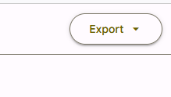
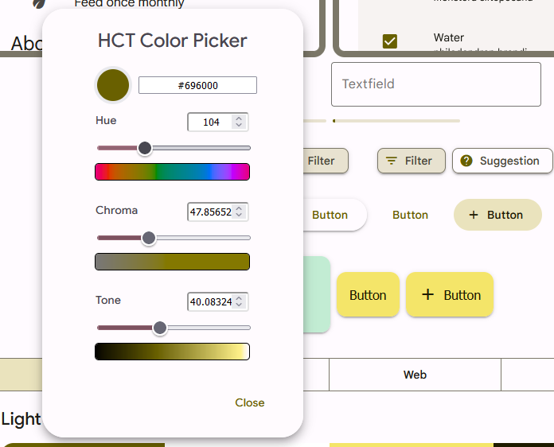
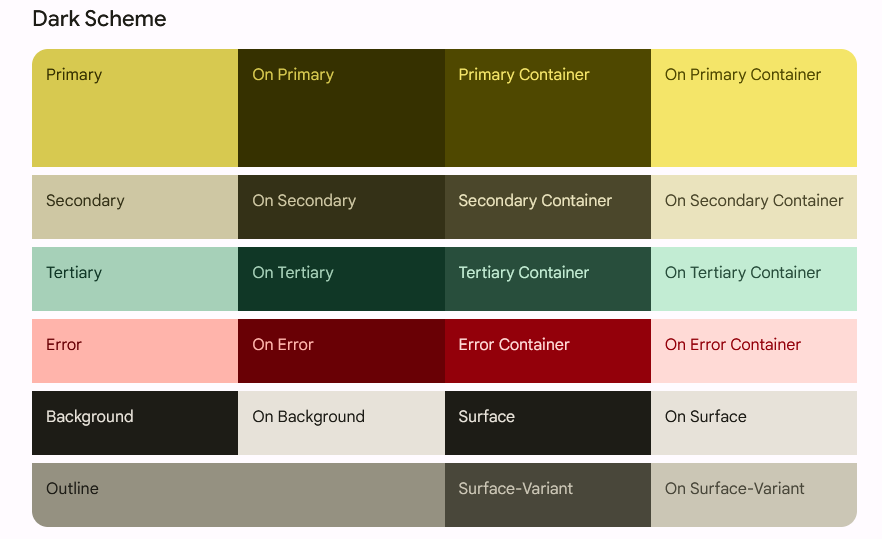
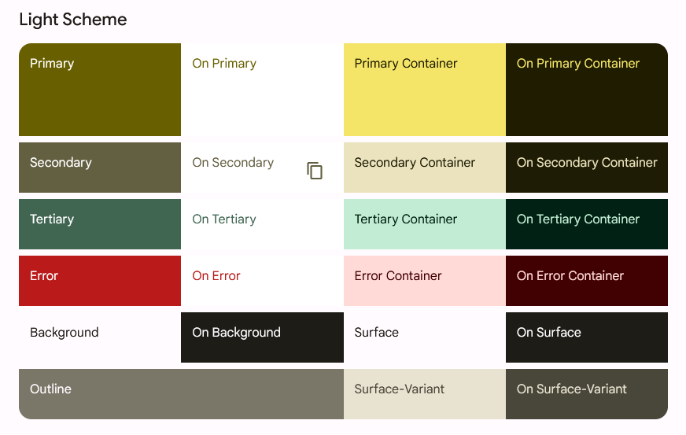
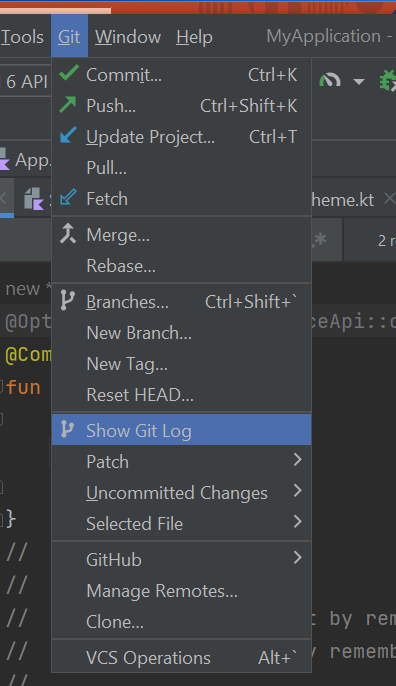

Using Material

Mutable State

Basic Event Handling

Basic I/O

Basic Form

## Material design continued

### Customizing MaterialTheme





 
[https://m3.material.io/theme-builder##/custom](https://m3.material.io/theme-builder#/custom)
 
  - [https://material.io/blog/material-theme-builder](https://m3.material.io/theme-builder##/custom)
  - [https://proandroiddev.com/how-to-create-a-truly-custom-theme-in-jetpack-compose-55fb4cd6d655](https://proandroiddev.com/how-to-create-a-truly-custom-theme-in-jetpack-compose-55fb4cd6d655)
 
Click on the Primary color circle to bring up the Color Picker.
 
 
Choose your desired colors with the sliders
 
 
Can export the theme for Jetpack Compose by selecting the export button near the top right of the web page
 





### Few Tweaks

Copy Color.kt to your project in a commonMain.ui.theme folder
 
  - i.e., create the ui subfolder and then create the theme subfolder in that
 
Use the teacher-provided Theme.kt (in Teams or next slide) and copy that to the same location
 
Use the teacher-provided Shape.kt (in Teams or slide after next) and copy that to the same location
 
Make sure the package line at the top of all 3 files says "package ui.theme"
 
 
Put `@file:OptIn(ExperimentalMaterialApi::class)` at the top (line 1) of your App.kt file
 
  - Otherwise seems to complain about Card component
 
In App.kt, import `ui.theme.AppTheme`
 
In App.kt, wrap your components in `AppTheme` rather than `MaterialTheme`.
 
```kotlin
fun App() {
  AppTheme {
    Banner("Jane")
  }
}
```
 
Now, your Material components should use your new custom color scheme.
 
You can also refer to colors in the theme explicitly to ensure the components you create are consistent with the theme

### Theme.kt

```kotlin
package ui.theme
import androidx.compose.foundation.isSystemInDarkTheme
import androidx.compose.material.MaterialTheme
import androidx.compose.material.lightColors
import androidx.compose.material.darkColors
import androidx.compose.runtime.Composable

private val LightColors = lightColors(
  primary = md_theme_light_primary,
  onPrimary = md_theme_light_onPrimary,
  primaryVariant = md_theme_light_primary,
  secondary = md_theme_light_secondary,
  onSecondary = md_theme_light_onSecondary,
  secondaryVariant = md_theme_light_secondary,
  error = md_theme_light_error,
  onError = md_theme_light_onError,
  background = md_theme_light_background,
  onBackground = md_theme_light_onBackground,
  surface = md_theme_light_surface,
  onSurface = md_theme_light_onSurface
)

private val DarkColors = darkColors(
  primary = md_theme_dark_primary,
  onPrimary = md_theme_dark_onPrimary,
  primaryVariant = md_theme_dark_primary,
  secondary = md_theme_dark_secondary,
  onSecondary = md_theme_dark_onSecondary,
  secondaryVariant = md_theme_dark_secondary,
  error = md_theme_dark_error,
  onError = md_theme_dark_onError,
  background = md_theme_dark_background,
  onBackground = md_theme_dark_onBackground,
  surface = md_theme_dark_surface,
  onSurface = md_theme_dark_onSurface,
)

@Composable
fun AppTheme(
  useDarkTheme: Boolean = isSystemInDarkTheme(),
  content: @Composable() () -> Unit
  ) 
{
  val colors = if (!useDarkTheme) {LightColors} else {DarkColors}
  MaterialTheme(
    colors = colors,
    shapes = ThemeShapes,
    content = content
  )
}
```

## Change Theme Shapes

 
If you haven't copied the teacher-provided Shape.kt, then create a file called Shape.kt in ui.theme
 
Copy the following to Shape.kt
 
  ```kotlin
package ui.theme
import androidx.compose.foundation.shape.RoundedCornerShape
import androidx.compose.material.Shapes
import androidx.compose.ui.unit.dp

val ThemeShapes = Shapes(
  small = RoundedCornerShape(8.dp),
  medium = RoundedCornerShape(4.dp),
  large = RoundedCornerShape(0.dp)
)
```
 
Using this Shape theme, you can vary the shape of the corners used by some Material components (such as button) to make them more or less rounded at different sizes.
 
 
Possible shapes include `RoundedCornerShape`, `CircleShape`, `CutCornerShape`



### Digression on Git

In class, we talked about how to use Git (commit and push)
 
  - Save points
  - Easy collaboration
 
Main point:
 
  - Commit and push every time you've finished getting something working.
  - That way you can get back to a working state if you "get into trouble" later
  - E.g., can "Show Git Log" and then pick the earlier commit you want to compare your current code to.

### Scaffold
 
A common screen pattern that comes with Material.
 
  - [https://developer.android.com/jetpack/compose/layouts/material](https://developer.android.com/jetpack/compose/layouts/material)
 
A Scaffold has the following common elements
 
  - title
  - topBar - [https://m3.material.io/components/top-app-bar/overview](https://m3.material.io/components/top-app-bar/overview)
    - Often use a TopAppBar component
    - [https://semicolonspace.com/jetpack-compose-topappbar/](https://semicolonspace.com/jetpack-compose-topappbar/)
    - [https://medium.com/google-developer-experts/exploring-jetpack-compose-topappbar-c8b79893be34](https://medium.com/google-developer-experts/exploring-jetpack-compose-topappbar-c8b79893be34)
    - [https://developer.android.com/reference/kotlin/androidx/compose/material3/package-summary##centeralignedtopappbar](https://developer.android.com/reference/kotlin/androidx/compose/material3/package-summary#centeralignedtopappbar)
  - bottomBar: [https://m3.material.io/components/bottom-app-bar/overview](https://m3.material.io/components/bottom-app-bar/overview)
    - Often a BottomAppBar
      - [https://developer.android.com/reference/kotlin/androidx/compose/material3/package-summary##bottomappbar](https://developer.android.com/reference/kotlin/androidx/compose/material3/package-summary#bottomappbar)
    - Or a NavigationBar
      - [https://m3.material.io/components/navigation-bar/overview](https://m3.material.io/components/navigation-bar/overview)
      - [https://developer.android.com/reference/kotlin/androidx/compose/material3/package-summary##navigationbar](https://developer.android.com/reference/kotlin/androidx/compose/material3/package-summary#navigationbar)
      - [https://itnext.io/navigation-bar-bottom-app-bar-in-jetpack-compose-with-material-3-c57ae317bd00](https://itnext.io/navigation-bar-bottom-app-bar-in-jetpack-compose-with-material-3-c57ae317bd00)
  - floatingActionButton
  - As well as the main content of the component

 
Very basic example:
 
```kotlin
Scaffold(
  topBar = { TopAppBar(title = { Text("My App") }) },
  bottomBar = { BottomAppBar { Text("Copyright (c) 2023 CoolEntertainment, Inc.") } },
  floatingActionButton = { FloatingActionButton(onClick = {}) { Text("Click Me")} }
  ) 
{
  Banner("Jorge")
}
```

### Consistency using Material Formatting

 
Material offers a number of consistent text formatting options using MaterialTheme.typography. Elements such as `h1`, `h2`, `h3`, `body1`, `body2`, etc. can be formatted using MaterialTheme libraries:

```kotlin
Text(text="Welcome to My App", style=MaterialTheme.typography.h1)
```
 
You can directly use the colors in the theme for consistency across your app using MaterialTheme.colors. E.g., Using a theme-consistent background color:

```kotlin
Column(
    modifier = Modifier.padding(24.dp)
    .fillMaxSize()
    .background(MaterialTheme.colors.background)
```
 
You can specify the shape of a component using MaterialTheme.shapes
 
  - E.g.,
    - modifier = Modifier.size(width = 180.dp, height = 180.dp).clip(MaterialTheme.shapes.small)

### Misc Formatting/Layouting

Change opacity of an image
 
  - Image component has a parameter alpha that can be set of a float value between 0 and 1
  - E.g., alpha = 0.5F
 
For a column, verticalArrangement has more than just top Arrangement.Center, .Bottom, .Top. Also have .SpaceBetween, .SpaceAround, .SpaceEvenly.
 
For a row, horizontalArrangement has several similar options too.
 
For scaling, there are several options: Crop, Fit, FillBounds, FillHeight, FillWidth, Inside.
 
  - Some of these may stretch an image to fit, others may crop an image to fit, and some preserve the complete image.

### Advanced
 
`FlowRow`, `FlowColumn`
 
  - [https://developer.android.com/jetpack/compose/layouts/flow](https://developer.android.com/jetpack/compose/layouts/flow)
  - `fillMaxWidth(0.7f)` -- Fractional sizing
 
Responsive design
 
  - [https://proandroiddev.com/adaptive-ui-with-jetpack-compose-968e375795d4](https://proandroiddev.com/adaptive-ui-with-jetpack-compose-968e375795d4)
 
Old-school: `ConstraintLayout`
 
  - [https://developer.android.com/jetpack/compose/layouts/constraintlayout](https://developer.android.com/jetpack/compose/layouts/constraintlayout)
  - [https://dev.to/saketh/constraint-layout-in-jetpack-compose-create-complex-and-responsive-android-layouts-on-the-fly-47gd](https://dev.to/saketh/constraint-layout-in-jetpack-compose-create-complex-and-responsive-android-layouts-on-the-fly-47gd)

### Example code snippets

 
Making a small circular image using clip and crop
 
```kotlin
Image(
    painter = painterResource("penguin.jpg"),
    contentDescription = "This image shows penguins",
    modifier = Modifier.size(40.dp).clip(RoundedCornerShape(50.dp)),
    contentScale = ContentScale.Crop
  )
```
 
Recall: Box lets you stack components on top of each other
 

## State
 
Since components are immutable, we must explicitly change state of the component using a `mutableState` in order to cause the component to be recomposed.
 
  - This approach is similar in principle to `useState` in React.
 
We must use the keyword `remember` in order to avoid resetting the state value each time the component is recomposed.
 
  - Or, better in some situations, `rememberSaveable` 
 
The syntax for creating a state variable is:
 
```kotlin
val count = remember { mutableStateOf(0) }
```
 
The syntax for accessing or modifying the value of a state variable is to use <statevariable>.value
 
  - e.g., count.value
 
E.g.,
 
  ```kotlin
@Composable
fun CountWithButton() {
  val count = remember { mutableStateOf(0) }
  Column(modifier = Modifier.padding(16.dp)) {
    Text("You've had ${count.value} glasses.")
    Button(onClick = { count.value++ }, Modifier.padding(top = 8.dp)) {
      Text("Add one")
    }
  }
}
```
 
[https://developer.android.com/jetpack/compose/state](https://developer.android.com/jetpack/compose/state)
 
 
[https://developer.android.com/codelabs/jetpack-compose-state](https://developer.android.com/codelabs/jetpack-compose-state)
 

## TextField

 
TextField is a Material composable for getting textual input from the user
 
To make a good, usable text field, you want to make sure that the field shows the current value typed in by the user and that the component remembers that value in state.
 
It is also good usability to provide a placeholder for the text field before the user enters any information
 
The TextField component issues an ValueChange event every time the user changes the information in the test field.
 
 
E.g.,
 
  ```kotlin
val text = rememberSaveable { mutableStateOf("") }
TextField(
  value = text.value,
  onValueChange = { text.value = it },
  textStyle = TextStyle(textAlign = TextAlign.Center),
  label = { Text(text = "Please enter your name")}
)
```
`rememberSaveable` behaves similarly to remember, but the stored value will survive the activity or process recreation using the saved instance state mechanism (for example it happens when the screen is rotated in the Android application)
 
 
Material also has an `OutlinedTextField`
 
 
[https://github.com/JetBrains/compose-multiplatform/blob/master/tutorials/Context_Menu/README.md](https://github.com/JetBrains/compose-multiplatform/blob/master/tutorials/Context_Menu/README.md)
 
 
[https://m3.material.io/components/text-fields/overview](https://m3.material.io/components/text-fields/overview)
 
 
[https://developer.android.com/reference/kotlin/androidx/compose/material3/package-summary##textfield](https://developer.android.com/reference/kotlin/androidx/compose/material3/package-summary#textfield)
 

### onClickable

You can turn most components into the equivalent of buttons using Modifier.
 
```kotlin
Modifier.clickable(onClick = {count.value-- },
onClickLabel = "Decrement count")
```

Note: The optional `onClickLabel` is for accessibility purposes. It does not actually display on the screen.

### Conditional Content

 
You can change whether a particular component is displayed or not using a conditional statement
 
Combined with a state variable, this lets you toggle visibility when, say, a user clicks a clickable.
 
```kotlin
val showImage = remember { mutableStateOf(true) }
Column() {
  …
  if (showImage.value) {
    Image( … )
  }
  …
  … in another composable:
  onClick = { showImage.value = !showImage.value }
}
```

### Forms

We can create a form in our app using several TextFields and a Button to complete/"submit" the form.
 
There are a variety of things we can do here:
 
  - Include logic to check the validity of the values entered in a text field
    - E.g., check that a given entry is long enough
  - Make the "submit" button appear only once something has been entered in all the text fields
    - Simply check the values of all the state variables associated with the text fields to make sure they are non-empty and "valid"
 
Once the submit button is clicked, several things can be done:
 
  - All state values should be appropriately handled.
    - At this early stage, we can just put all those values into an object and save it to state.
  - The form elements should go away (i.e., gated content) or limited so that the user cannot change the values
  - The submit button should be disabled to prevent multiple submissions.
  - Perhaps pop-up a message (e.g., using Snack Bar) thanking them for submitting their information

### Sample Form

```kotlin
val nameValue = rememberSaveable { mutableStateOf("") }
val passwordValue = rememberSaveable { mutableStateOf("") }
val ageValue = rememberSaveable { mutableStateOf("") }

Column {
  TextField(
    value = nameValue.value,
    onValueChange = { nameValue.value = it },
    textStyle = TextStyle(textAlign = TextAlign.Center),
    label = { Text(text = "Please enter your username") }
  )
  Spacer(modifier = Modifier.height(20.dp).width(20.dp))
  TextField(
    value = passwordValue.value,
    onValueChange = { passwordValue.value = it },
    textStyle = TextStyle(textAlign = TextAlign.Center),
    label = { Text(text = "Please enter your password") }
  )
  Spacer(modifier = Modifier.height(20.dp).width(20.dp))
  TextField(
    value = ageValue.value,
    onValueChange = { ageValue.value = it },
    textStyle = TextStyle(textAlign = TextAlign.Center),
    label = { Text(text = "Please enter your age") }
  )
}

if (!nameValue.value.isEmpty() && !passwordValue.value.isEmpty()
    && passwordValue.value.length >= 8 && !ageValue.value.isEmpty()
    && ageValue.value.toInt() >= 18) {
  Button(onClick={}) {
    Text("Signup")
  }
}
```

### Digression on Documentation

 
Goal:
  - Let another programmer know how to use your code
    - Mention each parameter and what it is for
  - Let yourself remember why you did what you did
  - Clarify explicitly any assumption made
  - If the algorithm is complicated, then describe the algorithm
 
Expectation:
  - EVERY composable function you create contains documentation (meaningful).

## Exercises

 
Create appropriate event handling for the onClick of your buttons and Card from earlier
 
  - Create appropriate state variables
  - Convert at least one component into a clickable and add event handling to it.
  - Make at least one component display only if a certain Boolean variable is true.
  - Toggle that variable in one of your buttons/clickables.
 
Capture user textual input using a text field and display that information elsewhere on the screen
 
 
Generally, play around with adding basic event handling to your screen and making it behave in a dynamic fashion based on the user's actions.
 
 
Create a dynamic form with at least two text fields.
 
## Additional Resources

