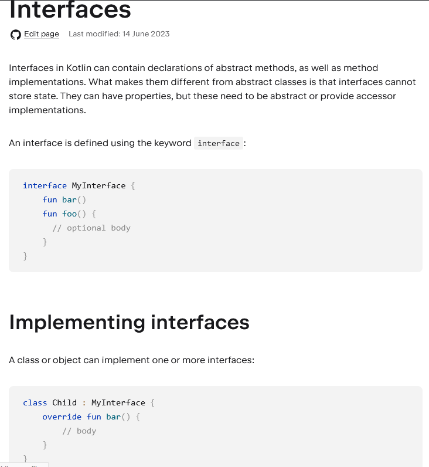

## Related Technologies for Multiplatform Applications

## 420-731-AB
Instructor: Talib Hussain

Days 8 and 9: CR2UD, Coroutines and Flows

## Objectives

* More MongoDB Realm for Kotlin
  * Frozen Architecture
* Walkthrough full sample CR2UD MVVM implementation
  * Hands\-on coding of CR2UD operations using Model\-View\-ViewModel approach \(see Class Materials for Frog\-MVVM\)
  * Note: Actually using specific terms: Repository – Screen – ScreenModel\, but is still an MVVM approach\.
* More Kotlin Coroutines
* Kotlin Flows
* Additional Work/Discussion
  * Handout Assignment \##2 \(see Class Materials\)
  * Handout Milestone \##1 \(see Class Materials\)
  * Individual work on Assignment \##2
  * Groupwork on Milestone 1
  * Flutter discussion

## Frozen Architecture

* Kotlin Realm works exclusively with frozen objects that can be passed between threads safely
  * This is different than using Realm in other languages
* So\, the objects that we received from the Realm database are not "Live"
  * This means that we can't see the changes made to the data
  * This means that we can't directly access that data\.
  * This makes it a bit complicated when doing a read operation
* To access a Live version of the frozen object\, we must be inside of a write or writeBlocking closure\.
  * Objects returned from a write closure become frozen objects when the write transaction completes\.
* [https://www\.mongodb\.com/docs/realm/sdk/kotlin/realm\-database/frozen\-arch/](https://www.mongodb.com/docs/realm/sdk/kotlin/realm-database/frozen-arch/)

## Separation of Concerns

* A key job of the ViewModel \(in our case "ScreenModel"\) is to isolate the View from the details of the Model\.
* A key job of the Model is to isolate theViewModel from details of the implementation of the database
* So\, let's avoid returning MongoDb\-specific data structures from our model to our ViewModel\.
* We'll convert the results of a query/write to the database into a data structure that holds the latest data from the realm object\.
  * This is a bit of a hassle\, but would let us\, for example\, to later on change the database implementation \(e\.g\.\, to SQL or Firebase\, etc\) without changing the ViewModels or Views\.

## Lazy Loading

Realm objects are lazy\-loaded by default\.

This allows you to query large collections of objects without reading large amounts of data from disk\.

This also means that the first access to a field of an object will always return the most recent data\.

## Realm Query Language

[https://www\.mongodb\.com/docs/realm/realm\-query\-language/\##std\-label\-flexible\-sync\-rql\-limitations](https://www.mongodb.com/docs/realm/realm-query-language/#std-label-flexible-sync-rql-limitations)

## What is that $0 in the query???

* val frog: Frog? = this\.query\<Frog>\("\_id == $0"\, PRIMARY\_KEY\_VALUE\)\.first\(\)\.find\(\)
* From ChatGPT  \(saved me typing\)
  * In the given code snippet\, $0 is used as a placeholder to represent a parameter in a query\. It is a convention commonly used in query languages to refer to the first parameter in a list of values\.
  * In this specific code\, the query is using the string interpolation to substitute $0 with the value of PRIMARY\_KEY\_VALUE\. The PRIMARY\_KEY\_VALUE is likely a constant or a variable that holds the value of the primary key to search for in the database\.
  * So\, the line val frog: Frog? = this\.query\<Frog>\("\_id == $0"\, PRIMARY\_KEY\_VALUE\)\.first\(\)\.find\(\) translates to a query that searches for a Frog object in the Realm database where the \_id field is equal to the value stored in PRIMARY\_KEY\_VALUE\. The $0 is replaced with the value of PRIMARY\_KEY\_VALUE during the query execution\.

## Kotlin Flows

* A suspending function asynchronously returns a single value\, but how can we return multiple asynchronously computed values? This is where Kotlin Flows come in\.
* Using the List\<Int> result type\, means we can only return all the values at once\.
  * To represent the stream of values that are being computed asynchronously\, we can use a Flow\<Int> type just like we would use a Sequence\<Int> type for synchronously computed values:
* Let's review this page together:
  * [https://kotlinlang\.org/docs/flow\.html](https://kotlinlang.org/docs/flow.html)
* Flows are cold streams similar to sequences — the code inside a flow builder does not run until the flow is collected\.
* Terminal operators on flows are suspending functions that start a collection of the flow\. The collect operator is the most basic one\, but there are others such as toList\(\)\, toSet\(\)\, first\(\)\, reduce\(\)
  * Calling toList\(\) on a Flow collects all of the objects emitted by the Flow and returns them to you in a List\.
* [https://bladecoder\.medium\.com/kotlins\-flow\-in\-viewmodels\-it\-s\-complicated\-556b472e281a](https://bladecoder.medium.com/kotlins-flow-in-viewmodels-it-s-complicated-556b472e281a)
* [https://developer\.android\.com/kotlin/flow](https://developer.android.com/kotlin/flow)
* [https://developer\.android\.com/kotlin/flow/stateflow\-and\-sharedflow](https://developer.android.com/kotlin/flow/stateflow-and-sharedflow)
* [https://blog\.canopas\.com/7\-useful\-ways\-to\-create\-flow\-in\-kotlin\-577992b73315](https://blog.canopas.com/7-useful-ways-to-create-flow-in-kotlin-577992b73315)

## Flow

## Misc Flows

* collectAsState is an extension on StateFlow\.
* Collects values from this StateFlow and represents its latest value via State\.
* You need to handle the collection as per appropriate Lifecycle\.
* You may see documentation online regarding LiveData\.  Kotlin does something different with its Flows
  * [https://medium\.com/androiddevelopers/migrating\-from\-livedata\-to\-kotlins\-flow\-379292f419fb](https://medium.com/androiddevelopers/migrating-from-livedata-to-kotlins-flow-379292f419fb)

## Flow: List vs non-List

* From ChatGPT \(even more typing saved\!\)
* The difference between Flow\<List<Frog>> and Flow\<Frog> lies in the nature of the emitted values and the structure of the resulting flow\.
* Flow\<List<Frog>>:
  * This represents a flow that emits lists of Frog objects\.
  * Each emission of the flow contains a list of Frog objects\.
  * It is useful when you expect multiple Frog objects to be emitted together as a batch or collection\.
  * For example\, if you want to fetch a list of all frogs from a database and receive the entire list at once\.
* Flow\<Frog>:
  * This represents a flow that emits individual Frog objects\.
  * Each emission of the flow contains a single Frog object\.
  * It is useful when you want to process Frog objects one at a time or react to individual Frog objects as they are emitted\.
  * For example\, if you want to observe a stream of real\-time updates for individual frogs in a dynamic manner\.
* In summary\, Flow\<List<Frog>> emits lists of Frog objects\, while Flow\<Frog> emits individual Frog objects\. The choice between the two depends on the specific use case and whether you need to work with batches of frogs or process them individually\.

## Recall: Kotlin Coroutine

* Coroutines offer asynchronous programming support at the language level in Kotlin\.
* A  _coroutine_  is an instance of suspendable computation\.
  * It is conceptually similar to a thread\, in the sense that it takes a block of code to run that works concurrently with the rest of the code\.
  * However\, a coroutine is not bound to any particular thread\. It may suspend its execution in one thread and resume in another one\.
  * Coroutines can be thought of as light\-weight threads\.
* Compose offers APIs that make using coroutines safe within the UI layer
* The rememberCoroutineScope function returns a CoroutineScope with which you can create coroutines in event handlers and call Compose suspend APIs\.
* Try this:
  * fun main\(\) = runBlocking \{ // this: CoroutineScope
  * launch \{ // launch a new coroutine and continue
  * delay\(1000L\) // non\-blocking delay for 1 second \(default time unit is ms\)
  * println\("World\!"\) // print after delay
  * \}
  * println\("Hello"\) // main coroutine continues while a previous one is delayed
  * \}

## Recall: Voyager – Screen model and Coroutine Scope

* The ScreenModel provides a coroutineScope property\.
  * It's cancelled automatically when the ScreenModel is disposed\.
* [https://voyager\.adriel\.cafe/screenmodel/coroutines\-integration](https://voyager.adriel.cafe/screenmodel/coroutines-integration)
  * class PostDetailsScreenModel\(
  * private val repository: PostRepository
  * \) : StateScreenModel<PostDetailsScreenModel\.State>\(State\.Init\) \{
  * sealed class State \{
  * object Init : State\(\)
  * object Loading : State\(\)
  * data class Result\(val post: Post\) : State\(\)
  * \}
  * fun getPost\(id: String\) \{
  * coroutineScope\.launch \{
  * mutableState\.value = State\.Loading
  * mutableState\.value = State\.Result\(post = repository\.getPost\(id\)\)
  * \}
  * \}
  * \}

## Exercise: Coroutines and Flow

* Worth 2%
* Visit the following two web pages\.  Read the pages in detail and try out each code example in an IDE\.  Play around with it a bit to get a sense of how coroutines and flows work\.
  * [https://kotlinlang\.org/docs/coroutines\-basics\.html](https://kotlinlang.org/docs/coroutines-basics.html)
  * [https://kotlinlang\.org/docs/flow\.html\##flows\-are\-cold](https://kotlinlang.org/docs/flow.html#flows-are-cold)
* Then\, complete as much of these two codelabs as possible during remaining classtime\.
  * [https://developer\.android\.com/codelabs/basic\-android\-kotlin\-compose\-coroutines\-android\-studio](https://developer.android.com/codelabs/basic-android-kotlin-compose-coroutines-android-studio)
    * Don't do step 7 \(unit tests\)
  * [https://developer\.android\.com/codelabs/jetpack\-compose\-advanced\-state\-side\-effects](https://developer.android.com/codelabs/jetpack-compose-advanced-state-side-effects)
  * Please note: This has Android\-specific approaches in it that are not fully aligned with Multiplatform\.
* Capture screenshots of your work as you go\, and submit a zip of them to Lea
* Other available labs:
  * [https://developer\.android\.com/codelabs/advanced\-kotlin\-coroutines](https://developer.android.com/codelabs/advanced-kotlin-coroutines)
  * [https://developer\.android\.com/codelabs/kotlin\-coroutines](https://developer.android.com/codelabs/kotlin-coroutines)
  * [https://play\.kotlinlang\.org/hands\-on/Introduction%20to%20Coroutines%20and%20Channels/01\_Introduction](https://play.kotlinlang.org/hands-on/Introduction%20to%20Coroutines%20and%20Channels/01_Introduction)

## Interfaces

* As discussed in class\, the colon : is used to indicate "implements an interface"
  * i\.e\.\, not just for "extends"
* [https://kotlinlang\.org/docs/interfaces\.html\##implementing\-interfaces](https://kotlinlang.org/docs/interfaces.html#implementing-interfaces)

## Misc Info

For you information \(same as in earlier slides\)\.

## List of items

Need to import the right thing

import androidx\.compose\.foundation\.lazy\.items

@Composable

fun ListContent\(onItemClick: \(String\) \-> Unit\) \{

val items = remember \{ List\(100\) \{ "Item $it" \} \}

LazyColumn \{

items\(items\) \{ item \->

Text\(

text = item\,

modifier = Modifier

\.clickable \{ onItemClick\(item\) \}

\.fillMaxWidth\(\)

\.padding\(16\.dp\)

\)

\}

\}

\}

## Mutable List

[https://medium\.com/geekculture/add\-remove\-in\-lazycolumn\-list\-aka\-recyclerview\-jetpack\-compose\-7c4a2464fc9f](https://medium.com/geekculture/add-remove-in-lazycolumn-list-aka-recyclerview-jetpack-compose-7c4a2464fc9f)

Caution: Using mutable objects such as ArrayList\<T> or mutableListOf\(\) as state in Compose causes your users to see incorrect or stale data in your app\. Mutable objects that are not observable\, such as ArrayList or a mutable data class\, are not observable by Compose and don't trigger a recomposition when they change\. Instead of using non\-observable mutable objects\, the recommendation is to use an observable data holder such as State\<List<T>> and the immutable listOf\(\)\.

## Layout Inspector

[https://developer\.android\.com/jetpack/compose/tooling/layout\-inspector](https://developer.android.com/jetpack/compose/tooling/layout-inspector)

## Grids (LazyGrid)

[https://developer\.android\.com/jetpack/compose/lists](https://developer.android.com/jetpack/compose/lists)

## protected

* protected visibility is available as in Java for members of a class
  * protected means that the member is visible inside that class AND that it is also visible in subclasses\.

## More on Forms

[https://www\.section\.io/engineering\-education/jetpack\-compose\-forms/](https://www.section.io/engineering-education/jetpack-compose-forms/)

## Kotlin Koans

* For small exercises focused on Kotlin language\,
  * [https://play\.kotlinlang\.org/koans/overview](https://play.kotlinlang.org/koans/overview)

## Snackbar

* Side\-effects
  * [https://developer\.android\.com/jetpack/compose/side\-effects](https://developer.android.com/jetpack/compose/side-effects)
* [https://medium\.com/@jurajkunier/how\-to\-show\-snackbar\-in\-jetpack\-compose\-3f2d81891f87](https://medium.com/@jurajkunier/how-to-show-snackbar-in-jetpack-compose-3f2d81891f87)
* [https://developer\.android\.com/reference/kotlin/androidx/compose/material3/SnackbarHostState](https://developer.android.com/reference/kotlin/androidx/compose/material3/SnackbarHostState)
* [https://www\.devbitsandbytes\.com/configuring\-snackbar\-jetpack\-compose\-using\-scaffold\-with\-bottom\-navigation/](https://www.devbitsandbytes.com/configuring-snackbar-jetpack-compose-using-scaffold-with-bottom-navigation/)
* [https://developer\.android\.com/jetpack/compose/layouts/material](https://developer.android.com/jetpack/compose/layouts/material)

## More on Text Styling

[https://semicolonspace\.com/jetpack\-compose\-text/](https://semicolonspace.com/jetpack-compose-text/)

## Enum classes

[https://blog\.logrocket\.com/kotlin\-enum\-classes\-complete\-guide/](https://blog.logrocket.com/kotlin-enum-classes-complete-guide/)

[https://kotlinlang\.org/docs/enum\-classes\.html](https://kotlinlang.org/docs/enum-classes.html)

## Misc Kotlin

* Returning multiple values from functions
  * [https://www\.baeldung\.com/kotlin/returning\-multiple\-values](https://www.baeldung.com/kotlin/returning-multiple-values)
* Destructuring declarations
  * [https://www\.tutorialspoint\.com/kotlin/kotlin\_destructuring\_declarations\.htm](https://www.tutorialspoint.com/kotlin/kotlin_destructuring_declarations.htm)
* Concurrency and coroutines
  * [https://kotlinlang\.org/docs/multiplatform\-mobile\-concurrency\-and\-coroutines\.html\##multithreaded\-coroutines](https://kotlinlang.org/docs/multiplatform-mobile-concurrency-and-coroutines.html#multithreaded-coroutines)
* Architecture
  * [https://proandroiddev\.com/building\-modern\-apps\-using\-the\-android\-architecture\-guidelines\-3238fff96f14](https://proandroiddev.com/building-modern-apps-using-the-android-architecture-guidelines-3238fff96f14)
* Misc
  * [https://proandroiddev\.com/zero\-to\-hero\-in\-kmm\-with\-compose\-and\-swiftui\-d8951f7d80b7](https://proandroiddev.com/zero-to-hero-in-kmm-with-compose-and-swiftui-d8951f7d80b7)
* Delegated Properties
  * [https://kotlinlang\.org/docs/delegated\-properties\.html\##delegating\-to\-another\-property](https://kotlinlang.org/docs/delegated-properties.html#delegating-to-another-property)

## Misc Compose Multiplatform

* Tutorials
  * [https://github\.com/JetBrains/compose\-multiplatform/tree/master/tutorials/Image\_And\_Icons\_Manipulations\##loading\-images\-from\-device\-storage\-or\-network\-asynchronously](https://github.com/JetBrains/compose-multiplatform/tree/master/tutorials/Image_And_Icons_Manipulations#loading-images-from-device-storage-or-network-asynchronously)

## Compose Multiplatform Examples

* [https://github\.com/JetBrains/compose\-multiplatform/blob/master/examples/README\.md](https://github.com/JetBrains/compose-multiplatform/blob/master/examples/README.md)
* Kotlin Multiplatform Example
  * [https://github\.com/android/kotlin\-multiplatform\-samples](https://github.com/android/kotlin-multiplatform-samples)
* Room with a View exercise
  * [https://developer\.android\.com/codelabs/android\-room\-with\-a\-view\-kotlin\##0](https://developer.android.com/codelabs/android-room-with-a-view-kotlin#0)

## Pokedex app in Compose Multiplatform

* Interesting application that may have useful capabilities to draw inspiration from
  * [https://www\.reddit\.com/r/Kotlin/comments/11pph1p/kotlin\_multiplatform\_app\_with\_shared\_ui\_for/](https://www.reddit.com/r/Kotlin/comments/11pph1p/kotlin_multiplatform_app_with_shared_ui_for/)
  * [https://github\.com/MohamedRejeb/Pokedex/blob/main/shared/src/commonMain/kotlin/com/mocoding/pokedex/ui/comingsoon/AsyncImage\.kt\##L18](https://github.com/MohamedRejeb/Pokedex/blob/main/shared/src/commonMain/kotlin/com/mocoding/pokedex/ui/comingsoon/AsyncImage.kt#L18)

## Nice link on State

[https://www\.kodeco\.com/30172122\-managing\-state\-in\-jetpack\-compose](https://www.kodeco.com/30172122-managing-state-in-jetpack-compose)

## More on Hoisted State

[https://developer\.android\.com/jetpack/compose/state](https://developer.android.com/jetpack/compose/state)

State that is hoisted this way has some important properties:

Single source of truth: By moving state instead of duplicating it\, we're ensuring there's only one source of truth\. This helps avoid bugs\.

Encapsulated: Only stateful composables can modify their state\. It's completely internal\.

Shareable: Hoisted state can be shared with multiple composables\. If you wanted to read name in a different composable\, hoisting would allow you to do that\.

Interceptable: callers to the stateless composables can decide to ignore or modify events before changing the state\.

Decoupled: the state for the stateless ExpandingCard may be stored anywhere\. For example\, it's now possible to move name into a ViewModel\.

