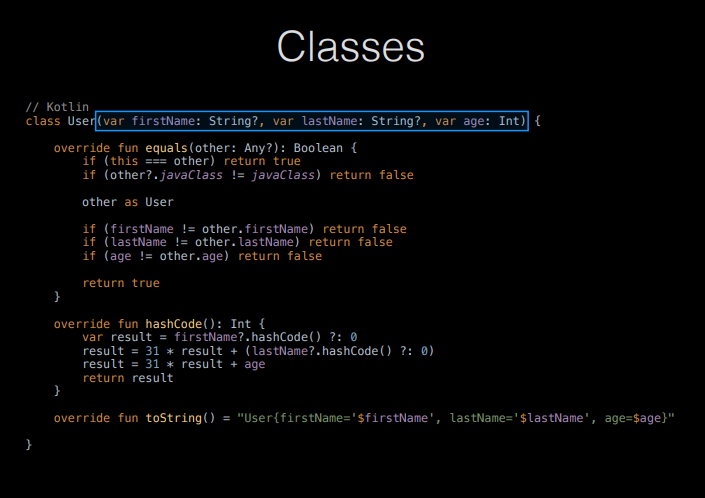

## Related Technologies for Multiplatform Applications

## 420-731-AB
Instructor: Talib Hussain

Day 2: More Kotlin Basics

## Objectives

* Kotlin Basics\, continued
  * Strings
  * Arrays
  * Lists
* Kotlin Operations
  * Loops
  * Ranges
  * When
* Functional Programming
  * Lambda functions
  * \.map\, \.filter
* Kotlin Object\-Oriented Programming
  * Classes
  * Constructors
  * Inheritance
* Null safety
* data classes
* Begin Group Formation

## More differences

* How to create an array\,  list\, etc\.
  * Use arrayOf\(\)\,  listOf\(\)\, arrayListOf\(\)\, etc
* No traditional  __for__  loop
  * Only a "for \( … in …\)" loop
  * __repeat__  loop
* Ranges are new
* __when__  instead of  __switch__
  * Behaves slightly differently
  * Main difference is no break needed\.
* Classes have a variety of differences with many shortcuts/new capabilities
  * No  __new__  keyword when creating objects
  * Default visibility is public and visibility modifiers vary slightly
  * Classes are not inheritable by default\.  Need to use keyword open\.
  * Functions are not overridable by default\.  Need to be in open class\, use open keyword and use override keyword\.
* Lambda
* Map/Filter operations

## Strings

* Access string characters using array notation
  * name = "Jane"
  * println\(name\[0\]\) would print 'J'
* Can use triple quotes to assigned any arbitrary text
  * val text = """
  * var age = 5
  * // This is a comment
  * """
  * Note: whitespace and line breaks are included\.\.\.
* String templates
  * Starts with a $ and can be a simple value or an expression in \{ \}
  * val name = "Ginger"
  * println\("$name\.length is $\{name\.length\} "\)
  * println\("Computed number is $\{name\.length \* 2 \+ 1\}"\)
  * >Ginger\.length is 6
  * >Computed number is 13
* Comparison
  * Can use == to compare strings \(yay\!\)  This is like \.equals\(\) in Java
  * Also \.equals\(\)\, \.compareTo\(\)\, indexOf\(\)
  * \.upperCase\(\)\, \.lowerCase\(\) and many more
  * Can also use === \(triple equals\) to check if two variables are pointing to the same object \(i\.e\.\, this is like == in Java\)\.

## Arrays

* Implicit type declaration
  * val nums = arrayOf\(1\, 2\, 3\, 4\)   //implicit type declaration
* Explicit type declaration
  * val nums = intArrayOf\(1\, 2\, 3\, 4\)
  * val nums = arrayOf\<Int>\(1\, 2\, 3\, 4\)
* Create an array with a set of default values
  * var nums = Array\<Int>\(4\, \{ 0 \}\)
  * var nums = IntArray\(4\, \{ 0 \}\)
  * var nums = IntArray\(4\, \{ it \}\) – special keyword it
  * var nums = IntArray\(4\, \{ it \+ 1\}\)
* Created an array with mixed types
  * var nums = arrayOf\(2\, "s"\, 4\.0\,2F\)
* Get size of array using size property
  * nums\.size

## Lists, etc.

* Several types of collections \(List\, Set\, Map\, etc\.\)
  * [https://kotlinlang\.org/api/latest/jvm/stdlib/kotlin\.collections/](https://kotlinlang.org/api/latest/jvm/stdlib/kotlin.collections/)
  * [https://www\.geeksforgeeks\.org/kotlin\-collections/](https://www.geeksforgeeks.org/kotlin-collections/)
* Create a list using listOf\(\):
  * [https://kotlinlang\.org/api/latest/jvm/stdlib/kotlin\.collections/list\-of\.html](https://kotlinlang.org/api/latest/jvm/stdlib/kotlin.collections/list-of.html)
* ArrayList:  arrayListOf\(\)
  * [https://kotlinlang\.org/api/latest/jvm/stdlib/kotlin\.collections/array\-list\-of\.html](https://kotlinlang.org/api/latest/jvm/stdlib/kotlin.collections/array-list-of.html)

## for – in loop

* In Kotlin\, there is no traditional "for" loop \(e\.g\.\, no counting over index values…\)
* Instead\, a  __for – in __ loop is used\.
  * Kotlin just calls it a  __for__  loop\.  But for – in helps distinguish it from the "usual"
* This is used to iterate over elements in a collection
  * Similar in functionality tofor – in loop in Swift and for – each loop in Java\.

## Try It!

* Spend 20 minutes creating and calling different functions that use parameters\, variables\, types\, strings\, arrays and lists in different ways\.
  * Goal: Become familiar with the new syntax
* Explore [https://www\.w3schools\.com/KOTLIN/kotlin\_examples\.php](https://www.w3schools.com/KOTLIN/kotlin_examples.php)
  * Up to "Kotlin For Loop" \(skip When\)
* CodeLabs to Explore:
  * Functions: [https://developer\.android\.com/codelabs/basic\-android\-kotlin\-compose\-functions\##0](https://developer.android.com/codelabs/basic-android-kotlin-compose-functions#0)
  * Collections: [https://developer\.android\.com/codelabs/basic\-android\-kotlin\-compose\-collections\##0](https://developer.android.com/codelabs/basic-android-kotlin-compose-collections#0)
    * Up to end of Lists

## when statement

* Kotlin does not have a switch statement\, but does provide a  __when__  statement that behaves similarly
  * val option = 3
  * val result = when \(option\) \{
  * 1 \-> "Choice 1"
  * 2\,4 \-> "Choice 2 or 4"
  * 3 \-> "Choice 3"
  * else \-> "Invalid Choice"
  * \}
  * [https://www\.w3schools\.com/KOTLIN/kotlin\_when\.php](https://www.w3schools.com/KOTLIN/kotlin_when.php)
  * This replaces the use of multiple if \.\. else expressions
  * Unlike a switch in Java\, you do not need a "break" between cases\.
  * _else_  is not needed if it is unreachable
* when statement is very flexible and can be used in several interesting ways\.
  * [https://blog\.mindorks\.com/replace\-switch\-with\-when\-in\-kotlin/](https://blog.mindorks.com/replace-switch-with-when-in-kotlin/)

## Ranges

* Kotlin allows you to explicitly express a range of values using the \.\. notation
  * Most often used with for – in loop
  * for \(x in 1\.\.10\) \{
  * \}
  * Can use a step function
  * for \(x in 1\.\.10 step 2\) \{
  * \}
* A range may be over characters
  * for \(c in 'a'\.\.'x'\) \{
  * println\(c\)
  * \}
* Use  __downTo__  to specify a range that is decreasing
  * for \(x in 10 downTo 1\) \{
  * \}
* You can also check whether a value is in a given range using an if statement
  * if \(y in 1\.\.100\) \{
  * \}
* [https://www\.baeldung\.com/kotlin/ranges](https://www.baeldung.com/kotlin/ranges)
* [https://www\.w3schools\.com/KOTLIN/kotlin\_ranges\.php](https://www.w3schools.com/KOTLIN/kotlin_ranges.php)

## Lambda Expressions

* Lambda expressions are functions that do not have a name which are defined without the  _fun_  keyword
  * Used immediately as an expression
  * Can help your code be more concise
* They are essentially code inside of curly braces
  * \{ body\_of\_function \}
* They may take variables as arguments
  * \{ argument\_list \-> body\_of\_function\}
* Special keyword "it"
  * Implicit name of a single parameter
  * We'll see this later in \.filter and \.map
* [https://student\.cs\.uwaterloo\.ca/~cs346/1231/learning\-kotlin/functional/index\.html](https://student.cs.uwaterloo.ca/~cs346/1231/learning-kotlin/functional/index.html)
* [https://www\.geeksforgeeks\.org/kotlin\-lambdas\-expressions\-and\-anonymous\-functions/](https://www.geeksforgeeks.org/kotlin-lambdas-expressions-and-anonymous-functions/)
* [https://www\.baeldung\.com/kotlin/lambda\-expressions](https://www.baeldung.com/kotlin/lambda-expressions)

## repeat loop

* Since we can't easily use a for loop for counting\, Kotlin provides a simple "repeat" function that loops a fixed number of times\.
* It is a function followed by a lambda
  * repeat\( _number_ \) \{
  * \}
  * Repeats the loop the given  _number_  of times\.
  * [https://kotlinlang\.org/api/latest/jvm/stdlib/kotlin/repeat\.html](https://kotlinlang.org/api/latest/jvm/stdlib/kotlin/repeat.html)
  * // greets with an index
  * repeat\(3\) \{ index \->
  * println\("Hello with index $index"\)
  * \}

## Using functional programming techniques

* Kotlin allows you to use a variety of functional programming operations on collections
* Two common ones are  \.filter and \.map
  * Many others exist
  * These exist in other languages such as JavaScript and Swift
* The syntax in Kotlin is to call the function on an object and provide it with a lambda expression in curly braces\.
* These operations may be chained together
  * val list = listOf\(1\,2\,3\,4\,5\)
  * // Filter by given predicate and return the list of elements that match the predicate
  * val selecteditems = list\.filter \{ it < 4 \}
  * // Apply the same operation to each element of the list and return the new list
  * val transformedItems = list\.map \{ it\*it \}
  * // Chain operations together
  * val selectedAndTransformedItems = list\.filter \{ it < 4 \}\.map \{ it\*it \}

## Store a function in a variable

* Use the :: notation to store a function in a variable
  * fun main\(\) \{
  * val trickFunction = ::trick
  * \}
  * fun trick\(\) \{
  * println\("No treats\!"\)
  * \}
* Or\, use a lambda expression to define the function\.  Store that lambda in a variable\.
  * fun main\(\) \{
  * val trickFunction = trick
  * trick\(\)
  * trickFunction\(\)
  * \}
  * val trick = \{
  * println\("No treats\!"\)
  * \}
* [https://developer\.android\.com/codelabs/basic\-android\-kotlin\-compose\-function\-types\-and\-lambda\##2](https://developer.android.com/codelabs/basic-android-kotlin-compose-function-types-and-lambda#2)

## Try It!

* Spend 20 minutes exploring when\, ranges\, lambda functions\, functional programming\, etc\. in detail
  * Goal: Become familiar with the new syntax
* Explore [https://www\.w3schools\.com/KOTLIN/kotlin\_examples\.php](https://www.w3schools.com/KOTLIN/kotlin_examples.php)
  * When and Ranges
* CodeLab to Explore:
  * Lambdas: [https://developer\.android\.com/codelabs/basic\-android\-kotlin\-compose\-function\-types\-and\-lambda\##3](https://developer.android.com/codelabs/basic-android-kotlin-compose-function-types-and-lambda#3)

## OOP in Kotlin

* A basic class in Kotlin is similar to one in Java
  * class Car \{
  * var brand = ""
  * var model = ""
  * var year = 0
  * fun updateModel\(newmodel: String\)\{\.\.\.\}
  * \.\.\.
  * \}
* "Fields" \(from Java\) are generally called  __properties__
* "Methods" \(from Java\) are called  __class functions__
* But\, visibility is public is default
  * private – only visible in that file
  * internal – visible within same module
  * protected \- visible inside that class AND that it is also visible in subclasses
* [https://www\.baeldung\.com/kotlin/visibility\-modifiers](https://www.baeldung.com/kotlin/visibility-modifiers)

## Constructor

* For a simple class\, we can just define a constructor
  * We don't have to explicitly define all the fields\, etc\.
  * class Car\(var brand: String\, var model: String\, var year: Int\)
* Constructor arguments can have default values
  * class Car\(var brand: String\, var model: String = "Unknown"\, var year:Int = 2022\)
* When calling a constructor in Kotlin\, we don't use the 'new' keyword
  * val c1 = Car\("Ford"\, "Mustang"\, 1969\)
* Multiple constructors are possible \(self\-study\)\.

## Sample class with constructor & functions

class Car\(var brand: String\, var model: String\, var year: Int\) \{

// Class function

fun drive\(\) \{

println\("Wrooom\!"\)

\}

// Class function with parameters

fun speed\(maxSpeed: Int\) \{

println\("Max speed is: " \+ maxSpeed\)

\}

\}

## Setting values

* Unlike java\, the getter and setter for a property of a class simply uses the name of the property
  * i\.e\.\, not getX\(\)\, setX\(\)\.
  * val car = Car\("Honda"\, "Camry"\, 2023\)
  * println\(car\.brand\)                 Access with \.\<property name>
  * car\.model = "Civic"               Set with \.\<property name>
  * println\(civis\.name\)

## No Static…

* Kotlin does not have the static keyword\.
* If you want to create the equivalent to a static method in Kotlin\, you can use "companion objects"
* Companion objects are the singleton objects whose properties and functions are tied to a class but not to the instance of that class\. Hence\, we can access them just like a static method of the class\.
* Note that only one companion class is allowed per class\. More than one companion object per class will lead to a runtime error in Kotlin\.
  * class MyClass \{
  * companion object\{
  * fun myStaticMethod\(\): String\{
  * return "This method can be called without object"
  * \}
  * \}
  * \}
  * fun main\(args: Array\<String>\) \{
  * println\(MyClass\.myStaticMethod\(\)\)
  * \}
* [https://medium\.com/@waqarul/kotlin\-static\-member\-fields\-and\-singletons\-b79fd65aaf9b](https://medium.com/@waqarul/kotlin-static-member-fields-and-singletons-b79fd65aaf9b)

## Inheritance

* To allow a class to be subclassed\, it must be defined with the keyword  __open__ \.
* A class extends another using the colon syntax below:
  * // Superclass
  * open class MyParentClass \{
  * val x = 5
  * \}
  * // Subclass
  * class MyChildClass: MyParentClass\(\) \{
  * fun myFunction\(\) \{
  * println\(x\) // x is now inherited from the superclass
  * \}
  * \}

* To allow a class to be subclassed\, it must be defined with the keyword  __open__ \.
* A class extends another using the colon syntax below:
  * // Superclass
  * open class MyParentClass \{
  * val x = 5
  * \}
  * // Subclass
  * class MyChildClass: MyParentClass\(\) \{
  * fun myFunction\(\) \{
  * println\(x\) // x is now inherited from the superclass
  * \}
  * \}
* If the parent has constructor values\, must also pass the appropriate constructor values when subclassing\.
  * open class MyClass\(var value:Int\)
  * class SubClass\(var value:Int\, var otherValue:String\): MyClass\(value\)

## Overriding Functions

* A function of a parent class cannot be overridden in a subclass unless the function in the parent is declared open\.
* The override keyword must also be used when defining the overridden function\.
  * open class MyClass\(var value:String\) \{
  * open fun myFunction\(\) \{
  * println\(value\)
  * \}
  * \}
  * class SubClass\(var value:String\, var otherValue:String\): MyClass\(value\) \{
  * override fun myFunction\(\) \{
  * println\(otherValue\);
  * \}
  * \}
* Elsewhere:
  * val x = MyClass\("Hi"\)
  * val y = SubClass\("Hi"\, "Bye"\)
  * x\.myFunction\(\)
  * y\.myFunction\(\)
  * Should print out "Hi" then "Bye"

## Try It!

* Spend 20 minutes exploring Kotlin OOP in detail
  * Goal: Become familiar with the new syntax
* Explore [https://www\.w3schools\.com/KOTLIN/kotlin\_examples\.php](https://www.w3schools.com/KOTLIN/kotlin_examples.php)
  * Classes section
* Details at:
  * [https://docs\.google\.com/presentation/d/1FSZwOeSwL\-XNkMXnKDy\-YPMEpCPKyb29RlpekSzzJDY/edit\##slide=id\.gb9961b3fa0\_0\_433](https://docs.google.com/presentation/d/1FSZwOeSwL-XNkMXnKDy-YPMEpCPKyb29RlpekSzzJDY/edit#slide=id.gb9961b3fa0_0_433)
* CodeLab to Explore:
  * [https://developer\.android\.com/codelabs/basic\-android\-kotlin\-compose\-classes\-and\-objects\##0](https://developer.android.com/codelabs/basic-android-kotlin-compose-classes-and-objects#0)

## Null Safety

* Kotlin is designed as a null safe language
  * By default\, variables in Kotlin cannot be set to null\.
* There is a special nullable type which allows you to use nulls subject to certain rules\.
* [https://medium\.com/mobile\-app\-development\-publication/swift\-optional\-and\-kotlin\-nullable\-a\-comparison\-773227f277c3](https://medium.com/mobile-app-development-publication/swift-optional-and-kotlin-nullable-a-comparison-773227f277c3)
  * Or\, use cached version if can't access Medium
  * [http://webcache\.googleusercontent\.com/search?q=cache:ej4eG6pKOeoJ:https://medium\.com/mobile\-app\-development\-publication/swift\-optional\-and\-kotlin\-nullable\-a\-comparison\-773227f277c3&client=firefox\-b\-d&hl=en&gl=ca&strip=1&vwsrc=0](http://webcache.googleusercontent.com/search?q=cache:ej4eG6pKOeoJ:https://medium.com/mobile-app-development-publication/swift-optional-and-kotlin-nullable-a-comparison-773227f277c3&client=firefox-b-d&hl=en&gl=ca&strip=1&vwsrc=0)

## Null Safety: Cannot assign null to a normal variable

var str: String = "xyz"

str = null // Compile\-time error

vs\.

var str: String? = "xyz"

str =null // OK

## Null Safety: Nullable parameter must be handled properly

fun getLength\(str: String\): Int? \{

return str\.length   // OK

\}

vs\.

fun getLength\(str: String?\): Int? \{

return str\.length   // Compile\-time error

\}

Since str could be null\, checking it's length opens you up to the possibility of a null pointer error\.

## Several ways to handle

* Can explicitly check for null \("old\-school" way\)
  * fun getLength\(str: String?\): Int? \{
  * if \(str \!= null\) \{
  * return str\.length   // OK
  * \}
  * return 0
  * \}
* Or can use the safe call operator ?\.
  * fun getLength\(str: String?\): Int? \{
  * return str?\.length   // OK
  * \}
  * This returns null if the given  _str_  string is null

## Java vs. Kotlin Example

  * // Java
  * public ZipCode getZipCode\(User user\) \{
  * if \(user \!= null\) \{
  * if \(user\.getAddress\(\) \!= null\)
  * return user\.getAddress\(\)\.getZipCode\(\);
  * \}
  * \}
  * return null;
  * \}
* vs
  * //Kotlin
  * fun getZipCode\(user: User?\): ZipCode? \{
  * return user?\.address?\.zipCode;
  * \}
* Or\, even more concisely
  * //Kotlin
  * fun getZipCode\(user: User?\): ZipCode? = user?\.address?\.zipCode

// Java

public ZipCode getZipCode\(User user\) \{

if \(user \!= null\) \{

if \(user\.getAddress\(\) \!= null\)

return user\.getAddress\(\)\.getZipCode\(\);

\}

\}

return null;

\}

Vs

## Data classes

* Kotlin offers different types of classes\, e\.g\.\,
  * data classes
  * enum classes
  * sealed classes
* Data classes are a very useful concise way to define a class whose purpose is to store data\.
  * E\.g\.\, Similar to a "POJO" – plain old Java object or JavaBean
* [https://antonioleiva\.com/data\-classes\-kotlin/](https://antonioleiva.com/data-classes-kotlin/)

## 

## Exercise

* Worth 1%
* Do as many of the coding problems at the following site as you can until time indicated by teacher\.
  * [https://developer\.android\.com/codelabs/basic\-android\-kotlin\-compose\-kotlin\-fundamentals\-practice\-problems\##0](https://developer.android.com/codelabs/basic-android-kotlin-compose-kotlin-fundamentals-practice-problems#0)
  * Note: The Internet profile and Special auction problems have nullable parameters\.  You can skip them if they are too complicated for you to understand\.
* Take a screenshot of your final code for each solution\.
* When time is up\, submit zip of all your screenshots to Lea

## Group Exercise

Share ideas for Apps in a shared google doc\.

Try to find others with shared interests

Discuss group formation

