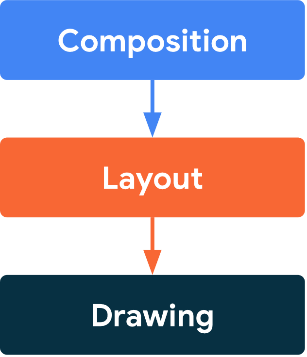
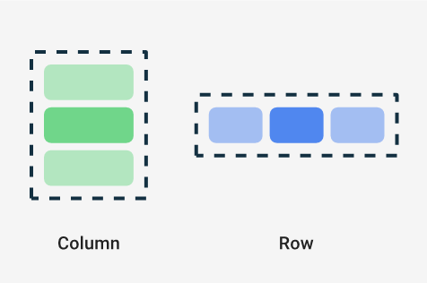

## Related Technologies for Multiplatform Applications

## 420-731-AB
Instructor: Talib Hussain

Day 3: Compose

## Objectives

Compose Basics

Basic Layout

Material 3

Component State

Assignment \##1 Handed Out

## Key Links

[https://developer\.android\.com/jetpack/compose/documentation](https://developer.android.com/jetpack/compose/documentation)

[https://developer\.android\.com/jetpack/compose/tutorial](https://developer.android.com/jetpack/compose/tutorial)

## Compose Multiplatform

* Jetpack Compose is a toolkit for building native Android UI
* Compose Multiplatform essentially extends Compose to cross\-platform\, with some limitations
* We'll focus initially on learning Compose in general\.
* Compose approach is based on defining the UI by describing how it should look and providing data dependencies
  * Rather than focusing on the process of the UI's construction

## Composable Functions

* Compose is built around composable functions
* This is a declarative style of programming
* To make a function composable\, just add the @Composable annotation to it\.
  * @Composable
  * fun Banner\(name: String\) \{
  * Text\("Hello $name\."\)
  * \}
*  In your Multiplatform project\, comment out everything inside your App\(\) function in App\.kt
*  Add the following composable to App\.kt and call it from inside App\(\)
  * @Composable
  * fun App\(\) \{
  * Banner\("Qureshi"\)
  * \}

## Key Properties of Composables

* Composables in Kotlin have properties similar to those of components in React
* Composables are immutable
  * You can't directly update its contents\.
  * You need to pass any and all information as parameters \(or state\)
* Composables are idempotent
  * It must have the same way when called multiple times with the same arguments \(and state\)
  * i\.e\.\, free of side\-effects
* When parameters/state changes\, the UI for that composable is regenerated
  * This process is called  __recomposition__
* As in React\, every time the state of the UI changes\, Compose recreates the parts of the UI tree that have changed\.

## Lifecycle of Composables

[https://developer\.android\.com/jetpack/compose/lifecycle](https://developer.android.com/jetpack/compose/lifecycle)

## Phases

* Compose has 3 main phases
  * Composition: What UI to show\. Compose runs composable functions and creates a description of your UI\.
  * Layout: Where to place UI\. This phase consists of two steps: measurement and placement\. Layout elements measure and place themselves and any child elements in 2D coordinates\, for each node in the layout tree\.
  * Drawing: How it renders\. UI elements draw into a Canvas\, usually a device screen\.
* Unidirectional Data Flow: Order of these phases is generally the same\, allowing data to flow in one direction from composition to layout to drawing\.

## Layouts

* [https://developer\.android\.com/jetpack/compose/layouts/basics](https://developer.android.com/jetpack/compose/layouts/basics)
* A composable may contain several UI elements \(i\.e\.\, other composables\)
* You must provide guidance on how they should be arranged
*  Add the following line to your Banner function so that it now includes two Text components
  * Text\("Welcome to My App"\)
* Run it – What happens?

## Layout Components: Column, Row

* Two basic layout components that help you arrange elements on the screen are Column and Row\.
  * These use curly braces to wrap UI elements\.  Those element will then be displayed appropriately on the screen \(vertically for Column\, horizontally for Row\)
    * Column \{
    * List of UI elements
    * \}
*  In the Banner function\, wrap the two Text components in a Column component\.  Then Try using a Row component instead\.

## Nesting

* Composables can nest many levels deep\, as needed\.
* Change the Banner so that it is a grid containing two rows\, one below the other\, each with 2 Texts containing different information
* Play around with various ways to use Column and Row to layout information on the screen
* Try using the composable Spacer
  * Spacer\(modifier=Modifier\.height\(20\.dp\)\)

## Modifiers & Style parameters

* To decorate or configure a composable\, you can use:
  * Modifiers \- Analogous to using an inline "style=" in React
  * Specific parameters for that component – especially the Text component
* Modifiers allow you to change the composable's size\, layout\, appearance or add high\-level interactions\, such as making an element clickable or scrollable\.
* You can chain them to create richer composables\.
* A modifier is specified using the modifier property on a layout component:
  * Column\(
  * modifier = Modifier
  * \.padding\(24\.dp\)
  * \.fillMaxSize\(\)\,
  * verticalArrangement = Arrangement\.Center\,
  * horizontalAlignment = Alignment\.CenterHorizontally
  * \) \{
  * Text\("Hello $name"\,
  * modifier=Modifier\.border\(BorderStroke\(3\.dp\, Color\.Red\)\)\)
  * Spacer\(modifier=Modifier\.height\(20\.dp\)\)
  * Text\(text="Welcome to My App"\,
  * color=Color\.Blue\,
  * fontStyle= FontStyle\.Italic\,
  * fontSize=24\.sp\,
  * fontFamily= FontFamily\.Monospace\,
  * textAlign= TextAlign\.Center\)
  * \}
* Note:
  * sp = scale\-independent pixels \(Takes user preference into account\) [https://singhajit\.com/tutorial\-1\-android\-ui\-design\-and\-styling/](https://singhajit.com/tutorial-1-android-ui-desgin-and-styling/)
  * dp = device\-independent pixels
  * When importing a needed class\, make sure to import the one from compose \(e\.g\.\, androidx\.compose\)
* [https://developer\.android\.com/jetpack/compose/modifiers](https://developer.android.com/jetpack/compose/modifiers)
* [https://developer\.android\.com/jetpack/compose/text](https://developer.android.com/jetpack/compose/text)
* [https://www\.tutorialkart\.com/android\-jetpack\-compose/text\-create/](https://www.tutorialkart.com/android-jetpack-compose/text-create/)
* [https://semicolonspace\.com/jetpack\-compose\-alignment\-arrangement/](https://semicolonspace.com/jetpack-compose-alignment-arrangement/)

## 

Mouse over the composable namein the IDE to see a pop\-up givingdetails on the parameters for thatcomposable

Or\, click on the name of the componentto load the associated \.kt file\, whichusually will provide the documentationand/or show you details on eachpossible parameter/function for that class

## Try It!

* Using the links provided so far\, explore styling and laying out Text components\, Columns and Rows in various ways
  * Especially from link: [https://developer\.android\.com/jetpack/compose/documentation](https://developer.android.com/jetpack/compose/documentation)
* Remove \.fillMaxSize\(\) – What happens?
* Try using \.fillMaxWidth\(\) – What happens?

## Loading Images in Multi-Platform

* Images are loaded slightly differently in Compose Multiplatform than usual for an Android app
* The image resource \(e\.g\.\, image\.jpg\) must be stored in the shared/src/commonMain/resources folder
* The composable that is going to load the image must use the experimental API annotation:
  * @OptIn\(ExperimentalResourceApi::class\)
* Then\, just use the Image composable as usual:
  * Image\(
  * painterResource\("image\.jpg"\)\,
  * null
  * \)

## Exercise

* Worth 0\.5%
* [https://developer\.android\.com/codelabs/basic\-android\-kotlin\-compose\-composables\-practice\-problems](https://developer.android.com/codelabs/basic-android-kotlin-compose-composables-practice-problems)
* Capture screenshots of each completed exercise showing code and emulator\.
  * If you don't fully complete an exercise\, capture a screenshot showing your partial work on that exercise\.
* Upload a zip file with all of screenshots to Lea\.

## Material

* Material is a  __design system __ created by Google to help teams build high\-quality digital experiences for Android\, iOS\, Flutter\, and the web\.
* It provides a number of components and layouts available as composable functions in Compose
  * Note: These components are also available in React and other languages\.
* Read about it here:
  * [https://m3\.material\.io/get\-started](https://m3.material.io/get-started)
  * [https://developer\.android\.com/jetpack/compose/layouts/material](https://developer.android.com/jetpack/compose/layouts/material)

## MaterialTheme

* Generally\, we use the MaterialTheme component at the highest level\.  This provides theme value \(colors\, shapes\, etc\) that are used by the various Material components\.
  * [https://developer\.android\.com/reference/kotlin/androidx/compose/material3/package\-summary\##materialtheme](https://developer.android.com/reference/kotlin/androidx/compose/material3/package-summary#materialtheme)
  * [https://developer\.android\.com/codelabs/basic\-android\-kotlin\-compose\-material\-theming\##2](https://developer.android.com/codelabs/basic-android-kotlin-compose-material-theming#2)
* Often\, we just stick with the defaults by using it without parameters
  * @Composable
  * fun MyApp\(\) \{
  * MaterialTheme \{
  * // Material Components like Button\, Card\, Switch\, etc\.
  * \}
  * \}

## Other Material UI Components

* There are many Material components we can use\.
  * [https://developer\.android\.com/reference/kotlin/androidx/compose/material3/package\-summary](https://developer.android.com/reference/kotlin/androidx/compose/material3/package-summary)
* Buttons
  * [https://m3\.material\.io/components/all\-buttons](https://m3.material.io/components/all-buttons)
  * https://developer\.android\.com/reference/kotlin/androidx/compose/material3/package\-summary\##Button\(kotlin\.Function0\,androidx\.compose\.ui\.Modifier\,kotlin\.Boolean\,androidx\.compose\.ui\.graphics\.Shape\,androidx\.compose\.material3\.ButtonColors\,androidx\.compose\.material3\.ButtonElevation\,androidx\.compose\.foundation\.BorderStroke\,androidx\.compose\.foundation\.layout\.PaddingValues\,androidx\.compose\.foundation\.interaction\.MutableInteractionSource\,kotlin\.Function1\)
* Card – Several types of card variants
  * [https://m3\.material\.io/components/cards/overview](https://m3.material.io/components/cards/overview)
  * [https://developer\.android\.com/reference/kotlin/androidx/compose/material3/package\-summary\##card](https://developer.android.com/reference/kotlin/androidx/compose/material3/package-summary#card)
  * Card\(
  * onClick = \{ /\* Do something \*/ \}\,
  * modifier = Modifier\.size\(width = 180\.dp\, height = 100\.dp\)
  * \) \{
  * Box\(Modifier\.fillMaxSize\(\)\) \{
  * Image\(…\)
  * Text\("Clickable"\, Modifier\.align\(Alignment\.Center\)\)
  * \}
  * \}

## State

* Since components are immutable\, we must explicitly change state of the component using a mutableState in order to cause the component to be recomposed\.
  * This approach is similar in principle to useState in React\.
* We must use the keyword 'remember' in order to avoid resetting the state value each time the component is recomposed\.
* The syntax for creating a state variable is:
  * e\.g\.\, val count = remember \{ mutableStateOf\(0\) \}
* The syntax for accessing or modifying the value of a state variable is to use <statevariable>\.value
  * e\.g\.\, count\.value
* E\.g\.\,
  * @Composable
  * fun CountWithButton\(\) \{
  * Column\(modifier = Modifier\.padding\(16\.dp\)\) \{
  * val count = remember \{ mutableStateOf\(0\) \}
  * Text\("You've had $\{count\.value\} glasses\."\)
  * Button\(onClick = \{ count\.value\+\+ \}\, Modifier\.padding\(top = 8\.dp\)\) \{
  * Text\("Add one"\)
  * \}
  * \}
  * \}

## State: Links

* Useful links on State
  * [https://developer\.android\.com/jetpack/compose/state](https://developer.android.com/jetpack/compose/state)
  * [https://developer\.android\.com/codelabs/jetpack\-compose\-state](https://developer.android.com/codelabs/jetpack-compose-state)
  * [https://dev\.to/zachklipp/remember\-mutablestateof\-a\-cheat\-sheet\-10ma](https://dev.to/zachklipp/remember-mutablestateof-a-cheat-sheet-10ma)
* Good codelab \(we'll do part of this next class as an exercise\)
  * https://developer\.android\.com/codelabs/jetpack\-compose\-state\##1

## Assignment #1: Single screen Kotlin Multiplatform / Compose Multiplatform App

* Worth 5% of grade\.  Due Apr 11 by 4:00pm\.  This is an individual assignment\.
* For this assignment\, you will create a single screen mobile app that runs on one platform \(iOS or Android\)\, and uses the multiplatform technologies taught in class\.
* The topic of the app is of your choice
  * Recommendation: Choose a screen/subject that aligns with your project\.  Try to focus on something different than your teammates\.
* The app must:
  * Be based on the Compose Multiplatform template and programmed in Kotlin
  * Use Material design
  * Contain multiple components and show good attention to layout
  * Show reasonable attention to styling/theming
  * Get user input \(button and/or text input\)
  * Update what is on the screen based on user input \(using mutableState\)
* The code must be documentation internally and contain a Readme file
  * The internal documentation should be informative and meaningful \(i\.e\.\, not vacuous\)
  * The Readme should give a high level indication of what the product is and how to use it\.  If there are any known issues\, they should be described/explained in the Readme\.  The Readme file should live at the root level of the project\.
* The code must compile and run\.
  * If you submit something with compile errors or that shows no meaningful output\, a high penalty will be assessed\, as appropriate\.
* The app should be usable – with clear wording/instructions and understandable\, easy\-to\-use interface

* Marking Scheme:
  * 40% Functionality
  * 20% Styling/Layout
  * 20% Documentation
  * 20% Usability/Design
  * 10% Bonus: Works on both iOS and Android\!
* Submission:
  * Submit zip file of entire project on Lea\.
* Late Penalty:
  * Late submissions lose 10% per day to a maximum of 1 day \(specifically: midnight the next day\)
  * Nothing accepted after 1 day without prior arrangement and a grade of zero may be given\.
  * Strong Recommendation: Submit incomplete version ON TIME with explanation of what is not done\.  Submit completed version the next day\.  This will likely result in a lower penalty than just submitting late\.
* Original work\!
  * "Your submitted work must be clear\, complete\, and YOUR OWN\.  You must be prepared to explain any of your work to me in person\.  Failure to be able to defend your work\, or do a similar question in front of me in person can/will void any grade you get on this assignment\."
  * Any code snippets copied or highly inspired from a 3rd party source must be explicitly indicated in the code documentation or Readme\.  The total amount of such non\-original code should be a small portion of your code\.

