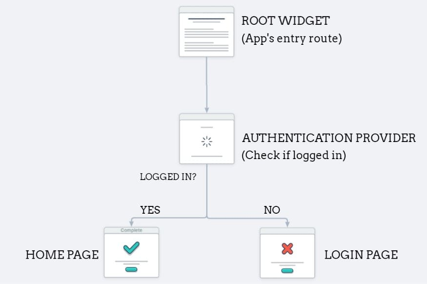
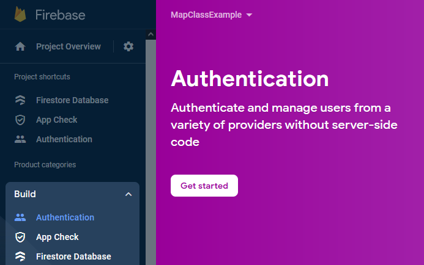
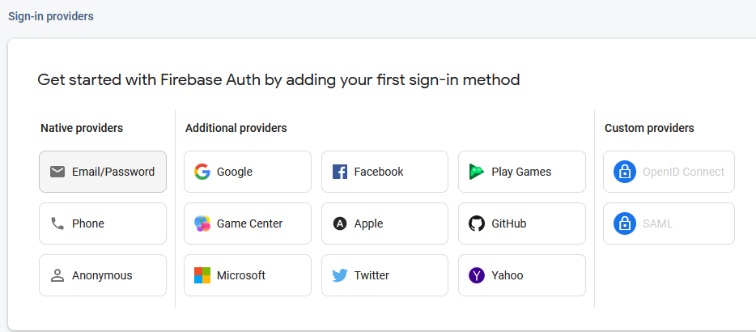
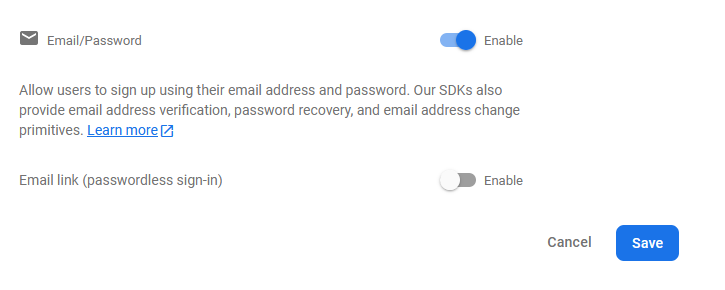
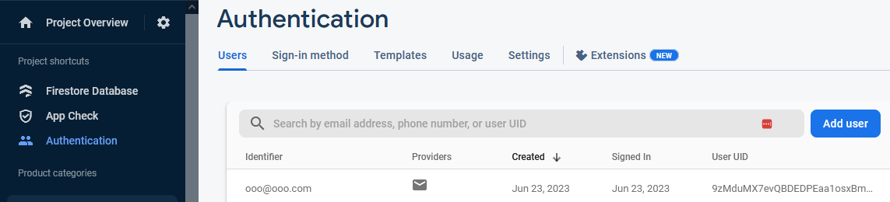

## Related Technologies for Multiplatform Applications

## 420-731-AB
Instructor: Talib Hussain

Day 14: Authentication

## Objectives

Design Milestone Presentations

Exercise 11: User authentication

More Error Handling

Misc\.

__Handout test__

## Authentication

* We have a serverless mobile app\.  Thus\, we do not have a back\-end server that we control that can perform user authentication\.
* Doing user authentication solely on the front\-end is not secure since we can't ensure secure access to the database \(e\.g\.\, malicious client\)
* But\, we can use the Firebase authentication service to validate our users securely
* We will be following the approach in this link:
  * [https://dev\.to/raajeevchandran/firebase\-authentication\-and\-keeping\-users\-logged\-in\-with\-provider\-in\-flutter\-9j5](https://dev.to/raajeevchandran/firebase-authentication-and-keeping-users-logged-in-with-provider-in-flutter-9j5)
* Official documentation is available here:
  * [https://firebase\.google\.com/docs/auth/flutter/start](https://firebase.google.com/docs/auth/flutter/start)

## Provider-based  approach…

## Exercise 11: Setting Up

* Before starting: Make sure you have committed & pushed\!
* We need to add the firebase\_auth plugin
  * flutter pub add firebase\_auth
  * If you haven't already from the earlier exercise\, also:
    * flutter pub add firebase\_core
    * flutter pub add provider
* At the top of the files that access the auth capabilities\, you will need to import the package
  * import 'package:firebase\_auth/firebase\_auth\.dart';
* We won't be using emulators per se\, but be aware that they are available\, which will let you develop offline if needed\.

## Setup on Firebase online

Go to your  console\.firebase\.google\.com and go to the authentication page in the build menu on the left

Click Get Started

## 

Choose the email/password provider and enable it\.

## Walkthrough of Link and Teacher Code

* Mostly the same as the link
  * [https://dev\.to/raajeevchandran/firebase\-authentication\-and\-keeping\-users\-logged\-in\-with\-provider\-in\-flutter\-9j5](https://dev.to/raajeevchandran/firebase-authentication-and-keeping-users-logged-in-with-provider-in-flutter-9j5)
  * Teacher code in class materials: teaching\_example\_flutter\_June23\_withAuth
* New way of accessing provider: context\.watch / context\.read
  * Can also still use Provider\.of
* We'll rename the former "User" and "UserRepository" to be "Profile" and "ProfileRepository" to avoid confusion with an auth package provided "User" object
* We'll create an "AuthRepository" that will perform our sign\-in/sign\-up operations using firebase auth\.
* We'll perform a joint operation when registering a user
  * The "Profile" repository will have a handle on the "Auth" repository
  * When adding a new user\, the Profile repository will call the auth repository first and then create the profile if successful\.
    * i\.e\.\, perform both asynchronous operations in a single method to avoid inconsistencies and simplify what we need to do in the UI widget\.
* Finally\, once everything is setup\, we can use the information about the currently authorized user to retrieve that user's profile information from the profile repository\.

## 

After addUser is updated and ProfileRepository is properly connected to the AuthRepository\, clicking on your register link should resuly in a new user being created in Firebase\.

In your console\.firebase\.google\.com\, click on Authentication on the menu on the left and look at the Users tab\.  You should see your new user\.

## Exercise 11 Wrap-Up

Capture screenshot of your online authentication database showing created users

Capture screenshots of your app showing logged in and logged out status\.

If you have other gated content \(e\.g\.\, UserGrid\)\, capture screenshots showing those before and after log in

Zip up your screenshots and upload to Lea\.

## Alternative links for user authentication

* There are several approaches to user authentication\.
* Social authentication: Using a  "Google Sign\-In" / "Facebook Sign\-in" / "Apple Sign\-in" etc\.
  * [https://firebase\.google\.com/docs/auth/flutter/federated\-auth](https://firebase.google.com/docs/auth/flutter/federated-auth)
* Below are some links showing or discussing approaches that differ in some ways from the one taught in class\.  There are many other links online\.
  * Recommend: Keep it simple for this class\!
  * [https://firebase\.google\.com/codelabs/firebase\-auth\-in\-flutter\-apps](https://firebase.google.com/codelabs/firebase-auth-in-flutter-apps)
  * [https://stackoverflow\.com/questions/63669262/check\-authentication\-state\-of\-user\-using\-firebaseauth\-in\-flutter](https://stackoverflow.com/questions/63669262/check-authentication-state-of-user-using-firebaseauth-in-flutter)
  * [https://stackoverflow\.com/questions/46253226/detect\-firebase\-auth\-provider\-for\-logged\-in\-user](https://stackoverflow.com/questions/46253226/detect-firebase-auth-provider-for-loged-in-user)
  * [https://stackoverflow\.com/questions/37873608/how\-do\-i\-detect\-if\-a\-user\-is\-already\-logged\-in\-firebase](https://stackoverflow.com/questions/37873608/how-do-i-detect-if-a-user-is-already-logged-in-firebase)

## More Error Handling

* Make error handling requirements clear as part of the function documentation and even better as the function signature
* Throw explicit user\-defined exceptions \(so rest of code is not dependent on 3rd party exceptions\)
* Result/sealed class approach: [https://codewithandrea\.com/articles/flutter\-exception\-handling\-try\-catch\-result\-type/](https://codewithandrea.com/articles/flutter-exception-handling-try-catch-result-type/)
* "Either" approach: [https://medium\.com/flutter\-community/a\-pragmatic\-approach\-to\-error\-handling\-468c4ac1a645](https://medium.com/flutter-community/a-pragmatic-approach-to-error-handling-468c4ac1a645)
* Asynchronous error handling\.  Recommend using await and try\.\.catch\, but can use \.catch\(\) and \.then\(\) on the Future\.  [https://dart\.dev/guides/libraries/futures\-error\-handling](https://dart.dev/guides/libraries/futures-error-handling)
  * Note: This approach can be hard to debug in the IDE with breakpoints\, etc\.

## Self-Study - Fetch

* This link does a very good job of describing how to use fetch\.   Please consult it to learn how to use fetch\.
  * [https://docs\.flutter\.dev/cookbook/networking/fetch\-data](https://docs.flutter.dev/cookbook/networking/fetch-data)
* A fetch call is necessarily asynchronous
  * Roughly dealing with a fetch is similar to dealing with the asynchronous database calls we made for our CRUD\.
  * i\.e\.\, use Futures/FutureBuilder

## Group Config

* Share database: [https://support\.google\.com/firebase/answer/7000272?hl=en](https://support.google.com/firebase/answer/7000272?hl=en)
* Git branch / merge
  * Next week…

## Misc

* Using Emulators
  * [https://firebase\.google\.com/docs/emulator\-suite/connect\_auth](https://firebase.google.com/docs/emulator-suite/connect_auth)
  * [https://firebase\.google\.com/docs/emulator\-suite/connect\_firestore](https://firebase.google.com/docs/emulator-suite/connect_firestore)
* StreamBuilder
  * [https://stackoverflow\.com/questions/50844519/flutter\-streambuilder\-vs\-futurebuilder](https://stackoverflow.com/questions/50844519/flutter-streambuilder-vs-futurebuilder)
  * [https://webcache\.googleusercontent\.com/search?q=cache:Emz3\_jfLBmoJ:https://medium\.com/quick\-code/reading\-lists\-from\-firestore\-using\-streambuilder\-in\-flutter\-eda590f461ed&cd=9&hl=en&ct=clnk&gl=ca](https://webcache.googleusercontent.com/search?q=cache:Emz3_jfLBmoJ:https://medium.com/quick-code/reading-lists-from-firestore-using-streambuilder-in-flutter-eda590f461ed&cd=9&hl=en&ct=clnk&gl=ca)
* Shimmer
  * Shimmer is a loading effect that is used to add beautiful animation when the data is loading from the server\. In simple words\, it is a loader like the Circular Progress Indicator available in the Flutter framework\.
  * [https://levelup\.gitconnected\.com/shimmer\-loading\-with\-provider\-28173f4267b0](https://levelup.gitconnected.com/shimmer-loading-with-provider-28173f4267b0)
    * import 'package:shimmer/shimmer\.dart';
    * Widget loadingShimmer\(\) => Shimmer\.fromColors\(
    * baseColor: Colors\.grey\,
    * highlightColor: Colors\.grey\[400\]\!\,
    * period:const Duration\(seconds: 1\)\,
    * child:
* Using a logger
  * [https://blog\.logrocket\.com/flutter\-logging\-best\-practices/](https://blog.logrocket.com/flutter-logging-best-practices/)
* Snackbar
  * [https://docs\.flutter\.dev/cookbook/design/snackbars](https://docs.flutter.dev/cookbook/design/snackbars)
* Documentation
  * [https://dart\.dev/effective\-dart/documentation](https://dart.dev/effective-dart/documentation)

