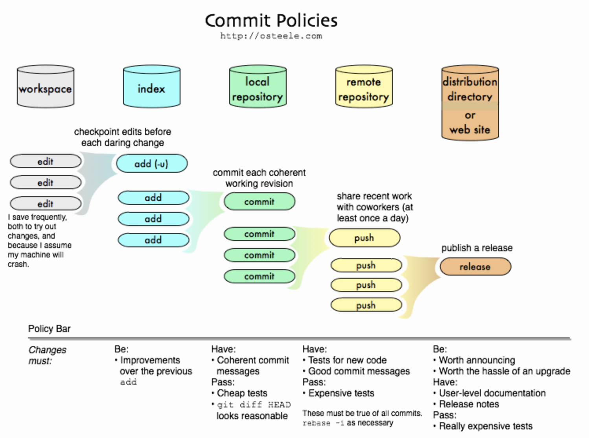

import { Tabs, TabItem } from '@astrojs/starlight/components';

When sharing code with others, it is often required to organize the developer history mores carefully than when working alone. Each git commit is a snapshot of the codebase, and it is important that each snapshot is sensible and recoverable. 

At the same time, it can sometimes feel like adding too many rules to the way you code can be prohibitive to the creative development process. Is there a way to get the best of both worlds?

The figure below from [Oliver Steele](https://blog.osteele.com/2008/05/commit-policies/) is a clear depiction of the kind of workflow common in shared development with repositories like GitHub:



Terminology review:
- **workspace:** the source code on your file system
- **index:** the staged files in your local repository 
- **local repository:** committed changes in your local repository
- **remote repository:** pushed changes in your shared GitHub repository
- **distribution:** published releases of your application

To paraphrase from the blog: by placing less restrictive "policies" to the left of the graph, you can update your own work frequently without worrying about affecting the work of others. By placing more restrictive "policies" on the right, you can maintain the stability of releases. And by incrementing the restrictiveness of these policies in small steps, you can reduce the backlog of code that is “trapped” towards the left.

Setting a "policy bar" like requiring that commit messages are "good" before pushing to a shared repository **requires that you can have a second chance at making commits**, that is, to be able to refactor not just your code, but your commit history, before pushing.

It turns out that before commits are pushed to a shared repository, they can be modified directly in `git` -- you can see in the small print of the figure above a reference to the command `git rebase -i`, which is one of the more common commands for doing this kind of work. 

Whenever you have a code review that requests you fix things like commit messages/titles, or requests that you split an existing commit into smaller chunks, you will **need to reset or rebase those commits, recover the changes, and create new commits**. This is not so difficult, once you are used to it. These notes should help give you concrete examples of the variety of `git` commands available to you for managing complex changes.

## Sharing code with others

*The following notes are adapted from https://www.atlassian.com/git/tutorials/comparing-workflows and https://www.atlassian.com/git/tutorials/comparing-workflows/feature-branch-workflow*

Before getting into detailed examples, it's worth going over the big picture of the problem we are trying to solve.

There are many possible ways to organize how code should be shared among developers. This is one of the core problems of the [DevOps](https://en.wikipedia.org/wiki/DevOps) field.

There are three main workflows worth knowing about for our purposes:

1. the [Centralized workflow](https://www.atlassian.com/git/tutorials/comparing-workflows), where developer share a `main` branch and all changes are committed to this branch. Developers manage conflicts locally and either merge or rebase to update the `main` branch. This is the default `git` workflow and requires no branches.
2. the [Git feature branch workflow](https://www.atlassian.com/git/tutorials/comparing-workflows/feature-branch-workflow) is common, and is the main workflow we will be learning about this semester.
3. The [Forking workflow](https://www.atlassian.com/git/tutorials/comparing-workflows/forking-workflow) is very common in open source software projects where there are many developers who do not necessarily know eachother or work together, allowing their work to be more independent while stille facilitating collaboration. We will not cover this in detail in our class, but it is worth knowing about as you will see it in your travels.

### Example

### Merging

In our project milestone, direct pushes to `main` are prohibited -- this means that we will need to request a `pull` from main branch instead, merging the feature you develop with the main codebase once it is approved. This makes sure that all code in the final product is (https://microsoft.github.io/code-with-engineering-playbook/code-reviews/).

See [Pull Requests in GitHub](https://docs.github.com/en/github/collaborating-with-issues-and-pull-requests/creating-a-pull-request) for clarifications about how to create a pull request.

:::tip
Why make **pull requests** instead of **pushes** to a shared repository? Once the repository is shared with more than once person, the code in it no longer belongs to a single developer. It is easy to accidentally push to a branch you own -- when it is your own branch, that is no problem, but when the branch is shared, that can introduce bugs and overwrite the work of colleagues.
:::

### Conflicts

If multiple people make changes to the same files, you may need to
resolve any conflicts that have occurred before you can merge.

```bash
# check out the develop branch and get the latest changes
git checkout develop
git pull

# check out your branch
git checkout <your branch>

# merge the develop branch into your branch
git merge develop

# if merge conflicts occur, above command will fail with a message telling you that there are conflicts to be solved

# find which files need to be resolved, and edit them to resolve the conflict
git status
```

Git conflicts produce a "diff", which can be resolved by selecting which parts of the conflict you want to accept or reject:

-   Accept your changes (current)
-   Accept the changes from dev branch (incoming)
-   Accept them both and fix the code (probably needed)

```diff ins={4-5} del={7} title="sample.txt"
Here are lines that are either unchanged from the common
ancestor, or cleanly resolved because only one side changed.
<<<<<<< ours:sample.txt           # git resolution marker
Conflict resolution is hard;       # changed in ours:sample.txt 
let's go shopping.                 # changes in ours:sample.txt
=======                            # git resolution divider
Git makes conflict resolution easy.    # changed in theirs:sample.txt
>>>>>>> theirs:sample.txt              # git resolution divider
And here is another line that is cleanly resolved or unmodified
```

You can use `git checkout --ours/theirs` to resolve these conflicts automatically:

<Tabs>
  <TabItem label="git checkout --ours">

After running `git checkout --ours`, `sample.txt` is automatically updated to only include the local changes:

```diff title="sample.txt" {3}
Here are lines that are either unchanged from the common
ancestor, or cleanly resolved because only one side changed.
Git makes conflict resolution easy.
And here is another line that is cleanly resolved or unmodified
```

  </TabItem>
  <TabItem label="git checkout --theirs">

After running `git checkout --theirs`, `sample.txt` is automatically updated to only include the remote changes:

```diff title="sample.txt" {3,4}
Here are lines that are either unchanged from the common
ancestor, or cleanly resolved because only one side changed.
Conflict resolution is hard;
let's go shopping.
And here is another line that is cleanly resolved or unmodified
```

  </TabItem>
  <TabItem label="Manual git resolution">

You can always manually resolve conflicts using your favourite editor. This way you can combine the two versions and modify them as you see fit:

```diff title="sample.txt" {3-4}
Here are lines that are either unchanged from the common
ancestor, or cleanly resolved because only one side changed.
Git makes conflict resolution easy.
Nevertheless, let's go shopping anyway.
And here is another line that is cleanly resolved or unmodified
```

  </TabItem>
</Tabs>

The merge process is completed when **all git conflict markers `<<<<` and `====` and `>>>>` are removed from the file**. Make sure you test the result by building your project before continuing.

```bash
# conclude the merge
git merge --continue

# verify that everything went ok
git log

# push the changes to the remote branch
git push
```

If no other conflicts appear, the PR can now be merged, and your branch
deleted. **Use `squash` to reduce your changes into a single commit, so
the commit history can be within an acceptable size.**

### Rebasing

*The following notes were adapted from the MAN page of `git-rebase`.*

In my mind, `git rebase` is the more useful cousin of `git merge`.

`git-rebase`: Reapply commits from one branch on top of another branch. A short example follows.

Assume you have a branch `topic` that you have been working on. In the time since you began work, other developers have completed pull requests to `main` branch, and so your `topic` branch has fallen behind.

You can apply the following command (either one, same result):

```bash
git rebase main
git rebase main topic
```

And see the following change to your branches (click the tabs):

<Tabs>
  <TabItem label="Branches before rebase">

  ```bash
       a---b---c topic
      /
  d---e---f---g main
  ```

  </TabItem>
  <TabItem label="Branches after rebase">

  ```bash
               a*---b*---c* topic
              /
  d---e---f---g main
  ```

  </TabItem>
</Tabs>

A range of commits can also be removed with rebase. If we have the following situation:

```bash
E---F---G---H---I---J  topicA
```
then the command `git rebase --onto topicA~5 topicA~3 topicA` would result in the removal of commits F and G:

```bash
E---H*---I*---J*  topicA
```

This is useful if F and G were flawed in some way, or should not be
part of topicA. Note that the argument to `--onto` and the `<upstream>`
parameter can be any valid commit.

In case of conflict, git rebase will stop at the first problematic commit and leave conflict markers in the tree. You can use git diff to locate the markers `<<<<<<` and make edits to resolve the conflict. 

For each file you edit, you need to tell git that the conflict has been resolved, typically this would be done with `git add <filename>`

After resolving the conflict manually and updating the index with the desired resolution, you can continue the rebasing process with `git rebase --continue`

Alternatively, you can undo the git rebase with `git rebase --abort`

### Stashing changes

`git stash` is super handy if you have un-committed changes in your
working directory, but you want to work on a different branch. You can
run `git stash`, save the un-committed work, and revert to the HEAD
commit. You can retrieve the saved changes by running `git stash pop`:

```bash
git stash
…
git stash pop
```

Or you can move the current state into a new branch:

```bash
git stash branch <new_branch_to_save_changes>
```


## Example workflows


### Preserve & edit existing commits with `git commit --amend`


### Precise change selection with `git add --patch`


<Tabs>
  <TabItem label="Rejecting a hunk">
   
```diff /.*Stage this hunk.*/
$ git add -p AdvancedStateAndSideEffectsCodelab/
diff --git a/AdvancedStateAndSideEffectsCodelab/app/build.gradle b/AdvancedStateAndSideEffectsCodelab/app/build.gradle
index 726de7a..47e44f7 100644
--- a/AdvancedStateAndSideEffectsCodelab/app/build.gradle
+++ b/AdvancedStateAndSideEffectsCodelab/app/build.gradle
@@ -42,16 +42,6 @@ android {
         manifestPlaceholders = [MAPS_API_KEY: properties.getProperty("MAPS_API_KEY", "")]
     }
 
-    signingConfigs {
-        // We use a bundled debug keystore, to allow debug builds from CI to be upgradable
-        debug {
-            storeFile rootProject.file('debug.keystore')
-            storePassword 'android'
-            keyAlias 'androiddebugkey'
-            keyPassword 'android'
-        }
-    }
-
     buildTypes {
         debug {
             signingConfig signingConfigs.debug
(1/2) Stage this hunk [y,n,q,a,d,j,J,g,/,e,?]? n
```

  </TabItem>
  <TabItem label="Accepting a hunk">

```diff /.*Stage this hunk.*/
@@ -126,6 +116,7 @@ dependencies {
     def lifecycle_version = "2.6.2"
     implementation "androidx.lifecycle:lifecycle-viewmodel-compose:$lifecycle_version"
     implementation "androidx.lifecycle:lifecycle-viewmodel-ktx:$lifecycle_version"
+    implementation "androidx.lifecycle:lifecycle-runtime-compose:$lifecycle_version"
     implementation "com.google.dagger:hilt-android:2.48.1"
     kapt "com.google.dagger:hilt-compiler:2.48.1"
 
(2/2) Stage this hunk [y,n,q,a,d,K,g,/,e,?]? y
```

  </TabItem>
  <TabItem label="Editing a hunk">

```diff /.*Stage this hunk.*/
diff --git a/AdvancedStateAndSideEffectsCodelab/app/src/main/java/androidx/compose/samples/crane/home/CraneHome.kt b/AdvancedStateAndSideEffectsCodelab/app/src/main/java/androidx/compose/samples/crane/home/CraneHome.kt
index 5074428..4edde48 100644
--- a/AdvancedStateAndSideEffectsCodelab/app/src/main/java/androidx/compose/samples/crane/home/CraneHome.kt
+++ b/AdvancedStateAndSideEffectsCodelab/app/src/main/java/androidx/compose/samples/crane/home/CraneHome.kt
@@ -36,6 +36,7 @@ import androidx.compose.samples.crane.base.ExploreSection
 import androidx.compose.samples.crane.data.ExploreModel
 import androidx.compose.ui.Modifier
 import androidx.compose.ui.graphics.Color
+import androidx.lifecycle.compose.collectAsStateWithLifecycle
 import androidx.lifecycle.viewmodel.compose.viewModel
 
 typealias OnExploreItemClicked = (ExploreModel) -> Unit
(1/2) Stage this hunk [y,n,q,a,d,j,J,g,/,e,?]? y
@@ -76,8 +77,8 @@ fun CraneHomeContent(
     modifier: Modifier = Modifier,
     viewModel: MainViewModel = viewModel(),
 ) {
-    // TODO Codelab: collectAsStateWithLifecycle step - consume stream of data from the ViewModel
-    val suggestedDestinations: List<ExploreModel> = remember { emptyList() }
+    val suggestedDestinations by viewModel.suggestedDestinations.collectAsStateWithLifecycle()
+
 
     val onPeopleChanged: (Int) -> Unit = { viewModel.updatePeople(it) }
     var tabSelected by remember { mutableStateOf(CraneScreen.Fly) }
(2/2) Stage this hunk [y,n,q,a,d,K,g,/,e,?]? y
```

  </TabItem>
  <TabItem label="Difference after patching">

```diff ins={7-8} del={13}
$ git status
On branch state-codelab
Your branch is up to date with 'origin/state-codelab'.

Changes to be committed:
  (use "git restore --staged <file>..." to unstage)
	modified:   AdvancedStateAndSideEffectsCodelab/app/build.gradle
	modified:   AdvancedStateAndSideEffectsCodelab/app/src/main/java/androidx/compose/samples/crane/home/CraneHome.kt

Changes not staged for commit:
  (use "git add <file>..." to update what will be committed)
  (use "git restore <file>..." to discard changes in working directory)
	modified:   AdvancedStateAndSideEffectsCodelab/app/build.gradle
```


  </TabItem>
</Tabs>

### Undo a commit and redo changes with `git reset --soft`

`git reset --soft <target commit>` essentially undoes all commit metadata (the SHA, the message, etc.) from `HEAD` (current commit) to the target specified, while preserving the actual code changes in the staging area.

This is useful for editing commits! There are a variety of circumstances this comes up, I have an example below to demonstrate one possible use.

Suppose you've done a bunch of work, but haven't finished the feature yet -- maybe it's the end of a lab and you want to pick up where you left off on your home computer. Here's a possible workflow:

```
$ git add .                                       (1)
$ git commit -m "awlkdjal"                        (2)
$ git push --set-upstream origin temp-branch      (3)
... # some time passes, you're on a new machine
$ git fetch && git switch temp-branch             (4)
$ git reset --soft HEAD^                          (5)     
... # make some edits         
$ git add . && git commit                         (6)
```

1. Add all changes to staging area
2. Making some temporary commit with a throw-away message (this is fine, since we will delete this information later)
3. Push the commit to some temporary remote branch (so you can get it later on another machine)
4. `fetch` to retrieve latest updates from remote, `switch` to switch branches
5. Leaves working tree as it was before "reset" i.e. none of the committed changes are discarded, they are now marked as "staged" just as they were before (2)
6. Stage changes and make a proper commit message once you are finished.

### Undo a commit permanently with `git reset --hard`

In truth, I don't use this option very often, but I am including it to demonstrate the difference between it and the `--soft` option which I use all the time.

```
$ git commit ...
$ git reset --hard HEAD~3   (1)
```

1. Let's say your last three commits
    (HEAD, HEAD^, and HEAD~2)
    were bad and you do not
    want to ever see them
    again. Do not do this if
    you have already given
    these commits to somebody
    else (i.e. pushed the commits to a branch that other developers will use)

### Split a single commit apart into a sequence of commits with `git reset --soft` and `git add -p`

Suppose that you have created lots of logically separate changes
and committed them together. Then, later you decide that it might
be better to have each logical chunk associated with its own
commit. You can use `git reset --soft` to rewind history without changing
the contents of your local files, and then successively use `git add
-p` to interactively select which hunks to include into each commit,
using git commit -c to pre-populate the commit message.Split one commit into many with `reset` and `add -p`

```
$ git reset -N HEAD^                        (1)
$ git add -p                                (2)
$ git diff --cached                         (3)
$ git commit -c HEAD@{1}                    (4)
...                                         (5)
$ git add ...                               (6)
$ git diff --cached                         (7)
$ git commit ...                            (8)
```

1.   First, reset the history
    back one commit so that we
    remove the original
    commit, but leave the
    working tree with all the
    changes. The -N ensures
    that any new files added
    with HEAD are still marked
    so that git add -p will
    find them.
2.   Next, we interactively
    select diff hunks to add
    using the git add -p
    facility. This will ask
    you about each diff hunk
    in sequence and you can
    use simple commands such
    as "yes, include this",
    "No don’t include this" or
    even the very powerful
    "edit" facility.
3.   Once satisfied with the
    hunks you want to include,
    you should verify what has
    been prepared for the
    first commit by using git
    diff --cached. This shows
    all the changes that have
    been moved into the index
    and are about to be
    committed.
4.   Next, commit the changes
    stored in the index. The
    -c option specifies to
    pre-populate the commit
    message from the original
    message that you started
    with in the first commit.
    This is helpful to avoid
    retyping it. The HEAD@{1}
    is a special notation for
    the commit that HEAD used
    to be at prior to the
    original reset commit (1
    change ago). See
    git-reflog(1) for more
    details. You may also use
    any other valid commit
    reference.
5.   You can repeat steps 2-4
    multiple times to break
    the original code into any
    number of commits.
6.   Now you’ve split out many
    of the changes into their
    own commits, and might no
    longer use the patch mode
    of git add, in order to
    select all remaining
    uncommitted changes.
7.   Once again, check to
    verify that you’ve
    included what you want to.
    You may also wish to
    verify that git diff
    doesn’t show any remaining
    changes to be committed
    later.
8.   And finally create the
    final commit.


### Interactive git rebase

*The following notes were adapted from the MAN page of `git-rebase`.*

Rebasing interactively means that you have a chance to edit the commits which are rebased. You can reorder the commits, you can change them, and you can remove them.

The interactive mode is meant for this type of workflow:

1. make a series of changes on a codebase, something like:
    <ol type="a">
      <li>create a series of completed commits</li>
      <li>make partial progress on some other work saved in a temporary commit</li>
      <li>fixup of some previous mistakes in the codebase</li>
    </ol>
2. commit those changes and `git push` them to a shared repository
3. your changes were not approved, repeat step 1 until they pass approval.

Sometimes the thing fixed in 1.c cannot be amended to the not-quite perfect commit it fixes, because that commit is buried deeply in your commit history. That is *exactly* what interactive rebase is for: use it after plenty of "1.a"s and "1.b"s, by rearranging and editing commits, and squashing multiple commits into one.

That is, after any normal day of development, `git rebase --interactive` lets you organize your work into a series of commits at will.

Start `git rebase -i` with the last commit you want to retain as-is:

```bash
git rebase -i SHA-or-reference-to-commit

## E.g. using reference to HEAD
git rebase -i HEAD~2

## E.g. SHA commit id (first 7 digits is enough)
git rebase -i fa1afe1
```

An editor will be fired up with all the commits in your current branch that come after the given commit. You can reorder the commits in this list to your heart’s content, and you can remove them. 

Assume the commit BEFORE the one you selected has the id `9f36727`. The resulting `git rebase` TODO list will look more or less like this:

```bash
pick deadbee The oneline of this commit
pick fa1afe1 The oneline of the next commit

# Rebase 9f36727..fa1afe1 onto 9f36727 (2 commands)
#
# Commands:
# p, pick <commit> = use commit
# r, reword <commit> = use commit
# e, edit <commit> = use commit
# s, squash <commit> = use commit
# ... more commands follow 
```

The oneline descriptions are purely for your pleasure; `git rebase` will not look at them. The commit SHA-ids (`deadbee` and `fa1afe1` in this example) are the important part: do not delete or edit the ids.

The TODO list that `git rebase --interactive` is showing you is the **default commands that take place when you run a normal `git rebase`**. By default, each commit in the range specified is `picked` i.e. **applied** to your current branch, starting from the top and working towards the bottom.

What `git rebase --interactive` allows you to do is to *change* the `pick` instruction for each commit to **some other instruction**. This is where the real power of the command lies.

By replacing the command `pick` with the command `edit`, you can tell `git rebase` to stop after applying that commit, so that you can edit the files and/or the commit message, amend the commit, and continue rebasing.

To interrupt the rebase (just like an `edit` command would do, but without cherry-picking any commit first), use the `break` command.

If you just want to edit the commit message for a commit, replace the
command `pick` with the command `reword`.

To drop a commit, replace the command `pick` with `drop`, or just
delete the matching line.

If you want to fold two or more commits into one, replace the command
`pick` for the second and subsequent commits with `squash` or `fixup`.

`git rebase` **will stop to give you the change to make changes** when `pick` has been replaced with `edit` or when a command fails due to merge errors. When you are done editing and/or resolving conflicts you can continue with `git rebase --continue`.

Reordering and editing commits usually creates untested intermediate steps. You may want to check that your history editing did not break anything by running a test, or at least recompiling at intermediate points in history by using the `exec` command (shortcut "x"). You may do so by creating a todo list like this one:

```bash
pick deadbee Implement feature XXX
fixup f1a5c00 Fix to feature XXX
exec ./gradlew build # exec can run any shell command -- might as well rebuild the project!
pick c0ffeee The oneline of the next commit
edit deadbab The oneline of the commit after
exec ./gradlew build
...
```

The interactive rebase will stop when a command fails (i.e. exits with
non-0 status) to give you an opportunity to fix the problem. You can
continue with `git rebase --continue`.

The `exec` command launches the command in a shell (the one specified
in `$SHELL` or the default shell if `$SHELL` is not set), so you can use
shell features (like `cd`, `>`, `;` ...). The command is run from the
root of the working tree.

### Splitting commits in interactive git rebase

In interactive mode, you can mark commits with the action `edit`.
However, this does not necessarily mean that git rebase expects the
result of this edit to be exactly one commit. Indeed, you can undo the
commit, or you can add other commits. This can be used to split a
commit into two:

-   Start an interactive rebase with `git rebase -i <commit>`, where
`<commit>` is the commit you want to split. In fact, any commit range
will do, as long as it contains that commit.

-   Mark the commit you want to split with the action `edit`.

-   When it comes to editing that commit, execute git reset HEAD^. The
effect is that the HEAD is rewound by one, and the index follows
suit. However, the working tree stays the same.

-   Now add the changes to the index that you want to have in the first
commit. You can use git add (possibly interactively) or git gui (or
both) to do that.

-   Commit the now-current index with whatever commit message is
appropriate now.

-   Repeat the last two steps until your working tree is clean.

-   Continue the rebase with `git rebase --continue`.

If you are not absolutely sure that the intermediate revisions are
consistent (they compile, pass the testsuite, etc.) you should use git
stash to stash away the not-yet-committed changes after each commit,
test, and amend the commit if fixes are necessary.


### Updating pull requests with --force


