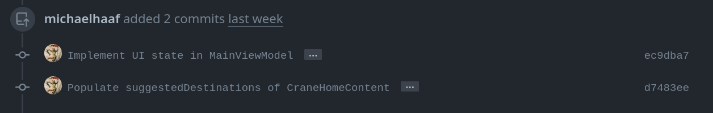
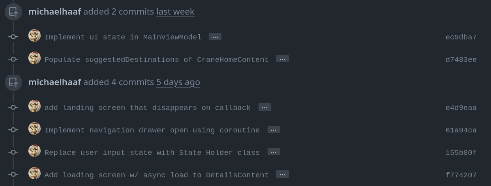
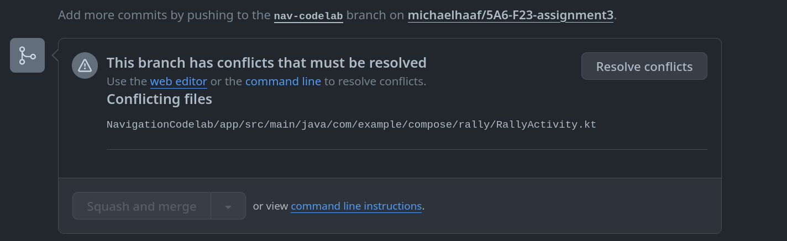
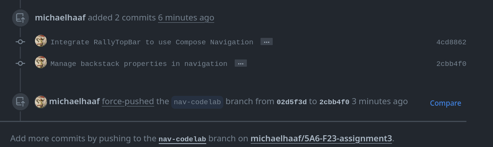

import { Tabs, TabItem } from '@astrojs/starlight/components';

## What is GitHub?

### git vs GitHub

### Alternatives

## Pull Requests

### Creating Pull Request templates

Pull request templates are `.github` directory Markdown files that allow you to specify a template for Pull Requests. You may already be using one for your project milestone.

When you add a pull request template to your repository, project contributors will automatically see the template's contents in the pull request body.

- Follow the [GitHub instructions for creating Pull Request templates](https://docs.github.com/en/communities/using-templates-to-encourage-useful-issues-and-pull-requests/creating-a-pull-request-template-for-your-repository) to create 
  - You can either use the GitHub web GUI as demonstrated in the linked instructions, or push your markdown file from your computer using your Desktop GUI/terminal CLI 
  - Typically, you can commit files like these **directly to your main branch** -- your local developer branches can be rebased with `git pull --rebase` to get the update. 
- [Sample template you can use assignments 3 and 4, and adapt for your milsetnoes 3 and 4, and adapt for your milestones](https://github.com/michaelhaaf/5A6-F23-assignment3/blob/main/.github/pull_request_template.md)

Note: templates must be created on the repository's default branch. Templates created in other branches are not available for collaborators to use. Pull request template filenames are not case sensitive, and can have an extension such as .md or .txt.

### Updating Pull Requests

Pull requests give developer teams they give us the opportunity to review, then discard/rework/edit, proposed changes to branch history in a shared draft environment. Pull requests are essentially a **draft** of the *future history* (whoa!) of your `main` branch. More clearly, they are *requests to pull (merge/rebase) the commit history of one branch onto another*, and most typically are used to *pull* developer changes onto a shared branch (typically called `main`). 

In GitHub, Pull Requests (PRs) are based on a pulling a *source* branch onto a *target* branch. They are updated automatically when the source branch they are based on is updated (i.e., when changes pushed are pushed).

This is all review so far -- however, there are slightly different workflows depending on whether or not the changes that are pushed have had their history altered or produce change conflicts. 

It is impossible to `git push` a branch that has history/content-conflicts -- those conflicts have to be "merged" -- but then, what happens to the nice linear history you spent time creating? In those cases, we can use `git push --force` to **overwrite** the remote developer branch with your proposed changes, thereby updating the pull request without any fuss.

#### No changes to history: just push

You can incrementally update a pull request by simply `git push` when you have new commits. As long as the new commits are linear additions to the existing pull request branch, and no modification of branch history took place, the pull request can update automatically along with the branch update.

```bash
## Ensure you are on your developer branch,
## and ensure the upstream branch you are pushing to is your developer branch
git push
```

<Tabs>
  <TabItem label="PR before git push">

  Figure: GitHub pull request, linear set of commits

  

  </TabItem>
  <TabItem label="PR after git push">
    
  Figure: GitHub pull request, linear set of commits, one additional commit, no issues

  

  </TabItem>
</Tabs>

You will see that the pull request automatically updates when the branch is pushed.

#### Pull requests conflicts with `main`: Resolving conflicts

After making a series of changes, you may find that your pull request has conflicts with the main branch that cannot be automatically resolved:



You will need to update your pull request such that it has the latest code from main (`git pull --rebase`) and **resolve the conflicts on your local git**. This will likely involve **rebasing your developer branch history** so that you can still retain a linear series of commits. See the relevant sections of the [git basics](/5A6-F23/lectures/development/01-git-basics/) and [git advanced](/5A6-F23/lectures/development/02-git-advanced/) for more information.

#### Changes to history: force required

It is more complicated to push a branch (and therefore update a pull request) when you have done "destructive" operations like `git rebase` -- the unique ID of historical commits, and relationships between them, are destroyed when github history is altered, therefore the pushed branch is no longer compatible. 

You will likely see screens that look something like this before and after your branch rebase:

<Tabs>
  <TabItem label="git push attempt after rebase">

```
$ git status
On branch nav-codelab
Your branch and 'origin/nav-codelab' have diverged,
and have 2 and 2 different commits each, respectively.
  (use "git pull" if you want to integrate the remote branch with yours)

nothing to commit, working tree clean

$ git push
Username for 'https://github.com': ...
Password for 'https://michaelhaaf@github.com': ...
To https://github.com/michaelhaaf/5A6-F23-assignment3
 ! [rejected]        nav-codelab -> nav-codelab (non-fast-forward)  ### non-fast-forward is the reason for rejection
error: failed to push some refs to 'https://github.com/michaelhaaf/5A6-F23-assignment3'
hint: Updates were rejected because the tip of your current branch is behind
hint: its remote counterpart. If you want to integrate the remote changes,
hint: use 'git pull' before pushing again.
hint: See the 'Note about fast-forwards' in 'git push --help' for details.
```

  </TabItem>
  <TabItem label="git push --force after rebase">

```
$ git status
On branch nav-codelab
Your branch and 'origin/nav-codelab' have diverged,
and have 2 and 2 different commits each, respectively.
  (use "git pull" if you want to integrate the remote branch with yours)

nothing to commit, working tree clean

$ git push --force
Enumerating objects: 35, done.
Counting objects: 100% (35/35), done.
Delta compression using up to 4 threads
Compressing objects: 100% (14/14), done.
Writing objects: 100% (24/24), 2.03 KiB | 259.00 KiB/s, done.
Total 24 (delta 10), reused 0 (delta 0), pack-reused 0
remote: Resolving deltas: 100% (10/10), completed with 5 local objects.
remote: 
remote: GitHub found 1 vulnerability on michaelhaaf/5A6-F23-assignment3's default branch (1 high). To find out more, visit:
remote:      https://github.com/michaelhaaf/5A6-F23-assignment3/security/dependabot/2
remote: 
To https://github.com/michaelhaaf/5A6-F23-assignment3
 + 02d5f3d...2cbb4f0 nav-codelab -> nav-codelab (forced update)
```

  </TabItem>

</Tabs>

How can we update the pull request?

Note well: **it is not necessary to create a new branch, nor to create a new pull request, when the local git history has changed**! Updating a developer branch that is under review is the perfect use case for a "dangerous" option like `git push --force`, which simply overrites the remote branch.

```bash
## Be careful to make sure you are on the right branch!
git push --force
```

<Tabs>
  <TabItem label="PR after git push --force (changed history)">
    
  Figure: GitHub pull request, no issues, "@user force-pushed SHA-1 onto SHA-2" or similar and history is updated.

  

  </TabItem>
</Tabs>

This is why using developer branches for code changes so useful: being able to manipulate your draft work history on the fly is **essential** for collaborating on code with other developers, in order to address feedback -- and are options are much more limited if we develop on `main` directly for that reason.

## GitHub Actions

### Workflows

### Action Marketplace

### Example: build & lint every pull request

### Example: package every merge to main

### Example: update version with each release

### Example: manage repository secrets for authentication

### More resources

## GitHub Project

### Issues

- [Requirement](https://github.com/michaelhaaf/5A6-F23-project-template/blob/main/.github/ISSUE_TEMPLATE/requirement.md): used to define high-level project requirements that are broken up into tasks using **Work Breakdown Structure WBS**
- [Task](https://github.com/michaelhaaf/5A6-F23-project-template/blob/main/.github/ISSUE_TEMPLATE/task.md): used to define Requirement subtasks using **Level of Effort (LOE)** estimations

### Tasks

- [Issues](https://docs.github.com/en/issues/tracking-your-work-with-issues/quickstart)

### Milestones

- [Milestones](https://docs.github.com/en/issues/using-labels-and-milestones-to-track-work/about-milestones) + [Creating and editing milestones](https://docs.github.com/en/issues/using-labels-and-milestones-to-track-work/creating-and-editing-milestones-for-issues-and-pull-requests)

### Tasking chart

- [GitHub Task list overview](https://docs.github.com/en/get-started/writing-on-github/working-with-advanced-formatting/about-task-lists)
- [Creating a Task List](https://docs.github.com/en/issues/managing-your-tasks-with-tasklists/creating-a-tasklist#creating-tasklists-with-markdown)

### Roadmap


Roadmaps are relatively common features in open-source projects for keeping-in-the-loop your community of developers, contributers, and users of your software -- the "roadmap" project is a recent attempt by GitHub to provide a GUI for automating some of this effort.

To adapt your proposal to a GitHub roadmap, see the links below for documentation and tutorials:

- [GitHub Roadmap](https://github.com/github/roadmap). 
- [Quickstart for GitHub Projects](https://docs.github.com/en/issues/planning-and-tracking-with-projects/learning-about-projects/quickstart-for-projects)
- [Project planning in Github using Roadmap](https://docs.github.com/en/issues/tracking-your-work-with-issues/planning-and-tracking-work-for-your-team-or-project)
- [Github Project overview](https://docs.github.com/en/issues/planning-and-tracking-with-projects/learning-about-projects/about-projects)
- [Best practises for GitHub Projects](https://docs.github.com/en/issues/planning-and-tracking-with-projects/learning-about-projects/best-practices-for-projects)


- [Android GitHub Actions Setup](https://medium.com/coletiv-stories/android-github-actions-setup-21ba37cf5a4f)
- [Github Actions and Gradle](https://docs.gradle.org/current/userguide/github-actions.html)
- [Workflow file syntax](https://docs.github.com/en/actions/using-workflows/workflow-syntax-for-github-actions)
- Useful articles: [Choosing the right JDK](https://developer.android.com/build/jdks), [Understanding Android build system](https://developer.android.com/build)
- Installing [ktlint](https://github.com/pinterest/ktlint): it's recommended you use the ktlint plugin available from the mavenCentral repository -- meaning, let Gradle automatically find and install ktlint for you, per-project. See [simple-setup](https://github.com/jlleitschuh/ktlint-gradle#simple-setup) for instructions.
  - Using ktlint in your project gradle: [sample build.gradle.kts](https://github.com/JLLeitschuh/ktlint-gradle/blob/main/samples/kotlin-ks/build.gradle.kts)
  - Here is another helpful example: [geeksForGeeks](https://www.geeksforgeeks.org/code-formatting-in-kotlin-using-ktlint/)
- [Gradle User Manual](https://docs.gradle.org/current/userguide/userguide.html)
- [Gradle tutorial](https://www.youtube.com/watch?v=gKPMKRnnbXU) -- step by step for "90%" of the Gradle knowledge you need to build "any Gradle project". Good conceptual overview with examples/step-by-step.
- [Android CI-CD using Github Actions](https://blog.logrocket.com/android-ci-cd-using-github-actions/)
- [Securely create android release using Github Actions](https://proandroiddev.com/create-android-release-using-github-actions-c052006f6b0b)

