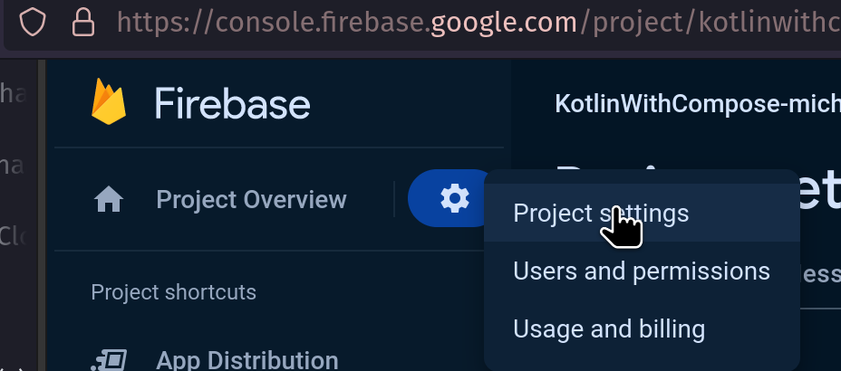
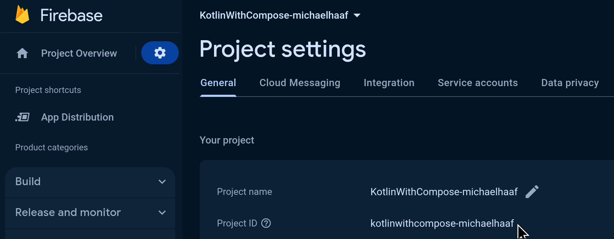
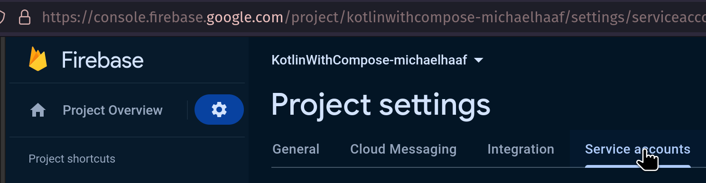
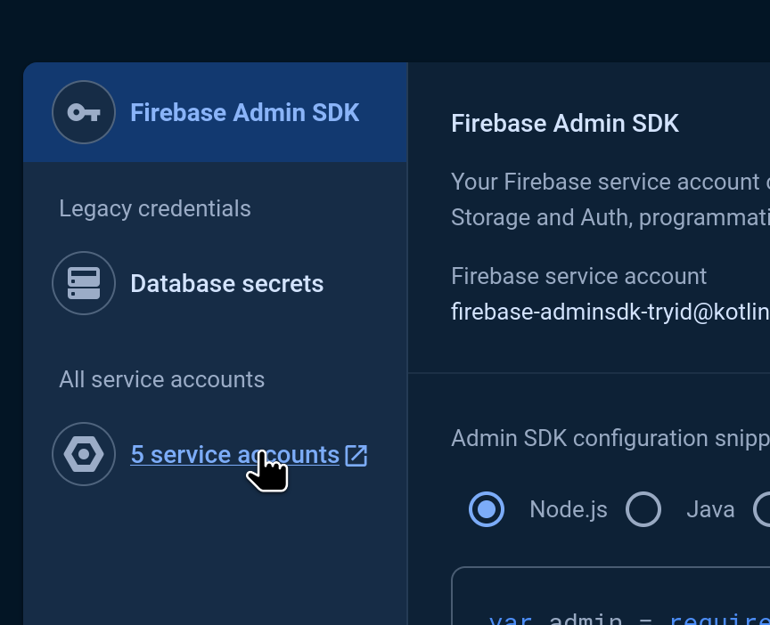
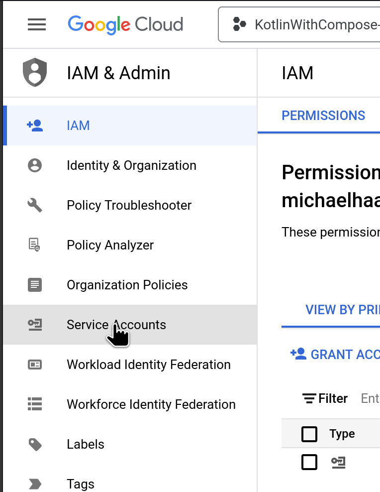
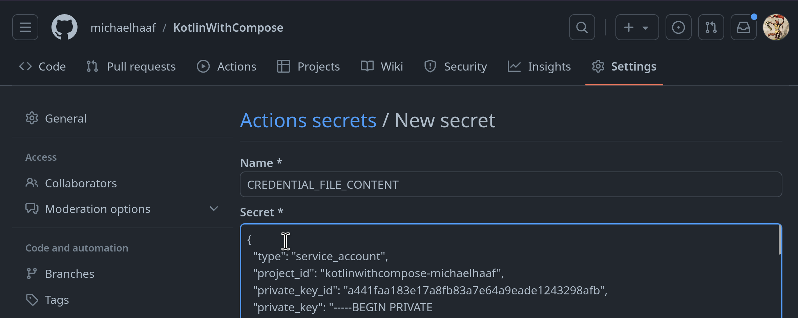
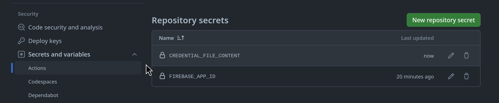

import { Tabs, TabItem } from '@astrojs/starlight/components';

## What is GitHub?

Ran out of time to write this properly, but you should know the following things (loosely based on explanations I have given in-class)

- `git` is the distributed repository technogy. It is a phenomenally powerful and ubiquitious open-source tool used for software collaboration for decades.
- GitHub is a relatively modern/recent project that is essentially a web service that manages `git` servers for its clients.
- Before GitHub, people ran their own `git` servers! Or, better yet, people [emailed git commit patches to update eachothers codebases](https://git-scm.com/docs/git-send-email). I'm not joking, emailing git commit patches remains the recommended method to [contribute to the Linux Kernel to this day](https://www.kernel.org/doc/html/latest/process/submitting-patches.html), and it actually makes a ton of sense.
- Actually, the word *distributed* means something here: every local `git` repository can act as a remote `git` repository. Having a server that listens to HTTPS/SSH calls on `git` commands is all that elevates a local repository to a remote `git` "server"
- After `git` but before GitHub, there were a wide variety of alternative technologies for this kind of thing. You may hear about SVN/Mercurial, that's what they are. They are still in use (I used Mercurial at work for a job in 2012) but I rarely run into them anymore. Similar idea but different.
- Today, there are many alternatives to using GitHub for hosting your source repositories and managing things to do with that source code. We used it this semester out of convenience/familiarity, but you should know there are other options:
  - self hosting a `git` server as discussed above (if you want to learn about [self hosting](https://en.wikipedia.org/wiki/Self-hosting_(web_services)), this is a great project!)
  - similar SAAS to Github like [GitLab](https://about.gitlab.com/)
  - commercial software like [Bitbucket](https://bitbucket.org/) 
  - A variety of things that are somewhat similar to GitHub in what they provide. I would personally recommend checking out [sourcehut](https://sourcehut.org/), [Codeberg](https://codeberg.org/), and [foregjo](https://forgejo.org/) as my understanding of the most sophisticated, instructive, useful, and "free as in libre" source software distribution platforms.

**Github makes use of Pull Requests and Actions to implement a CI/CD workflow, elaborated on in the sections below**.

## Pull Requests

### Creating Pull Request templates

Pull request templates are `.github` directory Markdown files that allow you to specify a template for Pull Requests. You may already be using one for your project milestone.

When you add a pull request template to your repository, project contributors will automatically see the template's contents in the pull request body.

- Follow the [GitHub instructions for creating Pull Request templates](https://docs.github.com/en/communities/using-templates-to-encourage-useful-issues-and-pull-requests/creating-a-pull-request-template-for-your-repository) to create 
  - You can either use the GitHub web GUI as demonstrated in the linked instructions, or push your markdown file from your computer using your Desktop GUI/terminal CLI 
  - Typically, you can commit files like these **directly to your main branch** -- your local developer branches can be rebased with `git pull --rebase` to get the update. 
- [Sample template you can use assignments 3 and 4, and adapt for your milsetnoes 3 and 4, and adapt for your milestones](https://github.com/michaelhaaf/5A6-F23-assignment3/blob/main/.github/pull_request_template.md)

Note: templates must be created on the repository's default branch. Templates created in other branches are not available for collaborators to use. Pull request template filenames are not case sensitive, and can have an extension such as .md or .txt.

### Updating Pull Requests

Pull requests give developer teams they give us the opportunity to review, then discard/rework/edit, proposed changes to branch history in a shared draft environment. Pull requests are essentially a **draft** of the *future history* (whoa!) of your `main` branch. More clearly, they are *requests to pull (merge/rebase) the commit history of one branch onto another*, and most typically are used to *pull* developer changes onto a shared branch (typically called `main`). 

In GitHub, Pull Requests (PRs) are based on a pulling a *source* branch onto a *target* branch. They are updated automatically when the source branch they are based on is updated (i.e., when changes pushed are pushed).

This is all review so far -- however, there are slightly different workflows depending on whether or not the changes that are pushed have had their history altered or produce change conflicts. 

It is impossible to `git push` a branch that has history/content-conflicts -- those conflicts have to be "merged" -- but then, what happens to the nice linear history you spent time creating? In those cases, we can use `git push --force` to **overwrite** the remote developer branch with your proposed changes, thereby updating the pull request without any fuss.

#### No changes to history: just push

You can incrementally update a pull request by simply `git push` when you have new commits. As long as the new commits are linear additions to the existing pull request branch, and no modification of branch history took place, the pull request can update automatically along with the branch update.

```bash
## Ensure you are on your developer branch,
## and ensure the upstream branch you are pushing to is your developer branch
git push
```

<Tabs>
  <TabItem label="PR before git push">

  Figure: GitHub pull request, linear set of commits

  

  </TabItem>
  <TabItem label="PR after git push">
    
  Figure: GitHub pull request, linear set of commits, one additional commit, no issues

  

  </TabItem>
</Tabs>

You will see that the pull request automatically updates when the branch is pushed.

#### Pull requests conflicts with `main`: Resolving conflicts

After making a series of changes, you may find that your pull request has conflicts with the main branch that cannot be automatically resolved:


You will need to update your pull request such that it has the latest code from main (`git pull --rebase`) and **resolve the conflicts on your local git**. This will likely involve **rebasing your developer branch history** so that you can still retain a linear series of commits. See the relevant sections of the [git basics](/5A6-F23/lectures/development/01-git-basics/) and [git advanced](/5A6-F23/lectures/development/02-git-advanced/) for more information.

#### Changes to history: force required

It is more complicated to push a branch (and therefore update a pull request) when you have done "destructive" operations like `git rebase` -- the unique ID of historical commits, and relationships between them, are destroyed when github history is altered, therefore the pushed branch is no longer compatible. 

You will likely see screens that look something like this before and after your branch rebase:

<Tabs>
  <TabItem label="git push attempt after rebase">

```
$ git status
On branch nav-codelab
Your branch and 'origin/nav-codelab' have diverged,
and have 2 and 2 different commits each, respectively.
  (use "git pull" if you want to integrate the remote branch with yours)

nothing to commit, working tree clean

$ git push
Username for 'https://github.com': ...
Password for 'https://michaelhaaf@github.com': ...
To https://github.com/michaelhaaf/5A6-F23-assignment3
 ! [rejected]        nav-codelab -> nav-codelab (non-fast-forward)  ### non-fast-forward is the reason for rejection
error: failed to push some refs to 'https://github.com/michaelhaaf/5A6-F23-assignment3'
hint: Updates were rejected because the tip of your current branch is behind
hint: its remote counterpart. If you want to integrate the remote changes,
hint: use 'git pull' before pushing again.
hint: See the 'Note about fast-forwards' in 'git push --help' for details.
```

  </TabItem>
  <TabItem label="git push --force after rebase">

```
$ git status
On branch nav-codelab
Your branch and 'origin/nav-codelab' have diverged,
and have 2 and 2 different commits each, respectively.
  (use "git pull" if you want to integrate the remote branch with yours)

nothing to commit, working tree clean

$ git push --force
Enumerating objects: 35, done.
Counting objects: 100% (35/35), done.
Delta compression using up to 4 threads
Compressing objects: 100% (14/14), done.
Writing objects: 100% (24/24), 2.03 KiB | 259.00 KiB/s, done.
Total 24 (delta 10), reused 0 (delta 0), pack-reused 0
remote: Resolving deltas: 100% (10/10), completed with 5 local objects.
remote: 
remote: GitHub found 1 vulnerability on michaelhaaf/5A6-F23-assignment3's default branch (1 high). To find out more, visit:
remote:      https://github.com/michaelhaaf/5A6-F23-assignment3/security/dependabot/2
remote: 
To https://github.com/michaelhaaf/5A6-F23-assignment3
 + 02d5f3d...2cbb4f0 nav-codelab -> nav-codelab (forced update)
```

  </TabItem>

</Tabs>

How can we update the pull request?

Note well: **it is not necessary to create a new branch, nor to create a new pull request, when the local git history has changed**! Updating a developer branch that is under review is the perfect use case for a "dangerous" option like `git push --force`, which simply overrites the remote branch.

```bash
## Be careful to make sure you are on the right branch!
git push --force
```

<Tabs>
  <TabItem label="PR after git push --force (changed history)">
    
  Figure: GitHub pull request, no issues, "@user force-pushed SHA-1 onto SHA-2" or similar and history is updated.

  

  </TabItem>
</Tabs>

This is why using developer branches for code changes so useful: being able to manipulate your draft work history on the fly is **essential** for collaborating on code with other developers, in order to address feedback -- and are options are much more limited if we develop on `main` directly for that reason.

## GitHub Actions

### Workflows

Workflows are, in a nutshell, a way to get the GitHub Server virtual machine that your code is run on to execute a variety of actions related to your codebase. For Application Development, this typically means you can write instructions to prepare dependencies, build your app, run tests, deploy your app, etc. Workflows are actually incredibly powerful (basically an interface for you to run scripts with a variety of useful libraries on free servers -- you can actually do all kind of neat stuff beyond app development with this! Food for thought).

Basically:
- workflow is a set of instructions written in a file (typically `.yml`)
- each workflow has a set of triggers that launch the workflow (manual with `workflow-dispatch` or based on repository events)
- each workflow has a set of jobs it runs
- each job has a set of actions it can run
- actions can be written and shared (see Action Marketplace) so that you don't have to re-write common scripts
- actions can also just be custom scripts (bash, like `chmod +x ./gradlew`, but other shells are possible)

More information:

- [(Github Documentation) Using Workflows](https://docs.github.com/en/actions/using-workflows). General description, complete usage instruction with helpful examples, syntax clarification, etc. Good starting reference point.
- [Workflow file syntax](https://docs.github.com/en/actions/using-workflows/workflow-syntax-for-github-actions)
- [Github Actions and Gradle](https://docs.gradle.org/current/userguide/github-actions.html)
- [(Podcast) SE Radio 567: Dave Cross on GitHub Actions](https://podcasts.google.com/feed/aHR0cHM6Ly9zZXJhZGlvLmxpYnN5bi5jb20vcnNz/episode/ZTYwODU4ZmMtZGU0Mi00NzJhLTgzNjYtZjZkNThjODBmMzRl?sa=X&ved=0CAIQuIEEahcKEwjwzqbRlP-CAxUAAAAAHQAAAAAQLQ). I seem to remember this being a pretty cool podcast about what you can do with GitHub Actions.

### Action Marketplace

Actions written by other developers are maintained on the [GitHub Marketplace](https://github.com/marketplace?type=actions) -- despite what the name implies, most of these are free to use! We have been using actions like `actions/checkout` and `actions/setup-java` throughout the course. In Milestone 4b, I've provided some recommended actions to use, but feel free to look around this list to see if there are other useful ones (and, if you see the workflow of another developer, you'll know where these `uses` statements come from and where to find out what they do.)

### M4B: Firebase App Distribution Workflow in GitHub

This section explains an example GitHub Action that's particularly useful for a Milestone 4b requirement. You should have already set up a Firebase account and basic Firebase dependencies/authentication before starting this one (review Talib's notes for explanations of how to do this.)

My notes here are a bit threadbare -- I have a few screenshots from key stages along the way that may be helpful.

I implemented this workflow based on the following tutorials/instructions:
- (most similar to what I did): [Android Factory "Deploy to Firebase with GitHub ACtions" youtube video tutorial](https://www.youtube.com/watch?v=KYG8lXZCVr4)
- (pretty similar but a bit different to what I did): [Distribute Android apps to testers using Gradle (Firebase docs)](https://www.youtube.com/watch?v=KYG8lXZCVr4)
- (not sure how similar this is, but seems helpful): [Distribute app bundle releases to testers (Google codelab)](https://www.youtube.com/watch?v=KYG8lXZCVr4)
- (what I actually did): [My example workflow in my Kotlin With Compose repo][release.yml]

[release.yml]: https://github.com/michaelhaaf/KotlinWithCompose/tree/main/.github/workflows/distribute.yml

#### Firebase/Gcloud Setup screenshots

In case you're having trouble finding where to go in the tutorials above:

<Tabs>
  <TabItem label="Project Settings">Finding the Project settings button (gearbox top left of Firebase console)
    </TabItem>
  <TabItem label="Project ID">**NOTE** the Youtube tutorial I linked incorrectly uses App ID when he meant to use Project ID. He clarifies this at the end of the tutorial. Hope this note saves you some time.
    </TabItem>
  <TabItem label="Firebase Service Accounts">Finding the service account section of your Firebase where you manage remote services that want to upload things to Firebase.
    </TabItem>
  <TabItem label="Firebase Service Accounts (2)">Here is where you go to create/manage GCloud services. These gives you the ability to autheticate the GitHub action which uploads your file to Firebase (this is all free and just uses the same google account you use for Firebase)</TabItem>
  <TabItem label="GCloud">Within GCloud, you again navigate to Service Accounts to get the GCloud credentials that you need to provide to GitHub. </TabItem>
</Tabs>

#### GitHub Secrets Setup screenshots

The images below show what your GitHub secret setup should look like. You will have access to variables in your GitHub Workflows of the form `secrets.VARIABLE_NAME`. This is explained in more detail in the tutorial, the M4b Issue I created, and the [github documentation about secrets in github actions](https://docs.github.com/en/actions/security-guides/using-secrets-in-github-actions).

(this basically lets you upload encrypted data to GitHub and safely giveing the GitHub Actions virtual machine the ability to use/decrypt that data.)
(Advanced: a similar technique is used to automatically sign `.apk` files, which is a prerequisite for uploading your apps to Google Play automatically.)

<Tabs>
  <TabItem label="Creating a new secret">Dump the contents of a json file into the "Secret" box. Give the secret an all-caps meaningful "Name". 
    </TabItem>
  <TabItem label="Project-ID">Here's what your GitHub secrets could look like after finishing the tutorials above. 
    </TabItem>
</Tabs>

## GitHub Project

These notes are sparse but there's some good documentation here organized by section for reference.

### Issues

- [Requirement](https://github.com/michaelhaaf/5A6-F23-project-template/blob/main/.github/ISSUE_TEMPLATE/requirement.md): used to define high-level project requirements that are broken up into tasks using **Work Breakdown Structure WBS**
- [Task](https://github.com/michaelhaaf/5A6-F23-project-template/blob/main/.github/ISSUE_TEMPLATE/task.md): used to define Requirement subtasks using **Level of Effort (LOE)** estimations

### Tasks

- [Issues](https://docs.github.com/en/issues/tracking-your-work-with-issues/quickstart)

### Milestones

- [Milestones](https://docs.github.com/en/issues/using-labels-and-milestones-to-track-work/about-milestones)
- [Creating and editing milestones](https://docs.github.com/en/issues/using-labels-and-milestones-to-track-work/creating-and-editing-milestones-for-issues-and-pull-requests)

### Tasking chart

- [GitHub Task list overview](https://docs.github.com/en/get-started/writing-on-github/working-with-advanced-formatting/about-task-lists)
- [Creating a Task List](https://docs.github.com/en/issues/managing-your-tasks-with-tasklists/creating-a-tasklist#creating-tasklists-with-markdown)

### Roadmap

Roadmaps are relatively common features in open-source projects for keeping-in-the-loop your community of developers, contributers, and users of your software -- the "roadmap" project is a recent attempt by GitHub to provide a GUI for automating some of this effort.

To adapt your proposal to a GitHub roadmap, see the links below for documentation and tutorials:

- [GitHub Roadmap](https://github.com/github/roadmap). 
- [Quickstart for GitHub Projects](https://docs.github.com/en/issues/planning-and-tracking-with-projects/learning-about-projects/quickstart-for-projects)
- [Project planning in Github using Roadmap](https://docs.github.com/en/issues/tracking-your-work-with-issues/planning-and-tracking-work-for-your-team-or-project)
- [Github Project overview](https://docs.github.com/en/issues/planning-and-tracking-with-projects/learning-about-projects/about-projects)
- [Best practises for GitHub Projects](https://docs.github.com/en/issues/planning-and-tracking-with-projects/learning-about-projects/best-practices-for-projects)

## Misc (Gradle)

These articles probably belong in another lecture, but I've run out of time. Check them out!

- Useful articles: [Choosing the right JDK](https://developer.android.com/build/jdks),
- [(Podcast) Fragmented 249: Java and the JDK](https://fragmentedpodcast.com/episodes/249-java-and-the-jdk-powering-the-android-landscape-with-michael-bailey/) REALLY helpful podcast explaining the differences between JRE/JDK and how/why versioning in Java works the way it does. Since Kotlin is based on JDK this is relevant. THere are interesting connections to Jetpack Compose/Kotlin/Gradle made in this podcast too.
- [Understanding Android build system](https://developer.android.com/build)
- [Gradle User Manual](https://docs.gradle.org/current/userguide/userguide.html)
- [Gradle tutorial](https://www.youtube.com/watch?v=gKPMKRnnbXU) -- step by step for "90%" of the Gradle knowledge you need to build "any Gradle project". Good conceptual overview with examples/step-by-step.

