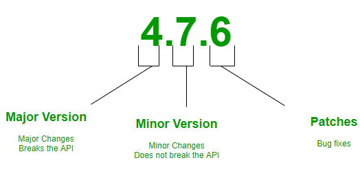

*These notes were adapted from https://www.linkedin.com/pulse/understanding-semantic-versioning-guide-developers-ajibola-oseni-*

As software developers, we constantly work with libraries, frameworks, and packages to build robust and reliable applications. 

Notably, our Jetpack Compose applications use explicit dependencies on external libraries, managed by our `build.gradle` configuration files. What happens when these external dependencies change? How can we protect our application from these changes? And how can those who use our applications have the same guarantees?

Keeping track of changes in these dependencies is essential for maintaining a stable and predictable development environment. This is where [Semantic Versioning (SemVer)](https://semver.org/spec/v2.0.0.html) comes into play. In this lecture, we explore what Semantic Versioning is, why it matters, and how to use it effectively.

## What is Semantic Versioning?

Semantic Versioning, often abbreviated as SemVer, is a versioning scheme for software that aims to convey meaning about the underlying changes in a release through version numbers.SemVer consists of three components: major, minor, and patch versions, represented as **MAJOR.MINOR.PATCH.**

- **Major Version (MAJOR)**: This digit is incremented when incompatible changes are introduced in the software. It signifies that there are breaking changes in the codebase, and developers should expect potential backward compatibility issues.
- **Minor Version (MINOR)**: When new features or enhancements are added in a backward-compatible manner, the minor version is incremented. Developers can safely update to a new minor version without worrying about breaking changes.
- **Patch Version (PATCH)**: The patch version is incremented for backward-compatible bug fixes and minor improvements that do not introduce new features or breaking changes.

## Why Does Semantic Versioning Matter?

- **Predictability**: By adhering to SemVer, developers and users of a library or package can anticipate the impact of an update. They can quickly assess whether an upgrade is safe or might require adjustments to their codebase.
- **Dependency Management**: Package managers like npm, Composer, and pip rely on Semantic Versioning to resolve and install compatible dependencies automatically. This helps maintain consistency in your project's ecosystem.
- **Communication**: SemVer serves as a communication tool between developers. When a new version is released, the change in version number provides immediate insight into the nature of the update.

## Using Semantic Versioning Effectively

- **Start with Version 1.0.0**: Every project should begin with version 1.0.0. This signifies that it's in its initial development phase.
- **Increment Versions Mindfully**: Major (MAJOR) for backward-incompatible changes. Minor (MINOR) for new features or enhancements. Patch (PATCH) for backward-compatible bug fixes.
- **Use Pre-release and Build Metadata**: SemVer allows for appending pre-release and build metadata to versions. For example, you can have versions like 1.0.0-alpha or 1.0.0+20231006.
- **Document Changes**: Maintain a changelog or release notes to document the changes made in each version. This helps users understand what has been added, fixed, or changed.
- **Test and Automate**: Implement automated testing and continuous integration to ensure that changes introduced in different versions do not break existing functionality.

## Conclusion

Semantic Versioning is a powerful tool for versioning software that fosters predictability, ease of communication, and efficient dependency management. By following the guidelines of SemVer, developers can maintain a well-structured versioning system that benefits both creators and consumers of software packages. So, the next time you're working on a project or releasing a library, remember to apply Semantic Versioning to make your software development process smoother and more transparent.
