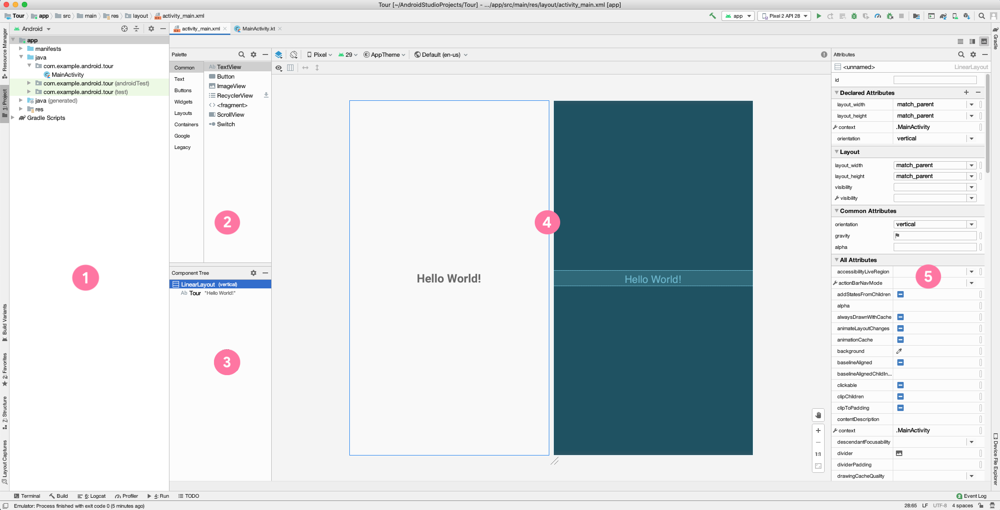
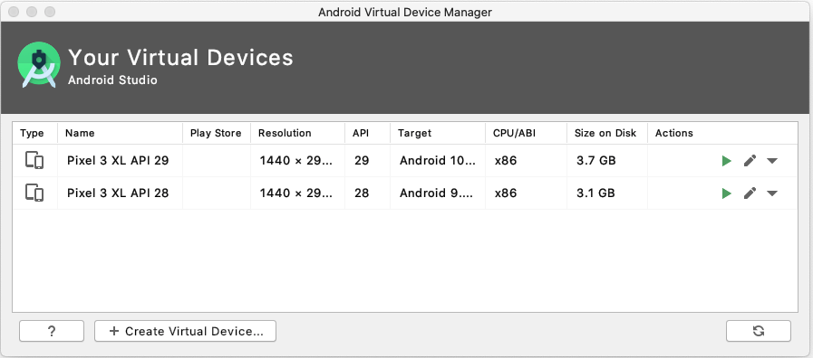
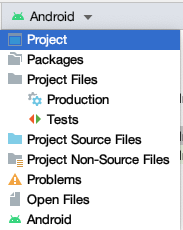
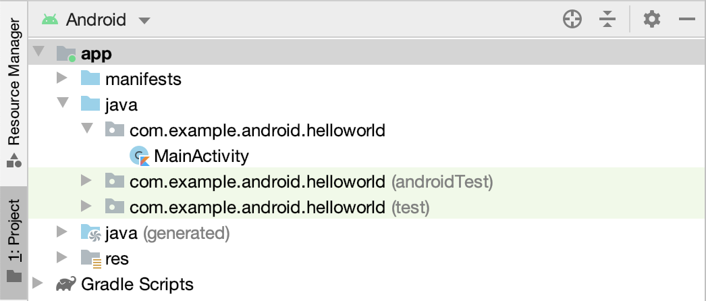

## Getting started

### Create a main() function

`main()`, or optionally `main(args: Array<String>)`, is the entry point for execution for a Kotlin program.

As with other languages, the Kotlin main() function specifies the entry point for execution. Any command line arguments are passed as an array of strings.

```kotlin title="Kotlin"
fun main(args: Array<String>) {
  println(  "Hello, world!"  )
}
```

The main function has no return statement. [Every function in Kotlin returns something](/lectures/01-intro-to-kotlin), even when no return type is explicitly specified. 

Note: When a function returns `kotlin.Unit` you don't have to specify it explicitly. This is different from some other languages, where you have to explicitly say that you are returning nothing.

## Android Studio** and IntelliJ

### Project Metadata

- **Name**: Enter a name for your application.
- **Package name**: 
  - A globally unique name that represents your app, similar to a web address. This often is the company web domain plus the name of the app. If you are not planning to publish your app, you can use the default. You can change this later, but it's extra work. 
  - This will also be the default Java and Kotlin package for your source code.
- **Save location**: This is where your app is stored on your computer.
- **Language**: Kotlin and the Java programming language are both supported. In general, you can mix and match Kotlin and Java. For our course, we will focus on Kotlin.
- **Minimum SDK**: Usually the default selection is sensible here. Try selecting a few different choices here. You can see that the percentage of supported devices will change as you do.

When you create an Android project, you'll need to define three API levels: The minimum required for a user to install your app, the user version you are targeting, and the version to use to compile your app:

- **Minimum SDK**: Device needs at least this API level to install
- **Target SDK**: API version and highest Android version tested
- **Compile SDK**: Android OS library version  compiled such that `minSdkVersion <= targetSdkVersion <= compileSdkVersion`

Note that the minimum SDK version has to be less than or equal to the target SDK version, which has to be less than or equal to the compile SDK version. 

As new releases of Android come out, it is good practice to compile and test your app against the latest version of the platform, and increment the compileSdk and targetSdk levels.

### Tour of Android Studio



In this view of Android Studio, you can see the Project window and the Layout Editor. The Layout Editor includes a Palette, a Component Tree, a Design Editor, and an Attributes window.

- Project window shows the files and folders for your project.
- Palette shows the components and layouts that you can drag into your project, such as TextViews, ImageViews, and Buttons.
- Component Tree shows the view hierarchy for your layout. Click a component or layout to show it in the Design Editor.
- Design Editor displays a Design view and a Blueprint view to give you a visual representation of your layout. 
- Attributes window contains a list of properties you can set for your component. 

### Android Virtual Device (AVD) Manager

In addition to running your app on a physical device, you can use the emulator to emulate many different Android form factors with the help of the Android Virtual Device (AVD) Manager. 



Note that you’ll need to download each system image that you want to emulate, since there are many possible options.

## Anatomy of a basic Android app 

- Activity (the source code)
- Resources (layout files, images, audio files, themes, and colors)
- Gradle files

In a basic app project, the main parts to know about are the Activity, the app’s resources, and the gradle files. We’ll cover each topic in more depth in this lesson, but briefly: 

An Activity handles user input and creates a window on the screen to display your user interface. 
Resources are additional files that your code uses, such as layout files, images, audio files, themes, colors, and more. 
Gradle files are scripts that control how your app is built, so that it can be installed on a device. 

### Project structure

```bash
MyApplication
├── app
│   ├── libs
│   └── src
│       ├── androidTest
│       ├── main
│       │   ├── java
│       │   ├── res
│       │   │   ├── drawable
│       │   │   ├── layout
│       │   │   ├── mipmap
│       │   │   └── values
│       │   └── AndroidManifest.xml
│       └── test
├── build.gradle
└── gradlew
```

When you create your first app from a project template, Android Studio generates a project structure similar to this. 

Here’s what each file or directory does: 
- `app`: stores source code, tests, and resources for your app 
- `libs`: stores local libraries your app depends on 
- `androidTest`: test code that’s specific to Android 
- `main`: Source code files
  - `java`: Java and Kotlin source code
  - `res`: Resources directory containing user interface files
- `test`: local unit tests that will execute on your computer
- `AndroidManifest.xml`: declares essential information for your app 
- `build.gradle`: controls how your application builds, tests, and deploys itself 
- `gradlew`: an executable to run gradle, even if it is not already installed

Recommended reading: [App resources in Android](https://developer.android.com/guide/topics/resources/providing-resources)

## File browsing 





Using Android Studio’s Project window, you can browse project files for your app. The Android view, which shows by default (image on the left), is structured for easy access to the files you need for app development. However, the Android view doesn’t reflect the actual file structure of your app (what you would see using the file explorer on your computer). To see how the folders and files actually look on your computer, switch to the Project view in the drop down menu (shown on the right). Feel free to use whichever view you prefer. 
### Run your Kotlin program

To run your program, click the Run icon to the left of the `main()` function. Android Studio runs the program, and displays the results in the console.

### Pass arguments to main()

In the top menu, select `Run > Edit Configurations` to open the Run/Debug Configurations window.

You can enter a set of command line arguments to be passed to your `main` function in the **Program arguments field**. Each argument is separated by a space; so arguments that have spaces inside of them should be "wrapped in quotation marks".

### Access arguments in `main()`

The `args` parameter is a String array: you can use array indices to access the arguments. E.g. `args[0]` to access the first input argument passed to main(), `args[1]` to access the second, etc.
### IntelliJ

## Command line

```bash
$ kotlinc main.kt -include-runtime -d main.jar
$ java -jar main.jar
```

The Kotlin docs: [Kotlin command-line compiler](https://kotlinlang.org/docs/command-line.html#homebrew)

### ki

I particularly liked [this tutorial](https://www.youtube.com/watch?v=t28RY1aOGJs)

### Gradle

Gradle is a JVM-based build system that enables developers to write **high-level** **scripts** that can be used to automate the process of compilation and application production. It is a flexible plugin-based system, which allows you to automate various aspects of the build process; including compiling and signing an .apk, downloading and managing external dependencies, or utilising specific SDK versions. 

:::tip[Note]
Gradle and the Android Gradle plugin run independent of Android Studio. This means that you can build your Android apps from within Android Studio, the command line on your machine, or on machines where Android Studio is not installed, such as continuous integration servers.

If you aren't using Android Studio, you can learn how to build and run your app from the command line. The output of the build is the same whether you are building a project from the command line, on a remote machine, or using Android Studio. 

[Configure your build](https://developer.android.com/build), Android Developer docs.
:::


## Additional resources
- [Official Gradle Docs](https://gradle.org/)
