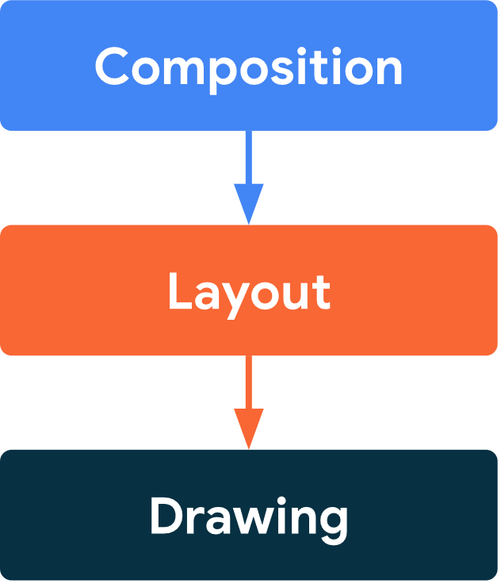
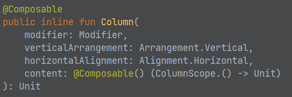

## Objectives

Compose Basics

Basic Layout

Material 3

Component State

## Compose Multiplatform

Jetpack Compose is a toolkit for building native Android UI

Compose Multiplatform essentially extends Compose to cross-platform, with some limitations

We'll focus initially on learning Compose in general.

Compose approach is based on defining the UI by describing how it should look and providing data dependencies, rather than focusing on the process of the UI's construction.


### Composable Functions

Compose is built around composable functions. This is a [declarative](#) style of programming

To make a function composable, just add the `@Composable` annotation to it.

```kotlin
@Composable
fun Banner(name: String) {
  Text("Hello $name.")
}
```

In your [Multiplatform project](/tutorials), comment out everything inside your App() function in App.kt

Add the following composable to App.kt and call it from inside App()

```kotlin
@Composable
fun App() {
  Banner("Qureshi")
}
```

### Key Properties of Composables

Composables in Kotlin have properties similar to those of components in React

Composables are [immutable](#)

- You can't directly update its contents.
- You need to pass any and all information as parameters (or state)

Composables are [idempotent](#)

- It must have the same way when called multiple times with the same arguments (and state)
- i.e., free of side-effects

When parameters/state changes, the UI for that composable is regenerated

- This process is called **recomposition**

As in React, every time the state of the UI changes, Compose recreates the parts of the UI tree that have changed.

### Lifecycle of Composables

[https://developer.android.com/jetpack/compose/lifecycle](https://developer.android.com/jetpack/compose/lifecycle)


### Phases

Compose has 3 main phases

- Composition: What UI to show. Compose runs composable functions and creates a description of your UI.
- Layout: Where to place UI. This phase consists of two steps: measurement and placement. Layout elements measure and place themselves and any child elements in 2D coordinates, for each node in the layout tree.
- Drawing: How it renders. UI elements draw into a Canvas, usually a device screen.

Unidirectional Data Flow: Order of these phases is generally the same, allowing data to flow in one direction from composition to layout to drawing.



## Layouts

[https://developer.android.com/jetpack/compose/layouts/basics](https://developer.android.com/jetpack/compose/layouts/basics)

A composable may contain several UI elements (i.e., other composables)

You must provide guidance on how they should be arranged

 Add the following line to your Banner function so that it now includes two Text components

- Text("Welcome to My App")

Run it – What happens?

### Components: `Column`, `Row`

Two basic layout components that help you arrange elements on the screen are `Column` and `Row`. These use curly braces to wrap UI elements. Those element will then be displayed appropriately on the screen (vertically for `Column`, horizontally for `Row`):

```kotlin
Column {
// List of vertical UI elements
}

Row {
// List of horizontal UI elements
}
```

 In the `Banner` function, wrap the two `Text` components in a `Column` component. Then try using a `Row` component instead.


### Nesting

Composables can nest many levels deep, as needed.

Change the Banner so that it is a grid containing two rows, one below the other, each with 2 Texts containing different information

Play around with various ways to use `Column` and `Row` to layout information on the screen

Try using the composable `Spacer`

```kotlin
Spacer(modifier=Modifier.height(20.dp))
```

### Modifiers & Style parameters

To decorate or configure a composable, you can use:

- Modifiers - Analogous to using an inline "style=" in React
- Specific parameters for that component – especially the Text component

Modifiers allow you to change the composable's size, layout, appearance or add high-level interactions, such as making an element clickable or scrollable.

You can chain them to create richer composables.

A modifier is specified using the modifier property on a layout component:

```kotlin
Column(
    modifier = Modifier
    .padding(24.dp)
    .fillMaxSize(),
    verticalArrangement = Arrangement.Center,
    horizontalAlignment = Alignment.CenterHorizontally)
{
Text("Hello $name",
modifier=Modifier.border(BorderStroke(3.dp, Color.Red)))
Spacer(modifier=Modifier.height(20.dp))
Text(text="Welcome to My App",
      color=Color.Blue,
      fontStyle= FontStyle.Italic,
      fontSize=24.sp,
      fontFamily= FontFamily.Monospace,
      textAlign= TextAlign.Center)
}
```

Note:

- sp = scale-independent pixels (Takes user preference into account) [https://singhajit.com/tutorial-1-android-ui-design-and-styling/](https://singhajit.com/tutorial-1-android-ui-desgin-and-styling/)
- dp = device-independent pixels
- When importing a needed class, make sure to import the one from compose (e.g., androidx.compose)

[https://developer.android.com/jetpack/compose/modifiers](https://developer.android.com/jetpack/compose/modifiers)

[https://developer.android.com/jetpack/compose/text](https://developer.android.com/jetpack/compose/text)

[https://www.tutorialkart.com/android-jetpack-compose/text-create/](https://www.tutorialkart.com/android-jetpack-compose/text-create/)

[https://semicolonspace.com/jetpack-compose-alignment-arrangement/](https://semicolonspace.com/jetpack-compose-alignment-arrangement/)



##


Mouse over the composable namein the IDE to see a pop-up givingdetails on the parameters for thatcomposable

Or, click on the name of the componentto load the associated .kt file, whichusually will provide the documentationand/or show you details on eachpossible parameter/function for that class

### Loading Images in Multi-Platform

Images are loaded slightly differently in Compose Multiplatform than usual for an Android app.

The image resource (e.g., image.jpg) must be stored in the `shared/src/commonMain/resources` folder. Additionally, the composable that is going to load the image must use the experimental API annotation:

```@kotlin
OptIn(ExperimentalResourceApi::class)
```

Then, just use the `Image` composable as usual:

```kotlin
Image(
    painterResource("image.jpg"),
    null
  )
```

### Exercise

Using the links provided so far, explore styling and laying out Text components, Columns and Rows in various ways

Especially from link: [https://developer.android.com/jetpack/compose/documentation](https://developer.android.com/jetpack/compose/documentation)

Remove `.fillMaxSize()` – What happens?

Try using `.fillMaxWidth()` – What happens?

## Material Design System

Material is a [design system](#) created by Google to help teams build high-quality digital experiences for Android, iOS, Flutter, and the web. It provides a number of components and layouts available as composable functions in Compose.

- Note: These components are also available in React and other languages.

Read about it here:

- [https://m3.material.io/get-started](https://m3.material.io/get-started)
- [https://developer.android.com/jetpack/compose/layouts/material](https://developer.android.com/jetpack/compose/layouts/material)

### `MaterialTheme` component

Generally, we use the `MaterialTheme` component at the highest level. This provides theme value (colors, shapes, etc) that are used by the various Material components.

- [https://developer.android.com/reference/kotlin/androidx/compose/material3/package-summary##materialtheme](https://developer.android.com/reference/kotlin/androidx/compose/material3/package-summary#materialtheme)
- [https://developer.android.com/codelabs/basic-android-kotlin-compose-material-theming##2](https://developer.android.com/codelabs/basic-android-kotlin-compose-material-theming#2)

Often, we just stick with the defaults by using it without parameters

```kotlin
@Composable
fun MyApp() {
  MaterialTheme {
  // Material Components like Button, Card, Switch, etc.
  }
}
```

### Other Material UI Components

There are many Material components we can use.

- [https://developer.android.com/reference/kotlin/androidx/compose/material3/package-summary](https://developer.android.com/reference/kotlin/androidx/compose/material3/package-summary)

Buttons

- [Material M3 Button docs](https://m3.material.io/components/all-buttons)
- [Kotlin Button docs](https://developer.android.com/reference/kotlin/androidx/compose/material3/package-summary#Button)

Card – Several types of card variants

- [https://m3.material.io/components/cards/overview](https://m3.material.io/components/cards/overview)
- [https://developer.android.com/reference/kotlin/androidx/compose/material3/package-summary##card](https://developer.android.com/reference/kotlin/androidx/compose/material3/package-summary#card)

```kotlin
Card(
    onClick = { /* Do something */ },
    modifier = Modifier.size(width = 180.dp, height = 100.dp)
    ) {
  Box(Modifier.fillMaxSize()) {
  Image(…)
  Text("Clickable", Modifier.align(Alignment.Center))
  }
}
```


## State

Since components are immutable, we must explicitly change state of the component using a mutableState in order to cause the component to be recomposed.

- This approach is similar in principle to useState in React.

We must use the keyword `remember` in order to avoid resetting the state value each time the component is recomposed.

The syntax for creating a state variable is:

- e.g., val count = remember { mutableStateOf(0) }

The syntax for accessing or modifying the value of a state variable is to use <statevariable>.value

- e.g., count.value

E.g.,

```kotlin
@Composable
fun CountWithButton() {
  Column(modifier = Modifier.padding(16.dp)) {
    val count = remember { mutableStateOf(0) }
    Text("You've had ${count.value} glasses.")
    Button(onClick = { count.value++ }, Modifier.padding(top = 8.dp)) {
      Text("Add one")
    }
  }
}
```

## Additional Resources

### Key readings

[https://developer.android.com/jetpack/compose/documentation](https://developer.android.com/jetpack/compose/documentation)
[https://developer.android.com/jetpack/compose/tutorial](https://developer.android.com/jetpack/compose/tutorial)

### Useful links

on State

- [https://developer.android.com/jetpack/compose/state](https://developer.android.com/jetpack/compose/state)
- [https://developer.android.com/codelabs/jetpack-compose-state](https://developer.android.com/codelabs/jetpack-compose-state)
- [https://dev.to/zachklipp/remember-mutablestateof-a-cheat-sheet-10ma](https://dev.to/zachklipp/remember-mutablestateof-a-cheat-sheet-10ma)
