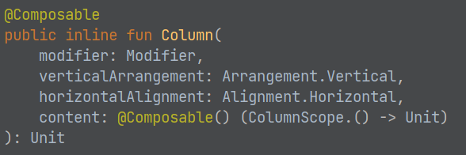
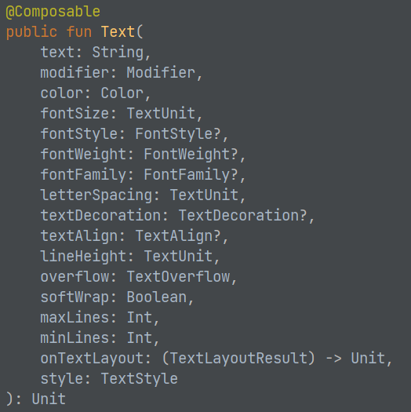

## Layouts

* [https://developer.android.com/jetpack/compose/layouts/basics](https://developer.android.com/jetpack/compose/layouts/basics)
* A composable may contain several UI elements (i.e., other composables)
* You must provide guidance on how they should be arranged
* Add the following line to your Greeting function so that it now includes two Text components

`Text("Welcome to My App")`

* Run it – What happens?

### Column & Row

* Two basic layout components that help you arrange elements on the screen are Column and Row.
  * These use curly braces to wrap UI elements.  Those element will then be displayed appropriately on the screen (vertically for Column, horizontally for Row)
  ```kotlin
    Column {
      List of UI elements
    }
  ```

### Nesting

* Composables can nest many levels deep, as needed.

* To decorate or configure a composable, you can use:
* Modifiers allow you to change the composable's size, layout, appearance or add high-level interactions, such as making an element clickable or scrollable.
* You can chain them to create richer composables.
* A modifier is specified using the modifier property on a layout component:
  ```kotlin
  Column(
    modifier = Modifier
    .padding(24.dp)
    .fillMaxSize(),
    verticalArrangement = Arrangement.Center,
    horizontalAlignment = Alignment.CenterHorizontally
  ) {
    Text("Hello $name",
    modifier=Modifier.border(BorderStroke(3.dp, Color.Red)))
    Spacer(modifier=Modifier.height(20.dp))
    Text(text="Welcome to My App",
    color=Color.Blue,
    fontStyle= FontStyle.Italic,
    fontSize=24.sp,
    fontFamily= FontFamily.Monospace,
    textAlign= TextAlign.Center)
  }
  ```





Mouse over the composable namein the IDE to see a pop-up givingdetails on the parameters for thatcomposable

Or, CTRL-click on the name of the component to load the associated .kt file,which usually will provide the documentation and/or show you details on each possible parameter/function for that class

