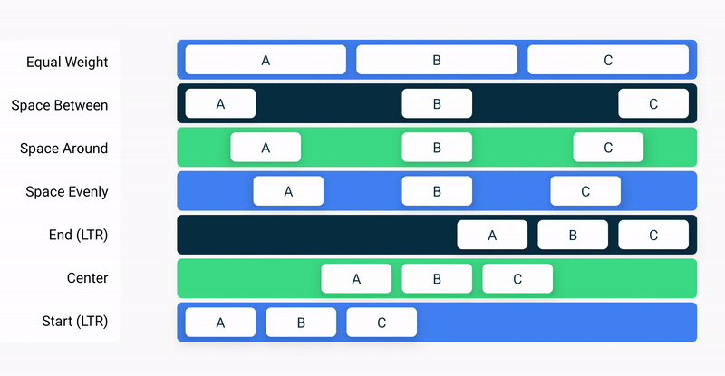

*These notes have been adapted from [Compose layout basics](https://developer.android.com/jetpack/compose/layouts/basics).*

It may seem counter-intuitive to create a user interface out of functions, rather than out of tags like you are used to with markup languages like HTML. Where are the components rendered on a screen? How can we control the "flow" of the interface?

This lecture focuses on the **layout** of `@Composable` functions, explaining some of the building blocks Compose provides to help you lay out your UI elements.

## Basics of Composable layouts

[Review from last lecture](/5A6-F23/lectures/user-interfaces/01-introduction-to-compose): `@Composable` functions are the basic building block of Compose. A composable function is a function emitting `Unit` that describes some part of your UI. The function takes some input and generates what's shown on the screen. 

A single `@Composable` function can emit several UI elements. In the `ArtistCard` function below, two `Text` elements are generated:

import { Tabs, TabItem } from '@astrojs/starlight/components';

<Tabs>
  <TabItem label="Kotlin">

  ```kotlin
  @Composable
  fun ArtistCard() {
    Text("Alfred Sisley")
    Text("3 minutes ago")
  }
  ```

  </TabItem>
  <TabItem label="Result">

  

  </TabItem>
</Tabs>

Compose does not handle layout automatically, and may arrange the elements in a way you don't like. In the above example, Compose stacks the text elements on top of eachother, making them unreadable.

The reason this happens is that the `ArtistCard()` function has the instruction to draw two Text elements, but does NOT have instructions about the **location** those elements should be drawn.

Compose comes built-in with a variety of [layout components](https://developer.android.com/reference/kotlin/androidx/compose/foundation/layout/package-summary) that we can use. We can then *compose* these elements to define our own layouts.

### Column, Row, and Box

Application user interfaces are (mostly) two dimensional, and made up of "boxes". The easiest way to fix the `ArtistCard()`, then, is to arrange these "boxes" in either a [`Column`](https://developer.android.com/reference/kotlin/androidx/compose/foundation/layout/package-summary#Column(androidx.compose.ui.Modifier,androidx.compose.foundation.layout.Arrangement.Vertical,androidx.compose.ui.Alignment.Horizontal,kotlin.Function1)) or a [`Row`](https://developer.android.com/reference/kotlin/androidx/compose/foundation/layout/package-summary#Row(androidx.compose.ui.Modifier,androidx.compose.foundation.layout.Arrangement.Horizontal,androidx.compose.ui.Alignment.Vertical,kotlin.Function1)), which are happily built-in for us:

<Tabs>
  <TabItem label="Kotlin">

  ```kotlin
  @Composable
  fun ArtistCardColumn() {
      Column {
          Text("Alfred Sisley")
          Text("3 minutes ago")
      }
  }
  ```

  </TabItem>
  <TabItem label="Result">

  

  </TabItem>
</Tabs>

While using the `Row` element alone would unravel the stack, it's not as interesting to place two text elements side-by-side. Instead, we can [nest]() `@Composable` layout elements to produce more complicated layouts, such as a `Column` within a `Row`:

<Tabs>
  <TabItem label="Kotlin">

  ```kotlin
  @Composable
  fun ArtistCardRow(artist: Artist) {
      Row(verticalAlignment = Alignment.CenterVertically) {
          Image(bitmap = artist.image, contentDescription = "Artist image")
          Column {
              Text(artist.name)
              Text(artist.lastSeenOnline)
          }
      }
  }
  ```

  </TabItem>
  <TabItem label="Result">

  

  </TabItem>
</Tabs>

Finally, the [`Box`](https://developer.android.com/reference/kotlin/androidx/compose/foundation/layout/package-summary#Box(androidx.compose.ui.Modifier,androidx.compose.ui.Alignment,kotlin.Boolean,kotlin.Function1)) element allows you to control how elements are stacked upon eachother, allowing you to create stacks of elements where overlap is desired:

<Tabs>
  <TabItem label="Kotlin">

  ```kotlin
  @Composable
  fun ArtistAvatar(artist: Artist) {
      Box {
          Image(bitmap = artist.image, contentDescription = "Artist image")
          Icon(Icons.Filled.Check, contentDescription = "Check mark")
      }
  }
  ```

  </TabItem>
  <TabItem label="Result">

  

  </TabItem>
</Tabs>

The primary layout components `Column`, `Row`, and `Box` are expressive and powerful in combination, and are often all you need to create complex layouts. You can write your own composable function to combine these layouts into a more elaborate layout that suits your app.

### Alignment and Arrangement

So far, it appears as though Jetpack Compose centers elements horizontally and vertically within their containers. This is pretty nice default behavior, but it would be nicer if we could control it -- so of course, we can. We can see some useful parameters for this by taking a look at the definitions for each of `Row`, `Column`, and `Box`:

<Tabs>
  <TabItem label="Row">

  ```kotlin {4-5} title="Kotlin"
  @Composable
  inline fun Row(
      modifier: Modifier = Modifier,
      horizontalArrangement: Arrangement.Horizontal = Arrangement.Start,
      verticalAlignment: Alignment.Vertical = Alignment.Top,
      content: @Composable RowScope.() -> Unit
  ): Unit
  ```

  </TabItem>
  <TabItem label="Column">

  ```kotlin {4-5} title="Kotlin"
  @Composable
  inline fun Column(
      modifier: Modifier = Modifier,
      verticalArrangement: Arrangement.Vertical = Arrangement.Top,
      horizontalAlignment: Alignment.Horizontal = Alignment.Start,
      content: @Composable ColumnScope.() -> Unit
  ): Unit
  ```

  </TabItem>
  <TabItem label="Box">

  ```kotlin {4} title="Kotlin"
  @Composable
  inline fun Box(
      modifier: Modifier = Modifier,
      contentAlignment: Alignment = Alignment.TopStart,
      propagateMinConstraints: Boolean = false,
      content: @Composable BoxScope.() -> Unit
  ): Unit
  ```

  </TabItem>

</Tabs>

To set children's position within a `Row`, set the `horizontalArrangement` and `verticalAlignment` arguments. For a `Column`, set the `verticalArrangement` and `horizontalAlignment` arguments. 

:::tip
You can think of the `Row` and `Column` components, and their `arrangment` and `alignment` parameters, as being similar to setting the [flex direction](https://developer.mozilla.org/en-US/docs/Web/CSS/flex-direction) for [Flexboxes](https://developer.mozilla.org/en-US/docs/Learn/CSS/CSS_layout/Flexbox) in CSS.

That is, the **primary axis** of `Row` elements is horizontal, and you **arrange** elements along that axis while **aligning** elements on the vertical axis.

Similarly, the **primary axis** of `Column` elements is vertical, and you **arrange** elements along that axis while **aligning** elements on the horizontal axis.

There isn't really a similar analogy for `Box` elements -- these take just an `alignment` parameter and no `arrangement`.
:::

Below follow some of the possible arguments for each, and their effects. You can see the range of possible [Alignments](https://developer.android.com/jetpack/compose/modifiers-list#Alignment) and [Arrangments](https://developer.android.com/reference/kotlin/androidx/compose/foundation/layout/Arrangement) by clicking on these corresponding links.

<Tabs>
  <TabItem label="Row Arrangments">

  

  </TabItem>
  <TabItem label="Column Arrangements">

  

  </TabItem>
</Tabs>

### The layout model

*These notes have been adapted from [Compose layout basics](https://developer.android.com/jetpack/compose/layouts/custom).*

As we have seen, UI elements in Compose are represented by the `@Composable` functions that emit a piece of UI when invoked. Since composables are functions, each composable can call other composable functions within their function body, allowing us to define nested UI structres. Behind the scenes, these composable UI elements are added to a UI tree that gets rendered on the screen. How is this "tree" modelled?

Each UI element has **one parent** and **zero to many children**. Each element is also located *within its parent*, specified as an `(x, y)` position, and a size, specified as a `width` and a `height`.

That is, **parent elements define the constraints for their child elements**. An element is asked to define its size within those constraints. Constraints restrict the minimum and maximum `width` and `height` of an element. If an element has child elements, it may measure each child to help determine its own size. Once an element determines and reports its own size, it defines how to place its child elements relative to itself.

Laying out each node in the UI tree is a three step process. Each node must:
  - Measure any children
  - Decide its own size
  - Place its children


## Modifiers

*These notes have been adapted from [Compose layout basics](https://developer.android.com/jetpack/compose/modifiers).*

Modifiers allow you to **decorate** or **augment** a composable. Modifiers let you do these sorts of things:

- Change the composable's size, layout, behavior, and appearance
- Add information, like accessibility labels
- Process user input
- Add high-level interactions, like making an element clickable, scrollable, draggable, or zoomable

Modifiers are standard [Kotlin objects](/5A6-F23/lectures/programming/02-oop-in-kotlin). Create a modifier by calling one of the [`Modifier`](https://developer.android.com/reference/kotlin/androidx/compose/ui/Modifier) class functions:

```kotlin {3} title="Kotlin"
@Composable
private fun Greeting(name: String) {
    Column(modifier = Modifier.padding(24.dp)) {
        Text(text = "Hello,")
        Text(text = name)
    }
}
```

`Modifier` functions are factory [extension functions](https://kotlinlang.org/docs/extensions.html) on `Modifier`, (that is, each of these extention functions returns a modified Modifer) allowing us to **chain** `Modifier` function class for combined effects:


<Tabs>
  <TabItem label="Kotlin">

  ```kotlin {4-6}
  @Composable
  private fun Greeting(name: String) {
    Column(
      modifier = Modifier
                  .padding(24.dp),
                  .fillMaxWidth()
    ) {
        Text(text = "Hello,")
        Text(text = name)
      }
  }
  ```

  </TabItem>
  <TabItem label="Result">

  

  </TabItem>
</Tabs>

In the code above, notice different modifier functions used together.

  - `padding` puts space around an element.
  - `fillMaxWidth` makes the composable fill the maximum width given to it from its parent.

It's a best practice to have all of your `@Composables` accept a `modifier` parameter, and **pass that modifier to its first child that emits UI**. Doing so makes your code more reusable and makes its behavior more predictable and intuitive. For more information, see the Compose API guidelines, [Elements accept and respect a Modifier parameter](https://android.googlesource.com/platform/frameworks/support/+/androidx-main/compose/docs/compose-api-guidelines.md#elements-accept-and-respect-a-modifier-parameter).
