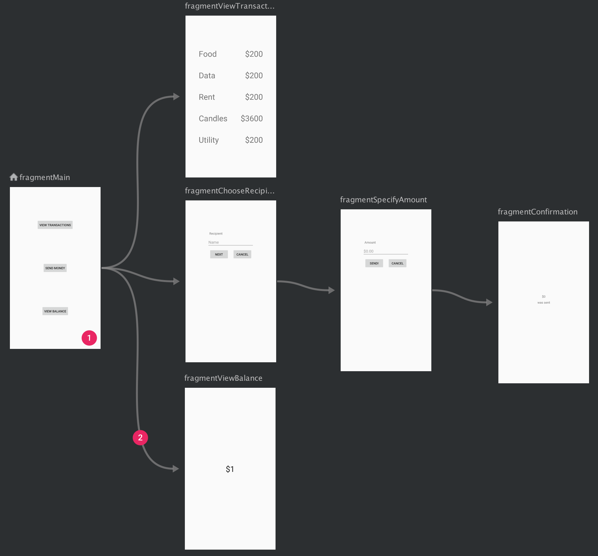
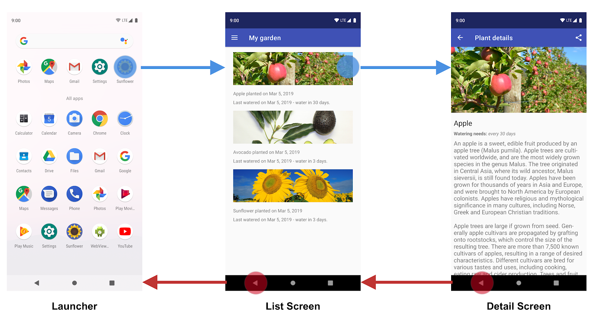
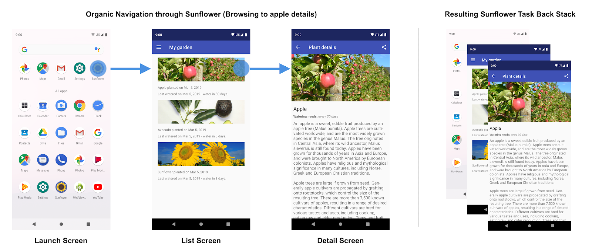
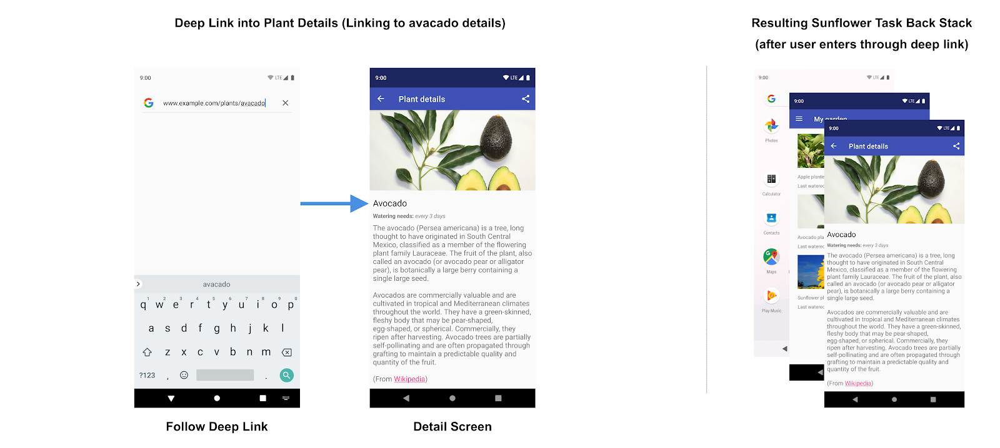

*These notes have been adapted from [Navigation](https://developer.android.com/guide/navigation), which contains a complete overview of topics covered here along with links to further details.*

So far, we've had just a single "screen" in our apps. **Navigation** refers to the interactions that let users navigate across, into, and back out from the different pieces of content within your app.

In a typical app, not unlike a website, we will often want to define multiple different screens to serve different purpose:
- Display a Profile
- Information Page for each Category
- Drill down to the details for a reply thread
- Etc.

While we can use conditional rendering to make any one given screen dynamic enough to fulfill these roles, it is much clearer for both the user and the developer to define **screens** for indepedent paes of an app.

Android Jetpack's Navigation component helps you implement navigation, from simple button clicks to more complex patterns, such as app bars and the navigation drawer. This will allow behaviors like:
- programmatically moving from one screen to another
- incorporating system navigation (e.g., "back" button) to move between screens.

The Navigation component also ensures a consistent and predictable user experience by adhering to an established [set of principles](#navigation-principles).

## Navigation key parts

The Navigation component consists of three key parts, which are described below:

  - Navigation graph: An **XML resource** that contains all navigation-related information in one centralized location. This includes all the individual content areas within your app, called *destinations*, as well as the possible *paths* that a user can take through your app.
  - `NavHost`: An empty container that displays destinations from your navigation graph. The Navigation component contains a default `NavHost` implementation, [`NavHostFragment`](https://developer.android.com/reference/androidx/navigation/fragment/NavHostFragment), that displays fragment destinations.
  - `NavController`: An object that manages app navigation within a `NavHost`. The `NavController` orchestrates the swapping of destination content in the `NavHost` as users move throughout your app.

### Setup

In order to use the Navigation Component in Compose, we will need to instruct our build system to **include an exeternal depedency** for the Navigation component system. Unlike other Compose and Kotlin libraries we have been using so far, Navigation is an external dependency that is *not* built in and needs to be downloaded.

There are many possible ways to manage external code dependencies in a project. The most straightforward way to do so in Android development is to use the [Gradle](#) build system -- these are kotlin language scripts that specify common configuration options for Android projects.

The most important Gradle file we will work with is `app/build.gradle.kts` (warning: pay attention to the full path name, there are multiple `build.gradle.kts` files in a given project).  Add the following line of code to the `dependencies` object:

```kotlin title="app/build.gradle.kts"
android {

    /* ... other code ... */ 

    dependencies { 
        /* ... */
        implementation("androidx.navigation:navigation-compose:2.7.2")
        /* ... */
    }
}
```

Press "Sync Now" in Android Studio and watch for any issues or errors building your project (you may need to tweak the version number). We will learn more about [adding components in general](https://developer.android.com/topic/libraries/architecture/adding-components#navigation) very soon.

### Navigation Graph

Navigation occurs between your app's *destinations*—that is, anywhere in your app to which users can navigate. These destinations are connected via *actions*.

A *navigation graph* is a resource file that contains all of your destinations and actions. The graph represents all of your app's navigation paths.

The figure below shows a visual representation of a navigation graph for a sample app containing six destinations connected by five actions. Each destination is represented by a preview thumbnail, and connecting actions are represented by arrows that show how users can navigate from one destination to another.



**Figure:** A navigation graph that shows previews of six different destinations that are connected via five actions.


1. Destinations are the different content areas in your app.
2. Actions are logical connections between your destinations that represent paths that users can take.

To add a navigation graph to your project, do the following:

1. In the Project window, right-click on the res directory and select `New > Android Resource File`. The New Resource File dialog appears.
1. Type a name in the File name field, such as "nav_graph".
1. Select Navigation from the Resource type drop-down list, and then click OK.

When you add your first navigation graph, Android Studio creates a `navigation` resource directory within the `res` directory. This directory contains your navigation graph resource file (`nav_graph.xml`, for example).

You can use Android Studio's **Navigation Editor** to view and edit your navigation graphs. [See this link for detailed instructions](https://developer.android.com/guide/navigation/get-started#nav-editor)

### `NavHost`

The NavHost is a `@Composable` you create that as a **container** for displaying the current destination of the navigation graph.

```kotlin title="NavHost Definition"
@Composable
public fun NavHost(
    navController: NavHostController,
    startDestination: String,
    modifier: Modifier = Modifier,
    /*... other optional arguments go here ... */
) {
    // content goes in the Content lambda
}
```

A `NavHost` accepts two main parameters: A `NavController` object, and a fixed starting point (specified by a String). There also are many useful optional parameters you can find reference to in the [NavHost documentation](#).

It is typical to either define the `NavHost` either directly in `MainActivity.kt`, or in a custom `Router` `@Composable` to encapsulate our navigation logic:

import { Tabs, TabItem } from '@astrojs/starlight/components';

```kotlin title="NavHost encapsulated inside Router @Composable"
@Composable
fun Router() {
    val navController = rememberNavController()
    NavHost(navController = navController, startDestination = "MainScreenRoute") {
        composable("MainScreenRoute") { MainScreen() }
        composable("AboutScreenRoute") { AboutScreen() }
    }
}
```

As you navigate between composables, the content of the `NavHost` is automatically recomposed.

It also links the `NavController` with a navigation graph.

### `NavContainer`

TBD

### Summary


As you navigate through your app, you tell the `NavController` that you want to navigate either along a specific path in your navigation graph or directly to a specific destination. The `NavController` then shows the appropriate destination in the `NavHost`.


## Navigation Principles

*These notes have been adapted from [Navigation Principles](https://developer.android.com/guide/navigation/principles).*

Navigation between different screens and apps is a core part of the user experience. The following principles set a baseline for a consistent and intuitive user experience across apps. The [Navigation component](https://developer.android.com/topic/libraries/architecture/navigation) is designed to implement these principles by default, ensuring that users can apply the same heuristics and patterns in navigation as they move between apps.

### Fixed start destination

Every app you build has a fixed start destination. This is the first screen the user sees when they launch your app from the launcher. This destination is also the last screen the user sees when they return to the launcher after pressing the Back button. Let’s take a look at the [Sunflower app](https://github.com/android/sunflower/tree/main/app) as an example.



**Figure 1.** The List Screen is the Sunflower app's start destination.

When launching the Sunflower app from the launcher, the first screen that a user sees is the List Screen, the list of plants in their garden. This is also the last screen they see before exiting the app. If they press the Back button from the list screen, they navigate back to the launcher.

### Navigation state is represented as a stack of destinations

When your app is first launched, a new task is created for the user, and app displays its start destination. This becomes the base destination of what is known as the back stack and is the basis for your app’s navigation state. The top of the stack is the current screen, and the previous destinations in the stack represent the history of where you've been. The back stack always has the start destination of the app at the bottom of the stack.

Operations that change the back stack always operate on the top of the stack, either by pushing a new destination onto the top of the stack or popping the top-most destination off the stack. Navigating to a destination pushes that destination on top of the stack.

The Navigation component manages all of your back stack ordering for you, though you can also choose to manage the back stack yourself.

### Up and Back are identical within your app's task


**Figure 2.** The Up and Back buttons

The Back button appears in the system navigation bar at the bottom of the screen and is used to navigate in reverse-chronological order through the history of screens the user has recently worked with. When you press the Back button, the current destination is popped off the top of the back stack, and you then navigate to the previous destination.

The Up button appears in the app bar at the top of the screen. Within your app's task, the Up and Back buttons behave identically.

### The Up button never exits your app

If a user is at the app's start destination, then the Up button does not appear, because the Up button never exits the app. The Back button, however, is shown and does exit the app.

When your app is launched using a deep link on another app's task, Up transitions users back to your app’s task and through a simulated back stack and not to the app that triggered the deep link. The Back button, however, does take you back to the other app.

### Deep linking simulates manual navigation

Whether deep linking or manually navigating to a specific destination, you can use the Up button to navigate through destinations back to the start destination.

When deep linking to a destination within your app’s task, any existing back stack for your app’s task is removed and replaced with the deep-linked back stack.

Using the Sunflower app again as an example, let’s assume that the user had previously launched the app from the launcher screen and navigated to the detail screen for an apple. Looking at the Recents screen would indicate that a task exists with the top most screen being the detail screen for the Apple.



**Figure 3.** User navigation through the Sunflower app and the resulting back stack.

At this point, the user can tap the Home button to put the app in the background. Next, let’s say this app has a deep link feature that allows users to launch directly into a specific plant detail screen by name. Opening the app via this deep link completely replaces the current Sunflower back stack shown in figure 3 with a new back stack, as shown in figure 4:



**Figure 4.** Following a deep link replaces the existing back stack for the Sunflower app.

Notice that the Sunflower back stack is replaced by a synthetic back stack with the avocado detail screen at the top. The My Garden screen, which is the start destination, was also added to the back stack. The original Sunflower back stack is gone, including the app's knowledge that the user was on the Apple details screen before. All of this is important because the synthetic back stack must be realistic. It should match a back stack that could have been achieved by organically navigating through the app.

To meet this need, the synthetic back stack that is created is a simplified one based on the NavGraph. For a simple NavGraph without nesting, this will consist of the start destination and the deep link destination. For more complex, nested navigation graphs, the synthetic back stack will also contain the start destinations of any nested graphs that are ancestors of the deep link destination.

The Navigation component supports deep linking and recreates a realistic back stack for you when linking to any destination in your navigation graph.

