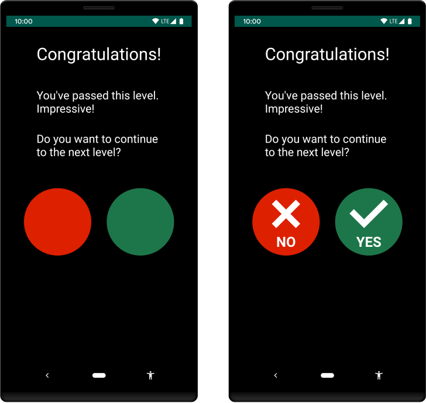
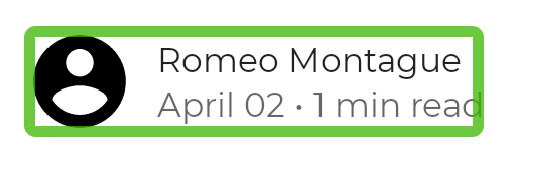
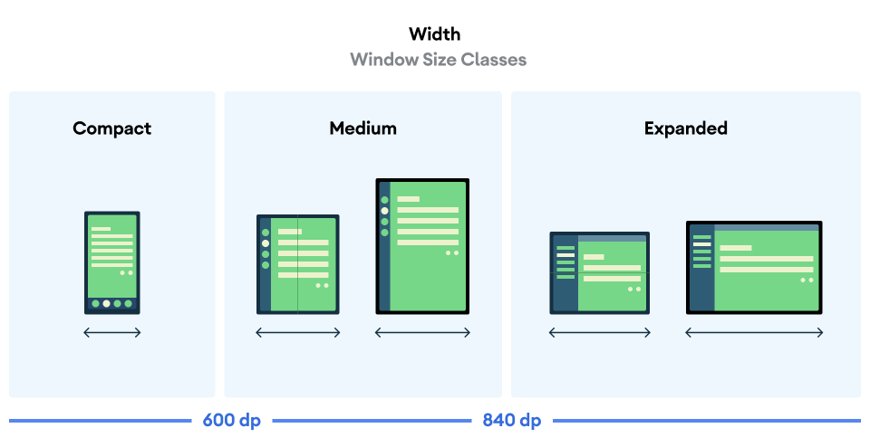
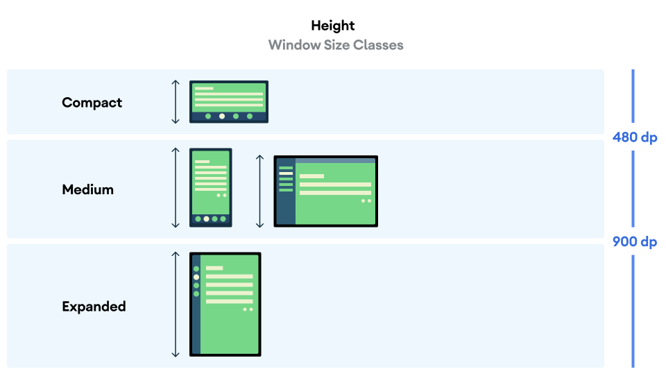

Accessibility is the practice of making your application usable by as many people as possible. 

It is tempting to think of accessibility as being about a subset of the total interactions with your software. This is a reductive view, for two reasons:
- ["We are all just temporarily abled"](https://uxmag.com/articles/were-just-temporarily-abled): in the span of time, no faculty or sense that functions today is guaranteed to function tomorrow. Vison, hearing, mobility, focus, touch -- all human senses can be obstructed by temporary (tired? drunk? in a hurry?) or permanent (genetics, accident, age) causes. As explained in the linked article: we aren’t just designing accessible products and websites for a subgroup of people that have permanent sensory disabilites -- though that is a just goal -- we are also designing these software for our current and future selves.
- ["Accessible design is universal design"](https://dspace.mit.edu/handle/1721.1/88013): accessible software is *usable* software for *everyone*, including those without disabilites. "Situational limitations" like device size, outdoor brightness, network speed, etc. are all impediments to using software that hasn't undertaken the necessary technical and architectural steps to be accessible. Even in the best of circumstances, software can impose usability obstacles for everyone if accessibility is not a part of the design (for e.g.: are the buttons too small? is the font too small? is there text overflow? is the color contrast blinding? does "Tab" not cycle interactive elements in the expected order? and so on!)

You may be familiar with accessibility concepts already: they are [enshrined in Canadian](https://www.canada.ca/en/employment-social-development/programs/accessible-canada/regulations-summary-act.html) and [Quebecois law](https://equidox.co/resources/accessibility-education-tools/accessibility-regulations/canada-quebec/), they are foundational principles of the [world wide web](https://www.w3.org/WAI/fundamentals/accessibility-usability-inclusion/) and [open source software](https://opensource.org/osd), and they are general beyond software in [architecture, engineering, and public life](https://en.wikipedia.org/wiki/Accessibility).

This lecture won't cover all of those subjects, though they are worth your time and study. Rather, we turn to the focus of this course: **how do we make accessible Android applications in Jetpack Compose?**

## Accessibility in Compose

*These notes have been adapted from [Accessibility in Compose](https://developer.android.com/jetpack/compose/accessibility) and [Build Accessible Apps](https://developer.android.com/guide/topics/ui/accessibility)*

Apps written in Compose should support accessibility for users with different needs and for use in different circumstances. The following sections describe the main knowledge needed to make this happen in Jetpack Compose.

1. [**Best Practises**](#best-practises) that Android developers follow are similar to principles found on other platforms, relating to button size, typography, color contrast, etc. The **Material theme** incorporates many of these best practises automatically, but these can be customized and its important to know what effect changes can have to component accessibility.

2. [**Responsive Layouts**](#responsive-layouts) are layouts that can adapt to changing device orientations and sizes. This concept is especially important if you are interested in adapting your app to multiple platforms. For our course, it mainly concerns being able to handled both *portrait* and *landscape* orientations in a mobile device.

3. [**Accessibility services**](#accessibility-services) for the Android Framework come in two varieties: 
- tools like [Accessibility Scanner][accessibility-scanner] used by developers to debug accessibility properties
- tools like [Talkback][talkback] and [Switch Access][switch-access] that transform what's shown on screen to a more fitting format for a user with a specific need. 

[talkback]: https://support.google.com/accessibility/android/answer/6283677
[switch-access]: https://support.google.com/accessibility/android/answer/6122836
[accessibility-scanner]: https://support.google.com/accessibility/android/answer/6376570

## Best Practises

### Use Semantic Properties

Like in Web development (see [Semantic HTML](https://developer.mozilla.org/en-US/docs/Glossary/semantics)), the components of Android User Interfaces carry *semantic* information -- that is, most elements in a user interface have *meaning* that is separate from their *appearance*.

Compose uses **semantic properties** in the `Modifier` object to pass information about `@Composables` to accessibility services. Semantic properties provide information about UI elements that are displayed to the user. 

Most built-in composables like `Text` and `Button`, as well as Material3 elements, fill these semantic properties with information inferred from the composable and its children. Some modifiers like `toggleable` and `clickable` will also set certain semantic properties. However, sometimes the framework needs more information to understand how to describe a UI element to the user.

The best practises below describes various situations in which you may need to explicitly add extra information to a `@Composable` so it can be correctly described to the Android framework.

### Enforce text visibility

For each set of text within your app, the *color contrast*—or difference in perceived brightness between the color of the text and the color of the background behind the text— needs to be above a specific threshold. The exact threshold depends on the text's font size and whether the text appears in bold:

- If the text is smaller than 18pt, or if the text is bold and smaller than 14pt, set the color contrast ratio to at least **4.5:1.**
- For all other text, set the color contrast ratio to at least **3:1.**

The following image shows two examples of text-to-background color contrast:


**Figure.** Lower than recommended (left) and sufficient (right) color contrast.

To check the text-to-background color contrast in your app, use an online color contrast checker or the Accessibility Scanner app.

### Use cues other than colour

To assist users with color vision deficiencies, use cues other than color to distinguish UI elements within your app's screens. These techniques can include using different shapes or sizes, providing text or visual patterns, or adding audio- or touch-based (haptic) feedback to mark the elements' differences.

The figure below shows two versions of an activity. One version uses only color to distinguish between two possible actions in a workflow. The other version uses the best practice of including shapes and text in addition to color to highlight the differences between the two options:



**Figure.** Examples of creating UI elements using color only (left) and using color, shapes, and text (right).


### Use minimum touch size targets

Any on-screen element that someone can click, touch, or interact with should be large enough for reliable interaction. When sizing these elements, make sure to set the minimum size to 48dp to correctly follow the [Material Design Accessibility Guidelines](https://material.google.com/usability/accessibility.html#accessibility-layout).

Material components—like `Checkbox`, `RadioButton`, `Switch`, `Slider`, and `Surface`—set this minimum size internally, so this is usually taken care of for you. See [setting minimum target sizes](https://developer.android.com/jetpack/compose/accessibility#minimum-target-sizes) for more detail and examples.

### Add click labels

You can use a click label to add semantic meaning to the click behavior of a composable. Click labels describe what happens when the user interacts with the composable. Accessibility services use click labels to help describe the app to users with specific needs.

Set the click label by passing a parameter in the `modifier.clickable`:

```kotlin {4-5}
@Composable
private fun ArticleListItem(openArticle: () -> Unit) {
    Row(
        Modifier.clickable(
            onClickLabel = stringResource(R.string.action_read_article),
            onClick = openArticle
        )
    ) {
        // ..
    }
}
```

Alternatively, if you don't have access to the clickable modifier, you can set the click label in `modifier.semantics`:

```kotlin {6-7}
@Composable
private fun LowLevelClickLabel(openArticle: () -> Boolean) {
    val readArticleLabel = stringResource(R.string.action_read_article)
    Canvas(
        Modifier.semantics {
            onClick(label = readArticleLabel, action = openArticle)
        }
    ) {
        // ..
    }
}
```

### Describe visual elements

When you define an `Image` or `Icon` composable, there is no automatic way for the Android framework to understand what is being displayed. You need to pass a textual description of the visual element.

Imagine a screen where the user can share the current page with friends. This screen contains a clickable share icon:


Based on the icon alone, the Android framework can’t figure out how to describe it to a visually impaired user. The Android framework needs an additional textual description of the icon.

The contentDescription parameter is used to describe a visual element. You should use a localized string, as this will be communicated to the user.

```kotlin {6}
@Composable
private fun ShareButton(onClick: () -> Unit) {
    IconButton(onClick = onClick) {
        Icon(
            imageVector = Icons.Filled.Share,
            contentDescription = stringResource(R.string.label_share)
        )
    }
}
```

Some visual elements are purely decorative and you might not want to communicate them to the user. When you set the contentDescription parameter to null, you indicate to the Android framework that this element does not have associated actions or state.

```kotlin {7-8}
@Composable
private fun PostImage(post: Post, modifier: Modifier = Modifier) {
    val image = post.imageThumb ?: painterResource(R.drawable.placeholder_1_1)

    Image(
        painter = image,
        // Specify that this image has no semantic meaning
        contentDescription = null,
        modifier = modifier
            .size(40.dp, 40.dp)
            .clip(MaterialTheme.shapes.small)
    )
}
```

It is up to you to decide whether a given visual element needs a `contentDescription`. Ask yourself if the element conveys information that the user will need to perform their task. If not, it’s better to leave the description out.

### Merge elements

Accessibility services like [Talkback][talkback] and [Switch Access][switch-access] allow users to move focus across elements on the screen. It is important that elements are focused at the right granularity. If every single low-level composable in your screen is focused independently, a user will have to interact a lot to move across the screen. If elements are merged too aggressively, users might not understand which elements belong together.

When you apply a `clickable` modifier to a composable, Compose will automatically merge all elements it contains. This also holds for `ListItem`; elements within a list item will be merged and accessibility services will view them as one element.

It is possible to have a set of composables that form a logical group, but that group is not clickable or part of a list item. You’d still want accessibility services to view them as one element. For example, imagine a composable that shows a user’s avatar, their name, and some extra information:



You can tell Compose to merge these elements by using the `mergeDescendants` parameter in the semantics modifier. This way, accessibility services will select only the merged element, and all semantics properties of the descendants are merged.

```kotlin {4}
@Composable
private fun PostMetadata(metadata: Metadata) {
    // Merge elements below for accessibility purposes
    Row(modifier = Modifier.semantics(mergeDescendants = true) {}) {
        Image(
            imageVector = Icons.Filled.AccountCircle,
            contentDescription = null // decorative
        )
        Column {
            Text(metadata.author.name)
            Text("${metadata.date} • ${metadata.readTimeMinutes} min read")
        }
    }
}
```

Accessibility services will now focus on the whole container at once, merging their contents:


### Describe an element's state

A composable can define a `stateDescription` for semantics which is used by the Android framework to read out the state that the composable is in. For example, a `toggleable` composable can be in either a “Checked” or an “Unchecked” state. In some cases, you might want to override the default state description labels that are used by Compose. You can do so by explicitly specifying the state description labels *before* defining a composable as `toggleable`:

```kotlin {9}
@Composable
private fun TopicItem(itemTitle: String, selected: Boolean, onToggle: () -> Unit) {
    val stateSubscribed = stringResource(R.string.subscribed)
    val stateNotSubscribed = stringResource(R.string.not_subscribed)
    Row(
        modifier = Modifier
            .semantics {
                // Set any explicit semantic properties
                stateDescription = if (selected) stateSubscribed else stateNotSubscribed
            }
            .toggleable(
                value = selected,
                onValueChange = { onToggle() }
            )
    ) {
        /* ... */
    }
}
```

## Responsive layouts

*Adapted from https://developer.android.com/jetpack/compose/layouts/adaptive*

The UI for your app should be *responsive* to account for different screen sizes, orientations and form factors. An *responsive layout* changes based on the screen space available to it. These changes range from simple layout adjustments to fill up space, to changing layouts completely to make use of additional room.

As a declarative UI toolkit, Jetpack Compose is well suited for designing and implementing layouts that adjust themselves to render content differently across a variety of sizes. This section contains some guidelines for how you can use Compose to make your UI responsive.

### Make layout changes depending on window size

When using Compose to lay out an entire application, **app-level** and **screen-level** composables occupy all of the space your app is given to render. At this level in your design, it might make sense to change the overall layout of a screen to take advantage of larger screens.

:::tip[Composable hierarchy for layouts]
- **App-level composable:** The single, root composable that occupies all space given to your app, and contain all other composables.
- **Screen-level composable:** A composable contained within the app-level composable thats occupies all space given to your app. Each screen-level composable generally represents a particular destination when navigating around the app.
- **Individual composables:** All other composables. These could be individual elements, reusable groups of content, or composables hosted within screen-level composables.
:::

You can use the actual portion of the screen that is allocated to your app using the the Material3 `WindowSizeClass` library. These size classes refer to the overall window of your app, so use these classes for layout decisions that affect your overall screen layout. 

You can pass the current window size class down as **state** that `@Composables` can use, as in the example below:

import { Tabs, TabItem } from '@astrojs/starlight/components';

<Tabs>

  <TabItem label="Example code">

```kotlin {13-14, 23, 28}
import androidx.compose.material3.windowsizeclass.ExperimentalMaterial3WindowSizeClassApi
import androidx.compose.material3.windowsizeclass.WindowHeightSizeClass
import androidx.compose.material3.windowsizeclass.WindowSizeClass
import androidx.compose.material3.windowsizeclass.calculateWindowSizeClass

class MainActivity : ComponentActivity() {
    @OptIn(ExperimentalMaterial3WindowSizeClassApi::class)
    override fun onCreate(savedInstanceState: Bundle?) {
        super.onCreate(savedInstanceState)

        setContent {
            // calculateWindowSizeClass converts the current window size to a WindowHeightSizeClass
            val windowSizeClass = calculateWindowSizeClass(this)
            MyApp(windowSizeClass)
        }
    }
}
@Composable
fun MyApp(windowSizeClass: WindowSizeClass) {
    // Perform logic on the size class to decide whether to show
    // the top app bar. 
    // Below: showTopAppBar is "true" when WindowHeighSizeClass is NOT Compact, "false" otherwise
    val showTopAppBar = windowSizeClass.heightSizeClass != WindowHeightSizeClass.Compact

    // MyScreen composeable (screen-level) knows nothing about window sizes
    // performs logic based on a Boolean flag.
    MyScreen(
        showTopAppBar = showTopAppBar,
        /* ... */
    )
}
```

  </TabItem>

  <TabItem label="Width classes">
Note: creating user interfaces for tablets and desktops is beyond the scope of this course, so you can usually assume that the "Compact" width is what applies to your device.

  </TabItem>

  <TabItem label="Height classes">
Note: the "Compact" height class is useful for detecting landscape mode in phones.

  </TabItem>

</Tabs>

This approach **confines screen size logic to a single location**, instead of scattering it across your app in many places that need to be kept in sync. 

This single location produces **state**, which can be explicitly passed down to other composables just like you would for any other app state. Explicitly passing state simplifies individual composables, since they will just be normal composable functions that take the size class or specified configuration along with other data.

To see how to use `WindowManager` in a real Android application, check out the [JetNews](https://github.com/android/compose-samples/tree/master/JetNews) sample compose app.

## Accessibility Services

### Developer services: Accessibility Scanner & Layout Inspector

- The [Accessibility scanner][accessibility-scanner] is somewhat like the Developer Console of web browsers like Firefox and Google Chrome -- it calculates a series of accessibilty properties (contrast, typography, button size) on the *client device* of your application. Since it is on the *client* device, you'll need to install it on your emulated device in Android Studio, see [the section below](#guide-installing-apps-on-emulated-devices-in-android-studio) for further instructions. You'll get the hang of using this in one of the codelabs of [Assignment 4](/5A6-F23/assignments/assignment-4).
- The [Layout inspector](https://developer.android.com/jetpack/compose/tooling/layout-inspector) allows you to see semantic label information and view the hiearchy between `@Composables` in your application. The Layout inspector is included in Android Studio and does not need to be installed on your emulated device.

### User services: Talkback & Switch Access

These services are a bit beyond the scope of this course -- they are tools that users with disabilities with install on their Android Devices to help them navigate applications on their phone. One of the optional codelabs in [Assignment 4](/5A6-F23/assignments/assignment-4) gives you practise using these tools.

- [Talkback][talkback]
- [switch-access][switch-access]

### Guide: Installing apps on emulated devices in Android Studio

There are two choices:

- Use Google Play with the emulated device to find and install the app 
- Download the .apk for the app you require, place it in the `build` folder of the emulated device, and start the device as normal.

I'm having trouble finding a straightforward tutorial for either. Stay tuned.

## Further resources

You can see and use example components written by the Android Development team here: [Jetpack Compose snippets](https://github.com/android/snippets/tree/af17252307f34b555be384b7711c553146472dd9/compose/snippets/src/main/java/com/example/compose/snippets)

There are many useful snippets here, but in particular for Accessibility, you can check out the following folders:

- [AccessibilitySnippets](https://github.com/android/snippets/blob/af17252307f34b555be384b7711c553146472dd9/compose/snippets/src/main/java/com/example/compose/snippets/accessibility/AccessibilitySnippets.kt)
- [AdaptiveLayoutSnippets](https://github.com/android/snippets/blob/af17252307f34b555be384b7711c553146472dd9/compose/snippets/src/main/java/com/example/compose/snippets/layouts/AdaptiveLayoutSnippets.kt)
