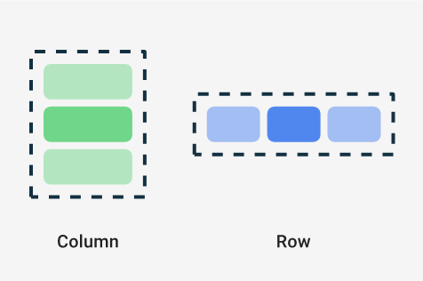

*These notes are adapted from slides by Talib Hussain. There may be some mistakes — let me know if there is something here that doesn’t make sense.*

Jetpack Compose is a toolkit for writing Android User Interfaces in Kotlin.

[Official documentation](https://developer.android.com/jetpack/compose/documentation)
[Official tutorial](https://developer.android.com/jetpack/compose/tutorial)

The "Compose" approach to user interfaces is based in part on the programming principle: ["favour composition over inheritance"](https://en.wikipedia.org/wiki/Composition_over_inheritance). 

A compositional approach takes advantage of the [functional programming paradigm](#) we have been learning in Kotlin. The main goal is for application code to describe **how the user interface should look/behave** rather than **how the user interface is contructed**
  - i.e., rather than (imperatively) focusing on the process of the UI's construction
  - In Web Dev II, you learned a very similar framework: [React](https://react.dev/)
  - For those of you who did not learn React, or need a refresher on the basics of Declarative UI, [this link gives useful information](https://developer.android.com/jetpack/compose/mental-model).

## Composable Functions

Compose is built around composable functions. These are the "lego bricks" of a user interface: complicated layouts are built up with indepedent and "composable" parts.

To make a function composable, just add the `@Composable` annotation to it.

```kotlin
@Composable
fun Banner(name: String) {
  Text("Hello $name.")
}
```

Note: recall that the default "Empty Activity" application in Android Studio uses this annotation. We're about to learn how it works.

### Key Properties of Composables

Composables in Kotlin have properties similar to those of components in React

Composables are [immutable](https://en.wikipedia.org/wiki/Immutable_object)
  - Like the [String](https://docs.oracle.com/javase/8/docs/api/java/lang/String.html) class in Java: once a Composable is created, its state cannot be altered (you can **transform** it into a **new** composable to change its behavior)
  - You need to pass any and all information as parameters (or state)

Composables are [idempotent](https://en.wikipedia.org/wiki/Idempotence)
  - Idempotent (fancy latin: idem + potent, "same" "power"): this term is used to describe operations in math/programming that give the same result even when applied to the same input multiple times. E.g. the operation `* 0` is idempotent: you can multiply a number by 0 repeatedly and the result will not change.
  - In User Interfaces, this means "adding the same Composable will only create an effect once"
    - Similar to pressing the "Off" button on a calculator multiple times (it will remain "off")

When parameters/state of the Composable function changes, the UI for that composable is regenerated
  - This process is called **recomposition**

As in React, every time the state of the UI changes, Compose recreates the parts of the UI tree that have changed.

### Lifecycle of Composables

[https://developer.android.com/jetpack/compose/lifecycle](https://developer.android.com/jetpack/compose/lifecycle)


* Compose has 3 main phases
  * Composition: What UI to show. Compose runs composable functions and creates a description of your UI.
  * Layout: Where to place UI. This phase consists of two steps: measurement and placement. Layout elements measure and place themselves and any child elements in 2D coordinates, for each node in the layout tree.
  * Drawing: How it renders. UI elements draw into a Canvas, usually a device screen.
* Unidirectional Data Flow: Order of these phases is generally the same, allowing data to flow in one direction from composition to layout to drawing.

## Layouts

* [https://developer.android.com/jetpack/compose/layouts/basics](https://developer.android.com/jetpack/compose/layouts/basics)
* A composable may contain several UI elements (i.e., other composables)
* You must provide guidance on how they should be arranged
* Add the following line to your Greeting function so that it now includes two Text components

`Text("Welcome to My App")`

* Run it – What happens?

### Column & Row

* Two basic layout components that help you arrange elements on the screen are Column and Row.
  * These use curly braces to wrap UI elements.  Those element will then be displayed appropriately on the screen (vertically for Column, horizontally for Row)
  ```kotlin
    Column {
      List of UI elements
    }
  ```
* In the Greeting composable, wrap the two Text components in a Column component and run it.  What happens?
* Then try using a Row component instead.



### Nesting

* Composables can nest many levels deep, as needed.
* Change the Greeting so that it is a grid containing two rows, one below the other, each with 2 Texts containing different information
* Play around with various ways to use Column and Row to layout information on the screen
* Try using the composable Spacer as appropriate
  * Spacer(modifier=Modifier.height(20.dp))

## Modifiers & Style parameters

* To decorate or configure a composable, you can use:
  * Modifiers - Analogous to using an inline "style=" in React
  * Specific parameters for that component – especially the Text component
* Modifiers allow you to change the composable's size, layout, appearance or add high-level interactions, such as making an element clickable or scrollable.
* You can chain them to create richer composables.
* A modifier is specified using the modifier property on a layout component:
  ```kotlin
  Column(
    modifier = Modifier
    .padding(24.dp)
    .fillMaxSize(),
    verticalArrangement = Arrangement.Center,
    horizontalAlignment = Alignment.CenterHorizontally
  ) {
    Text("Hello $name",
    modifier=Modifier.border(BorderStroke(3.dp, Color.Red)))
    Spacer(modifier=Modifier.height(20.dp))
    Text(text="Welcome to My App",
    color=Color.Blue,
    fontStyle= FontStyle.Italic,
    fontSize=24.sp,
    fontFamily= FontFamily.Monospace,
    textAlign= TextAlign.Center)
  }
  ```


Mouse over the composable namein the IDE to see a pop-up givingdetails on the parameters for thatcomposable

Or, CTRL-click on the name of the component to load the associated .kt file,which usually will provide the documentation and/or show you details on each possible parameter/function for that class

# Try It!

* Using the links provided so far, explore styling and laying out Text components, Columns and Rows in various ways using modifiers
  * In the modifier, remove .fillMaxSize() – What happens?
  * Try using .fillMaxWidth() – What happens?
  * Lots of information available starting with this link:  [https://developer.android.com/jetpack/compose/documentation](https://developer.android.com/jetpack/compose/documentation)
* Complete this codelab:
  * [https://developer.android.com/codelabs/basic-android-kotlin-compose-composables-practice-problems](https://developer.android.com/codelabs/basic-android-kotlin-compose-composables-practice-problems)

## Additional resources

[compose-vs-xml-podast]: https://fragmentedpodcast.com/episodes/237/, Fragmented android podcast.
[compare-declarative-frameworks]: https://www.jetpackcompose.app/compare-declarative-frameworks/JetpackCompose-vs-React-vs-Flutter

[compose-tutorial-playlist-2021]: https://www.youtube.com/watch?v=cDabx3SjuOY&list=PLQkwcJG4YTCSpJ2NLhDTHhi6XBNfk9WiC

[https://singhajit.com/tutorial-1-android-ui-desgin-and-styling/](https://singhajit.com/tutorial-1-android-ui-desgin-and-styling/)

[https://developer.android.com/jetpack/compose/modifiers](https://developer.android.com/jetpack/compose/modifiers)

[https://developer.android.com/jetpack/compose/text](https://developer.android.com/jetpack/compose/text)

[https://www.tutorialkart.com/android-jetpack-compose/text-create/](https://www.tutorialkart.com/android-jetpack-compose/text-create/)

[https://semicolonspace.com/jetpack-compose-alignment-arrangement/](https://semicolonspace.com/jetpack-compose-alignment-arrangement/)

