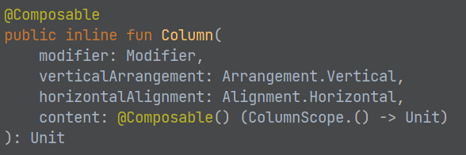

[Jetpack Compose](https://developer.android.com/jetpack/compose/mental-model) is the user interface framework we will use in this class to develop applications in Android. 

If you read the link embedded above, you will see Jetpack Compose described as "modern" and "declarative" -- after a few lectures about Kotlin, these words should start to sound familiar. In fact, the goals with languages like Kotlin and frameworks like Jetpack Compose (Compose for short) are similar: make it so that complicated application behavior can be written in code that directly expresses the requirements of that application. 

We've seen a few examples of this in the functional programming of Kotlin: modifying and extending the behavior of objects in Kotlin is much more direct since functions are "first class citizens". 

In the next few lessons, we'll see how the Compose framework (using Kotlin) enables a similar set of outcomes in designing user interfaces.

The main goal is for application code to define **what the user interface requirements are** (declarative) rather than **how the user interface is contructed** (imperative). 

A final note: in Web Dev II, you learned a very similar framework: [React](https://react.dev/). Frameworks like React, Kotlin+Compose, and even the trend for traditionally OOP languages like Python, Java, C# to take on functional coding styles is a part of a broader industry trend towards declarative programming concepts.

### (Brief) History of Android UI

Since 2008 when Android launched, the architecture of Android applications worked (approximately) as follows:
  - The view (the visible interfaced) organized as a tree of widgets (layouts, buttons, images, text, etc.)
    - [View.java](#)
  - User interactions and dynamic behavior require updates to in the face of changing data. This was implemented by Java API that could "walk" the UI view tree. Here is a (simple, fake) example of the code needed to have something happen when a button is pressed:

  ```java
  ```

  import { Tabs, TabItem } from '@astrojs/starlight/components';

  <Tabs>
    <TabItem label="Java">
      ```java
      TextView button = 
      ```
    </TabItem>
    <TabItem label="XML">
      ```xml

      ```
    </TabItem>
  </Tabs>
  

    - Java API: `TextView button = findViewById("someButtonId)` to get reference to button element (defined in XML in a separate file)
    - `button.setText("Updated Button Text")`, `container.addChild(SomeOtherViewObject)`, or img.setImageBitmap(Bitmap). These methods change the internal state of the widget.

- Java (Model and Controller) + XML (View markup)
  - Big picture: View elements "decoupled" from application logic in separate files/code
- Official Kotlin support in 2017. Compiles to Java, interoperable with Java, runs on JVM
  - Same big picture: Kotlin model and controller + XML interface markup
- Pretty standard stuff for application development in the 2000s:
  - Web:
    - HTML markup/display logic + Javascript client logic + Backend server logic (increasingly, CSS has removed the display logic from HTML over the past couple decades)
  - Desktop:
    - .NET also uses XML markup
    - 

What are some problems?

- Android UI toolkit versioning
  - Similar to the problem in Web Dev where some features are not supported by all browsers
  - However, Android updates on a 6-12month basis -- a long time to wait for features unrelated to the operating system!
- Android View API defined in 2008, 30k lines long (link)
- Is keeping views in XML really "decoupling" the user interface from the application logic?
  - XML creep into Java/Kotlin source code to select/modify XML views
    - E.g. the "state" of the application tied to the "state" of the user interface (error -> red, success -> green -- the display state and the application state need to match. What is the source of truth?)
  - Some user interface logic IS inherently coupled to business logic -- there is such thing as "good" coupling! Artificially separating two intertwined concepts introduces different code instabilities
    - examples: bike gears? What are other good examples of coupling.


- 2019: [Jetpack Compose begins development]()
- 2021: [Jetpack Compose 1.0 released]
- August 2023: 

## Fundamentals

To get to know Jetpack Compose, let's start with the basic example provided for us by creating an "Empty Activity" in Android Studio:

```kotlin
import ... 

class MainActivity : ComponentActivity() {
    override fun onCreate(savedInstanceState: Bundle?) {
        super.onCreate(savedInstanceState)
        setContent {
          ...
        }
    }
}
```

Before we dive into the `import` statements and the code inside of `setContent`, look into the following questions:

- What type of class is `MainActivity`?
- What type of parameter is used by the `onCreate` method?
- 


## Composable Functions

Compose is built around composable functions. These are the "lego bricks" of a user interface: complicated layouts are built up with indepedent and "composable" parts.

To make a function composable, just add the `@Composable` annotation to it.

```kotlin
@Composable
fun Banner(name: String) {
  Text("Hello $name.")
}
```

Note: recall that the default "Empty Activity" application in Android Studio uses this annotation. We're about to learn how it works.

### Key Properties of Composables

Composables in Kotlin have properties similar to those of components in React

Composables are [immutable](https://en.wikipedia.org/wiki/Immutable_object)
  - Like the [String](https://docs.oracle.com/javase/8/docs/api/java/lang/String.html) class in Java: once a Composable is created, its state cannot be altered (you can **transform** it into a **new** composable to change its behavior)
  - You need to pass any and all information as parameters (or state)

Composables are [idempotent](https://en.wikipedia.org/wiki/Idempotence)
  - Idempotent (fancy latin: idem + potent, "same" "power"): this term is used to describe operations in math/programming that give the same result even when applied to the same input multiple times. E.g. the operation `* 0` is idempotent: you can multiply a number by 0 repeatedly and the result will not change.
  - In User Interfaces, this means "adding the same Composable will only create an effect once"
    - Similar to pressing the "Off" button on a calculator multiple times (it will remain "off")

When parameters/state of the Composable function changes, the UI for that composable is regenerated
  - This process is called **recomposition**

As in React, every time the state of the UI changes, Compose recreates the parts of the UI tree that have changed.

### Lifecycle of Composables

[https://developer.android.com/jetpack/compose/lifecycle](https://developer.android.com/jetpack/compose/lifecycle)


* Compose has 3 main phases
  * Composition: What UI to show. Compose runs composable functions and creates a description of your UI.
  * Layout: Where to place UI. This phase consists of two steps: measurement and placement. Layout elements measure and place themselves and any child elements in 2D coordinates, for each node in the layout tree.
  * Drawing: How it renders. UI elements draw into a Canvas, usually a device screen.
* Unidirectional Data Flow: Order of these phases is generally the same, allowing data to flow in one direction from composition to layout to drawing.

## Layouts

* [https://developer.android.com/jetpack/compose/layouts/basics](https://developer.android.com/jetpack/compose/layouts/basics)
* A composable may contain several UI elements (i.e., other composables)
* You must provide guidance on how they should be arranged
* Add the following line to your Greeting function so that it now includes two Text components

`Text("Welcome to My App")`

* Run it – What happens?

### Column & Row

* Two basic layout components that help you arrange elements on the screen are Column and Row.
  * These use curly braces to wrap UI elements.  Those element will then be displayed appropriately on the screen (vertically for Column, horizontally for Row)
  ```kotlin
    Column {
      List of UI elements
    }
  ```
* In the Greeting composable, wrap the two Text components in a Column component and run it.  What happens?
* Then try using a Row component instead.


### Nesting

* Composables can nest many levels deep, as needed.
* Change the Greeting so that it is a grid containing two rows, one below the other, each with 2 Texts containing different information
* Play around with various ways to use Column and Row to layout information on the screen
* Try using the composable Spacer as appropriate
  * Spacer(modifier=Modifier.height(20.dp))

## Modifiers & Style parameters

* To decorate or configure a composable, you can use:
  * Modifiers - Analogous to using an inline "style=" in React
  * Specific parameters for that component – especially the Text component
* Modifiers allow you to change the composable's size, layout, appearance or add high-level interactions, such as making an element clickable or scrollable.
* You can chain them to create richer composables.
* A modifier is specified using the modifier property on a layout component:
  ```kotlin
  Column(
    modifier = Modifier
    .padding(24.dp)
    .fillMaxSize(),
    verticalArrangement = Arrangement.Center,
    horizontalAlignment = Alignment.CenterHorizontally
  ) {
    Text("Hello $name",
    modifier=Modifier.border(BorderStroke(3.dp, Color.Red)))
    Spacer(modifier=Modifier.height(20.dp))
    Text(text="Welcome to My App",
    color=Color.Blue,
    fontStyle= FontStyle.Italic,
    fontSize=24.sp,
    fontFamily= FontFamily.Monospace,
    textAlign= TextAlign.Center)
  }
  ```




Mouse over the composable namein the IDE to see a pop-up givingdetails on the parameters for thatcomposable

Or, CTRL-click on the name of the component to load the associated .kt file,which usually will provide the documentation and/or show you details on each possible parameter/function for that class

# Try It!

* Using the links provided so far, explore styling and laying out Text components, Columns and Rows in various ways using modifiers
  * In the modifier, remove .fillMaxSize() – What happens?
  * Try using .fillMaxWidth() – What happens?
  * Lots of information available starting with this link:  [https://developer.android.com/jetpack/compose/documentation](https://developer.android.com/jetpack/compose/documentation)
* Complete this codelab:
  * [https://developer.android.com/codelabs/basic-android-kotlin-compose-composables-practice-problems](https://developer.android.com/codelabs/basic-android-kotlin-compose-composables-practice-problems)

## Additional resources

[practical-intro-jc]: https://www.codemag.com/Article/2105061/A-Practical-Introduction-to-Jetpack-Compose-Android-Apps

[compose-vs-xml-podast]: https://fragmentedpodcast.com/episodes/237/, Fragmented android podcast.
[compare-declarative-frameworks]: https://www.jetpackcompose.app/compare-declarative-frameworks/JetpackCompose-vs-React-vs-Flutter

[compose-tutorial-playlist-2021]: https://www.youtube.com/watch?v=cDabx3SjuOY&list=PLQkwcJG4YTCSpJ2NLhDTHhi6XBNfk9WiC

[https://singhajit.com/tutorial-1-android-ui-desgin-and-styling/](https://singhajit.com/tutorial-1-android-ui-desgin-and-styling/)

[https://developer.android.com/jetpack/compose/modifiers](https://developer.android.com/jetpack/compose/modifiers)

[https://developer.android.com/jetpack/compose/text](https://developer.android.com/jetpack/compose/text)

[https://www.tutorialkart.com/android-jetpack-compose/text-create/](https://www.tutorialkart.com/android-jetpack-compose/text-create/)

[https://semicolonspace.com/jetpack-compose-alignment-arrangement/](https://semicolonspace.com/jetpack-compose-alignment-arrangement/)

