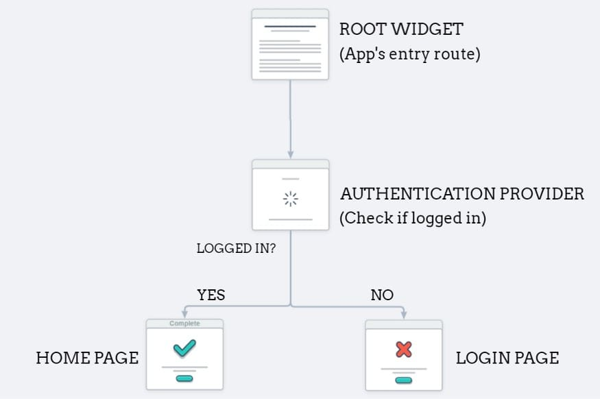

We have a serverless mobile app. Thus, we do not have a back-end server that we control that can perform user authentication.

Doing user authentication solely on the front-end is not secure since we can't ensure secure access to the database (e.g., malicious client)

But, we can use the Firebase authentication service to validate our users securely

We will be following the approach in this link:

- [https://dev.to/raajeevchandran/firebase-authentication-and-keeping-users-logged-in-with-provider-in-flutter-9j5](https://dev.to/raajeevchandran/firebase-authentication-and-keeping-users-logged-in-with-provider-in-flutter-9j5)

Official documentation is available here:

- [https://firebase.google.com/docs/auth/flutter/start](https://firebase.google.com/docs/auth/flutter/start)

## Provider-based approach…

## Alternative links for user authentication

There are several approaches to user authentication.

Social authentication: Using a "Google Sign-In" / "Facebook Sign-in" / "Apple Sign-in" etc.

- [https://firebase.google.com/docs/auth/flutter/federated-auth](https://firebase.google.com/docs/auth/flutter/federated-auth)

Below are some links showing or discussing approaches that differ in some ways from the one taught in class. There are many other links online.

- Recommend: Keep it simple for this class!
- [https://firebase.google.com/codelabs/firebase-auth-in-flutter-apps](https://firebase.google.com/codelabs/firebase-auth-in-flutter-apps)
- [https://stackoverflow.com/questions/63669262/check-authentication-state-of-user-using-firebaseauth-in-flutter](https://stackoverflow.com/questions/63669262/check-authentication-state-of-user-using-firebaseauth-in-flutter)
- [https://stackoverflow.com/questions/46253226/detect-firebase-auth-provider-for-logged-in-user](https://stackoverflow.com/questions/46253226/detect-firebase-auth-provider-for-loged-in-user)
- [https://stackoverflow.com/questions/37873608/how-do-i-detect-if-a-user-is-already-logged-in-firebase](https://stackoverflow.com/questions/37873608/how-do-i-detect-if-a-user-is-already-logged-in-firebase)

## More Error Handling

Make error handling requirements clear as part of the function documentation and even better as the function signature

Throw explicit user-defined exceptions (so rest of code is not dependent on 3rd party exceptions)

Result/sealed class approach: [https://codewithandrea.com/articles/flutter-exception-handling-try-catch-result-type/](https://codewithandrea.com/articles/flutter-exception-handling-try-catch-result-type/)

"Either" approach: [https://medium.com/flutter-community/a-pragmatic-approach-to-error-handling-468c4ac1a645](https://medium.com/flutter-community/a-pragmatic-approach-to-error-handling-468c4ac1a645)

Asynchronous error handling. Recommend using await and try..catch, but can use .catch() and .then() on the Future. [https://dart.dev/guides/libraries/futures-error-handling](https://dart.dev/guides/libraries/futures-error-handling)

- Note: This approach can be hard to debug in the IDE with breakpoints, etc.

## Self-Study - Fetch

This link does a very good job of describing how to use fetch. Please consult it to learn how to use fetch.

- [https://docs.flutter.dev/cookbook/networking/fetch-data](https://docs.flutter.dev/cookbook/networking/fetch-data)

A fetch call is necessarily asynchronous

- Roughly dealing with a fetch is similar to dealing with the asynchronous database calls we made for our CRUD.
- i.e., use Futures/FutureBuilder

## Misc

### Using Emulators

- [https://firebase.google.com/docs/emulator-suite/connect_auth](https://firebase.google.com/docs/emulator-suite/connect_auth)
- [https://firebase.google.com/docs/emulator-suite/connect_firestore](https://firebase.google.com/docs/emulator-suite/connect_firestore)

### StreamBuilder

- [https://stackoverflow.com/questions/50844519/flutter-streambuilder-vs-futurebuilder](https://stackoverflow.com/questions/50844519/flutter-streambuilder-vs-futurebuilder)
- [https://webcache.googleusercontent.com/search?q=cache:Emz3_jfLBmoJ:https://medium.com/quick-code/reading-lists-from-firestore-using-streambuilder-in-flutter-eda590f461ed&cd=9&hl=en&ct=clnk&gl=ca](https://webcache.googleusercontent.com/search?q=cache:Emz3_jfLBmoJ:https://medium.com/quick-code/reading-lists-from-firestore-using-streambuilder-in-flutter-eda590f461ed&cd=9&hl=en&ct=clnk&gl=ca)

### Shimmer

- Shimmer is a loading effect that is used to add beautiful animation when the data is loading from the server. In simple words, it is a loader like the Circular Progress Indicator available in the Flutter framework.
- [https://levelup.gitconnected.com/shimmer-loading-with-provider-28173f4267b0](https://levelup.gitconnected.com/shimmer-loading-with-provider-28173f4267b0)
  - import 'package:shimmer/shimmer.dart';
  - Widget loadingShimmer() => Shimmer.fromColors(
  - baseColor: Colors.grey,
  - highlightColor: Colors.grey[400]!,
  - period:const Duration(seconds: 1),
  - child:

### Using a logger

- [https://blog.logrocket.com/flutter-logging-best-practices/](https://blog.logrocket.com/flutter-logging-best-practices/)

### Snackbar

- [https://docs.flutter.dev/cookbook/design/snackbars](https://docs.flutter.dev/cookbook/design/snackbars)

### Documentation

- [https://dart.dev/effective-dart/documentation](https://dart.dev/effective-dart/documentation)
