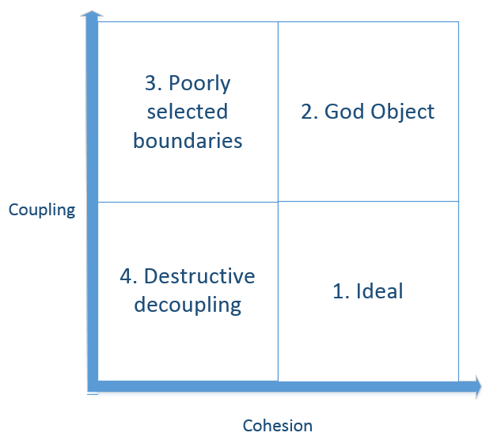
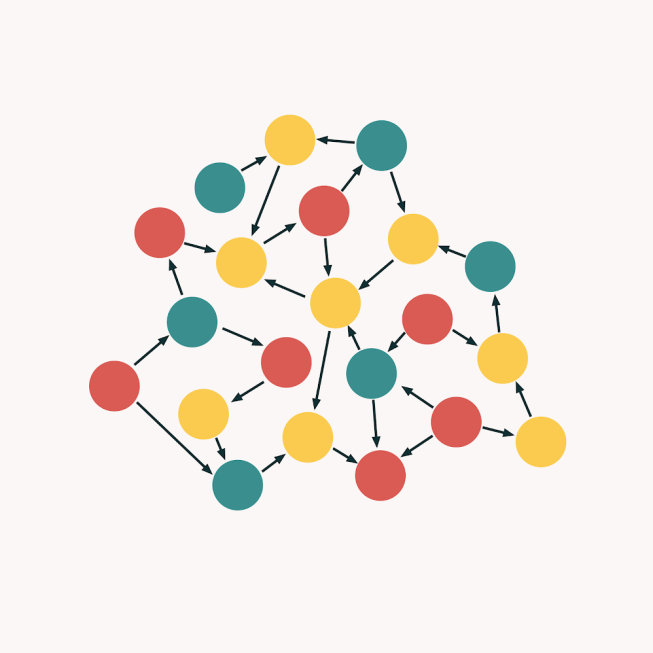
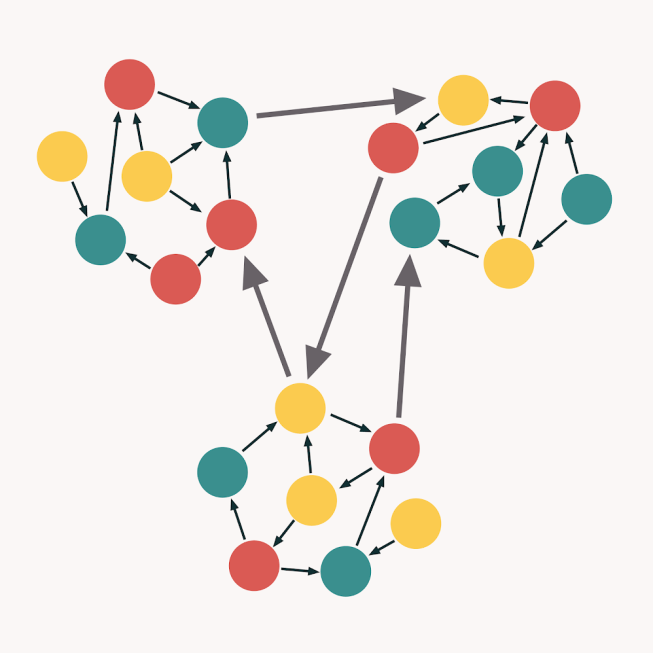
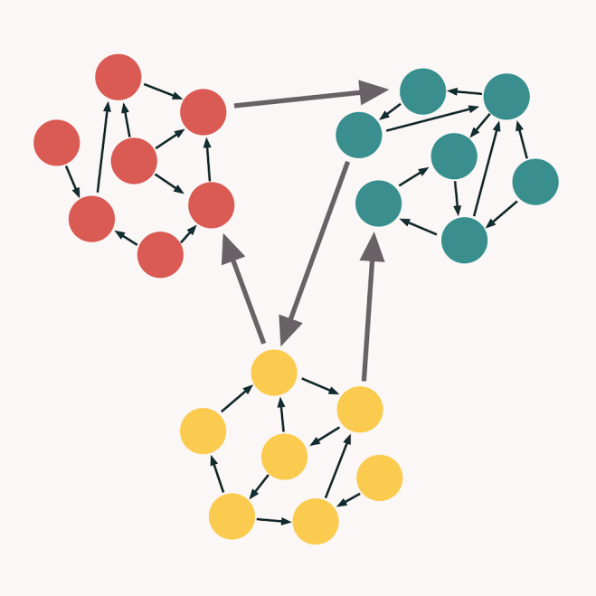
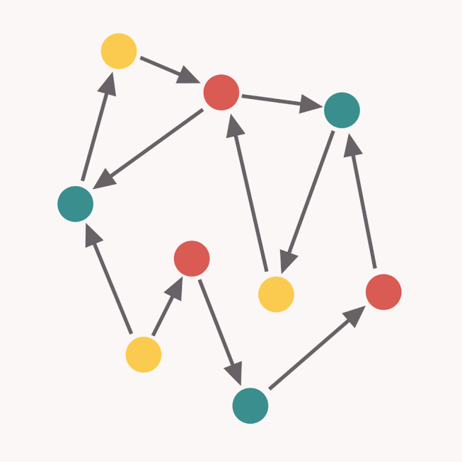

Work on Group Projects

Define what software design patterns and software architectural patterns are

Define cohesion

Define coupling

Understand the benefits of low coupling and high cohesion.

Review of project deliverables for tomorrow

## Design Patterns / Architectural Patterns

A software design pattern is a general, reusable solution to a commonly occurring problem within a given context in software design

- Often capture best practices as they evolve over time
- Often inspire and get "built-in" to new languages and frameworks
- E.g., Object-oriented programming

Architectural patterns are similar to design patterns but have a broader scope. An architectural pattern is a general, reusable solution to a commonly occurring problem in software architecture within a given context.

Many design patterns and architectural patterns seek to help produce systems and code that are **highly cohesive** and **loosely coupled.**

## Cohesion

Cohesion refers to

“How closely the operations in a routine are related”

- One method should only do one thing, or one module should deal with one thing only.
- E.g., "Opposite" of "Kitchen-Sink" class

Code should exhibit **strong cohesion**:

- Methods: each method performs one operation.
- Classes: a class achieves a fine-grain design or implementation goal.
- Packages: a package achieves a medium-grain design goal.
- Subsystems: the subsystem achieves a coarse-grain design goal.
- System: the system achieves all design goals and meets its requirements.

## Various Types of Cohesion

No hard-and-fast rule ("Know it when you see it")

Class elements may be grouped together for various cohesive reasons

- Logical: Logically same category even if different by nature (mouse and keyboard input handling) (Weaker)
- Temporal: Related in time or part of process (Weaker)
- Procedural/Sequential: Related sequentially as steps in a process (Good)
- Communication/Informational: Use the same data (Good)
- Functional: Related functionally as part of a single well-define task (Best)

## Coupling

Coupling refers to

“The strength of a connection between two routines”\*

- It is a complement to cohesion
  - Weak cohesion implies strong coupling.
  - Strong cohesion implies loose coupling.

If a code has strong or tight coupling, a single change in one method or data structure will cause **ripple effects**, i.e., additional changes in other parts of the system.

We want to build systems with parts that are **highly cohesive** and **loosely coupled**.

## Ripple Effects

When a change is made to the system and something else breaks.

- Unwanted side-effect.

Ripple effects cause a long-time of debugging code and understanding relations between system parts.

- Tightly coupled code has many parts of the system dependent on the code that changed.

## Examples of Approaches to achieve Loose Coupling

MVC / MVVM design pattern

Data Access Object

Dependency Injection

ORM Frameworks (Object Relational Mapping)

Factory pattern

Interfaces/Abstract classes

- Abstraction in general helps reduce coupling – But only when you use the abstract class not a specific class. Using the specific class (e.g., as a parameter) increases coupling.

Encapsulation

- Encapsulation can help create code that is loosely coupled when details of the implementation are hidden from other classes.

Good habits to reduce coupling

- If constructor (of classA) is passed a complex object (e.g., a list), store a local copy, not the original reference. This ensures that any classes with the original reference cannot be coupled to the implementation of classA.
- Return copies of complex objects (e.g., copy of a list field in classA) from accessor methods (of classA). This ensures that calling classes are not coupled with the implementation of the fields of classA. Ideally, use generic types when returning (e.g., List, not ArrayList) so that the calling classes do not know unneeded details of the implementation.

Note:

- Cohesion is not an answer to achieving loose coupling (i.e., they are independent concepts)
- Composition does not guarantee loose coupling (it could actually introduce unneeded coupling, especially if using specific classes rather than generic ones).
- Inheritance and Polymorphism can both increase coupling (e.g., among the class hierarchy) and can reduce coupling for classes outside the hierarchy (if generic references are used). Unnecessary complexity can also happen with poor design choices.

## Data Access Object (DAO) a.k.a. CRUD interface

Design pattern to isolate the business logic from the data persistence layer (e.g., the database).

- Abstraction of data persistence
- i.e., loose coupling
- Usually focused methods (high cohesion) – but can be coded poorly with lower cohesion
- Usually for a single data collection (high cohesion) – but can be coded poorly with lower cohesion

Uses an abstract API that hides complexities of interacting with the underlying storage mechanisms

- E.g., Simple CRUD interface

Internals of DAO can sometimes be complicated

- E.g., manage opening, closing database, handling exceptions, properly formulating database queries, etc.

Repository pattern is similar, though it can encompass multiple DAOs and is closer to business logic layer.

- Abstract collections of objects
- In a simple domain, the repository is just a DOA.
- [https://www.baeldung.com/java-dao-vs-repository](https://www.baeldung.com/java-dao-vs-repository)
