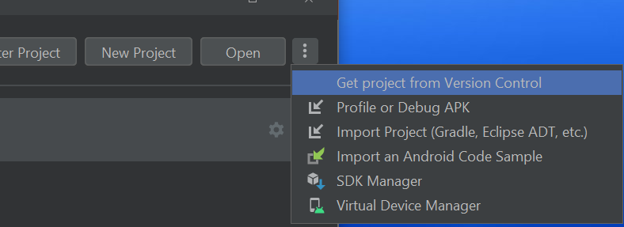

## Application Development II

## 420-5A6-AB
Instructor: Talib Hussain

Day 1: Introduction

---

Image from: https://img.freepik.com/premium-photo/phone-mobile-application-development-concept-mobile-internet-3d-illustration_76964-5164.jpg?size=626&ext=jpg

## Objectives

Course Outline

Intro to Kotlin and Compose

## Welcome!

* You'll be learning:
  * How to program in a newer language – Kotlin – that is based on Java but uses a more concise syntax
  * How to create user interfaces using Jetpack Compose
  * How to use appropriate design principles, tools and techniques to produce robust mobile code
  * How to work together in groups to design and create a working Android app
* You’ll be learning both individually and together
  * Encourage critical thinking, exploratory learning-by-doing, and collaborative learning
  * You’ll be making many design decisions of your own

## Course Outline

* Course Outline posted on Teams Class Materials folder
* My email: [talib.hussain@johnabbott.qc.ca](mailto:talib.hussain@johnabbott.qc.ca)
* Contact via Teams or email (more urgent) or MIO messaging (less urgent or "official")
* Official Ponderation: 2 hours lecture + 4 hours lab + 3 hours homework

## Go Over Course Outline…

## Quiz Proposal

* Possibly students create Kahoots (e.g., each group makes one quiz)
* Possibly Section 1 vs Section 2
  * E.g., Section 1 creates Kahoot for Section 2
* Possibly instructors pool questions and create the actual Kahoot.
* Goal: Have fun challenging each other
* Marking: Self-marked (full marks for group that creates the quiz)
  * Normal bragging rights for high scorers 
* "The Contract": Take it seriously.
  * Otherwise, we go back to traditional quizzes
* Attendance mandatory for quiz (0 otherwise)

## Class Format

Important to learn on your own too!  Look up things you’re not sure about, explore concepts introduced in class, and try to find out more about techniques discussed in class.

* Introduce new concepts/techniques
  * Limited amount of "lecture"
    * Not a lot of new stuff "conceptually".
  * Lots of exploratory links
* Walk-through code examples and/or Try It! Exercises
  * Walkthroughs of existing code
  * Try It!: Short coding exercise on your own (e.g., 5 – 10 min)
* Lab Exercises
  * Larger exercises to complete individually (not worth marks)
  * Often will be online codelabs
* We will use all classtime.  If you finish an activity earlier than the rest of the class, then…
  * Work on making your solution more elaborate/creative and try new things out.
  * Research more details about technique online (often some links will be provided)
  * Work on the assignment/project
  * Or, help a friend – you can learn a lot by teaching
* Collaborative sessions
  * Work together in groups in meeting rooms on group assignments/project
* Test / Review sessions

Learning by Doing!

## Rough Progression

* Overall approach: You know how to program.  You know how to build an app.  Now, learn how to leverage online resources and build an app using common technologies.
  * We are front-loading somewhat to reduce end-of-semester crunch with two other heavy-project courses (Web 3 and Game Dev)
  * Assignments -> Individual
  * Project/Milestones -> Group
* Assignment 1: Simple Kotlin Program
* Assignment 2: Simple mobile app using Compose (single screen)
* Assignment 3: Multi-screen app with Navigation and storage
* Assignment 4: App with error handling, user authentication and more.
  * Goal: Done by week 9 so we can strongly focus on project
* Milestone 1: Get familiar with app config and setup (in parallel with Assignment 1)
  * Let's get the simple technicalities out of the way
* Milestone 2: Design App
  * Goal: Done by Week 7
* Milestone 3: Initial capability
* Milestone 4: Final capability
  * Goal: Done by last day of class

## Tools

* We’ll be using several tools to learn, coordinate and collaborate
* Teams
  * For file sharing.  Class slides will be posted to Teams.  Sometimes beforehand, always after.
  * We'll sometimes use screen share to show your work in class
  * Office hours by appointment
* Lea - For receiving & submitting assignments/project and getting feedback
* Email - For communicating (time-critical).  Will aim for <24hr response.
* MIO - For communicating (non-time-critical or "official")
* Google Forms – For tests
* Android Studio (IDE)
* Github – For maintaining and sharing codebase
* Online document share (e.g., Google Docs) for shared project documentation

## AI, Stack Overflow, Help, etc.

* There are lots of cool tools and resources out there to help us as programmers.
* Recently, AI tools are in focus.  Here, for example, we have autocomplete/code generation tools in our IDEs.  ChatGPT and other such tools are also available.
* Bottom-line – you're here to learn.  You learn by doing things yourself, not by having them done for you or told to you.  It is best to think of these tools as aids for speeding up doing what you already know.
* So, for example, if you find yourself looking for an autocomplete suggestion or code generation in order to figure out what you're supposed to do… stop yourself.
  * save yourself typing - ok
  * save yourself thinking – not ok
* As for other resources online or getting help from someone else, they are all great for researching solutions for how to do things. But, in the end, you need to be able to do it yourself.
  * Don't: Borrow solutions you don't understand.
  * Don't: Copy lots of code and expect it to all work out.
  * Do: If you get an idea or suggestions from a source (including another person), put a reference to it in your comments
  * Do: If you do happen to copy a portion of code exactly, put a clear indication of what isn't yours in the comments  otherwise cheating/plagiarism (which = mark of 0 and reported to college).
  * You don't have to give a source for my code provided in class/slides.  But, if I or another student help you figure out how to do something complex, always nice to given a shout out in the comments.

## Kotlin

* General-purpose, statically-typed, open-source language
* Created by JetBrains – the company who built IntelliJ IDEA and Android Studio
  * v1.0 released 2016
* It runs on a Java Virtual Machine (JVM) and can be used anywhere Java is used
* Somewhat similar to Java, but has many simplifications in syntax and a variety of modern capabilities, such as null safety
  * Avoid boilerplate code
  * Avoid specifying types when unnecessary
* Android mobile development has been "Kotlin-first" since 2019
* Over 95% of the top thousand Android apps use Kotlin.
  * [https://kotlinlang.org/docs/android-overview.html](https://kotlinlang.org/docs/android-overview.html)
* Used by over 60% of professional Android developers
  * [https://developer.android.com/kotlin](https://developer.android.com/kotlin)
* 100% Java interoperable
  * Can call Java code from Kotlin and Kotlin code from Java
  * [https://kotlinlang.org/docs/java-interop.html](https://kotlinlang.org/docs/java-interop.html)
  * [https://kotlinlang.org/docs/java-to-kotlin-interop.html](https://kotlinlang.org/docs/java-to-kotlin-interop.html)

## Compose (a.k.a. Jetpack Compose)

* Modern declarative UI toolkit for component-based UI ("composables")
* Created by Google
  * V1.0 released July 2021
* 100% Kotlin
* Greatly simplifies the coding of UI for Android
  * Can cut development time in half
  * Is now the recommended approach to creating UIs for Android
* Conceptually similar to React and Flutter
  * Similar declarative approach using components
  * Strong integration with Google's Material Design
  * [https://developer.android.com/jetpack/compose/designsystems/material3](https://developer.android.com/jetpack/compose/designsystems/material3)
* 24% of the top 1000 apps on Google Play have adopted Compose
  * [https://android-developers.googleblog.com/2023/05/whats-new-in-jetpack-compose.html](https://android-developers.googleblog.com/2023/05/whats-new-in-jetpack-compose.html)
* Lots of great documentation to help you learn
  * [https://developer.android.com/courses/jetpack-compose/course](https://developer.android.com/courses/jetpack-compose/course)
  * [https://developer.android.com/jetpack/compose/documentation](https://developer.android.com/jetpack/compose/documentation)

## Let's jump right in

😱But I don't know Kotlin….!

No worries – just getting a feel for things.

## Hello World

* The default project ("Empty Activity") in Android Studio actually creates a Kotlin-Compose app
  * It is now the standard for Android app development
* Startup Android Studio and create a new project
* There is a very cool new feature called "Live Edit", but it is only available in the very latest release of Android Studio and Gradle.
  * You may need to update
* We'll walkthrough the project files to see what the basic setup is
  * Uses Gradle (build.gradle.kts) to specify dependencies on 3rd party packages
    * Analogous in some ways to using npm for Node.js, but all specified explicitly in a single place.  Gradle will download all required packages for you automatically.
  * Gradle also specifies various details for building the project (e.g., applicationId, minSdk level, version)
* Main entry point is "MainActivity.kt"
  * Single activity design

## 

That sure doesn't look like Java…

fun?

var?

Where are the semi-colons?

Make code change

## Let's look at something more complicated…

[https://github.com/tshussain/KotlinWithCompose.git](https://github.com/tshussain/KotlinWithCompose.git)

## Load project in Studio

Copy the git clone link for the project.

In Android Studio, create a new project by "Get Project from Version Control"

It may take some time to build the project

Copy the git clone link for the project.

In Android Studio, create a new project by "Get Project from Version Control"

It may take some time to build the project

## Similarity to React

* Notice the rough similarity to React JSX
  * Nested UI components
    * @Composable indicates a UI component much like a JSX component
  * Named "properties" on components
    * Really are named parameters to functions in Kotlin
  * "Single Activity" design pattern
    * Similar in rough concept to single page app design of React
  * State management and re-render UI when state changes
    * Here we see a "ViewModel" class approach.  We'll also see parameter passing, the provider pattern, and storing state in variables (more similar to React).
* [https://www.jetpackcompose.app/compare-declarative-frameworks/JetpackCompose-vs-React-vs-SwiftUI](https://www.jetpackcompose.app/compare-declarative-frameworks/JetpackCompose-vs-React-vs-SwiftUI)

## Useful Links

* Intro to Kotlin
  * [https://developer.android.com/teach#teach-a-class](https://developer.android.com/teach#teach-a-class)
  * [https://www.w3schools.com/KOTLIN/index.php](https://www.w3schools.com/KOTLIN/index.php)
  * [https://eecs441.eecs.umich.edu/](https://eecs441.eecs.umich.edu/)
  * [https://www.slideshare.net/GoogleDevelopersLeba/android-development-with-kotlin-course](https://www.slideshare.net/GoogleDevelopersLeba/android-development-with-kotlin-course)
  * [https://kotlinlang.org/docs/home.html](https://kotlinlang.org/docs/home.html)
  * [https://student.cs.uwaterloo.ca/~cs346/1231/learning-kotlin/index.html](https://student.cs.uwaterloo.ca/~cs346/1231/learning-kotlin/index.html)
  * Null safety: [https://developer.android.com/codelabs/basic-android-kotlin-compose-nullability](https://developer.android.com/codelabs/basic-android-kotlin-compose-nullability)
  * Lambdas: [https://www.baeldung.com/kotlin/lambda-expressions](https://www.baeldung.com/kotlin/lambda-expressions)
  * Data classes: [https://antonioleiva.com/data-classes-kotlin/](https://antonioleiva.com/data-classes-kotlin/)
  * Kotlin vs Java: [https://medium.com/@PurpleGreenLemon/what-exactly-did-kotlin-learn-from-java-55f566659b8d](https://medium.com/@PurpleGreenLemon/what-exactly-did-kotlin-learn-from-java-55f566659b8d)
  * [https://developer.android.com/get-started/codelabs](https://developer.android.com/get-started/codelabs)
* Compose
  * Component-Based UI: [https://medium.com/androiddevelopers/thinking-in-compose-c4ef150bb7cf](https://medium.com/androiddevelopers/thinking-in-compose-c4ef150bb7cf)
  * @Composable: [https://medium.com/androiddevelopers/composable-functions-a505ab20b523](https://medium.com/androiddevelopers/composable-functions-a505ab20b523)
  * Modifiers: [https://developer.android.com/jetpack/compose/modifiers](https://developer.android.com/jetpack/compose/modifiers)
  * [https://developer.android.com/jetpack/compose/tutorial](https://developer.android.com/jetpack/compose/tutorial)
  * [https://towardsdev.com/common-mistakes-to-avoid-in-jetpack-compose-d5093fb1169e](https://towardsdev.com/common-mistakes-to-avoid-in-jetpack-compose-d5093fb1169e)
  * Vs React: [https://www.jetpackcompose.app/compare-declarative-frameworks/JetpackCompose-vs-React-vs-SwiftUI](https://www.jetpackcompose.app/compare-declarative-frameworks/JetpackCompose-vs-React-vs-SwiftUI)
  * [https://github.com/android/compose-samples](https://github.com/android/compose-samples)

* Gradle
  * [https://www.kodeco.com/books/kotlin-multiplatform-by-tutorials/v1.0/chapters/2-getting-started](https://www.kodeco.com/books/kotlin-multiplatform-by-tutorials/v1.0/chapters/2-getting-started)
  * [https://kotlinlang.org/docs/multiplatform-mobile-dependencies.html#add-a-multiplatform-dependency](https://kotlinlang.org/docs/multiplatform-mobile-dependencies.html#add-a-multiplatform-dependency)
* ViewModel
  * [https://developer.android.com/topic/libraries/architecture/viewmodel](https://developer.android.com/topic/libraries/architecture/viewmodel)
  * [https://developer.android.com/codelabs/basic-android-kotlin-compose-viewmodel-and-state#5](https://developer.android.com/codelabs/basic-android-kotlin-compose-viewmodel-and-state#5)
* Navigating between screens
  * [https://developer.android.com/codelabs/basic-android-kotlin-compose-navigation#0](https://developer.android.com/codelabs/basic-android-kotlin-compose-navigation#0)
  * [https://betterprogramming.pub/android-jetpack-compose-and-nesting-navigation-f72df5a84691](https://betterprogramming.pub/android-jetpack-compose-and-nesting-navigation-f72df5a84691)
  * Using intents? [https://developer.android.com/codelabs/basic-android-kotlin-training-activities-intents#0](https://developer.android.com/codelabs/basic-android-kotlin-training-activities-intents#0)
* Event Handling
  * Sealed classes
  * [https://www.freecodecamp.org/news/how-to-handle-ui-events-in-jetpack-compose/](https://www.freecodecamp.org/news/how-to-handle-ui-events-in-jetpack-compose/)
  * [https://medium.com/swlh/simplify-your-ui-interactions-with-events-java-kotlin-any-language-5062c1b1e0e4](https://medium.com/swlh/simplify-your-ui-interactions-with-events-java-kotlin-any-language-5062c1b1e0e4)

* Design/Architecture
  * [https://developer.android.com/jetpack/compose/architecture](https://developer.android.com/jetpack/compose/architecture)
  * Single Activity:
    * [https://levelup.gitconnected.com/modernize-your-android-app-with-the-single-activity-pattern-1526407a7d4](https://levelup.gitconnected.com/modernize-your-android-app-with-the-single-activity-pattern-1526407a7d4)
    * [https://betterprogramming.pub/single-activity-apps-with-jetpack-compose-bba4938ad630](https://betterprogramming.pub/single-activity-apps-with-jetpack-compose-bba4938ad630)
  * Unidirectional Data Flow: [https://developer.android.com/topic/architecture](https://developer.android.com/topic/architecture)
  * [https://developer.android.com/design](https://developer.android.com/design)
  * [https://m3.material.io/develop/android/jetpack-compose](https://m3.material.io/develop/android/jetpack-compose)
  * [https://developer.android.com/courses/pathways/android-development-with-kotlin-13](https://developer.android.com/courses/pathways/android-development-with-kotlin-13)
* Authenticate users
  * [https://firebase.google.com/codelabs/build-android-app-with-firebase-compose#0](https://auth0.com/blog/android-authentication-jetpack-compose-part-1/)
  * [https://auth0.com/blog/android-authentication-jetpack-compose-part-1/](https://auth0.com/blog/android-authentication-jetpack-compose-part-1/)
  * [https://auth0.com/blog/android-authentication-jetpack-compose-part-2/](https://auth0.com/blog/android-authentication-jetpack-compose-part-2/)
* Kotlin Misc:
  * Error handling: [https://www.baeldung.com/kotlin/exception-handling](https://www.baeldung.com/kotlin/exception-handling)
  * [https://kotlinlang.org/docs/java-interop.html#how-to-enable-java-synthetic-property-references](https://kotlinlang.org/docs/java-interop.html#how-to-enable-java-synthetic-property-references)
  * Extensions: [https://kotlinlang.org/docs/extensions.html#extensions-are-resolved-statically](https://kotlinlang.org/docs/extensions.html#extensions-are-resolved-statically)
  * Coroutines, async: [https://www.simplilearn.com/tutorials/kotlin-tutorial/ultimate-guide-on-kotlin-coroutines](https://www.simplilearn.com/tutorials/kotlin-tutorial/ultimate-guide-on-kotlin-coroutines)
  * Destructuring: [https://www.tutorialspoint.com/kotlin/kotlin_destructuring_declarations.htm](https://www.tutorialspoint.com/kotlin/kotlin_destructuring_declarations.htm)
  * [https://cesarmorigaki.medium.com/replace-livedata-with-stateflow-4f3c89214b04](https://cesarmorigaki.medium.com/replace-livedata-with-stateflow-4f3c89214b04)
  * Async [https://student.cs.uwaterloo.ca/~cs346/1231/building-software/async-programming/index.html](https://student.cs.uwaterloo.ca/~cs346/1231/building-software/async-programming/index.html)
  * Calling Java from Kotlin: [https://www.javatpoint.com/kotlin-java-interoperability-calling-java-from-kotlin](https://www.javatpoint.com/kotlin-java-interoperability-calling-java-from-kotlin)

## Concepts

Null safety

Composable UI design

Declarative UI

## Intro to Kotlin

* [https://play.kotlinlang.org/byExample/overview](https://play.kotlinlang.org/byExample/overview)
* [https://developer.android.com/teach#teach-a-class](https://developer.android.com/teach#teach-a-class)
* [https://www.w3schools.com/KOTLIN/index.php](https://www.w3schools.com/KOTLIN/index.php)
* [https://kotlinlang.org/docs/home.html](https://kotlinlang.org/docs/home.html)
* [https://eecs441.eecs.umich.edu/](https://eecs441.eecs.umich.edu/)
* [https://www.slideshare.net/GoogleDevelopersLeba/android-development-with-kotlin-course](https://www.slideshare.net/GoogleDevelopersLeba/android-development-with-kotlin-course)
* Codelabs:
  * [https://developer.android.com/codelabs/basic-android-kotlin-compose-functions#0](https://developer.android.com/codelabs/basic-android-kotlin-compose-functions#0)

## Some basics that are the same as in Java

* Comments //  or /*  */
* Operators: + - * / % ++ -- = += -= *= /= %= == != > < >= <= && || !
* if / if-else / if-else-if
* while / do-while
* break / continue / return
  * (Though Kotlin adds ability to use labels)
* Index arrays/strings starting at 0
* How to access an array element

## Some basics that differ from Java

* Semicolons are optional
* Declaring functions, parameters, return types
* Declaring variables / constants
  * Specifying types is optional
* No primitive types - All types are objects (hence capitalized)
* Using Strings varies in some ways – can use ==  (!!)
* Easy string interpolation using $
* How to create an array,  list, etc.
  * Use arrayOf(),  listOf(), arrayListOf(), etc

## Functions

* The  __fun__  keyword is used to declare a function
  * fun main() {
  * println("Hello World")
  * }
  * We don't need to add 'public' since public is the default visibility in Kotlin
  * Semicolons are optional!!  But, this means that line breaks are significant.
* When a function has parameters, you must specify the type.
  * The type is written after the parameter name and preceded by a colon
  * fun greeting(message: String) {
  * println(message)
  * }
* If a function returns something, you must specify the return type
  * The return type is written after the parentheses containing the parameters and preceded by a colon (and is before the brace)
  * fun augmentMessage(message: String) : String {
  * return "This is the message: " + message;
  * }
* If a function returns nothing, you can omit the type or use the special return type  __Unit__
  * No 'void'

## Try it as we go…

In App.kt, replace "Hello World" with a call to greeting() with an appropriate argument

In the App.kt file, define a function called greeting.

As we learn more about functions and variables, play around with the function definition and the function call to try variations out.

To see the results of a println in Android Studio, select View > Tool Windows > Logcat

## Functions: Named arguments

  * fun greeting(name: String, age: Int) {
  * println ("Hello $name, you are now $age old")
  * }
  * Note: That's string interpolation – cool.
* Kotlin functions can be called using named arguments
  * A named argument provides the name of the parameter in the calling line with an = sign and the value being passed in
    * greeting(name="Xing", age=15)
  * Order of named parameters doesn't matter
    * greeting(age=15, name="Xing") also works
  * Named and positional parameters cannot be mixed unless you retain order

## Functions: Default arguments

* A parameter in a function can be specified with a default value by using the assignment operator and provided the value
  * fun greeting(name: String = "Unknown", age: Int = 10) {
  * println ("Hello $name, you are now $age old")
  * }
  * Some, all or none may have default values.
* When calling a function, a parameter with a default argument may be omitted.  In that case, the default value will be used.
  * Typically, you will use named parameters when omitting a parameter
  * But, as long as the omitted parameters are last in the parameter list, you can use positional parameters as well.  The following are all valid
    * greeting (age=5)
    * greeting(name="Joe")
    * greeting("Jane")
  * These are not valid
    * greeting(5)
    * greeting(age=5, "Juan")

## Single Expression Functions (or "One-Line Functions")

* If you have a function that has just a single expression, the curly braces are optional
  * fun convertToFahrenheit(degree : Float) : Float {
  * return (degree * 9 / 5) + 32
  * }
* can be simplified to
  * fun convertToFahrenheit(degree : Float) = (degree * 9 / 5) + 32
* Applies for almost every type of expression:
  * fun getResult(percentage : Int) = if (percentage > 40) "Pass" else "Fail"

## Variables

* The  __var__  keyword is used to declare a variable that may change in value
* The  __val__  keyword is used to declare a constant
  * var name = "Joe"
  * val birthyear = 1985
* Use of val is recommended where possible.
* Cool feature  We don't have to specify a type – Kotlin will figure it out based on the first assignment.
  * Once a type is assigned, it can't be changed.
* But, we can still specify a type if we wish.  Unlike Java, the type is written after the variable name and preceded by a colon
  * var name: String = "Joe"
  * val birthyear: Int = 1985

## Types

* Main types are:
  * Int
  * Double
  * Char
  * Boolean
  * String
  * Also: Float, Long, Short
  * Note: All capitalized.
* Conversion:
  * You can convert one type to another using a toXXX() method on the object
    * value1.toInt()
    * value2.toString()
* Still have Double.MIN_VALUE, etc.

