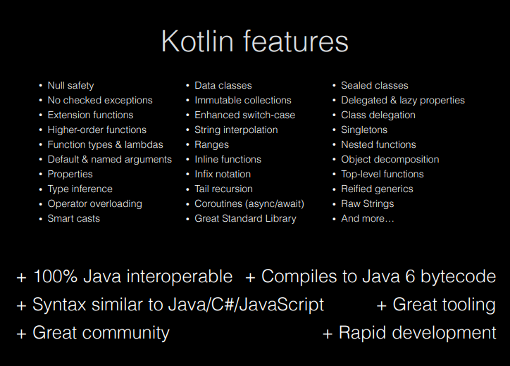

## Application Development II

## 420-5A6-AB
Instructor: Talib Hussain

Day 2: Kotlin

---

Image from: https://img.freepik.com/premium-photo/phone-mobile-application-development-concept-mobile-internet-3d-illustration_76964-5164.jpg?size=626&ext=jpg

## Objectives

* Kotlin Basics
  * Functions
  * Variables
  * Types
  * Strings
  * Arrays
  * Lists
* Kotlin Operations
  * Loops
  * Ranges
  * When
* Functional Programming
  * Lambda functions
  * .map, .filter
* Kotlin Object-Oriented Programming
  * Classes
  * Constructors
  * Inheritance

## Kotlin

* General-purpose, statically-typed, open-source language
* Created by JetBrains – the company who built IntelliJ IDEA and Android Studio
  * v1.0 released 2016
* It runs on a Java Virtual Machine (JVM) and can be used anywhere Java is used
* Somewhat similar to Java, but has many simplifications in syntax and a variety of modern capabilities, such as null safety
  * Avoid boilerplate code
  * Avoid specifying types when unnecessary
* Android mobile development has been "Kotlin-first" since 2019
* Over 95% of the top thousand Android apps use Kotlin.
  * [https://kotlinlang.org/docs/android-overview.html](https://kotlinlang.org/docs/android-overview.html)
* Used by over 60% of professional Android developers
  * [https://developer.android.com/kotlin](https://developer.android.com/kotlin)
* 100% Java interoperable
  * Can call Java code from Kotlin and Kotlin code from Java
  * [https://kotlinlang.org/docs/java-interop.html](https://kotlinlang.org/docs/java-interop.html)
  * [https://kotlinlang.org/docs/java-to-kotlin-interop.html](https://kotlinlang.org/docs/java-to-kotlin-interop.html)

## Concepts

Null safety

Composable UI design

Declarative UI

## Intro to Kotlin

* [https://play.kotlinlang.org/byExample/overview](https://play.kotlinlang.org/byExample/overview)
* [https://developer.android.com/teach#teach-a-class](https://developer.android.com/teach#teach-a-class)
* [https://www.w3schools.com/KOTLIN/index.php](https://www.w3schools.com/KOTLIN/index.php)
* [https://kotlinlang.org/docs/home.html](https://kotlinlang.org/docs/home.html)
* [https://eecs441.eecs.umich.edu/](https://eecs441.eecs.umich.edu/)
* [https://www.slideshare.net/GoogleDevelopersLeba/android-development-with-kotlin-course](https://www.slideshare.net/GoogleDevelopersLeba/android-development-with-kotlin-course)
* Codelabs:
  * [https://developer.android.com/courses/pathways/android-basics-compose-unit-1-pathway-1](https://developer.android.com/codelabs/basic-android-kotlin-compose-functions#0)

## Some basics that are the same as in Java

* Comments //  or /*  */
* Operators: + - * / % ++ -- = += -= *= /= %= == != > < >= <= && || !
* if / if-else / if-else-if
* while / do-while
* break / continue / return
  * (Though Kotlin adds ability to use labels)
* Index arrays/strings starting at 0
* How to access an array element

## Some basics that differ from Java

* Semicolons are optional
* Declaring functions, parameters, return types
* Declaring variables / constants
  * Specifying types is optional
* No primitive types - All types are objects (hence capitalized)
* Using Strings varies in some ways – can use ==  (!!)
* Easy string interpolation using $
* How to create an array,  list, etc.
  * Use arrayOf(),  listOf(), arrayListOf(), etc

## Functions

* The  __fun__  keyword is used to declare a function
  * fun main() {
  * println("Hello World")
  * }
  * We don't need to add 'public' since public is the default visibility in Kotlin
  * Semicolons are optional!!  But, this means that line breaks are significant.
* When a function has parameters, you must specify the type.
  * The type is written after the parameter name and preceded by a colon
  * fun greeting(message: String) {
  * println(message)
  * }
* If a function returns something, you must specify the return type
  * The return type is written after the parentheses containing the parameters and preceded by a colon (and is before the brace)
  * fun augmentMessage(message: String) : String {
  * return "This is the message: " + message;
  * }
* If a function returns nothing, you can omit the type or use the special return type  __Unit__
  * No 'void'

## Try it as we go…

In App.kt, replace "Hello World" with a call to greeting() with an appropriate argument

In the App.kt file, define a function called greeting.

As we learn more about functions and variables, play around with the function definition and the function call to try variations out.

To see the results of a println in Android Studio, select View > Tool Windows > Logcat

## Functions: Named arguments

  * fun greeting(name: String, age: Int) {
  * println ("Hello $name, you are now $age old")
  * }
  * Note: That's string interpolation – cool.
* Kotlin functions can be called using named arguments
  * A named argument provides the name of the parameter in the calling line with an = sign and the value being passed in
    * greeting(name="Xing", age=15)
  * Order of named parameters doesn't matter
    * greeting(age=15, name="Xing") also works
  * Named and positional parameters cannot be mixed unless you retain order

## Functions: Default arguments

* A parameter in a function can be specified with a default value by using the assignment operator and provided the value
  * fun greeting(name: String = "Unknown", age: Int = 10) {
  * println ("Hello $name, you are now $age old")
  * }
  * Some, all or none may have default values.
* When calling a function, a parameter with a default argument may be omitted.  In that case, the default value will be used.
  * Typically, you will use named parameters when omitting a parameter
  * But, as long as the omitted parameters are last in the parameter list, you can use positional parameters as well.  The following are all valid
    * greeting (age=5)
    * greeting(name="Joe")
    * greeting("Jane")
  * These are not valid
    * greeting(5)
    * greeting(age=5, "Juan")

## Single Expression Functions (or "One-Line Functions")

* If you have a function that has just a single expression, the curly braces are optional
  * fun convertToFahrenheit(degree : Float) : Float {
  * return (degree * 9 / 5) + 32
  * }
* can be simplified to
  * fun convertToFahrenheit(degree : Float) = (degree * 9 / 5) + 32
* Applies for almost every type of expression:
  * fun getResult(percentage : Int) = if (percentage > 40) "Pass" else "Fail"

## Variables

* The  __var__  keyword is used to declare a variable that may change in value
* The  __val__  keyword is used to declare a constant
  * var name = "Joe"
  * val birthyear = 1985
* Use of val is recommended where possible.
* Cool feature  We don't have to specify a type – Kotlin will figure it out based on the first assignment.
  * Once a type is assigned, it can't be changed.
* But, we can still specify a type if we wish.  Unlike Java, the type is written after the variable name and preceded by a colon
  * var name: String = "Joe"
  * val birthyear: Int = 1985

## Types

* Main types are:
  * Int
  * Double
  * Char
  * Boolean
  * String
  * Also: Float, Long, Short
  * Note: All capitalized.
* Conversion:
  * You can convert one type to another using a toXXX() method on the object
    * value1.toInt()
    * value2.toString()
* Still have Double.MIN_VALUE, etc.

## More differences

* How to create an array,  list, etc.
  * Use arrayOf(),  listOf(), arrayListOf(), etc
* No traditional  __for__  loop
  * Only a "for ( … in …)" loop
  * __repeat__  loop
* Ranges are new
* __when__  instead of  __switch__
  * Behaves slightly differently
  * Main difference is no break needed.
* Classes have a variety of differences with many shortcuts/new capabilities
  * No  __new__  keyword when creating objects
  * Default visibility is public and visibility modifiers vary slightly
  * Classes are not inheritable by default.  Need to use keyword open.
  * Functions are not overridable by default.  Need to be in open class, use open keyword and use override keyword.
* Lambda
* Map/Filter operations

## Strings

* Access string characters using array notation
  * name = "Jane"
  * println(name[0]) would print 'J'
* Can use triple quotes to assigned any arbitrary text
  * val text = """
  * var age = 5
  * // This is a comment
  * """
  * Note: whitespace and line breaks are included...
* String templates
  * Starts with a $ and can be a simple value or an expression in { }
  * val name = "Ginger"
  * println("$name.length is ${name.length} ")
  * println("Computed number is ${name.length * 2 + 1}")
  * >Ginger.length is 6
  * >Computed number is 13
* Comparison
  * Can use == to compare strings (yay!)  This is like .equals() in Java
  * Also .equals(), .compareTo(), indexOf()
  * .upperCase(), .lowerCase() and many more
  * Can also use === (triple equals) to check if two variables are pointing to the same object (i.e., this is like == in Java).

## Arrays

* Implicit type declaration
  * val nums = arrayOf(1, 2, 3, 4)   //implicit type declaration
* Explicit type declaration
  * val nums = intArrayOf(1, 2, 3, 4)
  * val nums = arrayOf<Int>(1, 2, 3, 4)
* Create an array with a set of default values
  * var nums = Array<Int>(4, { 0 })
  * var nums = IntArray(4, { 0 })
  * var nums = IntArray(4, { it }) – special keyword it
  * var nums = IntArray(4, { it + 1})
* Created an array with mixed types
  * var nums = arrayOf(2, "s", 4.0,2F)
* Get size of array using size property
  * nums.size

## Lists, etc.

* Several types of collections (List, Set, Map, etc.)
  * [https://kotlinlang.org/api/latest/jvm/stdlib/kotlin.collections/](https://kotlinlang.org/api/latest/jvm/stdlib/kotlin.collections/)
  * [https://www.geeksforgeeks.org/kotlin-collections/](https://www.geeksforgeeks.org/kotlin-collections/)
* Create a list using listOf():
  * [https://kotlinlang.org/api/latest/jvm/stdlib/kotlin.collections/list-of.html](https://kotlinlang.org/api/latest/jvm/stdlib/kotlin.collections/list-of.html)
* ArrayList:  arrayListOf()
  * [https://kotlinlang.org/api/latest/jvm/stdlib/kotlin.collections/array-list-of.html](https://kotlinlang.org/api/latest/jvm/stdlib/kotlin.collections/array-list-of.html)

## for – in loop

* In Kotlin, there is no traditional "for" loop (e.g., no counting over index values…)
* Instead, a  __for – in __ loop is used.
  * Kotlin just calls it a  __for__  loop.  But for – in helps distinguish it from the "usual"
* This is used to iterate over elements in a collection
  * Similar in functionality tofor – in loop in Swift and for – each loop in Java.

## Try It!

* Spend 45 minutes creating and calling different functions that use parameters, variables, types, strings, arrays and lists in different ways.
  * Goal: Become familiar with the new syntax
* Explore [https://www.w3schools.com/KOTLIN/kotlin_examples.php](https://www.w3schools.com/KOTLIN/kotlin_examples.php)
  * Up to "Kotlin For Loop" (skip When)
* CodeLabs to Explore:
  * Functions: [https://developer.android.com/codelabs/basic-android-kotlin-compose-functions#0](https://developer.android.com/codelabs/basic-android-kotlin-compose-functions#0)
  * Collections: [https://developer.android.com/codelabs/basic-android-kotlin-compose-collections#0](https://developer.android.com/codelabs/basic-android-kotlin-compose-collections#0)
    * Up to end of Lists
* If the above codelabs are too complex for you to get started, try these two codelabs first
  * First program: [https://developer.android.com/codelabs/basic-android-kotlin-compose-first-program](https://developer.android.com/codelabs/basic-android-kotlin-compose-first-program)
  * Variables: [https://developer.android.com/codelabs/basic-android-kotlin-compose-variables](https://developer.android.com/codelabs/basic-android-kotlin-compose-variables)
* If the above is easy for you and you finish early, try this codelab next (do as many problems as you can in the time remaining):
  * [https://developer.android.com/codelabs/basic-android-kotlin-compose-intro-kotlin-practice-problems](https://developer.android.com/codelabs/basic-android-kotlin-compose-intro-kotlin-practice-problems)

## when statement

* Kotlin does not have a switch statement, but does provide a  __when__  statement that behaves similarly
  * val option = 3
  * val result = when (option) {
  * 1 -> "Choice 1"
  * 2,4 -> "Choice 2 or 4"
  * 3 -> "Choice 3"
  * else -> "Invalid Choice"
  * }
  * [https://www.w3schools.com/KOTLIN/kotlin_when.php](https://www.w3schools.com/KOTLIN/kotlin_when.php)
  * This replaces the use of multiple if .. else expressions
  * Unlike a switch in Java, you do not need a "break" between cases.
  * _else_  is not needed if it is unreachable
* when statement is very flexible and can be used in several interesting ways.
  * [https://blog.mindorks.com/replace-switch-with-when-in-kotlin/](https://blog.mindorks.com/replace-switch-with-when-in-kotlin/)

## Ranges

* Kotlin allows you to explicitly express a range of values using the .. notation
  * Most often used with for – in loop
  * for (x in 1..10) {
  * }
  * Can use a step function
  * for (x in 1..10 step 2) {
  * }
* A range may be over characters
  * for (c in 'a'..'x') {
  * println(c)
  * }
* Use  __downTo__  to specify a range that is decreasing
  * for (x in 10 downTo 1) {
  * }
* You can also check whether a value is in a given range using an if statement
  * if (y in 1..100) {
  * }
* [https://www.baeldung.com/kotlin/ranges](https://www.baeldung.com/kotlin/ranges)
* [https://www.w3schools.com/KOTLIN/kotlin_ranges.php](https://www.w3schools.com/KOTLIN/kotlin_ranges.php)

## Lambda Expressions

* Lambda expressions are functions that do not have a name which are defined without the  _fun_  keyword
  * Used immediately as an expression
  * Can help your code be more concise
* They are essentially code inside of curly braces
  * { body_of_function }
* They may take variables as arguments
  * { argument_list -> body_of_function}
* Special keyword "it"
  * Implicit name of a single parameter
  * We'll see this later in .filter and .map
* [https://student.cs.uwaterloo.ca/~cs346/1231/learning-kotlin/functional/index.html](https://student.cs.uwaterloo.ca/~cs346/1231/learning-kotlin/functional/index.html)
* [https://www.geeksforgeeks.org/kotlin-lambdas-expressions-and-anonymous-functions/](https://www.geeksforgeeks.org/kotlin-lambdas-expressions-and-anonymous-functions/)
* [https://www.baeldung.com/kotlin/lambda-expressions](https://www.baeldung.com/kotlin/lambda-expressions)

## repeat loop

* Since we can't easily use a for loop for counting, Kotlin provides a simple "repeat" function that loops a fixed number of times.
* It is a function followed by a lambda
  * repeat( _number_ ) {
  * }
  * Repeats the loop the given  _number_  of times.
  * [https://kotlinlang.org/api/latest/jvm/stdlib/kotlin/repeat.html](https://kotlinlang.org/api/latest/jvm/stdlib/kotlin/repeat.html)
  * // greets with an index
  * repeat(3) { index ->
  * println("Hello with index $index")
  * }

## Using functional programming techniques

* Kotlin allows you to use a variety of functional programming operations on collections
* Two common ones are  .filter and .map
  * Many others exist
  * These exist in other languages such as JavaScript and Swift
* The syntax in Kotlin is to call the function on an object and provide it with a lambda expression in curly braces.
* These operations may be chained together
  * val list = listOf(1,2,3,4,5)
  * // Filter by given predicate and return the list of elements that match the predicate
  * val selecteditems = list.filter { it < 4 }
  * // Apply the same operation to each element of the list and return the new list
  * val transformedItems = list.map { it*it }
  * // Chain operations together
  * val selectedAndTransformedItems = list.filter { it < 4 }.map { it*it }

## Store a function in a variable

* Use the :: notation to store a function in a variable
  * fun main() {
  * val trickFunction = ::trick
  * }
  * fun trick() {
  * println("No treats!")
  * }
* Or, use a lambda expression to define the function.  Store that lambda in a variable.
  * fun main() {
  * val trickFunction = trick
  * trick()
  * trickFunction()
  * }
  * val trick = {
  * println("No treats!")
  * }
* [https://developer.android.com/codelabs/basic-android-kotlin-compose-function-types-and-lambda#2](https://developer.android.com/codelabs/basic-android-kotlin-compose-function-types-and-lambda#2)

## Try It!

* Spend 45 minutes exploring when, ranges, lambda functions, functional programming, etc. in detail
  * Goal: Become familiar with the new syntax
* Explore [https://www.w3schools.com/KOTLIN/kotlin_examples.php](https://www.w3schools.com/KOTLIN/kotlin_examples.php)
  * When and Ranges
* CodeLab to Explore:
  * Lambdas: [https://developer.android.com/codelabs/basic-android-kotlin-compose-function-types-and-lambda](https://developer.android.com/codelabs/basic-android-kotlin-compose-function-types-and-lambda)
* If you finish the above early, try this codelab next (do as many problems as you can in the time remaining):
  * [https://developer.android.com/codelabs/basic-android-kotlin-compose-kotlin-fundamentals-practice-problems](https://developer.android.com/codelabs/basic-android-kotlin-compose-kotlin-fundamentals-practice-problems)

## OOP in Kotlin

* A basic class in Kotlin is similar to one in Java
  * class Car {
  * var brand = ""
  * var model = ""
  * var year = 0
  * fun updateModel(newmodel: String){...}
  * ...
  * }
* "Fields" (from Java) are generally called  __properties__
* "Methods" (from Java) are called  __class functions__
* But, visibility is public is default
  * private – only visible in that file
  * internal – visible within same module
  * protected - visible inside that class AND that it is also visible in subclasses
* [https://www.baeldung.com/kotlin/visibility-modifiers](https://www.baeldung.com/kotlin/visibility-modifiers)

## Constructor

* For a simple class, we can just define a constructor
  * We don't have to explicitly define all the fields, etc.
  * class Car(var brand: String, var model: String, var year: Int)
* Constructor arguments can have default values
  * class Car(var brand: String, var model: String = "Unknown", var year:Int = 2022)
* When calling a constructor in Kotlin, we don't use the 'new' keyword
  * val c1 = Car("Ford", "Mustang", 1969)
* Multiple constructors are possible (self-study).

## Sample class with constructor & functions

class Car(var brand: String, var model: String, var year: Int) {

// Class function

fun drive() {

println("Wrooom!")

}

// Class function with parameters

fun speed(maxSpeed: Int) {

println("Max speed is: " + maxSpeed)

}

}

## Setting values

* Unlike java, the getter and setter for a property of a class simply uses the name of the property
  * i.e., not getX(), setX().
  * val car = Car("Honda", "Camry", 2023)
  * println(car.brand)                 Access with .<property name>
  * car.model = "Civic"               Set with .<property name>
  * println(civis.name)

## No Static…

* Kotlin does not have the static keyword.
* If you want to create the equivalent to a static method in Kotlin, you can use "companion objects"
* Companion objects are the singleton objects whose properties and functions are tied to a class but not to the instance of that class. Hence, we can access them just like a static method of the class.
* Note that only one companion class is allowed per class. More than one companion object per class will lead to a runtime error in Kotlin.
  * class MyClass {
  * companion object{
  * fun myStaticMethod(): String{
  * return "This method can be called without object"
  * }
  * }
  * }
  * fun main(args: Array<String>) {
  * println(MyClass.myStaticMethod())
  * }
* [https://medium.com/@waqarul/kotlin-static-member-fields-and-singletons-b79fd65aaf9b](https://medium.com/@waqarul/kotlin-static-member-fields-and-singletons-b79fd65aaf9b)

## Inheritance

* To allow a class to be subclassed, it must be defined with the keyword  __open__ .
* A class extends another using the colon syntax below:
  * // Superclass
  * open class MyParentClass {
  * val x = 5
  * }
  * // Subclass
  * class MyChildClass: MyParentClass() {
  * fun myFunction() {
  * println(x) // x is now inherited from the superclass
  * }
  * }

* To allow a class to be subclassed, it must be defined with the keyword  __open__ .
* A class extends another using the colon syntax below:
  * // Superclass
  * open class MyParentClass {
  * val x = 5
  * }
  * // Subclass
  * class MyChildClass: MyParentClass() {
  * fun myFunction() {
  * println(x) // x is now inherited from the superclass
  * }
  * }
* If the parent has constructor values, must also pass the appropriate constructor values when subclassing.
  * open class MyClass(var value:Int)
  * class SubClass(var value:Int, var otherValue:String): MyClass(value)

## Overriding Functions

* A function of a parent class cannot be overridden in a subclass unless the function in the parent is declared open.
* The override keyword must also be used when defining the overridden function.
  * open class MyClass(var value:String) {
  * open fun myFunction() {
  * println(value)
  * }
  * }
  * class SubClass(var value:String, var otherValue:String): MyClass(value) {
  * override fun myFunction() {
  * println(otherValue);
  * }
  * }
* Elsewhere:
  * val x = MyClass("Hi")
  * val y = SubClass("Hi", "Bye")
  * x.myFunction()
  * y.myFunction()
  * Should print out "Hi" then "Bye"

## Try It!

* Spend 45 minutes exploring Kotlin OOP in detail
  * Goal: Become familiar with the new syntax
* Explore [https://www.w3schools.com/KOTLIN/kotlin_examples.php](https://www.w3schools.com/KOTLIN/kotlin_examples.php)
  * Classes section
* Details at:
  * [https://docs.google.com/presentation/d/1FSZwOeSwL-XNkMXnKDy-YPMEpCPKyb29RlpekSzzJDY/edit#slide=id.gb9961b3fa0_0_433](https://docs.google.com/presentation/d/1FSZwOeSwL-XNkMXnKDy-YPMEpCPKyb29RlpekSzzJDY/edit#slide=id.gb9961b3fa0_0_433)
* CodeLab to Explore:
  * [https://developer.android.com/codelabs/basic-android-kotlin-compose-classes-and-objects#0](https://developer.android.com/codelabs/basic-android-kotlin-compose-classes-and-objects#0)

## Next

Kotlin Special Features

Form groups

Handout Assignment #1 / Milestone #1

