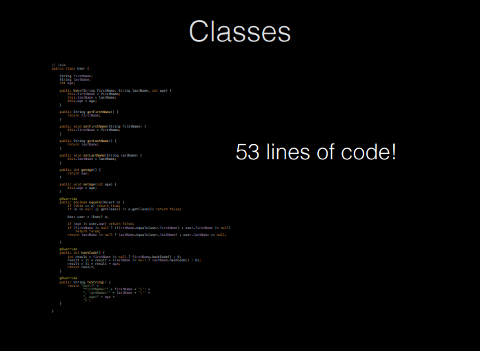
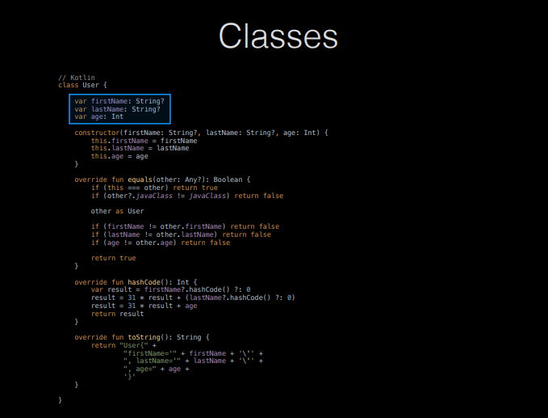
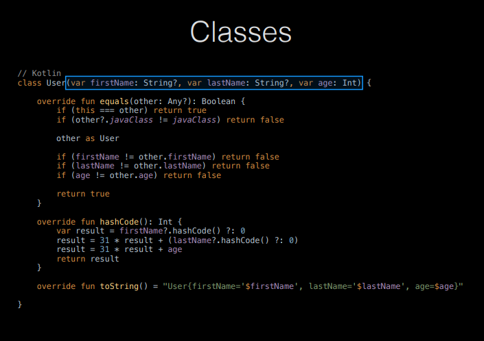
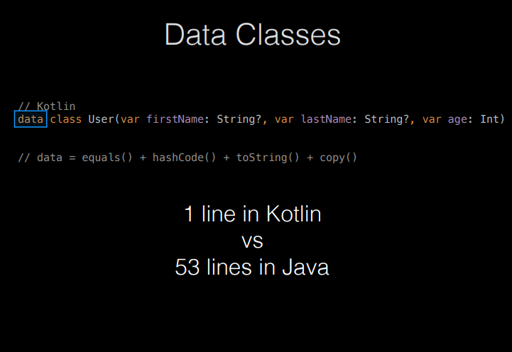

## Application Development II

## 420-5A6-AB
Instructor: Talib Hussain

Day 3: Kotlin

---

Image from: https://img.freepik.com/premium-photo/phone-mobile-application-development-concept-mobile-internet-3d-illustration_76964-5164.jpg?size=626&ext=jpg

## Objectives

* Kotlin Object-Oriented Programming
  * Classes
  * Constructors
  * Inheritance
* Null Safety
  * Nullable Types
  * Safe Call Operator ?.
  * Elvis Operator ?:
  * Not-Null Assertion Operator !!
* Data Classes

## OOP in Kotlin

* A basic class in Kotlin is similar to one in Java
  * class Car {
  * var brand = ""
  * var model = ""
  * var year = 0
  * fun updateModel(newmodel: String){...}
  * ...
  * }
* "Fields" (from Java) are generally called  __properties__
* "Methods" (from Java) are called  __class functions__
* But, visibility is public is default
  * private – only visible in that file
  * internal – visible within same module
  * protected - visible inside that class AND that it is also visible in subclasses
* [https://www.baeldung.com/kotlin/visibility-modifiers](https://www.baeldung.com/kotlin/visibility-modifiers)

## Constructor

* For a simple class, we can just define a constructor
  * We don't have to explicitly define all the fields, etc.
  * class Car(var brand: String, var model: String, var year: Int)
* Constructor arguments can have default values
  * class Car(var brand: String, var model: String = "Unknown", var year:Int = 2022)
* When calling a constructor in Kotlin, we don't use the 'new' keyword
  * val c1 = Car("Ford", "Mustang", 1969)
* Multiple constructors are possible (self-study).

## Sample class with constructor & functions

class Car(var brand: String, var model: String, var year: Int) {

// Class function

fun drive() {

println("Wrooom!")

}

// Class function with parameters

fun speed(maxSpeed: Int) {

println("Max speed is: " + maxSpeed)

}

}

## Setting values

* Unlike java, the getter and setter for a property of a class simply uses the name of the property
  * i.e., not getX(), setX().
  * val car = Car("Honda", "Camry", 2023)
  * println(car.brand)                 Access with .<property name>
  * car.model = "Civic"               Set with .<property name>
  * println(civis.name)

## No Static…

* Kotlin does not have the static keyword.
* If you want to create the equivalent to a static method in Kotlin, you can use "companion objects"
* Companion objects are the singleton objects whose properties and functions are tied to a class but not to the instance of that class. Hence, we can access them just like a static method of the class.
* Note that only one companion class is allowed per class. More than one companion object per class will lead to a runtime error in Kotlin.
  * class MyClass {
  * companion object{
  * fun myStaticMethod(): String{
  * return "This method can be called without object"
  * }
  * }
  * }
  * fun main(args: Array<String>) {
  * println(MyClass.myStaticMethod())
  * }
* [https://medium.com/@waqarul/kotlin-static-member-fields-and-singletons-b79fd65aaf9b](https://medium.com/@waqarul/kotlin-static-member-fields-and-singletons-b79fd65aaf9b)

## Inheritance

* To allow a class to be subclassed, it must be defined with the keyword  __open__ .
* A class extends another using the colon syntax below:
  * // Superclass
  * open class MyParentClass {
  * val x = 5
  * }
  * // Subclass
  * class MyChildClass: MyParentClass() {
  * fun myFunction() {
  * println(x) // x is now inherited from the superclass
  * }
  * }

* To allow a class to be subclassed, it must be defined with the keyword  __open__ .
* A class extends another using the colon syntax below:
  * // Superclass
  * open class MyParentClass {
  * val x = 5
  * }
  * // Subclass
  * class MyChildClass: MyParentClass() {
  * fun myFunction() {
  * println(x) // x is now inherited from the superclass
  * }
  * }
* If the parent has constructor values, must also pass the appropriate constructor values when subclassing.
  * open class MyClass(var value:Int)
  * class SubClass(var value:Int, var otherValue:String): MyClass(value)

## Overriding Functions

* A function of a parent class cannot be overridden in a subclass unless the function in the parent is declared open.
* The override keyword must also be used when defining the overridden function.
  * open class MyClass(var value:String) {
  * open fun myFunction() {
  * println(value)
  * }
  * }
  * class SubClass(var value:String, var otherValue:String): MyClass(value) {
  * override fun myFunction() {
  * println(otherValue);
  * }
  * }
* Elsewhere:
  * val x = MyClass("Hi")
  * val y = SubClass("Hi", "Bye")
  * x.myFunction()
  * y.myFunction()
  * Should print out "Hi" then "Bye"

## Try It!

* Spend 45 minutes exploring Kotlin OOP in detail
  * Goal: Become familiar with the new syntax
* Explore [https://www.w3schools.com/KOTLIN/kotlin_examples.php](https://www.w3schools.com/KOTLIN/kotlin_examples.php)
  * Classes section
* Details at:
  * [https://docs.google.com/presentation/d/1FSZwOeSwL-XNkMXnKDy-YPMEpCPKyb29RlpekSzzJDY/edit#slide=id.gb9961b3fa0_0_433](https://docs.google.com/presentation/d/1FSZwOeSwL-XNkMXnKDy-YPMEpCPKyb29RlpekSzzJDY/edit#slide=id.gb9961b3fa0_0_433)
* CodeLab to Explore:
  * [https://developer.android.com/codelabs/basic-android-kotlin-compose-classes-and-objects#0](https://developer.android.com/codelabs/basic-android-kotlin-compose-classes-and-objects#0)

## Null Safety

* Kotlin is designed as a null safe language
  * By default, variables in Kotlin cannot be set to null.
* There is a special nullable type which allows you to use nulls subject to certain rules.
* [https://kotlinlang.org/docs/null-safety.html#safe-casts](https://kotlinlang.org/docs/null-safety.html#safe-casts)

## Null Safety: Cannot assign null to a normal variable

var str: String = "xyz"

str = null // Compile-time error

vs.

var str: String? = "xyz"

str =null // OK

## Null Safety: Nullable parameter must be handled properly

fun getLength(str: String): Int? {

return str.length   // OK

}

vs.

fun getLength(str: String?): Int? {

return str.length   // Compile-time error

}

Since str could be null, checking its length opens you up to the possibility of a null pointer error.

## Safe Call Operator ?.

* Can explicitly check for null ("old-school" way)
  * fun getLength(str: String?): Int? {
  * if (str != null) {
  * return str.length   // OK
  * }
  * return 0
  * }
* Or can use the safe call operator ?.
  * fun getLength(str: String?): Int? {
  * return str?.length   // OK
  * }
  * This returns null if the given  _str_  string is null

## Java vs. Kotlin Example

  * // Java
  * public ZipCode getZipCode(User user) {
  * if (user != null) {
  * if (user.getAddress() != null)
  * return user.getAddress().getZipCode();
  * }
  * }
  * return null;
  * }
* vs
  * //Kotlin
  * fun getZipCode(user: User?): ZipCode? {
  * return user?.address?.zipCode;
  * }
* Or, even more concisely
  * //Kotlin
  * fun getZipCode(user: User?): ZipCode? = user?.address?.zipCode

## Elvis Operator ?:

* If you want to use a particular value when a nullable is null, you can use an if –else statement
  * val c: Int = if (b != null) b.length else -1
* Or, you can use a simpler expression called the Elvis operator ?:
  * val c = b?.length ?: -1
  * If the expression to the left of ?: is not null, the Elvis operator returns it, otherwise it returns the expression to the right. Note that the expression on the right-hand side is evaluated only if the left-hand side is null.
  * Called "Elvis operator" since when ?: is viewed sideways, it resembles an emoticon of Elvis Presley with his signature hairstyle.
  * So, Kotlin doesn't have a ternary operator, but theElvis operator is similar in some ways (for nulls).

## Not-Null Assertion Operator !!

* The not-null assertion operator (!!) converts any value to a non-null type and throws an exception if the value is null
  * val c = b!!.length
* Essentially, you just manually opened up the door to a runtime NPE (NullPointerException)
* So, you really should only ever use !! when you are sure that the value cannot be null
  * For instance, you have earlier checked whether it was null and it wasn't.

## Data Class

* Kotlin offers different types of classes, e.g.,
  * data class – discussed today
  * enum class – similar to Java
  * sealed class – discussed later
* Data classes are a very useful concise way to define a class whose purpose is to store data.
  * E.g., Similar to a "POJO" – plain old Java object or JavaBean
* Essentially, a data class provides, automatically, the toString(), equals(), hashCode() and copy() functions.  And, via a class constructor, also provides the getters and setters.
* [https://antonioleiva.com/data-classes-kotlin/](https://antonioleiva.com/data-classes-kotlin/)

## 

## Try It!

* [https://developer.android.com/codelabs/basic-android-kotlin-compose-nullability#0](https://developer.android.com/codelabs/basic-android-kotlin-compose-nullability#0)
* [https://developer.android.com/codelabs/basic-android-kotlin-compose-generics#3](https://developer.android.com/codelabs/basic-android-kotlin-compose-generics#3)
  * #3 AND #4
* If finished early, you may work on the assignment in the time remaining.

## Assignment #1: Kotlin Program

* Worth 7% of final grade. Due Aug 7, midnight
  * Estimated Level of Effort: 4.5 hours – 1.5 hours class time and 3 hours homework.
* For this assignment, you will create a sorting program based on a binary search tree using the Kotlin language with OOP, data classes and lambdas.
* This is an Individual assignment
* The goal of this assignment is to demonstrate understanding of the Kotlin language
  * It is assumed you know how to create a Binary Search Tree (BST), insert into a BST, and traverse a BST in sorted order
  * The following link has some sample code as a reference: [https://www.baeldung.com/kotlin/binary-tree](https://www.baeldung.com/kotlin/binary-tree)
* Requirements
  * Use a data class to store at least three pieces of information about a Person (one String, one Int, and one nullable type)
  * Create a Node object that will be stored in the tree.  A Node will contain a Person, a left Node and a right Node.
  * Create a BinarySearchTree class that stores the tree
    * In its constructor, it should accept a lambda function that will be used to determine the sort order
    * Create an insert() function that will insert a Person into the tree (using the sorting function to keep the BST sorted in sorted order)
    * Create a toList() function that returns a list of all the Persons in the BST, in sorted order.
  * Repeat 3 times: Build a BST containing at least 10 Persons (using canned data, random data, user-entered data, etc.) and display the contents of the BST in sorted order.
    * All information about each Person should be displayed, in order.  If the nullable field is null, then display the word "Unknown".
    * You may display the information in the console (e.g., using println) or on the emulator screen using Compose.
    * You may leverage the code provided by the teacher for displaying a list in Compose.
  * BST 1: Lambda should sort in alphabetical order on the String field
  * BST 2: Lambda should sort in increasing order on the Int field
  * BST 3: Lambda should sort in size-of-String order on the String field
* Marking Scheme:
  * 80% Functionality – Meets requirements and works.
  * 20% Documentation – All classes and functions should have reasonable documentation describing their purpose and any assumptions
* Submission:
  * Submit zip file of entire project on Lea.  Do not submit the build folder.
* Late Penalty:
  * Late submissions lose 10% per day to a maximum of 3 days.
  * Nothing accepted after 3 days and a grade of zero will be given.
* Original work!
  * "Your submitted work must be clear, complete, and YOUR OWN.  You must be prepared to explain any of your work to me in person.  Failure to be able to defend your work, or do a similar question in front of me in person can/will void any grade you get on this assignment."

## Group Formation

Group 1:

Group 2:

Group 3:

Group 4:

Group 5:

Group 6:

