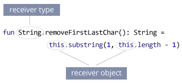

## Application Development II

## 420-5A6-AB
Instructor: Talib Hussain

Day 4: Kotlin

---

Image from: https://img.freepik.com/premium-photo/phone-mobile-application-development-concept-mobile-internet-3d-illustration_76964-5164.jpg?size=626&ext=jpg

## Objectives

* Finish Data Classes and Null Safety Exercise
* Constructors and init blocks
* Companion Objects
* Extension functions

## Try It! (Data Classes and Null Safety)

* [https://developer.android.com/codelabs/basic-android-kotlin-compose-nullability#0](https://developer.android.com/codelabs/basic-android-kotlin-compose-nullability#0)
* [https://developer.android.com/codelabs/basic-android-kotlin-compose-generics#3](https://developer.android.com/codelabs/basic-android-kotlin-compose-generics#3)
  * #3 AND #4

## Constructors and init blocks

* Read the following link to learn about primary constructors, secondary constructors and init blocks
  * [https://www.digitalocean.com/community/tutorials/kotlin-class-constructor](https://www.digitalocean.com/community/tutorials/kotlin-class-constructor)
* Try out the following:
  * Create an abstract class that contains an init block
  * Create a subclass that contains a secondary constructor and an init block
  * Place a println statement in each init block and in the secondary constructor
  * Run the program.  What order do the print statements happen in?
  * Play around with variations on this until you understand it well.
* Think about the following:
  * How are secondary constructors different from constructor overloading in Java?

## Companion Objects

* Recall: There is no "static" keyword in Kotlin
* If we want to achieve something similar, we need to use a "companion object"
  * A companion object is a singleton object whose properties and functions are tied to a class but  _not_  to the instance of that class
  * A companion object can be given an explicit name or no name
  * Only a single companion object can be defined per class
  * A companion object can define multiple properties and multiple functions.
* A companion object is defined with the keywords "companion object"
  * e.g., This defines an unnamed companion object that provides a property LATTE
    * class Cafe {
    * companion object {
    * const val LATTE = "latte"
    * }
  * This property would be accessed using the class name or the default name "Companion"
    * Cafe.Companion.LATTE
    * Cafe.LATTE
  * It cannot be accessed via an instance
    * var mycaf = Cafe()
    * mycaf.LATTE -> compile error

* A named companion object is defined using the same keywords followed by the name
  * class Cafe {
  * companion object Beverage {
  * const val LATTE = "latte"
  * }
  * }
  * It can no longer be accessed using the default name "Companion", but by its defined name instead
    * OK:
      * Cafe.Beverage.LATTE
      * Cafe.LATTE
    * But: Cafe.Companion.LATTE -> Compile Error
* A function is defined in the same block and accessed similarly
  * class Cafe {
  * companion object Beverage {
  * const val LATTE = "latte"
  * fun temp() { println("hot") }
  * }
  * }
  * Accessed using:
    * Cafe.temp()
    * Cafe.Beverage.temp()
* [https://medium.com/swlh/kotlin-basics-of-companion-objects-a8422c96779b](https://medium.com/swlh/kotlin-basics-of-companion-objects-a8422c96779b)
* [https://kotlinlang.org/docs/object-declarations.html#companion-objects](https://kotlinlang.org/docs/object-declarations.html#companion-objects)

## Extension Functions

* In most OOP languages, if you want to add a new functional capability to an existing class, you need to either modify it directly, extend it in a new class via inheritance or somehow wrap it in another new class (e.g., using composition).
* In Koltin, you can also use  __extension function __ to extend a class with new functionalities.
* Basically, an extension function is a member function of a class that is defined  __outside the class__ .
  * i.e., without actually changing the original class or inheriting from it, we can just add a function
* For example, you need to use a method to the String class that returns a new string with first and last character removed; this method is not already available in String class. You can use extension function to accomplish this task.
  * fun String.removeFirstLastChar(): String =  this.substring(1, this.length - 1)
  * fun main(args: Array<String>) {
  * val myString= "Hello Everyone"
  * val result = myString.removeFirstLastChar()
  * println("First character is: $result")
  * }
* The new function you defined can be accessed by dereferencingan object of the appropriate type (called the "receiver" type).
  * Here, the receiver type is String
  * In the function, you can refer to the "receiver object" using  _this_ .
* [https://kotlinlang.org/docs/extensions.html#extension-functions](https://kotlinlang.org/docs/extensions.html#extension-functions)
* [https://medium.com/mindorks/extension-function-in-kotlin-d52d1525550](https://medium.com/mindorks/extension-function-in-kotlin-d52d1525550)

## Try It! (Companion Objects and Extensions)

* [https://developer.android.com/codelabs/basic-android-kotlin-compose-generics#3](https://developer.android.com/codelabs/basic-android-kotlin-compose-generics#3)
  * #5, 6, and 7
* If finished early, work on Assignment #1

## Group Formation

* Group 1:
  * Will C., Griffin, Lauren
* Group 2:
  * Jordan, Makena
* Group 3:
  * Nitpreet, Aidan, Jose
* Group 4:
  * Jean-Rose, Anjeli, Cindy
* Group 5:
  * Seth, Phil, Robert
* Group 6:
  * Ryan, Will D., Brandon
* Group 7:
  * Zakari, Kui Hua

## Assignment #1: Kotlin Program

* Worth 7% of final grade. Due Sep 7, midnight
  * Estimated Level of Effort: 4.5 hours – 1.5 hours class time and 3 hours homework.
* For this assignment, you will create a sorting program based on a binary search tree using the Kotlin language with OOP, data classes and lambdas.
* This is an Individual assignment
* The goal of this assignment is to demonstrate understanding of the Kotlin language
  * It is assumed you know how to create a Binary Search Tree (BST), insert into a BST, and traverse a BST in sorted order
  * The following link has some sample code as a reference: [https://www.baeldung.com/kotlin/binary-tree](https://www.baeldung.com/kotlin/binary-tree)
* Requirements
  * Use a data class to store at least three pieces of information about a Person (one String, one Int, and one nullable type)
  * Create a Node object that will be stored in the tree.  A Node will contain a Person, a left Node and a right Node.
  * Create a BinarySearchTree class that stores the tree
    * In its constructor, it should accept a lambda function that will be used to determine the sort order
    * Create an insert() function that will insert a Person into the tree (using the sorting function to keep the BST sorted in sorted order)
    * Create a toList() function that returns a list of all the Persons in the BST, in sorted order.
  * Repeat 3 times: Build a BST containing at least 10 Persons (using canned data, random data, user-entered data, etc.) and display the contents of the BST in sorted order.
    * All information about each Person should be displayed, in order.  If the nullable field is null, then display the word "Unknown".
    * You may display the information in the console (e.g., using println) or on the emulator screen using Compose.
    * You may leverage the code provided by the teacher for displaying a list in Compose.
  * BST 1: Lambda should sort in alphabetical order on the String field
  * BST 2: Lambda should sort in increasing order on the Int field
  * BST 3: Lambda should sort in size-of-String order on the String field
* Marking Scheme:
  * 80% Functionality – Meets requirements and works.
  * 20% Documentation – All classes and functions should have reasonable documentation describing their purpose and any assumptions
* Submission:
  * Submit zip file of entire project on Lea.  Do not submit the build folder.
* Late Penalty:
  * Late submissions lose 10% per day to a maximum of 3 days.
  * Nothing accepted after 3 days and a grade of zero will be given.
* Original work!
  * "Your submitted work must be clear, complete, and YOUR OWN.  You must be prepared to explain any of your work to me in person.  Failure to be able to defend your work, or do a similar question in front of me in person can/will void any grade you get on this assignment."

