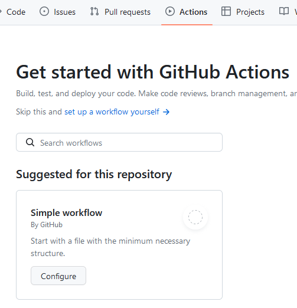
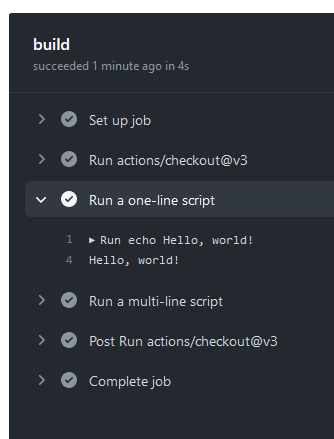
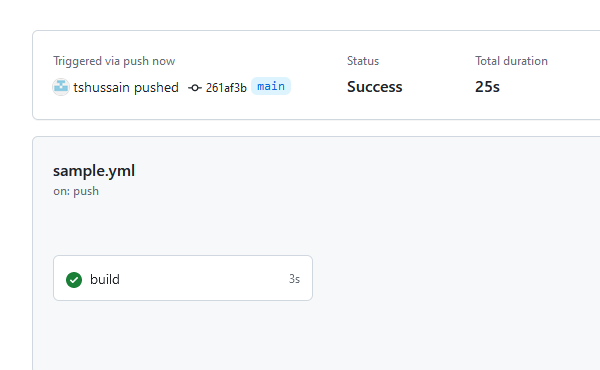
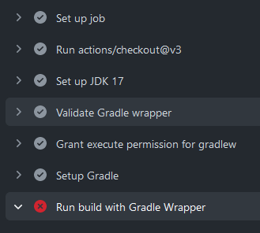
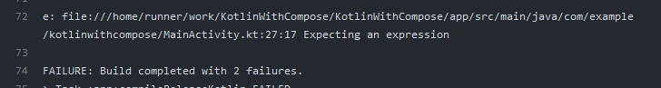
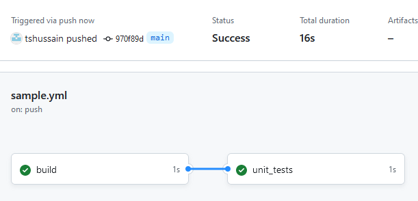
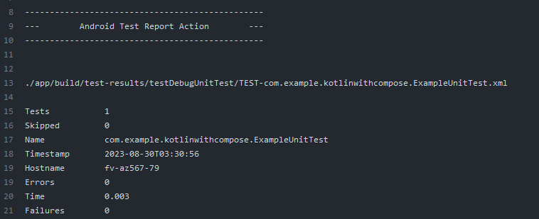
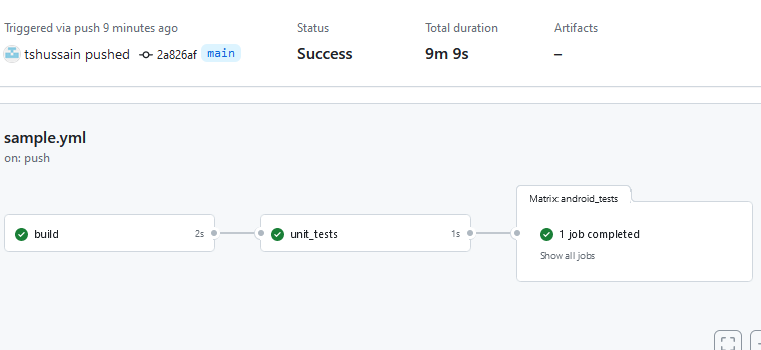
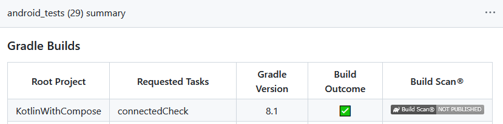
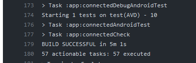

## Application Development II

## 420-5A6-AB
Instructor: Talib Hussain

Day 5: Kotlin, CI/CD

---

Image from: https://img.freepik.com/premium-photo/phone-mobile-application-development-concept-mobile-internet-3d-illustration_76964-5164.jpg?size=626&ext=jpg

## Objectives

* Finish Exercise on Companion Objects and Extension Functions
* Lambdas and Higher-Order Functions
* CI/CD with GitHub Actions
* (1 hour) Work on Assignment 1
* Handout Milestone 1

## Try It! (Companion Objects and Extensions)

* [https://developer.android.com/codelabs/basic-android-kotlin-compose-generics#3](https://developer.android.com/codelabs/basic-android-kotlin-compose-generics#3)
  * #5, 6, and 7
* If finished early, work on Assignment #1

## Using Lambdas…

* In assignment #1, you are asked to provide a lambda to the constructor of a class, and use that lambda within the insert function to determine order for insertion.
* Visit the following link to get a rough idea of what such a lambda might look like
  * [https://alvinalexander.com/source-code-kotlin-sortedWith-syntax-lambda-examples/](https://alvinalexander.com/source-code-kotlin-sortedWith-syntax-lambda-examples/)
* In that link, we are passing a lambda to a built-in function on lists called sortedWith.
  * In the assignment you will not be using sortedWith(), but will be implementing an insert function that may behave internally in an analogous way
* The lambda will not be passed in as a parameter to the insert function, but instead will be stored as a field in the class and access by the insert function
* Your lambda does not need to be a Comparator, and can just accept a general lambda
* Your lambda does need to behave similarly to a comparator.
* You can use a when statement in a very analogous way.
* Your lambda should operate on Person objects
* The link shows different types of lambdas analogous to the 3 expected of you in the assignment.

## Higher-Order Functions

* A higher-order function is a function that takes functions as parameters, or returns a function.
  * [https://kotlinlang.org/docs/lambdas.html#function-literals-with-receiver](https://kotlinlang.org/docs/lambdas.html#function-literals-with-receiver)
* Common higher-order functions that can be used on collections include
  * .forEach(), .map(), .filter(), .groupBy(), .fold(), .sortedBy()
* You can also define your own higher-order functions that accept functions or lambdas as parameter.
* When defining a function as a parameter, you need to specify the input and output types of that parameter.
  * i.e., As with normal parameters, the "type" of a function-parameter must be specified.
  * This means that the function-parameter's "signature" appears after the parameter name using the syntax  : (param type list) -> return type
  * The function represented by the function parameter can then be invoked simply by calling it by the parameter's name (and passing it the appropriate parameters)
  * fun higherFunc( funcParam: (Int, Int) -> Int) {      // accepting a two-argument function as parameter
  * var result = funcParam(2,4)    // invokes the function funcParam by passing parameters 2 and 4 to it
  * println("The sum of two numbers is: $result")
  * }
  * fun higherFunc( funcParam: () -> Unit ) {     // accepting a no-argument function as parameter
  * funcParam()                               //invokes the function funcParam
  * }
* Note that the actual value passed when invoking the function-parameter is determined by the higher-order function.
* For more details on passing lambdas as parameters, see this link
  * [https://www.geeksforgeeks.org/kotlin-higher-order-functions/](https://www.geeksforgeeks.org/kotlin-higher-order-functions/)

## Calling a Higher-Order Function

* When calling a higher-order function, we can pass an existing named function as a parameter using the :: notation
  * higherFunc(::existingFunction)
  * where, for example,
    * fun existingFunction(a:Int) : Int {
    * return a+1
    * }
    * fun higherFunc( funcParam: (Int) -> Int) {      // accepting one-argument function as parameter
    * var result = funcParam(2)    // invokes the function funcParam by passing parameter 2 to it
    * println("The sum of two numbers is: $result")
    * }
* Since a lambda expression is just an anonymous function, it can also be passed as a parameter.
  * var lambda = {a: Int  -> a + 2 }
  * higherFunc(lambda)
* We can also pass the lambda "in-line"
  * higherFunc(funcParam = {a: Int  -> a + 3 })
  * higherFunc({a: Int  -> a + 4 })

## Try It! Higher-order functions

* Do the following codelab to get more experience using lambdas and higher-order functions in Kotlin
  * [https://developer.android.com/codelabs/basic-android-kotlin-compose-higher-order-functions#0](https://developer.android.com/codelabs/basic-android-kotlin-compose-higher-order-functions#0)

## Continuous Integration/Continuous Delivery(CI/CD) using GitHub

* Use GitHub Actions to define workflows
  * A workflow is a configurable automated process that will run one or more jobs
  * Workflows may run sequentially or in parallel
  * Workflows are generally triggered by events, such as a pull request being created, or a new tag being pushed
  * Workflows may also be triggered manually at any time.
* GitHub Actions uses YAML script files for each workflow
  * The YAML file specifies a set of jobs to run when certain triggers occur
  * E.g., build the project every time something is pushed to main.
    * This is useful to make sure that no one "breaks the build" (i.e., commits something that doesn't compile).
* [https://docs.github.com/en/actions/automating-builds-and-tests/building-and-testing-java-with-gradle](https://docs.github.com/en/actions/automating-builds-and-tests/building-and-testing-java-with-gradle)
  * Indentation matters…
* Other links:
  * [https://docs.gradle.org/current/userguide/github-actions.html](https://docs.gradle.org/current/userguide/github-actions.html)
  * [https://blog.logrocket.com/android-ci-cd-using-github-actions/](https://blog.logrocket.com/android-ci-cd-using-github-actions/)

## 

## Now, let's make it actually build…!

* [https://docs.gradle.org/current/userguide/github-actions.html#sec:configure_github_actions](https://docs.gradle.org/current/userguide/github-actions.html#sec:configure_github_actions)
* [https://github.com/gradle/gradle-build-action](https://github.com/gradle/gradle-build-action)
* [https://github.com/gradle/wrapper-validation-action](https://github.com/gradle/wrapper-validation-action)
* Replace the "steps" section of your yaml file with the following.
  * steps:
  * # Checks-out your repository under $GITHUB_WORKSPACE, so your job can access it
  * - uses: actions/checkout@v3
  * # We need version 17 or higher for our app
  * - name: Set up JDK 17
  * uses: actions/setup-java@v3
  * with:
  * java-version: 17
  * distribution: 'temurin'
  * cache: gradle
  * - name: Validate Gradle wrapper
  * uses: gradle/wrapper-validation-action@v1
  * - name: Grant execute permission for gradlew
  * run: chmod +x gradlew
  * - name: Setup Gradle
  * uses: gradle/gradle-build-action@v2
  * - name: Run build with Gradle Wrapper
  * run: ./gradlew build

## Build Error?

Now, make a simple syntax error in your MainActivity.kt so that it can't compile properly

Commit and push your changes (don't forget to commit the yaml file changes too).

Go to GitHub Actions and you should see a new workflow being kicked off

That build should fail.  Look carefully and it should give some indication of the error.

With extra "Echo" messages for more clarity.

## Steps represent a sequence of tasks that will be executed as part of the job

steps:

- run: echo "The job was automatically triggered by a ${{ github.event_name }} event."

- run: echo "This job is running on a ${{ runner.os }} server hosted by GitHub!"

## Checks-out your repository under $GITHUB_WORKSPACE, so your job can access it

- uses: actions/checkout@v3

- run: echo "The ${{ github.repository }} repository has been cloned."

- run: echo "Setting up JDK"

## We need version 17 or higher for our app

- name: Set up JDK 17

uses: actions/setup-java@v3

with:

java-version: 17

distribution: 'temurin'

cache: gradle

- run: echo "The workflow is now ready to test your code."

- name: Validate Gradle wrapper

uses: gradle/wrapper-validation-action@v1

- name: Grant execute permission for gradlew

run: chmod +x gradlew

- run: echo "Building Debug APK."

- name: Setup Gradle

uses: gradle/gradle-build-action@v2

- name: Run build with Gradle Wrapper

run: ./gradlew build

- run: echo "Build status report=${{ job.status }}."

## Run Unit Tests

* A key reason to use CI/CD is to make sure that your pushed code is always in a good state.
* Passing all the unit tests is an important part of this.
  * We have one unit test in our project (created as part of the project template)
    * app/src/test/…ExampleUnitTest.java
* Let's define a 2nd job in our workflow that will run our unit tests
  * [https://docs.github.com/en/actions/using-jobs/using-jobs-in-a-workflow](https://docs.github.com/en/actions/using-jobs/using-jobs-in-a-workflow)
  * [https://github.com/marketplace/actions/android-test-report-action](https://github.com/marketplace/actions/android-test-report-action)

Add the following at the end of the yaml file.  The indentation of test: should match the indentation of build: earlier in the file.

## The second job called "unit_tests"

## It should run only after the build job succeeds

unit_tests:

needs: build

runs-on: ubuntu-latest

steps:

- uses: actions/checkout@v3

- name: Set up JDK 17

uses: actions/setup-java@v3

with:

java-version: 17

distribution: 'temurin'

cache: gradle

- name: Grant execute permission for gradlew

run: chmod +x gradlew

## Execute unit tests

- name: Unit Test

run: ./gradlew testDebugUnitTest

- name: Android Test Report

uses: asadmansr/android-test-report-action@v1.2.0

if: ${{ always() }} # IMPORTANT: run Android Test Report regardless

## 

Commit and push the changes to the yaml file.  This should kick off a workflow comprised of two jobs

When the text job is complete, look at the details in the Android Test Report.  It should show that 1 test was run and that none failed.

## Instrumentation TestLet's make sure it can run on Android

* We are making a mobile app.  It is important to know that the program will load properly on an Android device.
* GitHub actions allows us to check that using an emulator.
  * [https://github.com/ReactiveCircus/android-emulator-runner](https://github.com/ReactiveCircus/android-emulator-runner)
  * The emulator can use hardware acceleration only on the macOS emulator. Therefore, this job needs to run on a macOS runner while others can run on Ubuntu runners.

Add the following at the end of the yaml file

## The third job called "android_tests"

android_tests:

needs: unit_tests

runs-on: macos-latest

steps:

- run: echo "Starting Instrumentation Tests"

- name: Checkout

uses: actions/checkout@v3

## Need JDK 17 and gradle 8.1 for the code to build properly in the emulator (8.1.0 leads to error here)

- name: Set up JDK 17

uses: actions/setup-java@v3

with:

java-version: 17

distribution: 'temurin'

cache: gradle

- name: Gradle cache

uses: gradle/gradle-build-action@v2

with:

gradle-version: 8.1

- name: Grant execute permission for gradlew

run: chmod +x gradlew

- name: Use 8.1 wrapper

run: ./gradlew wrapper --gradle-version=8.1

- name: Instrumentation Tests

uses: reactivecircus/android-emulator-runner@v2

with:

api-level: 29

script: ./gradlew connectedCheck

## 

May take many minutes to startup the emulator (e.g., 10+ minutes).

 Work on Assignment 1 or Milestone 1 while waiting.

## Note:

* It takes a long time to start up the emulator, so may be worth experimenting with the caching described in:
  * [https://github.com/ReactiveCircus/android-emulator-runner](https://github.com/ReactiveCircus/android-emulator-runner)
* android_tests:
* needs: unit_tests
* runs-on: macos-latest
* strategy:
* matrix:
* api-level: [ 29 ]
* steps:
* - name: checkout
* uses: actions/checkout@v3
* # Need JDK 17 and gradle 8.1 for the code to build properly in the emulator.
* # (8.1.0 leads to error here)
* - name: Set up JDK 17
* uses: actions/setup-java@v3
* with:
* java-version: 17
* distribution: 'temurin'
* cache: gradle
* - name: Gradle cache
* uses: gradle/gradle-build-action@v2
* with:
* gradle-version: 8.1
* - name: Grant execute permission for gradlew
* run: chmod +x gradlew
* - name: Use 8.1 wrapper
* run: ./gradlew wrapper --gradle-version=8.1
* - name: AVD cache
* uses: actions/cache@v3
* id: avd-cache
* with:
* path: |
* ~/.android/avd/*
* ~/.android/adb*
* key: avd-${{ matrix.api-level }}
* - name: create AVD and generate snapshot for caching
* if: steps.avd-cache.outputs.cache-hit != 'true'
* uses: reactivecircus/android-emulator-runner@v2
* with:
* api-level: ${{ matrix.api-level }}
* force-avd-creation: false
* emulator-options: -no-window -gpu swiftshader_indirect -noaudio -no-boot-anim -camera-back none
* disable-animations: false
* script: echo "Generated AVD snapshot for caching."
* - name: run tests
* uses: reactivecircus/android-emulator-runner@v2
* with:
* api-level: ${{ matrix.api-level }}
* force-avd-creation: false
* emulator-options: -no-snapshot-save -no-window -gpu swiftshader_indirect -noaudio -no-boot-anim -camera-back none
* disable-animations: true
* script: ./gradlew connectedCheck

## Sneak Peak: Deployment for User Testing

* Later in the course, we will investigate using GitHub Actions to actually deploy our app so that test users can try it out.
* This requires using Firebase
  * Storing secrets: [https://proandroiddev.com/create-android-release-using-github-actions-c052006f6b0b](https://proandroiddev.com/create-android-release-using-github-actions-c052006f6b0b)
  * Firebase-GitHub integration: [https://firebase.google.com/docs/hosting/github-integration](https://firebase.google.com/docs/hosting/github-integration)
  * Running the published app as a tester: [https://quickresource.quickseries.com/knowledge-base/installing-your-test-app-on-android-firebase/](https://quickresource.quickseries.com/knowledge-base/installing-your-test-app-on-android-firebase/)
* Not for this class, but you can also deploy to the Google Play store (but that is a more complicated process and your app needs to go through approvals at Google first).
  * [https://dev.to/jforatier/build-test-and-deploy-your-android-application-with-github-actions-hh1](https://dev.to/jforatier/build-test-and-deploy-your-android-application-with-github-actions-hh1)
* Other misc links:
  * [https://www.kodeco.com/19407406-continuous-delivery-for-android-using-github-actions](https://www.kodeco.com/19407406-continuous-delivery-for-android-using-github-actions)
  * [https://dustn.dev/post/2022-02-21-build-a-cicd-pipeline-using-github-actions/](https://dustn.dev/post/2022-02-21-build-a-cicd-pipeline-using-github-actions/)

## Assignment #1: Kotlin Program

* Worth 7% of final grade. Due Sep 7, midnight
  * Estimated Level of Effort: 4.5 hours – 1.5 hours class time and 3 hours homework.
* For this assignment, you will create a sorting program based on a binary search tree using the Kotlin language with OOP, data classes and lambdas.
* This is an Individual assignment
* The goal of this assignment is to demonstrate understanding of the Kotlin language
  * It is assumed you know how to create a Binary Search Tree (BST), insert into a BST, and traverse a BST in sorted order
  * The following link has some sample code as a reference: [https://www.baeldung.com/kotlin/binary-tree](https://www.baeldung.com/kotlin/binary-tree)
* Requirements
  * Use a data class to store at least three pieces of information about a Person (one String, one Int, and one nullable type)
  * Create a Node object that will be stored in the tree.  A Node will contain a Person, a left Node and a right Node.
  * Create a BinarySearchTree class that stores the tree
    * In its constructor, it should accept a lambda function that will be used to determine the sort order
    * Create an insert() function that will insert a Person into the tree (using the sorting function to keep the BST sorted in sorted order)
    * Create a toList() function that returns a list of all the Persons in the BST, in sorted order.
  * Repeat 3 times: Build a BST containing at least 10 Persons (using canned data, random data, user-entered data, etc.) and display the contents of the BST in sorted order.
    * All information about each Person should be displayed, in order.  If the nullable field is null, then display the word "Unknown".
    * You may display the information in the console (e.g., using println) or on the emulator screen using Compose.
    * You may leverage the code provided by the teacher for displaying a list in Compose.
  * BST 1: Lambda should sort in alphabetical order on the String field
  * BST 2: Lambda should sort in increasing order on the Int field
  * BST 3: Lambda should sort in size-of-String order on the String field
* Marking Scheme:
  * 80% Functionality – Meets requirements and works.
  * 20% Documentation – All classes and functions should have reasonable documentation describing their purpose and any assumptions
* Submission:
  * Submit zip file of entire project on Lea.  Do not submit the build folder.
* Late Penalty:
  * Late submissions lose 10% per day to a maximum of 3 days.
  * Nothing accepted after 3 days and a grade of zero will be given.
* Original work!
  * "Your submitted work must be clear, complete, and YOUR OWN.  You must be prepared to explain any of your work to me in person.  Failure to be able to defend your work, or do a similar question in front of me in person can/will void any grade you get on this assignment."

## Milestone 1: Analyzing an Existing App

* Worth 5% of final grade. Due Sep 13, 2:00pm (before any class presentations start)
  * Estimated Level of Effort: 3 hours – 1 hour class time and 2 hours homework (x3 people).
* For this milestone, you will get a better picture of what is possible using Kotlin and Jetpack Compose by inspecting sample applications from GitHub.  You will also learn more about project configuration, and get used to working with your teammates.
* This is a Group assignment
* The goal of this assignment is to demonstrate the ability to analyze existing code and to understand the basic structure and design of a Kotlin-Compose app
* Requirements:
  * Each team member should fork an existing Android application from the following link.
    * [https://github.com/android/compose-samples/](https://github.com/android/compose-samples/)
    * Each group must choose a different app.  Claim it on Teams Chat.
  * Each team member should build and run it locally
  * As a team, inspect the project file structure, the source code and the configuration files (yaml and gradle), as well as analyze the running product itself.
  * Give a presentation in class (with a slide deck) discussing your joint findings as follows:
    * A brief primer on the app itself (i.e., what is it, what can you do with it, etc.)
    * How is their Kotlin code structured and what you learned from this program about Kotlin
    * How is their Compose UI structured and what you learned from this program about Compose
    * What configuration approach the code uses and what you learned from it.
  * Each slide should indicate who created it and who presented it.
  * All team members must participate in the presentation
  * You have at most 10 minutes to present.
* Marking Scheme:
  * 25% Timeliness and professional conduct in presentation
  * 55% Quality of presentation content
  * 20% Individual contributions (Will be based on self-reports and teacher assessment)
* Submission:
  * Submit presentation file on Lea.
* Late Penalty:
  * __No lates allowed__ .  Presentation slides must be handed in on Lea by 2:00pm on September 13.
* Original work!
  * "Your submitted work must be clear, complete, and YOUR OWN.  You must be prepared to explain any of your work to me in person.  Failure to be able to defend your work, or do a similar question in front of me in person can/will void any grade you get on this assignment."

## App Choice

* Group 1: JetChat
  * Will C., Griffin, Lauren
* Group 2: Rally
  * Jordan, Makena
* Group 3: JetSnack
  * Nitpreet, Aidan, Jose
* Group 4: JetSurvey
  * Jean-Rose, Anjeli, Cindy
* Group 5: Reply
  * Seth, Phil, Robert
* Group 6: Owl
  * Ryan, Will D., Brandon
* Group 7: Crane
  * Zakari, Kui Hua

