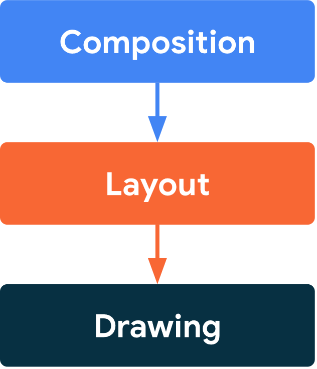
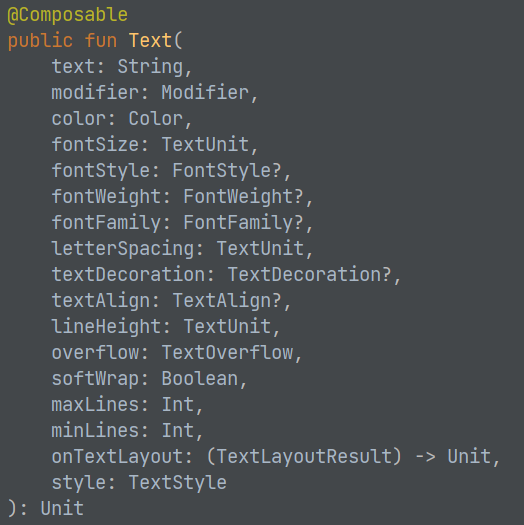

## Application Development II

## 420-5A6-AB
Instructor: Talib Hussain

Day 6: Compose

---

Image from: https://img.freepik.com/premium-photo/phone-mobile-application-development-concept-mobile-internet-3d-illustration_76964-5164.jpg?size=626&ext=jpg

## Objectives

Compose Basics

Basic Layout

Material 3

Component State

## Compose

* Jetpack Compose is a toolkit for building native Android UI
  * [https://developer.android.com/jetpack/compose/documentation](https://developer.android.com/jetpack/compose/documentation)
  * [https://developer.android.com/jetpack/compose/tutorial](https://developer.android.com/jetpack/compose/tutorial)
* The Compose approach is based on defining the UI by describing how it should look and providing data dependencies
  * i.e., rather than (imperatively) focusing on the process of the UI's construction
* This is a Declarative UI approach, just like React
  * For those of you who did not learn React, or need a refresher on the basics of Declarative UI, this link gives useful information
  * [https://developer.android.com/jetpack/compose/mental-model](https://developer.android.com/jetpack/compose/mental-model)

## Composable Functions

* Compose is built around composable functions
* This is a declarative style of programming
* To make a function composable, just add the @Composable annotation to it.
  * @Composable
  * fun Greeting(name: String) {
  * Text("Hello $name.")
  * }
  * Note: The default app provided by Android studio has a composable almost exactly like this (let's ignore the "Modifier" for now).

## Key Properties of Composables

* Composables in Kotlin have properties similar to those of components in React
* Composables are immutable
  * You can't directly update its contents.
  * You need to pass any and all information as parameters (or state)
* Composables are idempotent
  * It must have the same way when called multiple times with the same arguments (and state)
  * i.e., free of side-effects
* When parameters/state changes, the UI for that composable is regenerated
  * This process is called  __recomposition__
* As in React, every time the state of the UI changes, Compose recreates the parts of the UI tree that have changed.

## Lifecycle of Composables

[https://developer.android.com/jetpack/compose/lifecycle](https://developer.android.com/jetpack/compose/lifecycle)

## Phases

* Compose has 3 main phases
  * Composition: What UI to show. Compose runs composable functions and creates a description of your UI.
  * Layout: Where to place UI. This phase consists of two steps: measurement and placement. Layout elements measure and place themselves and any child elements in 2D coordinates, for each node in the layout tree.
  * Drawing: How it renders. UI elements draw into a Canvas, usually a device screen.
* Unidirectional Data Flow: Order of these phases is generally the same, allowing data to flow in one direction from composition to layout to drawing.

## Layouts

* [https://developer.android.com/jetpack/compose/layouts/basics](https://developer.android.com/jetpack/compose/layouts/basics)
* A composable may contain several UI elements (i.e., other composables)
* You must provide guidance on how they should be arranged
* Add the following line to your Greeting function so that it now includes two Text components
  * Text("Welcome to My App")
* Run it – What happens?

## Layout Components: Column, Row

* Two basic layout components that help you arrange elements on the screen are Column and Row.
  * These use curly braces to wrap UI elements.  Those element will then be displayed appropriately on the screen (vertically for Column, horizontally for Row)
    * Column {
    * List of UI elements
    * }
* In the Greeting composable, wrap the two Text components in a Column component and run it.  What happens?
* Then try using a Row component instead.

## Nesting

* Composables can nest many levels deep, as needed.
* Change the Greeting so that it is a grid containing two rows, one below the other, each with 2 Texts containing different information
* Play around with various ways to use Column and Row to layout information on the screen
* Try using the composable Spacer as appropriate
  * Spacer(modifier=Modifier.height(20.dp))

## Modifiers & Style parameters

* To decorate or configure a composable, you can use:
  * Modifiers - Analogous to using an inline "style=" in React
  * Specific parameters for that component – especially the Text component
* Modifiers allow you to change the composable's size, layout, appearance or add high-level interactions, such as making an element clickable or scrollable.
* You can chain them to create richer composables.
* A modifier is specified using the modifier property on a layout component:
  * Column(
  * modifier = Modifier
  * .padding(24.dp)
  * .fillMaxSize(),
  * verticalArrangement = Arrangement.Center,
  * horizontalAlignment = Alignment.CenterHorizontally
  * ) {
  * Text("Hello $name",
  * modifier=Modifier.border(BorderStroke(3.dp, Color.Red)))
  * Spacer(modifier=Modifier.height(20.dp))
  * Text(text="Welcome to My App",
  * color=Color.Blue,
  * fontStyle= FontStyle.Italic,
  * fontSize=24.sp,
  * fontFamily= FontFamily.Monospace,
  * textAlign= TextAlign.Center)
  * }

Notes:

sp = scale-independent pixels (Takes user preference into account)

dp = device-independent pixels

[https://singhajit.com/tutorial-1-android-ui-desgin-and-styling/](https://singhajit.com/tutorial-1-android-ui-desgin-and-styling/)

When importing a needed class, make sure to import the one from compose (e.g., androidx.compose)

[https://developer.android.com/jetpack/compose/modifiers](https://developer.android.com/jetpack/compose/modifiers)

[https://developer.android.com/jetpack/compose/text](https://developer.android.com/jetpack/compose/text)

[https://www.tutorialkart.com/android-jetpack-compose/text-create/](https://www.tutorialkart.com/android-jetpack-compose/text-create/)

[https://semicolonspace.com/jetpack-compose-alignment-arrangement/](https://semicolonspace.com/jetpack-compose-alignment-arrangement/)

## 

Mouse over the composable namein the IDE to see a pop-up givingdetails on the parameters for thatcomposable

Or, CTRL-click on the name of the component to load the associated .kt file,which usually will provide the documentation and/or show you details on each possible parameter/function for that class

## Try It!

* Using the links provided so far, explore styling and laying out Text components, Columns and Rows in various ways using modifiers
  * In the modifier, remove .fillMaxSize() – What happens?
  * Try using .fillMaxWidth() – What happens?
  * Lots of information available starting with this link:  [https://developer.android.com/jetpack/compose/documentation](https://developer.android.com/jetpack/compose/documentation)
* Complete this codelab:
  * [https://developer.android.com/codelabs/basic-android-kotlin-compose-composables-practice-problems](https://developer.android.com/codelabs/basic-android-kotlin-compose-composables-practice-problems)

