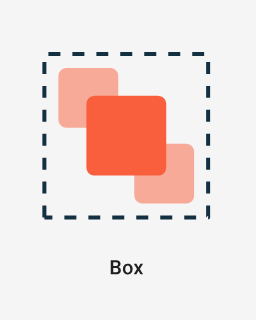

## Application Development II

## 420-5A6-AB
Instructor: Talib Hussain

Day 7: 
Images and 
Material Design

---

Image from: https://img.freepik.com/premium-photo/phone-mobile-application-development-concept-mobile-internet-3d-illustration_76964-5164.jpg?size=626&ext=jpg

## Objectives

* Review course schedule
* Side-discussion on Risk Management
* Kahoot quiz signup
* Working with Images
* Using Material
  * Custom Theme
  * Material Components
* Work on Assignment #1 / Milestone #1

## Course Schedule

Sep 7 (Tomorrow!) – Assignment #1 due at midnight

Sep 11 – Quiz Kahoot #1 on Kotlin

Sep 13 (next 3 hr lab) – Milestone #1 due before class.  Presentations in class.

Sep 21 – Assignment #2 due midnight

Sep 25 – Quiz Kahoot #2 on Compose [Week 6]

Oct 5 – Assignment #3 due midnight

Oct 11 [Monday Schedule] – Quiz #3 on State/Event Handling

Oct 16 – Quiz Kahoot #4 on Navigation/Routing

Oct 18 – Milestone #2 due (Project design and Initial setup).  Presentations in class.

Oct 26 – Quiz Kahoot #5 on Coroutines/Flow/Storage [Week 10]

Nov 1: Sprint 1 ends; In-class review with Teacher

Nov 6 – Quiz Kahoot #6 on Authentication/TBD

(Tues Nov 14 is Monday schedule)

Nov 15: Sprint 2 ends; Milestone #3 due (Project design update, Preliminary code/demo)

Nov 29: Sprint 3 ends; In-class review with Teacher

Dec 6 [Last class]: Final project due and presentations.

## Kahoot Quiz Instructions + Sign-Up

* Each group will prepare one quiz (The two groups of 2 will collaborate on 1 quiz)
* Each quiz must have at least 9 questions (12 for two-group case)
  * This is a Group activity and each team member is responsible for creating 3 questions.  This includes the text and the image choice.
* Total quiz length target is 5 to 10 minutes (12 min for group of 4).   Questions should offer at least 30 seconds to respond even if they are simple, and no more than 2 minutes even if they require some thought.
  * Exception: You may include 1 "Challenge" question that requires using the IDE or searching on the Internet.  This can take up to 5 minutes and must be the last question.
  * Note: For simple questions, 30 seconds may seem long, but we want to be fair to any students who need a bit more time.
* The group that prepares the quiz must send me the quiz.  Use the "share" feature in Kahoot and share it with user  __talibhussain129__ .
  * Note: must be 129, not another user with my name…
  * We will run the kahoot from my account.
* In MIO or Teams, you must also send me a summary indicating who was responsible for each question (i.e., who came up with the question)
  * It is ok if 1 person takes the main responsibility for entering the questions in Kahoot, but the person who created each question is credited.
  * Alternatively, you can put the name of the person who created the question at the end of the question itself… but then everyone will know!!
* Sep 11 – Quiz Kahoot #1 on Kotlin
  * __Group = Lauren, Will C., Griffin__
* Sep 25 – Quiz Kahoot #2 on Compose
  * __Group = __  __Makena, Jordyn, Kui Hua, Zakari__
* Oct 11 [Monday Schedule] – Quiz #3 on State/Event Handling
  * __Group = Cindy, Jean-Rose, __  __Anjeli__
* Oct 16 – Quiz Kahoot #4 on Navigation/Routing
  * __Group =  Jose, Aidan, __  __Nitpreet__
* Oct 26 – Quiz Kahoot #5 on Coroutines/Flow/Storage
  * __Group = Ryan, Brandon, Will D.__
* Nov 6 – Quiz Kahoot #6 on Authentication/TBD
  * __Group = Robert, Seth, Phil__

## Android Resources

* The basic way to make an image available to use in your app is to store it as a  __resource __ in your project
* Resources are additional files and static content that your code uses
  * [https://developer.android.com/guide/topics/resources/providing-resources](https://developer.android.com/guide/topics/resources/providing-resources)
* Resources are stored in the res folder
  * In a Kotlin project, this folder path is app/src/main/res.
  * If you are in "Android" view in the project explorer tab, then it shows up as app/res (which is not the actual path on disk).
* Images are stored in the res/drawable folder
* Android automatically generates a "Resource ID" for all resources.  These resource IDs are stored in the special R class.
  * To refer to a resource in your code, you use the syntax R.<resource-id>
  * A resource id typically looks like <path>.<filename-without-extension>
  * E.g., an image named myImage.jpg would be accessed by referring to R.drawable.myImage
* Note: Android is picky with resources. It expects specific types of files in specific resource folders.
  * You can't just add a new folder on the filesystem.
  * You can't put the wrong type of file in a resource folder.
  * These are usually compile-time errors.
  * Advanced: You can add a new resource folder by right-clicking on the res folder and choosing "New->Android Resource Directory".  But even then, you can't use any name you want.  You must use the wizard.

## Displaying Images in Compose

* To display an image in Android, you can use the Image composable.
* Image has two required parameters: painter and contentDescription
* A painter is the result of a call to the painterResource function.
* E.g. for res/drawable/penguins.jpg
  * val penguinImage = painterResource(R.drawable.penguins)
  * Image(
  * painter = penguinImage,
  * contentDescription = "A group of penguins standing on snow"
  * )
* Following good design principles, you should always provide a content description.
  * This is used for accessibility purposes, such as by TalkBalk
  * You can set it to null, but don't!!
    * Will be penalized on assignments/project
  * As with good documentation, the content description should be meaningful
    * Vacuous descriptions (e.g., "This is an image") will be penalized on assignments/project

## Try It!

* Do the following codelab to learn how to format and use images in a Compose app
  * [https://developer.android.com/codelabs/basic-android-kotlin-compose-add-images#0](https://developer.android.com/codelabs/basic-android-kotlin-compose-add-images#0)
* If finished, see next slide for last class's final Try It!.  You should have finished this at home, but if not, continue working on this
* If you're done both codelabs, experiment with adding multiple images and within a more complex layout.

## Try It! (From last class)

* Using the links provided so far, explore styling and laying out Text components, Columns and Rows in various ways using modifiers
  * In the modifier, remove .fillMaxSize() – What happens?
  * Try using .fillMaxWidth() – What happens?
  * Lots of information available starting with this link:  [https://developer.android.com/jetpack/compose/documentation](https://developer.android.com/jetpack/compose/documentation)
* 2. Complete this codelab:
  * [https://developer.android.com/codelabs/basic-android-kotlin-compose-composables-practice-problems](https://developer.android.com/codelabs/basic-android-kotlin-compose-composables-practice-problems)

## Material

* Material is a  __design system __ created by Google to help teams build high-quality digital experiences for Android, iOS, Flutter, and the web.
* It provides a number of components and layouts available as composable functions in Compose
  * Note: These components are also available in React and other languages.
* For those who did React last semester, this will feel very familiar…
* Read about it here:
  * [https://m3.material.io/get-started](https://m3.material.io/get-started)
  * [https://developer.android.com/jetpack/compose/layouts/material](https://developer.android.com/jetpack/compose/layouts/material)

## MaterialTheme

* A Material 3 theme contains the following subsystems: [color scheme](https://m3.material.io/styles/color/overview), [typography](https://m3.material.io/styles/typography/overview) and [shapes](https://m3.material.io/styles/shape/overview).
  * When you customize these values, your changes are automatically reflected in the Material 3 components you use to build your app.
* Generally, we use the MaterialTheme component at the highest level to provide a consistent theme throughout our app.
  * [https://developer.android.com/reference/kotlin/androidx/compose/material3/package-summary#materialtheme](https://developer.android.com/reference/kotlin/androidx/compose/material3/package-summary#materialtheme)
* We can just stick with the defaults by using it without parameters, e.g.:
  * @Composable
  * fun MyApp() {
  * MaterialTheme {
  * MyMainComposable()
  * }
  * }
* In the default project provided by Android Studio, we are actually using MaterialTheme
  * KotlinWithComposeTheme (defined in theme.kt) uses MaterialTheme

## Other Material UI Components

* There are many Material components we can use.
  * [https://developer.android.com/reference/kotlin/androidx/compose/material3/package-summary](https://developer.android.com/reference/kotlin/androidx/compose/material3/package-summary)
* Buttons – several types of button variants
  * Button, ElevatedButton, OutlinedButton, TextButton, FilledTonalButton.  Also many types of IconButtons.
  * [https://m3.material.io/components/all-buttons](https://m3.material.io/components/all-buttons)
  * [https://developer.android.com/reference/kotlin/androidx/compose/material3/package-summary#Button](https://developer.android.com/reference/kotlin/androidx/compose/material3/package-summary#Button)
* Cards – Several types of card variants
  * Card, ElevatedCard, OutlinedCard
  * [https://m3.material.io/components/cards/overview](https://m3.material.io/components/cards/overview)
  * [https://developer.android.com/reference/kotlin/androidx/compose/material3/package-summary#card](https://developer.android.com/reference/kotlin/androidx/compose/material3/package-summary#card)
  * Card(
  * onClick = { /* Do something */ },
  * modifier = Modifier.size(width = 180.dp, height = 100.dp)
  * ) {
  * Box(Modifier.fillMaxSize()) {
  * Image(…)
  * Text("Clickable", Modifier.align(Alignment.Center))
  * }
  * }
* Note: When using a Card, put @file:OptIn(ExperimentalMaterialApi::class) at the top (line 1) of your file
  * Otherwise it will complain about Card component when you build
  * Android Studio should offer this solution when the build fails.

## Work on Assignment #1 or Milestone #1

## Assignment #1: Kotlin Program

* Worth 7% of final grade. Due Sep 7, midnight
  * Estimated Level of Effort: 4.5 hours – 1.5 hours class time and 3 hours homework.
* For this assignment, you will create a sorting program based on a binary search tree using the Kotlin language with OOP, data classes and lambdas.
* This is an Individual assignment
* The goal of this assignment is to demonstrate understanding of the Kotlin language
  * It is assumed you know how to create a Binary Search Tree (BST), insert into a BST, and traverse a BST in sorted order
  * The following link has some sample code as a reference: [https://www.baeldung.com/kotlin/binary-tree](https://www.baeldung.com/kotlin/binary-tree)
* Requirements
  * Use a data class to store at least three pieces of information about a Person (one String, one Int, and one nullable type)
  * Create a Node object that will be stored in the tree.  A Node will contain a Person, a left Node and a right Node.
  * Create a BinarySearchTree class that stores the tree
    * In its constructor, it should accept a lambda function that will be used to determine the sort order
    * Create an insert() function that will insert a Person into the tree (using the sorting function to keep the BST sorted in sorted order)
    * Create a toList() function that returns a list of all the Persons in the BST, in sorted order.
  * Repeat 3 times: Build a BST containing at least 10 Persons (using canned data, random data, user-entered data, etc.) and display the contents of the BST in sorted order.
    * All information about each Person should be displayed, in order.  If the nullable field is null, then display the word "Unknown".
    * You may display the information in the console (e.g., using println) or on the emulator screen using Compose.
    * You may leverage the code provided by the teacher for displaying a list in Compose.
  * BST 1: Lambda should sort in alphabetical order on the String field
  * BST 2: Lambda should sort in increasing order on the Int field
  * BST 3: Lambda should sort in size-of-String order on the String field
* Marking Scheme:
  * 80% Functionality – Meets requirements and works.
  * 20% Documentation – All classes and functions should have reasonable documentation describing their purpose and any assumptions
* Submission:
  * Submit zip file of entire project on Lea.  Do not submit the build folder.
* Late Penalty:
  * Late submissions lose 10% per day to a maximum of 3 days.
  * Nothing accepted after 3 days and a grade of zero will be given.
* Original work!
  * "Your submitted work must be clear, complete, and YOUR OWN.  You must be prepared to explain any of your work to me in person.  Failure to be able to defend your work, or do a similar question in front of me in person can/will void any grade you get on this assignment."

## Milestone 1: Analyzing an Existing App

* Worth 5% of final grade. Due Sep 13, 2:00pm (before any class presentations start)
  * Estimated Level of Effort: 3 hours – 1 hour class time and 2 hours homework (x3 people).
* For this milestone, you will get a better picture of what is possible using Kotlin and Jetpack Compose by inspecting sample applications from GitHub.  You will also learn more about project configuration, and get used to working with your teammates.
* This is a Group assignment
* The goal of this assignment is to demonstrate the ability to analyze existing code and to understand the basic structure and design of a Kotlin-Compose app
* Requirements:
  * Each team member should fork an existing Android application from the following link.
    * [https://github.com/android/compose-samples/](https://github.com/android/compose-samples/)
    * Each group must choose a different app.  Claim it on Teams Chat.
  * Each team member should build and run it locally
  * As a team, inspect the project file structure, the source code and the configuration files (yaml and gradle), as well as analyze the running product itself.
  * Give a presentation in class (with a slide deck) discussing your joint findings as follows:
    * A brief primer on the app itself (i.e., what is it, what can you do with it, etc.)
    * How is their Kotlin code structured and what you learned from this program about Kotlin
    * How is their Compose UI structured and what you learned from this program about Compose
    * What configuration approach the code uses and what you learned from it.
  * Each slide should indicate who created it and who presented it.
  * All team members must participate in the presentation
  * You have at most 10 minutes to present.
* Marking Scheme:
  * 25% Timeliness and professional conduct in presentation
  * 55% Quality of presentation content
  * 20% Individual contributions (Will be based on self-reports and teacher assessment)
* Submission:
  * Submit presentation file on Lea.
* Late Penalty:
  * __No lates allowed__ .  Presentation slides must be handed in on Lea by 2:00pm on September 13.
* Original work!
  * "Your submitted work must be clear, complete, and YOUR OWN.  You must be prepared to explain any of your work to me in person.  Failure to be able to defend your work, or do a similar question in front of me in person can/will void any grade you get on this assignment."

## Milestone #1 App Choice

* Group 1: JetChat
  * Will C., Griffin, Lauren
* Group 2: Rally
  * Jordan, Makena
* Group 3: JetSnack
  * Nitpreet, Aidan, Jose
* Group 4: JetSurvey
  * Jean-Rose, Anjeli, Cindy
* Group 5: Reply
  * Seth, Phil, Robert
* Group 6: Owl
  * Ryan, Will D., Brandon
* Group 7: Crane
  * Zakari, Kui Hua

## Next

