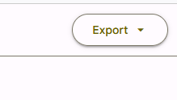

## Application Development II

## 420-5A6-AB
Instructor: Talib Hussain

Day 8: 
Material Design

---

Image from: https://img.freepik.com/premium-photo/phone-mobile-application-development-concept-mobile-internet-3d-illustration_76964-5164.jpg?size=626&ext=jpg

## Objectives

10 Minutes – Check bases with team on Milestone 1

Material Design

## Course Schedule

Sep 7 (Today!) – Assignment #1 due at midnight

Sep 11 – Quiz Kahoot #1 on Kotlin

Sep 13 (next 3 hr lab) – Milestone #1 due before class.  Presentations in class.

Sep 21 – Assignment #2 due midnight

Sep 25 – Quiz Kahoot #2 on Compose [Week 6]

Oct 5 – Assignment #3 due midnight

Oct 11 [Monday Schedule] – Quiz #3 on State/Event Handling

Oct 16 – Quiz Kahoot #4 on Navigation/Routing

Oct 18 – Milestone #2 due (Project design and Initial setup).  Presentations in class.

Oct 26 – Quiz Kahoot #5 on Coroutines/Flow/Storage [Week 10]

Nov 1: Sprint 1 ends; In-class review with Teacher

Nov 6 – Quiz Kahoot #6 on Authentication/TBD

(Tues Nov 14 is Monday schedule)

Nov 15: Sprint 2 ends; Milestone #3 due (Project design update, Preliminary code/demo)

Nov 29: Sprint 3 ends; In-class review with Teacher

Dec 6 [Last class]: Final project due and presentations.

## Digression on Documentation

* Goal:
  * Let another programmer know how to use your code
    * Mention each parameter and what it is for
  * Let yourself remember why you did what you did
  * Clarify explicitly any assumption made
  * If the algorithm is complicated, then describe the algorithm
* Expectation:
  * EVERY composable function you create contains documentation (meaningful).

## Material

* Material is a  __design system __ created by Google to help teams build high-quality digital experiences for Android, iOS, Flutter, and the web.
* It provides a number of components and layouts available as composable functions in Compose
  * Note: These components are also available in React and other languages.
* For those who did React last semester, this will feel very familiar…
* Read about it here:
  * [https://m3.material.io/get-started](https://m3.material.io/get-started)
  * [https://developer.android.com/jetpack/compose/layouts/material](https://developer.android.com/jetpack/compose/layouts/material)

## MaterialTheme

* A Material 3 theme contains the following subsystems: [color scheme](https://m3.material.io/styles/color/overview), [typography](https://m3.material.io/styles/typography/overview) and [shapes](https://m3.material.io/styles/shape/overview).
  * When you customize these values, your changes are automatically reflected in the Material 3 components you use to build your app.
* Generally, we use the MaterialTheme component at the highest level to provide a consistent theme throughout our app.
  * [https://developer.android.com/reference/kotlin/androidx/compose/material3/package-summary#materialtheme](https://developer.android.com/reference/kotlin/androidx/compose/material3/package-summary#materialtheme)
* We can just stick with the defaults by using it without parameters, e.g.:
  * @Composable
  * fun MyApp() {
  * MaterialTheme {
  * MyMainComposable()
  * }
  * }
* In the default project provided by Android Studio, we are actually using MaterialTheme
  * KotlinWithComposeTheme (defined in theme.kt) uses MaterialTheme

## Other Material UI Components

* There are many Material components we can use.
  * [https://developer.android.com/reference/kotlin/androidx/compose/material3/package-summary](https://developer.android.com/reference/kotlin/androidx/compose/material3/package-summary)
* Buttons – several types of button variants
  * Button, ElevatedButton, OutlinedButton, TextButton, FilledTonalButton.  Also many types of IconButtons.
  * [https://m3.material.io/components/all-buttons](https://m3.material.io/components/all-buttons)
  * [https://developer.android.com/reference/kotlin/androidx/compose/material3/package-summary#Button](https://developer.android.com/reference/kotlin/androidx/compose/material3/package-summary#Button)
* Cards – Several types of card variants
  * Card, ElevatedCard, OutlinedCard
  * [https://m3.material.io/components/cards/overview](https://m3.material.io/components/cards/overview)
  * [https://developer.android.com/reference/kotlin/androidx/compose/material3/package-summary#card](https://developer.android.com/reference/kotlin/androidx/compose/material3/package-summary#card)
  * Card(
  * onClick = { /* Do something */ },
  * modifier = Modifier.size(width = 180.dp, height = 100.dp)
  * ) {
  * Box(Modifier.fillMaxSize()) {
  * Image(…)
  * Text("Clickable", Modifier.align(Alignment.Center))
  * }
  * }
* Note: When using a Card, put @file:OptIn(ExperimentalMaterialApi::class) at the top (line 1) of your file
  * Otherwise it will complain about Card component when you build
  * Android Studio should offer this solution when the build fails.

## Try It! - Custom Theme

* [https://m3.material.io/theme-builder#/custom](https://m3.material.io/theme-builder#/custom)
  * [https://material.io/blog/material-theme-builder](https://m3.material.io/theme-builder#/custom)
  * [https://proandroiddev.com/how-to-create-a-truly-custom-theme-in-jetpack-compose-55fb4cd6d655](https://proandroiddev.com/how-to-create-a-truly-custom-theme-in-jetpack-compose-55fb4cd6d655)
* Click on the Primary color circle to bring up the Color Picker.
* Choose your desired colors with the sliders
* Can export the theme for Jetpack Compose by selecting the export button near the top right of the web page

## Applying the Theme to Your Project

* Copy Color.kt and Theme.kt from the exported zip file to your project in the ui.theme folder
  * Overwrite the existing ones if they are there (as in the default project)
  * If not there, create the ui subfolder and then create the theme subfolder in that
* Replace KotlinWithComposeTheme in MainActivity.kt with AppTheme
* Make sure the package line at the top of the theme files have the correct full package name (ending in ui.theme)
* Now, your Material components should use your new custom color scheme.
* You can also refer to colors in the theme explicitly to ensure the components you create are consistent with the theme

## Color.kt

package com.example.kotlinwithcompose.ui.theme

import androidx.compose.ui.graphics.Color

package com.example.kotlinwithcompose.ui.theme

import androidx.compose.ui.graphics.Color

val md_theme_light_primary = Color(0xFFB31963)

val md_theme_light_onPrimary = Color(0xFFFFFFFF)

val md_theme_light_primaryContainer = Color(0xFFFFD9E2)

val md_theme_light_onPrimaryContainer = Color(0xFF3E001D)

val md_theme_light_secondary = Color(0xFF74565F)

val md_theme_light_onSecondary = Color(0xFFFFFFFF)

val md_theme_light_secondaryContainer = Color(0xFFFFD9E2)

val md_theme_light_onSecondaryContainer = Color(0xFF2B151C)

val md_theme_light_tertiary = Color(0xFF7C5635)

val md_theme_light_onTertiary = Color(0xFFFFFFFF)

val md_theme_light_tertiaryContainer = Color(0xFFFFDCC1)

val md_theme_light_onTertiaryContainer = Color(0xFF2E1500)

val md_theme_light_error = Color(0xFFBA1A1A)

val md_theme_light_errorContainer = Color(0xFFFFDAD6)

val md_theme_light_onError = Color(0xFFFFFFFF)

val md_theme_light_onErrorContainer = Color(0xFF410002)

val md_theme_light_background = Color(0xFFFFFBFF)

val md_theme_light_onBackground = Color(0xFF201A1B)

val md_theme_light_surface = Color(0xFFFFFBFF)

val md_theme_light_onSurface = Color(0xFF201A1B)

val md_theme_light_surfaceVariant = Color(0xFFF2DDE1)

val md_theme_light_onSurfaceVariant = Color(0xFF514347)

val md_theme_light_outline = Color(0xFF837377)

val md_theme_light_inverseOnSurface = Color(0xFFFAEEEF)

val md_theme_light_inverseSurface = Color(0xFF352F30)

val md_theme_light_inversePrimary = Color(0xFFFFB1C8)

val md_theme_light_shadow = Color(0xFF000000)

val md_theme_light_surfaceTint = Color(0xFFB31963)

val md_theme_light_outlineVariant = Color(0xFFD5C2C6)

val md_theme_light_scrim = Color(0xFF000000)

val md_theme_dark_primary = Color(0xFFFFB1C8)

val md_theme_dark_onPrimary = Color(0xFF650033)

val md_theme_dark_primaryContainer = Color(0xFF8E004A)

val md_theme_dark_onPrimaryContainer = Color(0xFFFFD9E2)

val md_theme_dark_secondary = Color(0xFFE3BDC6)

val md_theme_dark_onSecondary = Color(0xFF422931)

val md_theme_dark_secondaryContainer = Color(0xFF5A3F47)

val md_theme_dark_onSecondaryContainer = Color(0xFFFFD9E2)

val md_theme_dark_tertiary = Color(0xFFEFBD94)

val md_theme_dark_onTertiary = Color(0xFF48290B)

val md_theme_dark_tertiaryContainer = Color(0xFF623F20)

val md_theme_dark_onTertiaryContainer = Color(0xFFFFDCC1)

val md_theme_dark_error = Color(0xFFFFB4AB)

val md_theme_dark_errorContainer = Color(0xFF93000A)

val md_theme_dark_onError = Color(0xFF690005)

val md_theme_dark_onErrorContainer = Color(0xFFFFDAD6)

val md_theme_dark_background = Color(0xFF201A1B)

val md_theme_dark_onBackground = Color(0xFFEBE0E1)

val md_theme_dark_surface = Color(0xFF201A1B)

val md_theme_dark_onSurface = Color(0xFFEBE0E1)

val md_theme_dark_surfaceVariant = Color(0xFF514347)

val md_theme_dark_onSurfaceVariant = Color(0xFFD5C2C6)

val md_theme_dark_outline = Color(0xFF9E8C90)

val md_theme_dark_inverseOnSurface = Color(0xFF201A1B)

val md_theme_dark_inverseSurface = Color(0xFFEBE0E1)

val md_theme_dark_inversePrimary = Color(0xFFB31963)

val md_theme_dark_shadow = Color(0xFF000000)

val md_theme_dark_surfaceTint = Color(0xFFFFB1C8)

val md_theme_dark_outlineVariant = Color(0xFF514347)

val md_theme_dark_scrim = Color(0xFF000000)

val seed = Color(0xFFB41A63)

## Theme.kt

private val DarkColors = darkColorScheme(

primary = md_theme_dark_primary,

onPrimary = md_theme_dark_onPrimary,

primaryContainer = md_theme_dark_primaryContainer,

onPrimaryContainer = md_theme_dark_onPrimaryContainer,

secondary = md_theme_dark_secondary,

onSecondary = md_theme_dark_onSecondary,

secondaryContainer = md_theme_dark_secondaryContainer,

onSecondaryContainer = md_theme_dark_onSecondaryContainer,

tertiary = md_theme_dark_tertiary,

onTertiary = md_theme_dark_onTertiary,

tertiaryContainer = md_theme_dark_tertiaryContainer,

onTertiaryContainer = md_theme_dark_onTertiaryContainer,

error = md_theme_dark_error,

errorContainer = md_theme_dark_errorContainer,

onError = md_theme_dark_onError,

onErrorContainer = md_theme_dark_onErrorContainer,

background = md_theme_dark_background,

onBackground = md_theme_dark_onBackground,

surface = md_theme_dark_surface,

onSurface = md_theme_dark_onSurface,

surfaceVariant = md_theme_dark_surfaceVariant,

onSurfaceVariant = md_theme_dark_onSurfaceVariant,

outline = md_theme_dark_outline,

inverseOnSurface = md_theme_dark_inverseOnSurface,

inverseSurface = md_theme_dark_inverseSurface,

inversePrimary = md_theme_dark_inversePrimary,

surfaceTint = md_theme_dark_surfaceTint,

outlineVariant = md_theme_dark_outlineVariant,

scrim = md_theme_dark_scrim,

)

@Composable

fun AppTheme(

useDarkTheme: Boolean = isSystemInDarkTheme(),

content: @Composable() () -> Unit

) {

val colors = if (!useDarkTheme) { LightColors } else { DarkColors }

MaterialTheme(

colorScheme = colors,

content = content

)

}

package com.example.kotlinwithcompose.ui.theme

import androidx.compose.foundation.isSystemInDarkTheme

import androidx.compose.material3.MaterialTheme

import androidx.compose.material3.lightColorScheme

import androidx.compose.material3.darkColorScheme

import androidx.compose.runtime.Composable

private val LightColors = lightColorScheme(

primary = md_theme_light_primary,

onPrimary = md_theme_light_onPrimary,

primaryContainer = md_theme_light_primaryContainer,

onPrimaryContainer = md_theme_light_onPrimaryContainer,

secondary = md_theme_light_secondary,

onSecondary = md_theme_light_onSecondary,

secondaryContainer = md_theme_light_secondaryContainer,

onSecondaryContainer = md_theme_light_onSecondaryContainer,

tertiary = md_theme_light_tertiary,

onTertiary = md_theme_light_onTertiary,

tertiaryContainer = md_theme_light_tertiaryContainer,

onTertiaryContainer = md_theme_light_onTertiaryContainer,

error = md_theme_light_error,

errorContainer = md_theme_light_errorContainer,

onError = md_theme_light_onError,

onErrorContainer = md_theme_light_onErrorContainer,

background = md_theme_light_background,

onBackground = md_theme_light_onBackground,

surface = md_theme_light_surface,

onSurface = md_theme_light_onSurface,

surfaceVariant = md_theme_light_surfaceVariant,

onSurfaceVariant = md_theme_light_onSurfaceVariant,

outline = md_theme_light_outline,

inverseOnSurface = md_theme_light_inverseOnSurface,

inverseSurface = md_theme_light_inverseSurface,

inversePrimary = md_theme_light_inversePrimary,

surfaceTint = md_theme_light_surfaceTint,

outlineVariant = md_theme_light_outlineVariant,

scrim = md_theme_light_scrim,

)

## Now let's add Custom Shapes

* [https://m3.material.io/styles/shape/overview](https://m3.material.io/styles/shape/overview)
* Create a Shape.kt file in ui.theme with the following content
  * Make sure to give it the correct package name
  * package <***>.ui.theme
  * import androidx.compose.foundation.shape.CutCornerShape
  * import androidx.compose.material3.Shapes
  * import androidx.compose.ui.unit.dp
  * val ThemeShapes = Shapes(
  * small = CutCornerShape(18.dp),
  * medium = CutCornerShape(14.dp),
  * large = CutCornerShape(10.dp)
  * )
* In Theme.kt, add the following line inside the MaterialTheme parameter list:
  * shapes = ThemeShapes
* Using this Shape theme, you can vary the shape of the corners used by some Material components (such as button) to make them more or less rounded at different sizes.
  * Possible shapes include RoundedCornerShape, CutCornerShape

## Assignment #1: Kotlin Program

* Worth 7% of final grade. Due Sep 7, midnight
  * Estimated Level of Effort: 4.5 hours – 1.5 hours class time and 3 hours homework.
* For this assignment, you will create a sorting program based on a binary search tree using the Kotlin language with OOP, data classes and lambdas.
* This is an Individual assignment
* The goal of this assignment is to demonstrate understanding of the Kotlin language
  * It is assumed you know how to create a Binary Search Tree (BST), insert into a BST, and traverse a BST in sorted order
  * The following link has some sample code as a reference: [https://www.baeldung.com/kotlin/binary-tree](https://www.baeldung.com/kotlin/binary-tree)
* Requirements
  * Use a data class to store at least three pieces of information about a Person (one String, one Int, and one nullable type)
  * Create a Node object that will be stored in the tree.  A Node will contain a Person, a left Node and a right Node.
  * Create a BinarySearchTree class that stores the tree
    * In its constructor, it should accept a lambda function that will be used to determine the sort order
    * Create an insert() function that will insert a Person into the tree (using the sorting function to keep the BST sorted in sorted order)
    * Create a toList() function that returns a list of all the Persons in the BST, in sorted order.
  * Repeat 3 times: Build a BST containing at least 10 Persons (using canned data, random data, user-entered data, etc.) and display the contents of the BST in sorted order.
    * All information about each Person should be displayed, in order.  If the nullable field is null, then display the word "Unknown".
    * You may display the information in the console (e.g., using println) or on the emulator screen using Compose.
    * You may leverage the code provided by the teacher for displaying a list in Compose.
  * BST 1: Lambda should sort in alphabetical order on the String field
  * BST 2: Lambda should sort in increasing order on the Int field
  * BST 3: Lambda should sort in size-of-String order on the String field
* Marking Scheme:
  * 80% Functionality – Meets requirements and works.
  * 20% Documentation – All classes and functions should have reasonable documentation describing their purpose and any assumptions
* Submission:
  * Submit zip file of entire project on Lea.  Do not submit the build folder.
* Late Penalty:
  * Late submissions lose 10% per day to a maximum of 3 days.
  * Nothing accepted after 3 days and a grade of zero will be given.
* Original work!
  * "Your submitted work must be clear, complete, and YOUR OWN.  You must be prepared to explain any of your work to me in person.  Failure to be able to defend your work, or do a similar question in front of me in person can/will void any grade you get on this assignment."

## Milestone 1: Analyzing an Existing App

* Worth 5% of final grade. Due Sep 13, 2:00pm (before any class presentations start)
  * Estimated Level of Effort: 3 hours – 1 hour class time and 2 hours homework (x3 people).
* For this milestone, you will get a better picture of what is possible using Kotlin and Jetpack Compose by inspecting sample applications from GitHub.  You will also learn more about project configuration, and get used to working with your teammates.
* This is a Group assignment
* The goal of this assignment is to demonstrate the ability to analyze existing code and to understand the basic structure and design of a Kotlin-Compose app
* Requirements:
  * Each team member should fork an existing Android application from the following link.
    * [https://github.com/android/compose-samples/](https://github.com/android/compose-samples/)
    * Each group must choose a different app.  Claim it on Teams Chat.
  * Each team member should build and run it locally
  * As a team, inspect the project file structure, the source code and the configuration files (yaml and gradle), as well as analyze the running product itself.
  * Give a presentation in class (with a slide deck) discussing your joint findings as follows:
    * A brief primer on the app itself (i.e., what is it, what can you do with it, etc.)
    * How is their Kotlin code structured and what you learned from this program about Kotlin
    * How is their Compose UI structured and what you learned from this program about Compose
    * What configuration approach the code uses and what you learned from it.
  * Each slide should indicate who created it and who presented it.
  * All team members must participate in the presentation
  * You have at most 10 minutes to present.
* Marking Scheme:
  * 25% Timeliness and professional conduct in presentation
  * 55% Quality of presentation content
  * 20% Individual contributions (Will be based on self-reports and teacher assessment)
* Submission:
  * Submit presentation file on Lea.
* Late Penalty:
  * __No lates allowed__ .  Presentation slides must be handed in on Lea by 2:00pm on September 13.
* Original work!
  * "Your submitted work must be clear, complete, and YOUR OWN.  You must be prepared to explain any of your work to me in person.  Failure to be able to defend your work, or do a similar question in front of me in person can/will void any grade you get on this assignment."

## Milestone #1 App Choice

* Group 1: JetChat
  * Will C., Griffin, Lauren
* Group 2: Rally
  * Jordan, Makena
* Group 3: JetSnack
  * Nitpreet, Aidan, Jose
* Group 4: JetSurvey
  * Jean-Rose, Anjeli, Cindy
* Group 5: Reply
  * Seth, Phil, Robert
* Group 6: Owl
  * Ryan, Will D., Brandon
* Group 7: Crane
  * Zakari, Kui Hua

## Next

