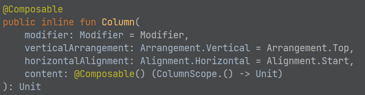
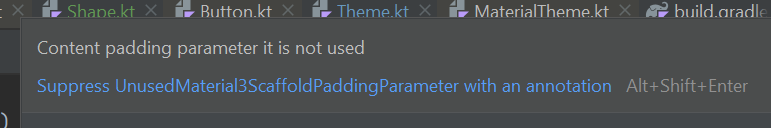

## Application Development II

## 420-5A6-AB
Instructor: Talib Hussain

Day 9: 
UI and State

---

Image from: https://img.freepik.com/premium-photo/phone-mobile-application-development-concept-mobile-internet-3d-illustration_76964-5164.jpg?size=626&ext=jpg

## Objectives

* Kahoot Quiz #1
* Scaffold
* Handout Assignment #2
* Mutable State
  * delegates  (by)
  * remember
  * rememberSaveable

## Course Schedule

Sep 7 – Assignment #1 due at midnight

__Sep 11 (Today) – Quiz Kahoot #1 on Kotlin__

Sep 13 (Wednesday) – Milestone #1 due before class.  Presentations in class.

Sep 21 – Assignment #2 due midnight

Sep 25 – Quiz Kahoot #2 on Compose [Week 6]

Oct 5 – Assignment #3 due midnight

Oct 11 [Monday Schedule] – Quiz #3 on State/Event Handling

Oct 16 – Quiz Kahoot #4 on Navigation/Routing

Oct 18 – Milestone #2 due (Project design and Initial setup).  Presentations in class.

Oct 26 – Quiz Kahoot #5 on Coroutines/Flow/Storage [Week 10]

Nov 1: Sprint 1 ends; In-class review with Teacher

Nov 6 – Quiz Kahoot #6 on Authentication/TBD

(Tues Nov 14 is Monday schedule)

Nov 15: Sprint 2 ends; Milestone #3 due (Project design update, Preliminary code/demo)

Nov 29: Sprint 3 ends; In-class review with Teacher

Dec 6 [Last class]: Final project due and presentations.

## 5 Min: Milestone 1 "Stand-Up"

Status/Planning for Wednesday's presentation

20 Minutes at end of class today

## Kahoot Quiz

## 

## Scaffold

* A common screen pattern that comes with Material.
  * [https://developer.android.com/jetpack/compose/layouts/material](https://developer.android.com/jetpack/compose/layouts/material)
* A Scaffold has the following common elements
  * title
  * topBar - [https://m3.material.io/components/top-app-bar/overview](https://m3.material.io/components/top-app-bar/overview)
    * Often use a TopAppBar component
    * [https://semicolonspace.com/jetpack-compose-topappbar/](https://semicolonspace.com/jetpack-compose-topappbar/)
    * [https://medium.com/google-developer-experts/exploring-jetpack-compose-topappbar-c8b79893be34](https://medium.com/google-developer-experts/exploring-jetpack-compose-topappbar-c8b79893be34)
    * [https://developer.android.com/reference/kotlin/androidx/compose/material3/package-summary#centeralignedtopappbar](https://developer.android.com/reference/kotlin/androidx/compose/material3/package-summary#centeralignedtopappbar)
  * bottomBar: [https://m3.material.io/components/bottom-app-bar/overview](https://m3.material.io/components/bottom-app-bar/overview)
    * Often a BottomAppBar
      * [https://developer.android.com/reference/kotlin/androidx/compose/material3/package-summary#bottomappbar](https://developer.android.com/reference/kotlin/androidx/compose/material3/package-summary#bottomappbar)
    * Or a NavigationBar
      * [https://m3.material.io/components/navigation-bar/overview](https://m3.material.io/components/navigation-bar/overview)
      * [https://developer.android.com/reference/kotlin/androidx/compose/material3/package-summary#navigationbar](https://developer.android.com/reference/kotlin/androidx/compose/material3/package-summary#navigationbar)
      * [https://itnext.io/navigation-bar-bottom-app-bar-in-jetpack-compose-with-material-3-c57ae317bd00](https://itnext.io/navigation-bar-bottom-app-bar-in-jetpack-compose-with-material-3-c57ae317bd00)
  * floatingActionButton
  * As well as the main content of the component

## it

* The keyword it is the implicit name of a single parameter
* Very often, a lambda expression has only one parameter.
* If the compiler can parse the signature without any parameters, the parameter does not need to be declared and -> can be omitted. The parameter will be implicitly declared under the name it
* Instead of
  * {str -> str.length >= 4}
* you can just use:
  * {it.length >= 4}

## Passing Trailing Lambdas

* [https://kotlinlang.org/docs/lambdas.html#passing-trailing-lambdas](https://kotlinlang.org/docs/lambdas.html#passing-trailing-lambdas)
* In Kotlin, one cool language feature is that if the  __last__  parameter of a function is a function, then a lambda expression passed as the corresponding argument can be placed outside the parentheses
  * This syntax is also known as  _trailing lambda_ .
* If the lambda is the only argument in that call, the parentheses can be omitted entirely
* For example, consider the following higher-order function:
  * fun searchThis(name: String, query: (String) -> Boolean): Boolean {
  * return query(name)
  * }
* The function can be called in four ways (varying passing in the lambda and using it or not)
  * searchThis("Joe", {str -> str.length >= 4})
  * searchThis("Jane") {    str -> str.length >= 4}
  * searchThis("Joe", {it.length >= 4})
  * searchThis("Jane") {    it.length >= 4}

* With the use of Passing Trailing Lambdas and the it keyword allowing us to omit ->, we get a very convenient syntax to use when calling Composables.
* If you look at the function definition for many Composables, you will see that the last parameter is a function (often called content).
  * Not all of them (e.g., checkout the Text composable)

## innerPadding

* The Scaffold composable allows the TopBar/BottomBar to overlap with the body by default.
* However, it provides a value that we can use to pad the scaffold to ensure the overlap doesn't happen.
* To use this, we can use the special keyword "it" to refer to the (implicit) lambda parameter that Scaffold passes to the body
  * Scaffold(
  * topBar = { TopAppBar(title = { Text("My App") }) },
  * bottomBar = { BottomAppBar { Text("Copyright (c) 2023 CoolEntertainment, Inc.") } },
  * floatingActionButton = { FloatingActionButton(onClick = {}) { Text("Click Me")} }
  * ) {
  * Column(modifier = Modifier.padding(paddingValues = it)) {
  * }
  * }
* Note: The IDE will give a compiler error with a suggestion to suppress the warning.   Don't do this.  Instead use the approach in the code above.
* Note: You might see online examples using an explicit lambda parameter as below, but this is much "clunkier" syntax than just using 'it'
  * Scaffold(
  * ) { innerPadding ->
  * Column(modifier = Modifier.padding(innerPadding)) {
  * }

## Consistency using Material Formatting

* Material offers a number of consistent text formatting options using MaterialTheme.typography
  * h1, h2, h3, body1, body2, etc.
  * E.g.,
  * Text(text="Welcome to My App", style=MaterialTheme.typography.h1)
* You can directly use the colors in the theme for consistency across your app using MaterialTheme.colors
  * E.g., Using a theme-consistent background color:
    * Column(
    * modifier = Modifier.padding(24.dp)
    * .fillMaxSize()
    * .background(MaterialTheme.colors.background)
* You can specify the shape of a component using MaterialTheme.shapes
  * E.g.,
    * modifier = Modifier.size(width = 180.dp, height = 180.dp).clip(MaterialTheme.shapes.small)

## Misc Formatting/Layouting

* Change opacity of an image
  * Image component has a parameter alpha that can be set of a float value between 0 and 1
  * E.g., alpha = 0.5F
* For a column, verticalArrangement has more than just top Arrangement.Center, .Bottom, .Top.  Also have .SpaceBetween, .SpaceAround, .SpaceEvenly.
* For a row, horizontalArrangement has several similar options too.
* For scaling, there are several options: Crop, Fit, FillBounds, FillHeight, FillWidth, Inside.
  * Some of these may stretch an image to fit, others may crop an image to fit, and some preserve the complete image.

## Example: BottomBar with Icons

bottomBar = {

BottomAppBar {

IconButton(

onClick = {}

) {

Icon(Icons.Filled.Menu, contentDescription = "Menu")

}

IconButton(

onClick = {}

) {

Icon(

Icons.Filled.AccountBox,

contentDescription = "Contacts"

)

}

IconButton(

onClick = {}

) {

Icon(Icons.Filled.Call, contentDescription = "Phone")

}

IconButton(

onClick = {}

) {

Icon(Icons.Filled.Add, contentDescription = "Add Contact")

}

}

}

## Example: Circular, cropped image

* Making a small circular image using clip and crop
  * Image(
  * painter = painterResource("penguin.jpg"),
  * contentDescription = "This image shows penguins",
  * modifier = Modifier.size(40.dp).clip(RoundedCornerShape(50.dp)),
  * contentScale = ContentScale.Crop
  * )
* Recall: Box lets you stack components on top of each other

## Try It!

* This codelab walks you through apply Material formatting in your Composables.
  * [https://developer.android.com/codelabs/basic-android-kotlin-compose-material-theming#2](https://developer.android.com/codelabs/basic-android-kotlin-compose-material-theming#2)

## Advanced Layout

* FlowRow, FlowColumn
  * [https://developer.android.com/jetpack/compose/layouts/flow](https://developer.android.com/jetpack/compose/layouts/flow)
  * fillMaxWidth(0.7f)  -- Fractional sizing
* Responsive design
  * [https://proandroiddev.com/adaptive-ui-with-jetpack-compose-968e375795d4](https://proandroiddev.com/adaptive-ui-with-jetpack-compose-968e375795d4)
  * [https://codelabs.developers.google.com/jetpack-compose-adaptability#0](https://codelabs.developers.google.com/jetpack-compose-adaptability#0)
* Old-school: ConstraintLayout
  * [https://developer.android.com/jetpack/compose/layouts/constraintlayout](https://developer.android.com/jetpack/compose/layouts/constraintlayout)
  * [https://dev.to/saketh/constraint-layout-in-jetpack-compose-create-complex-and-responsive-android-layouts-on-the-fly-47gd](https://dev.to/saketh/constraint-layout-in-jetpack-compose-create-complex-and-responsive-android-layouts-on-the-fly-47gd)

## Handout Assignment #2

## Milestone 1: Analyzing an Existing App

* Worth 5% of final grade. Due Sep 13, 2:00pm (before any class presentations start)
  * Estimated Level of Effort: 3 hours – 1 hour class time and 2 hours homework (x3 people).
* For this milestone, you will get a better picture of what is possible using Kotlin and Jetpack Compose by inspecting sample applications from GitHub.  You will also learn more about project configuration, and get used to working with your teammates.
* This is a Group assignment
* The goal of this assignment is to demonstrate the ability to analyze existing code and to understand the basic structure and design of a Kotlin-Compose app
* Requirements:
  * Each team member should fork an existing Android application from the following link.
    * [https://github.com/android/compose-samples/](https://github.com/android/compose-samples/)
    * Each group must choose a different app.  Claim it on Teams Chat.
  * Each team member should build and run it locally
  * As a team, inspect the project file structure, the source code and the configuration files (yaml and gradle), as well as analyze the running product itself.
  * Give a presentation in class (with a slide deck) discussing your joint findings as follows:
    * A brief primer on the app itself (i.e., what is it, what can you do with it, etc.)
    * How is their Kotlin code structured and what you learned from this program about Kotlin
    * How is their Compose UI structured and what you learned from this program about Compose
    * What configuration approach the code uses and what you learned from it.
  * Each slide should indicate who created it and who presented it.
  * All team members must participate in the presentation
  * You have at most 10 minutes to present.
* Marking Scheme:
  * 25% Timeliness and professional conduct in presentation
  * 55% Quality of presentation content
  * 20% Individual contributions (Will be based on self-reports and teacher assessment)
* Submission:
  * Submit presentation file on Lea.
* Late Penalty:
  * __No lates allowed__ .  Presentation slides must be handed in on Lea by 2:00pm on September 13.
* Original work!
  * "Your submitted work must be clear, complete, and YOUR OWN.  You must be prepared to explain any of your work to me in person.  Failure to be able to defend your work, or do a similar question in front of me in person can/will void any grade you get on this assignment."

## Milestone #1 App Choice

* Group 1: JetChat
  * Will C., Griffin, Lauren
* Group 2: Rally
  * Jordan, Makena
* Group 3: JetSnack
  * Nitpreet, Aidan, Jose
* Group 4: JetSurvey
  * Jean-Rose, Anjeli, Cindy
* Group 5: Reply
  * Seth, Phil, Robert
* Group 6: Owl
  * Ryan, Will D., Brandon
* Group 7: Crane
  * Zakari, Kui Hua

## Assignment #2: Single Screen, Interactive Compose App

* Worth 7% of grade.  Due Sep 21 by midnight.  This is an individual assignment.
* For this assignment, you will create a single screen mobile app that runs on an emulated Android, interacts with the user and uses state.
* The topic of the app is of your choice
  * Recommendation: Choose a screen/subject that may align with your eventual project.  Try to focus on something different than your teammates.
* The app must:
  * Be programmed in Kotlin and use Jetpack Compose for the UI
  * Use Material design
  * Contain multiple components and show good attention to layout
  * Show reasonable attention to styling/theming
  * Get user input (button and/or text input)
  * Update what is on the screen based on user input (using mutableState)
  * Display at least one list of information that the user has entered
  * Be robust to rotating the device
* The code must be documented internally and contain a Readme file
  * The internal documentation should be informative and meaningful (i.e., not vacuous)
  * The Readme should give a high-level indication of what the product is and how to use it.  If there are any known issues, they should be described/explained in the Readme.  The Readme file should live at the root level of the project.
* The code must compile and run.
  * If you submit something with compile errors or that shows no meaningful output, a high penalty will be assessed, as appropriate.
* The app should be usable – with clear wording/instructions and understandable, easy-to-use interface

* Marking Scheme:
  * 40% Functionality
  * 20% Styling/Layout
  * 20% Documentation
  * 20% Usability/Design
* Submission:
  * Submit zip file of entire project on Lea.
* Late Penalty:
  * Late submissions lose 10% per day to a maximum of 3 days
  * Nothing accepted after 3 days without prior arrangement and a grade of zero may be given.
  * Strong Recommendation: Submit incomplete version ON TIME with explanation of what is not done.  Submit completed version later with explanation of what changed.  This may result in a lower penalty than just submitting late.
* Original work!
  * "Your submitted work must be clear, complete, and YOUR OWN.  You must be prepared to explain any of your work to me in person.  Failure to be able to defend your work, or do a similar question in front of me in person can/will void any grade you get on this assignment."
  * Any code snippets copied or "highly inspired" from a 3rd party source or ChatGPT must be explicitly indicated (with source identified) in the code documentation or Readme.
    * The total amount of such non-original code should be a small portion of your code (rule of thumb is < 20%).
    * 3rd party code should not be used for key algorithmic capabilities that this assignment is focused on.  They should rather be used for more rote/simple parts of the code.  Credit for that portion of the project may not be given if it is key.
    * If excessive 3rd party contributions are used, your grade may be based proportionally only on the portion that is original.  (e.g., if 50% is original and that is worth a grade of 80% based on the marking scheme, then a total grade of 40% may be given).
    * If in any doubt regarding a 3rd party contribution – ask IN ADVANCE.  Ideally in writing so we both have backup if there are any questions later on.

## Next

