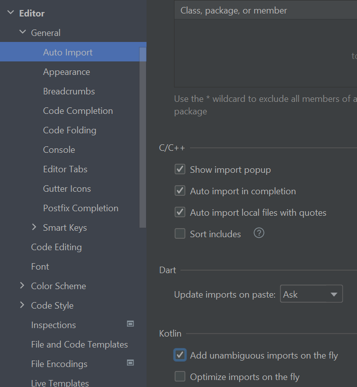
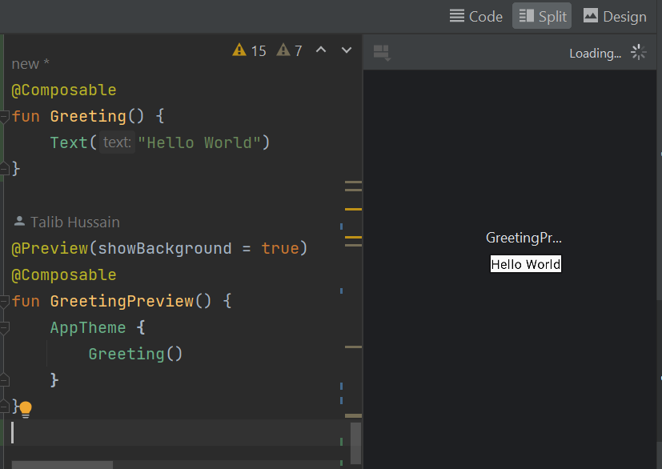
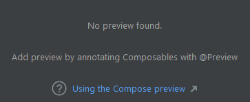
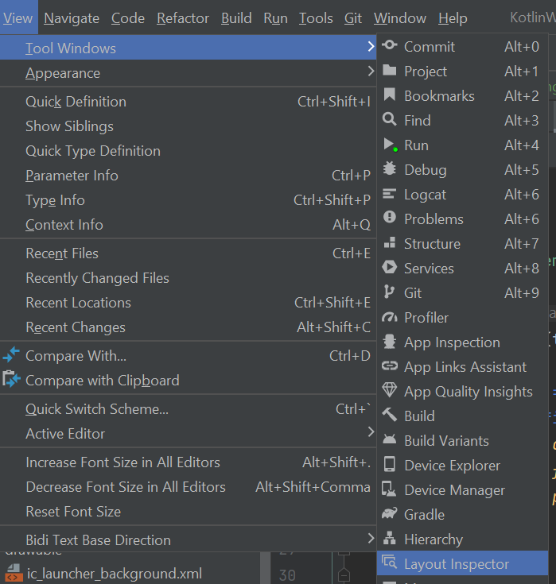
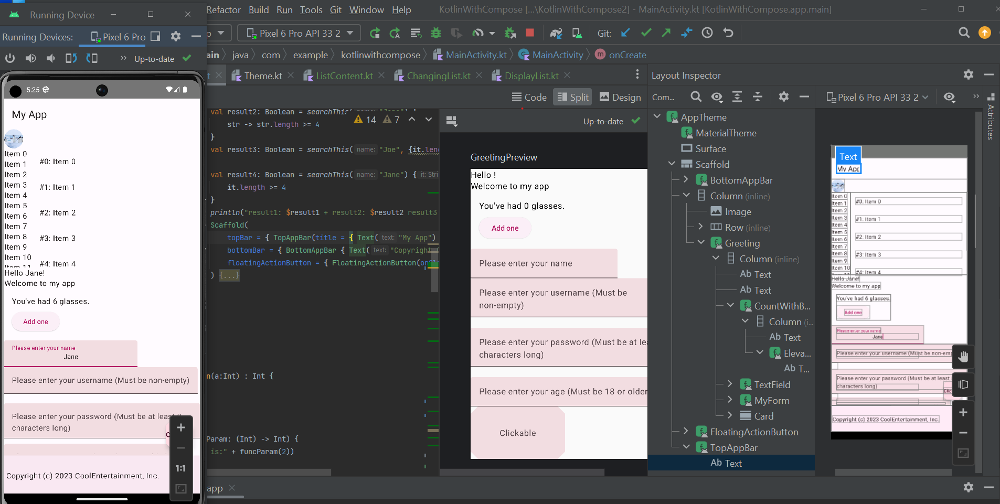
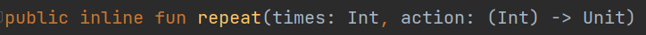
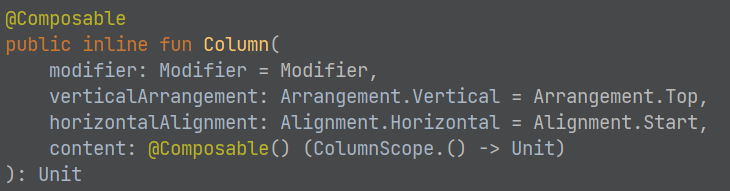
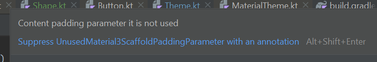
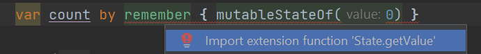
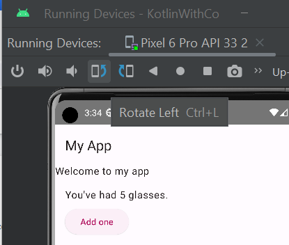

## Application Development II

## 420-5A6-AB
Instructor: Talib Hussain

Day 10: 
State

---

Image from: https://img.freepik.com/premium-photo/phone-mobile-application-development-concept-mobile-internet-3d-illustration_76964-5164.jpg?size=626&ext=jpg

## Objectives

Finish off Material Formatting

State

Milestone 1 presentations (2:00pm)

Basic I/O

## Course Schedule

Sep 7 – Assignment #1 due at midnight

Sep 11 (Today) – Quiz Kahoot #1 on Kotlin

__Sep 13 (Wednesday) – Milestone #1 due before class (2:00pm at latest).  Presentations in class.__

Sep 21 – Assignment #2 due midnight

Sep 25 – Quiz Kahoot #2 on Compose [Week 6]

Oct 5 – Assignment #3 due midnight

Oct 11 [Monday Schedule] – Quiz #3 on State/Event Handling

Oct 16 – Quiz Kahoot #4 on Navigation/Routing

Oct 18 – Milestone #2 due (Project design and Initial setup).  Presentations in class.

Oct 26 – Quiz Kahoot #5 on Coroutines/Flow/Storage [Week 10]

Nov 1: Sprint 1 ends; In-class review with Teacher

Nov 6 – Quiz Kahoot #6 on Authentication/TBD

(Tues Nov 14 is Monday schedule)

Nov 15: Sprint 2 ends; Milestone #3 due (Project design update, Preliminary code/demo)

Nov 29: Sprint 3 ends; In-class review with Teacher

Dec 6 [Last class]: Final project due and presentations.

## 

## @Preview

* The @Preview annotation can be added to a Composable.
  * This tells Android Studio that the composable should be shown in the design view for that file
* Access the design view using the "Split" or "Design" tab in the top right of the editor
  * This generates the preview if it exists
* [https://developer.android.com/jetpack/compose/tooling/previews](https://developer.android.com/jetpack/compose/tooling/previews)

## Layout Inspector

* The Layout Inspector in Android Studio lets you inspect a Compose layout inside a running app in an emulator or physical device.
  * [https://developer.android.com/jetpack/compose/tooling/layout-inspector](https://developer.android.com/jetpack/compose/tooling/layout-inspector)
* With the Layout Inspector, you can compare your app layout with design mockups, display a magnified or 3D view of your app, and examine details of its layout  _at runtime_
* Try it! Run an app in the emulator.  Bring up the Layout Inspector.  As you use the app, the Layout Inspector updates.
  * Click on a UI element in the inspector "screen" to go to that component in the inspector component tree
  * Drill down the tree to see what Composables are in use.
  * Double-click on a component in the component tree to bring up the relevant line of code that created that Composable.
* More on Tooling to support Compose
  * [https://medium.com/androiddevelopers/compose-tooling-42621bd8719b](https://medium.com/androiddevelopers/compose-tooling-42621bd8719b)

## 

## it

* The keyword it is the implicit name of a single parameter
* Very often, a lambda expression has only one parameter.
* If the compiler can parse the signature without any parameters, the parameter does not need to be declared and -> can be omitted. The parameter will be implicitly declared under the name it
* Instead of
  * {str -> str.length >= 4}
* you can just use:
  * {it.length >= 4}

## Trailing Lambda Syntax

* [https://kotlinlang.org/docs/lambdas.html#passing-trailing-lambdas](https://kotlinlang.org/docs/lambdas.html#passing-trailing-lambdas)
* In Kotlin, one cool language feature is that if the  __last__  parameter of a function is a function, then a lambda expression passed as the corresponding argument can be placed outside the parentheses
  * This neat "syntactic sugar" is also known as  _trailing lambda_ .
* If the lambda is the only argument in that call, the parentheses can be omitted entirely
* For example, consider the following higher-order function:
  * fun searchThis(name: String, query: (String) -> Boolean): Boolean {
  * return query(name)
  * }
* The function can be called in four ways (varying passing in the lambda and using it or not)
  * searchThis("Joe", {str -> str.length >= 4})
  * searchThis("Jane") {    str -> str.length >= 4}
  * searchThis("Joe", {it.length >= 4})
  * searchThis("Jane") {    it.length >= 4}

## Used in core Kotlin

* Some built-in Kotlin functions are defined using trailing lambdas
* E.g., repeat loop
  * repeat(3) {
  * println("Hello")
  * }
* Optional: This basic codelab (#5) introduces trailing lambdas
  * [https://developer.android.com/codelabs/basic-android-kotlin-compose-function-types-and-lambda#4](https://developer.android.com/codelabs/basic-android-kotlin-compose-function-types-and-lambda#4)

## Trailing Lambdas with Composables

* With the use of Passing Trailing Lambdas and the it keyword allowing us to omit ->, we get a very convenient syntax to use when calling Composables.
  * MyComposable(  _params_  ) {
  * _child content_
  * }
* This allows us to provide multi-line functions without crowding up the argument list
* If you look at the function definition for many Composables, you will see that the last parameter is a function (often called content).
  * Not all of them (e.g., checkout the Text composable)

## innerPadding

* The Scaffold composable allows the TopBar/BottomBar to overlap with the body by default.
* However, it provides a value that we can use to pad the scaffold to ensure the overlap doesn't happen.
* To use this, we can use the special keyword "it" to refer to the (implicit) lambda parameter that Scaffold passes to the body
  * Scaffold(
  * topBar = { TopAppBar(title = { Text("My App") }) },
  * bottomBar = { BottomAppBar { Text("Copyright (c) 2023 CoolEntertainment, Inc.") } },
  * floatingActionButton = { FloatingActionButton(onClick = {}) { Text("Click Me")} }
  * ) {
  * Column(modifier = Modifier.padding(paddingValues = it)) {
  * }
  * }
* Note: The IDE will give a compiler error with a suggestion to suppress the warning.   Don't do this.  Instead use the approach in the code above.
* Note: You might see online examples using an explicit lambda parameter as below, but this is much "clunkier" syntax than just using 'it'
  * Scaffold(
  * ) { innerPadding ->
  * Column(modifier = Modifier.padding(innerPadding)) {
  * }

## Try It!

* This codelab walks you through apply Material formatting in your Composables.
  * [https://developer.android.com/codelabs/basic-android-kotlin-compose-material-theming#2](https://developer.android.com/codelabs/basic-android-kotlin-compose-material-theming#2)

## Advanced Layout

* FlowRow, FlowColumn
  * [https://developer.android.com/jetpack/compose/layouts/flow](https://developer.android.com/jetpack/compose/layouts/flow)
  * fillMaxWidth(0.7f)  -- Fractional sizing
* Responsive design
  * [https://proandroiddev.com/adaptive-ui-with-jetpack-compose-968e375795d4](https://proandroiddev.com/adaptive-ui-with-jetpack-compose-968e375795d4)
  * [https://codelabs.developers.google.com/jetpack-compose-adaptability#0](https://codelabs.developers.google.com/jetpack-compose-adaptability#0)
* Old-school: ConstraintLayout
  * [https://developer.android.com/jetpack/compose/layouts/constraintlayout](https://developer.android.com/jetpack/compose/layouts/constraintlayout)
  * [https://dev.to/saketh/constraint-layout-in-jetpack-compose-create-complex-and-responsive-android-layouts-on-the-fly-47gd](https://dev.to/saketh/constraint-layout-in-jetpack-compose-create-complex-and-responsive-android-layouts-on-the-fly-47gd)

## State of a Composable

## Property Delegation

* Delegation is an object-oriented design pattern and Kotlin supports it natively
* Delegation Pattern means delegating the responsibility to other objects. It allows an object to communicate back to its owner in a decoupled way.
* Recall: Kotlin does not require you to define getters and setters
  * But, they still exist.  What is actually happening under the hood is that the Kotlin compiler is generating those getter and setter methods for you.
  * i.e., a property in Kotlin is effectively just a pair of getter and setter methods
* Using property delegation, the getter and setter for a particular field (e.g., "foo") can be "delegated" to another object (e.g., "bar")
  * This means, in effect, when you try to call the getter for foo, you will actually be calling a function from bar.
  * Specifically, you will call the "getValue" method on bar
* We use the "by" keyword to indicate property delegation
  * var foo: T by bar
* [https://kotlinlang.org/docs/delegated-properties.html](https://kotlinlang.org/docs/delegated-properties.html)

## Types of Delegate Properties

* There are 4 types of delegate properties in Kotlin
  * [https://waynestalk.com/en/kotlin-by-delegated-properties-en/](https://waynestalk.com/en/kotlin-by-delegated-properties-en/)
  * Lazy
    * Allows us to defer the initialization of a property until the first use of the property
  * __Observable__
    * __Implements a simple version of the Observer pattern__
    * __The observer pattern is a software design pattern in which an object, named the subject, maintains a list of its dependents, called observers, and notifies them automatically of any state changes__
  * Vetoable
    * We won't use for now
    * Is a variant of an observable delegate. When the property is being modified, it allows you to decide whether to allow the modification
  * NotNull
    * Similar to lateinit keyword, notNull allows you to declare a property without first initializing it.
    * However, lateinit does not support primitive types (such as Int and Long), you will have to use the notNull delegate instead
    * Note: Usually you will use lateinit or lazy.

## State

* Since composables in Kotlin are immutable, we require a state mechanism that will allow us to set or change a new state value and trigger a recomposition whenever that state value changes.
  * [https://developer.android.com/jetpack/compose/state](https://developer.android.com/jetpack/compose/state)
  * [https://dev.to/zachklipp/remember-mutablestateof-a-cheat-sheet-10ma](https://dev.to/zachklipp/remember-mutablestateof-a-cheat-sheet-10ma)
* We can set and change the state of the component using a MutableState object.
  * This approach is similar in principle to useState in React.
* The function mutableStateOf() creates an observable MutableState<T>, which is an observable type integrated with the compose runtime.
  * i.e., observer pattern – so when the value changes, it notifies its observers (i.e., the composable!)
* We must also use the keyword remember in order to avoid resetting the state value each time the component is recomposed.
* There are three ways to declare a MutableState object in a composable:
  * val mutableState = remember { mutableStateOf(default) }
  * __var value by remember { __  __mutableStateOf__  __(default) }__
  * val (value, setValue) = remember { mutableStateOf(default) }
* These are not quite the same.  We will generally use the delegate approach (with 'by')
  * A warning that indicates why delegate approach is better: [https://proandroiddev.com/you-might-be-creating-your-states-wrong-jetpack-compose-b8b1aff1bcd8](https://proandroiddev.com/you-might-be-creating-your-states-wrong-jetpack-compose-b8b1aff1bcd8)

* Approach 1:
  * val count = remember { mutableStateOf(0) }
  * Access or modify the value of the state variable using <statevariable>.value
  * e.g., count.value = 5
* Approach 2 -> Better
  * var count by remember { mutableStateOf(0) }
  * Access or modify the value of the state variable using <statevariable>
  * e.g. count = 5
  * Much easier to use!  However, you will need to import two functions State.getValue and State.setValue.  The IDE will help you out.

* Sample Composable that modifies state when user clicks a button
  * @Composable
  * fun CountWithButton() {
  * Column(modifier = Modifier.padding(16.dp)) {
  * var count by remember { mutableStateOf(0) }
  * Text("You've had ${count} glasses.")
  * Button(onClick = { count }, Modifier.padding(top = 8.dp)) {
  * Text("Add one")
  * }
  * }
  * }
* Add the above to your program.  Click the button a few times and notice how the display changes
* Now, press the screen rotation button in the emulator… what happens?

## rememberSaveable

* One of the challenges in UI development is handling state persistence and restoration during configuration changes, such as screen rotations.
* In Compose, when the phone configuration changes, the default behavior is for the composable function to recompose from scratch.
  * This potentially loses the current state.
* rememberSaveable behaves similarly to remember, but the stored value will survive the activity or process recreation using the saved instance state mechanism.
* This simplifies the process of saving and restoring state across recompositions.
* Example:
  * var count by rememberSaveable { mutableStateOf(0) }
  * Here, the count variable is declared as a state variable using rememberSaveable. It will automatically be saved and restored during configuration changes, ensuring that the UI retains its state.
* rememberSaveable is very useful, but when our state objects become large or complex, we'll want to use a different approach (ViewModels).
  * Later…

## TextField

* TextField is a Material composable for getting textual input from the user
  * [https://m3.material.io/components/text-fields/overview](https://m3.material.io/components/text-fields/overview)
  * [https://developer.android.com/reference/kotlin/androidx/compose/material3/package-summary#textfield](https://developer.android.com/reference/kotlin/androidx/compose/material3/package-summary#textfield)
* To make a good, usable text field, you want to make sure that the field shows the current value typed in by the user and that the component remembers that value in state.
* It is also good usability to provide a placeholder for the text field before the user enters any information
* The TextField component issues a ValueChange event every time the user changes the information in the test field.
* E.g.,
  * var name by rememberSaveable { mutableStateOf("") }
  * TextField(
  * value = name,
  * onValueChange = { name = it },
  * textStyle = TextStyle(textAlign = TextAlign.Center),
  * label = { Text(text = "Please enter your name")}
  * )
* Note: For some reason, my IDE didn't find the import for TextStyle.  If you have the same issue, it is:
  * import androidx.compose.ui.text.TextStyle
* Material also has an OutlinedTextField

## Try It! (State)

* Try the following codelab, up to the end of #8
  * [https://developer.android.com/codelabs/jetpack-compose-state#1](https://developer.android.com/codelabs/jetpack-compose-state#1)

## Milestone 1: Analyzing an Existing App

* Worth 5% of final grade. Due Sep 13, 2:00pm (before any class presentations start)
  * Estimated Level of Effort: 3 hours – 1 hour class time and 2 hours homework (x3 people).
* For this milestone, you will get a better picture of what is possible using Kotlin and Jetpack Compose by inspecting sample applications from GitHub.  You will also learn more about project configuration, and get used to working with your teammates.
* This is a Group assignment
* The goal of this assignment is to demonstrate the ability to analyze existing code and to understand the basic structure and design of a Kotlin-Compose app
* Requirements:
  * Each team member should fork an existing Android application from the following link.
    * [https://github.com/android/compose-samples/](https://github.com/android/compose-samples/)
    * Each group must choose a different app.  Claim it on Teams Chat.
  * Each team member should build and run it locally
  * As a team, inspect the project file structure, the source code and the configuration files (yaml and gradle), as well as analyze the running product itself.
  * Give a presentation in class (with a slide deck) discussing your joint findings as follows:
    * A brief primer on the app itself (i.e., what is it, what can you do with it, etc.)
    * How is their Kotlin code structured and what you learned from this program about Kotlin
    * How is their Compose UI structured and what you learned from this program about Compose
    * What configuration approach the code uses and what you learned from it.
  * Each slide should indicate who created it and who presented it.
  * All team members must participate in the presentation
  * You have at most 10 minutes to present.
* Marking Scheme:
  * 25% Timeliness and professional conduct in presentation
  * 55% Quality of presentation content
  * 20% Individual contributions (Will be based on self-reports and teacher assessment)
* Submission:
  * Submit presentation file on Lea.
* Late Penalty:
  * __No lates allowed__ .  Presentation slides must be handed in on Lea by 2:00pm on September 13.
* Original work!
  * "Your submitted work must be clear, complete, and YOUR OWN.  You must be prepared to explain any of your work to me in person.  Failure to be able to defend your work, or do a similar question in front of me in person can/will void any grade you get on this assignment."

## Milestone #1 App Choice

* Group 1: JetChat
  * Will C., Griffin, Lauren
* Group 2: Rally
  * Jordan, Makena
* Group 3: JetSnack
  * Nitpreet, Aidan, Jose
* Group 4: JetSurvey
  * Jean-Rose, Anjeli, Cindy
* Group 5: Reply
  * Seth, Phil, Robert
* Group 6: Owl
  * Ryan, Will D., Brandon
* Group 7: Crane
  * Zakari, Kui Hua

## Milestone 1 Presentations

## onClickable

* You can turn most components into the equivalent of buttons using Modifier.
  * Modifier.clickable(onClick = {count-- },
  * onClickLabel = "Decrement count")
  * Note: The optional onClickLabel is for accessibility purposes.  It does not actually display on the screen.

## Conditional Content

* You can change whether a particular component is displayed or not using a conditional statement
* Combined with a state variable, this lets you toggle visibility when, say, a user clicks a clickable.
  * E.g.,
    * var showImage by remember { mutableStateOf(true) }
    * Column() {
    * …
    * if (showImage.value) {
    * Image( … )
    * }
    * …
    * … in another composable:
    * onClick = { showImage.value = !showImage.value }
    * }

## Form

* We can create a form in our app using several TextFields and a Button to complete/"submit" the form.
* There are a variety of things we can do here:
  * Include logic to check the validity of the values entered in a text field
    * E.g., check that a given entry is long enough
  * Make the "submit" button appear only once something has been entered in all the text fields
    * Simply check the values of all the state variables associated with the text fields to make sure they are non-empty and "valid"
* Once the submit button is clicked, several things can be done:
  * All state values should be appropriately handled.
    * At this early stage, we can just put all those values into an object and save it to state.
  * The form elements should go away (i.e., gated content) or limited so that the user cannot change the values
  * The submit button should be disabled to prevent multiple submissions.
  * Perhaps pop-up a message (e.g., using Snack Bar) thanking them for submitting their information

## Sample Form

@Composable

fun MyForm() {

var nameValue by rememberSaveable { mutableStateOf("") }

var passwordValue by rememberSaveable { mutableStateOf("") }

var ageValue by rememberSaveable { mutableStateOf("") }

var loggedInStatus by rememberSaveable { mutableStateOf(false)}

Column {

if (!loggedInStatus) {

TextField(

value = nameValue,

onValueChange = { nameValue = it },

textStyle = TextStyle(textAlign = TextAlign.Center),

label = { Text(text = "Please enter your username (Must be non-empty)") }

)

Spacer(modifier = Modifier.height(20.dp).width(20.dp))

TextField(

value = passwordValue,

onValueChange = { passwordValue = it },

textStyle = TextStyle(textAlign = TextAlign.Center),

label = { Text(text = "Please enter your password (Must be at least 8 characters long)") }

)

Spacer(modifier = Modifier.height(20.dp).width(20.dp))

TextField(

value = ageValue,

onValueChange = { ageValue = it },

textStyle = TextStyle(textAlign = TextAlign.Center),

label = { Text(text = "Please enter your age (Must be 18 or older)") }

)

if (!nameValue.isEmpty() && !passwordValue.isEmpty()

&& passwordValue.length >= 8 && !ageValue.isEmpty()

&& ageValue.toInt() >= 18

) {

Button(onClick = { loggedInStatus = true }) {

Text("Signup")

}

}

}

else {

Text("Welcome $nameValue. You are $ageValue years old.")

}

}

## Try It!

* Create appropriate event handling for the onClick of your buttons and Card from earlier
  * Create appropriate state variables
  * Convert at least one component into a clickable and add event handling to it.
  * Make at least one component display only if a certain Boolean variable is true.
  * Toggle that variable in one of your buttons/clickables.
* Capture user textual input using a text field and display that information elsewhere on the screen
* Generally, play around with adding basic event handling to your screen and making it behave in a dynamic fashion based on the user's actions.
* Create a dynamic form with at least two text fields.

## Assignment #2: Single Screen, Interactive Compose App

* Worth 7% of grade.  Due Sep 21 by midnight.  This is an individual assignment.
* For this assignment, you will create a single screen mobile app that runs on an emulated Android, interacts with the user and uses state.
* The topic of the app is of your choice
  * Recommendation: Choose a screen/subject that may align with your eventual project.  Try to focus on something different than your teammates.
* The app must:
  * Be programmed in Kotlin and use Jetpack Compose for the UI
  * Use Material design
  * Contain multiple components and show good attention to layout
  * Show reasonable attention to styling/theming
  * Get user input (button and/or text input)
  * Update what is on the screen based on user input (using mutableState)
  * Display at least one list of information that the user has entered
  * Be robust to rotating the device
* The code must be documented internally and contain a Readme file
  * The internal documentation should be informative and meaningful (i.e., not vacuous)
  * The Readme should give a high-level indication of what the product is and how to use it.  If there are any known issues, they should be described/explained in the Readme.  The Readme file should live at the root level of the project.
* The code must compile and run.
  * If you submit something with compile errors or that shows no meaningful output, a high penalty will be assessed, as appropriate.
* The app should be usable – with clear wording/instructions and understandable, easy-to-use interface

* Marking Scheme:
  * 40% Functionality
  * 20% Styling/Layout
  * 20% Documentation
  * 20% Usability/Design
* Submission:
  * Submit zip file of entire project on Lea.
* Late Penalty:
  * Late submissions lose 10% per day to a maximum of 3 days
  * Nothing accepted after 3 days without prior arrangement and a grade of zero may be given.
  * Strong Recommendation: Submit incomplete version ON TIME with explanation of what is not done.  Submit completed version later with explanation of what changed.  This may result in a lower penalty than just submitting late.
* Original work!
  * "Your submitted work must be clear, complete, and YOUR OWN.  You must be prepared to explain any of your work to me in person.  Failure to be able to defend your work, or do a similar question in front of me in person can/will void any grade you get on this assignment."
  * Any code snippets copied or "highly inspired" from a 3rd party source or ChatGPT must be explicitly indicated (with source identified) in the code documentation or Readme.
    * The total amount of such non-original code should be a small portion of your code (rule of thumb is < 20%).
    * 3rd party code should not be used for key algorithmic capabilities that this assignment is focused on.  They should rather be used for more rote/simple parts of the code.  Credit for that portion of the project may not be given if it is key.
    * If excessive 3rd party contributions are used, your grade may be based proportionally only on the portion that is original.  (e.g., if 50% is original and that is worth a grade of 80% based on the marking scheme, then a total grade of 40% may be given).
    * If in any doubt regarding a 3rd party contribution – ask IN ADVANCE.  Ideally in writing so we both have backup if there are any questions later on.

## Next

More State

Displaying Lists

