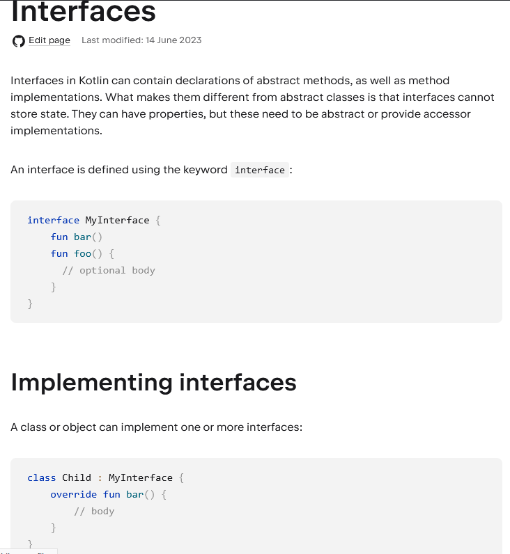

## Application Development II

## 420-5A6-AB
Instructor: Talib Hussain

Day 11: 
State and Lists

---

Image from: https://img.freepik.com/premium-photo/phone-mobile-application-development-concept-mobile-internet-3d-illustration_76964-5164.jpg?size=626&ext=jpg

## Objectives

* More State & I/O
  * State Sharing
  * State Hoisting
  * Stateless vs Stateful Components
* Lists
  * LazyColumn and LazyRow
  * Mutable state with lists

## Some Refactoring

* Now that we have gotten our coding feet wet and figured out some Compose basics, let's start getting into good coding habits
* We want to be able to break up our components into separate files.
* One simple approach is to have one composable per file
* So, take a few minutes to break out your code into separate files.

## Password Entry…

* We really don't want to see the password in the text field…
  * Add the following property to TextField:
    * visualTransformation = PasswordVisualTransformation(),
* We also don't want the keyboard to reveal what has been typed.
  * Add the following property to TextField or OutlinedTextField
    * keyboardOptions = KeyboardOptions(
    * keyboardType = KeyboardType.Password,
    * imeAction = ImeAction.Done
    * ),
* Make these changes as part of your refactor (if you had a password request).  Otherwise, add a composable with a TextField that requests a password and use this approach.
* There are a variety of options with regards to the keyboard thatyou can explore at the following links:
  * [https://developer.android.com/reference/kotlin/androidx/compose/foundation/text/KeyboardOptions](https://developer.android.com/reference/kotlin/androidx/compose/foundation/text/KeyboardOptions)
  * [https://developer.android.com/reference/kotlin/androidx/compose/ui/text/input/KeyboardType](https://developer.android.com/reference/kotlin/androidx/compose/ui/text/input/KeyboardType)

TextField(

value = passwordValue,

onValueChange = { passwordValue = it },

textStyle = TextStyle(textAlign = TextAlign.Center),

label = { Text(text = "Please enter your password") },

visualTransformation = PasswordVisualTransformation(),

keyboardOptions = KeyboardOptions(

keyboardType = KeyboardType.Password,

imeAction = ImeAction.Done

)

)

## Sharing State

* Now, we quickly run into an issue
  * What if we want to pass state information to a child component and have them change it?
* We need to pass down the value and a callback function to change the value separately.
  * This enables the child to call the callback function to make the desired change.
* To pass a function, we usually pass down a lambda function such as:
  * childComponent(count, setCount = { count = it})
* To accept a function as a parameter, we use this notation
  * fun childComponent(count: Int, setCount: (Int) -> Unit)
* To pass both the getter and setter from the parent, call:
  * childComponent(count, setCount = { count = it})
* To accept those parameters in the child, we use this notation
  * fun childComponent(count: Int, setCount: (Int) -> Unit)
* Inside the child function, we can call the callback (i.e., setCount), and this will cause the state in the parent to change.  That change in turn will lead to a recomposition.

## Passing value and setter

* At parent level:
  * ImageCard(showImage = showImage, setShowImage = { showImage = it},
  * count = count, setCount = { count = it})
* At child level:
  * fun ImageCard(showImage: Boolean, setShowImage: (Boolean) -> Unit,
  * count: Int, setCount: (Int) -> Unit)
  * …
  * onClick = { setShowImage(!showImage); setCount(count - 1) },
  * …
  * Text("Clickable ${count} ${showImage}", Modifier.align(Alignment.Center))

## State Hoisting

* When writing code with multiple components, it is important to declare the state variable at the highest necessary point in the component tree.
  * i.e., if several components in a branch of the component tree need to use a given variable, then that state variable should be defined in their shared ancestor (i.e., the root of the branch they are all part of).
* State that is hoisted this way has some important properties:
  * [https://developer.android.com/jetpack/compose/state#state-hoisting](https://developer.android.com/jetpack/compose/state#state-hoisting)
  * Single source of truth: By moving state instead of duplicating it, we're ensuring there's only one source of truth. This helps avoid bugs.
  * Encapsulated: Only stateful composables can modify their state. It's completely internal.
  * Shareable: Hoisted state can be shared with multiple composables. If you wanted to read name in a different composable, hoisting would allow you to do that.
  * Interceptable: callers to the stateless composables can decide to ignore or modify events before changing the state.
  * Decoupled: the state for the stateless ExpandingCard may be stored anywhere. For example, it's now possible to move name into a ViewModel.
* [https://www.kodeco.com/30172122-managing-state-in-jetpack-compose](https://www.kodeco.com/30172122-managing-state-in-jetpack-compose)

## Stateless vs Stateful Components

* Another good design principle is to create stateless components wherever possible.
* This lets us separate the logic for displaying the data from the source of the data
  * We can do this by hoisting state.
* In turn, this lets us
  * Re-use the display component for multiple different sources of data.
  * "preview" the stateless component
    * @preview to preview in Studio, but can't take any parameters
    * To be discussed later
  * Perform easier testing
* As you develop reusable Composables, you often want to expose both a Stateful and a Stateless version of the same composable
  * This results in pairs of similarly named components.  One that holds state and one that doesn't
  * One naming technique for a given pair is to use the exact same component name (but parameters will vary).
  * Another is to use similar but different names, and be consistent across your components.
  * You can also explicitly use the word Stateless or Stateful in the component name for clarity.
    * Note: In Flutter, this is the naming approach used.
* Links:
  * [https://developer.android.com/jetpack/compose/state#stateful-vs-stateless](https://developer.android.com/jetpack/compose/state#stateful-vs-stateless)
  * [https://peterchege.hashnode.dev/stateful-and-stateless-components-in-jetpack-compose](https://peterchege.hashnode.dev/stateful-and-stateless-components-in-jetpack-compose)

## Example: Stateful vs Stateless

/* Stateful Component */

@Composable

fun HelloScreen() {

var name by rememberSaveable { mutableStateOf("") }

HelloContent(name = name, onNameChange = { name = it })

}

/* Stateless Component */

@Composable

fun HelloContent(name: String, onNameChange: (String) -> Unit) {

Column(modifier = Modifier.padding(16.dp)) {

Text(

text = "Hello, $name",

modifier = Modifier.padding(bottom = 8.dp),

style = MaterialTheme.typography.bodyMedium

)

OutlinedTextField(value = name, onValueChange = onNameChange, label = { Text("Name") })

}

}

## Read It!

* Read through the following article.  It gives a very good set of examples DOs and DON'Ts related to state in Compose
  * [https://medium.com/@takahirom/jetpack-compose-state-guideline-494d467b6e76](https://medium.com/@takahirom/jetpack-compose-state-guideline-494d467b6e76)

## Displaying Lists: LazyColumn and LazyRow

* If you need to display a large number of items, or a list of unknown length, then using a layout such as Column can result in performance issues
  * ALL of the items will be composed and laid out whether or not they are visible on the device screen
  * Note: LazyColumn and LazyRow are equivalent to RecyclerView in Android Views, except entirely new composables are created as the user scrolls through the list.
* LazyColumn and LazyRow are two components that will only compose and layout those items that are current visible on the screen.
* They produce a vertical or horizontal scrolling list.
* These two components are a bit different from most other layouts in Compose.
* Inside the braces, instead of specifying Composables directly, you specify a sequence of specific commands to describe the item contents.
  * Technically this is termed a domain-specific language (DSL)
* [https://developer.android.com/jetpack/compose/lists](https://developer.android.com/jetpack/compose/lists)
* [https://developer.android.com/reference/kotlin/androidx/compose/foundation/lazy/LazyListScope](https://developer.android.com/reference/kotlin/androidx/compose/foundation/lazy/LazyListScope)
* [https://medium.com/@mal7othify/lists-using-lazycolumn-in-jetpack-compose-c70c39805fbc](https://medium.com/@mal7othify/lists-using-lazycolumn-in-jetpack-compose-c70c39805fbc)

## item() and items()

* The item() function adds a single items to the layout.
* The items(Int) function adds a given number of items to the layout
  * LazyColumn {
  * // Add a single item
  * item {
  * Text(text = "First item")
  * }
  * // Add 5 items
  * items(5) { index ->
  * Text(text = "Item: $index")
  * }
  * // Add another single item
  * item {
  * Text(text = "Last item")
  * }
  * }

## items(<list>) & itemsIndexed(<list>)

* A LazyColumn can also accept an existing list
* For example, if myList is a List<String>
  * LazyColumn {
  * items(myList) { item ->
  * Text(text = item)
  * }
  * }
  * }
* itemsIndexed can provide access to the item as well as its index.
  * itemsIndexed(myList) { index, item ->
  * Text(text = "#$index: $item")
  * }
* May need to manually import items/itemsIndexed
  * import androidx.compose.foundation.lazy.items
  * or
  * import androidx.compose.foundation.lazy.itemsIndexed

## Display list from state

* This example shows use a stateful and stateless component.
  * You will need to import androidx.compose.foundation.lazy.items
* /* Stateful */
* @Composable
* fun DisplayList() {
* val idList = remember { List<String>(100) { "Item $it" } }
* DisplayGivenList(idList = idList)
* }
* /* Stateless */
* @Composable
* fun DisplayGivenList(idList: List<String>) {
* LazyColumn {
* items(items=idList) { id ->
* Text(text = "" + id)
* }
* }
* }

A simple Kotlin List does not have .getValue() or .setValue() functions, so we can't use delegation

## Pass in function to apply to clicked item

Need to import the right thing

import androidx.compose.foundation.lazy.items

@Composable

fun ListContent(onItemClick: (String) -> Unit) {

val items: List<String> = remember { List(100) { "Item $it" } }

LazyColumn {

itemsIndexed(items) { index, item ->

Text(

text = "#$index: $item",

modifier = Modifier

.clickable { onItemClick(item) }

.fillMaxWidth()

.padding(16.dp)

)

}

}

}

## What about changing the displayed list?mutableStateListOf

* So far, we have been creating state variables that an unchanging lists
* But, we may want to add or remove elements to the list as the user uses our app
  * You'll need to do this in Assignment #2!
  * [https://medium.com/geekculture/add-remove-in-lazycolumn-list-aka-recyclerview-jetpack-compose-7c4a2464fc9f](https://medium.com/geekculture/add-remove-in-lazycolumn-list-aka-recyclerview-jetpack-compose-7c4a2464fc9f)
* To accomplish this, we need to use a mutable state with a List
* There are two ways to accomplish this.
  * Call .toMutableStateList() on an existing List object
  * Call mutableStateListOf() to create a mutable state with an empty List and then add/remove elements to your state
* Caution: Using mutable objects such as ArrayList<T> or mutableListOf() as state in Compose causes your users to see incorrect or stale data in your app.
  * Mutable objects that are not observable, such as ArrayList or a mutable data class, are not observable by Compose and don't trigger a recomposition when they change.
  * Instead of using non-observable mutable objects, the recommendation is to use an observable data holder such as State<List<T>> and the immutable listOf().
  * [https://dev.to/zachklipp/two-mutables-dont-make-a-right-2kgp](https://dev.to/zachklipp/two-mutables-dont-make-a-right-2kgp)

## Creating & Using a Mutable State List

* For example, this creates state with a MutableList that is initially empty
  * val todoList = remember { mutableStateListOf<String>() }
* These operations allow you to access the list:
  * items (todoList) { item ->
  * }
  * or
  * itemsIndexed(todoList) { index, item ->
  * }
* These operations update the list:
  * todoList.add("Information to add")
  * todoList.remove(item)
  * todoList.removeAt(index)

fun ChangingList() {

val todoList = rememberSaveable { mutableStateListOf<String>() }

LazyColumn {

item() {

Button(

onClick = {todoList.add("Do this ${todoList.size}")},

) {

Text(text = "Add Item")

}

}

itemsIndexed(todoList) { index, item ->

Text(

text = "#$index: $item",

modifier = Modifier

.clickable { todoList.remove(item) }

.padding(16.dp)

)

}

}

}

## Try It!

* Continue working on the following codelab.  Complete # 9, 10 & 11
  * This shows you how to do a checkbox list
  * [https://developer.android.com/codelabs/jetpack-compose-state#8](https://developer.android.com/codelabs/jetpack-compose-state#8)
* Optional: This codelab provides additional practice (including animating a list)
  * [https://developer.android.com/codelabs/jetpack-compose-basics#8](https://developer.android.com/codelabs/jetpack-compose-basics#8)

## Practice It!

* Complete the following codelab, which challenges you to display a list using Cards and Material Theming
  * [https://developer.android.com/codelabs/basic-android-kotlin-compose-practice-superheroes?hl=en#0](https://developer.android.com/codelabs/basic-android-kotlin-compose-practice-superheroes?hl=en#0)
  * Note: Solution code is provided at the end for reference.  But, try to do this on your own before looking.
* You now know everything you need to do Assignment #2

## Misc.

* LazyGrid
  * See [https://developer.android.com/jetpack/compose/lists](https://developer.android.com/jetpack/compose/lists)
* Advanced form operations
  * [https://www.section.io/engineering-education/jetpack-compose-forms/](https://www.section.io/engineering-education/jetpack-compose-forms/)
* More on Text Styling
  * [https://semicolonspace.com/jetpack-compose-text/](https://semicolonspace.com/jetpack-compose-text/)
* Returning multiple values from functions
  * [https://www.baeldung.com/kotlin/returning-multiple-values](https://www.baeldung.com/kotlin/returning-multiple-values)
* Destructuring declarations
  * [https://www.tutorialspoint.com/kotlin/kotlin_destructuring_declarations.htm](https://www.tutorialspoint.com/kotlin/kotlin_destructuring_declarations.htm)

## Misc.: Interfaces

* The colon : is used to indicate "implements an interface"
  * i.e., not just for "extends"
* [https://kotlinlang.org/docs/interfaces.html#implementing-interfaces](https://kotlinlang.org/docs/interfaces.html#implementing-interfaces)

## Assignment #2: Single Screen, Interactive Compose App

* Worth 7% of grade.  Due Sep 21 by midnight.  This is an individual assignment.
* For this assignment, you will create a single screen mobile app that runs on an emulated Android, interacts with the user and uses state.
* The topic of the app is of your choice
  * Recommendation: Choose a screen/subject that may align with your eventual project.  Try to focus on something different than your teammates.
* The app must:
  * Be programmed in Kotlin and use Jetpack Compose for the UI
  * Use Material design
  * Contain multiple components and show good attention to layout
  * Show reasonable attention to styling/theming
  * Get user input (button and/or text input)
  * Update what is on the screen based on user input (using mutableState)
  * Display at least one list of information that the user has entered
  * Be robust to rotating the device
* The code must be documented internally and contain a Readme file
  * The internal documentation should be informative and meaningful (i.e., not vacuous)
  * The Readme should give a high-level indication of what the product is and how to use it.  If there are any known issues, they should be described/explained in the Readme.  The Readme file should live at the root level of the project.
* The code must compile and run.
  * If you submit something with compile errors or that shows no meaningful output, a high penalty will be assessed, as appropriate.
* The app should be usable – with clear wording/instructions and understandable, easy-to-use interface

* Marking Scheme:
  * 40% Functionality
  * 20% Styling/Layout
  * 20% Documentation
  * 20% Usability/Design
* Submission:
  * Submit zip file of entire project on Lea.
* Late Penalty:
  * Late submissions lose 10% per day to a maximum of 3 days
  * Nothing accepted after 3 days without prior arrangement and a grade of zero may be given.
  * Strong Recommendation: Submit incomplete version ON TIME with explanation of what is not done.  Submit completed version later with explanation of what changed.  This may result in a lower penalty than just submitting late.
* Original work!
  * "Your submitted work must be clear, complete, and YOUR OWN.  You must be prepared to explain any of your work to me in person.  Failure to be able to defend your work, or do a similar question in front of me in person can/will void any grade you get on this assignment."
  * Any code snippets copied or "highly inspired" from a 3rd party source or ChatGPT must be explicitly indicated (with source identified) in the code documentation or Readme.
    * The total amount of such non-original code should be a small portion of your code (rule of thumb is < 20%).
    * 3rd party code should not be used for key algorithmic capabilities that this assignment is focused on.  They should rather be used for more rote/simple parts of the code.  Credit for that portion of the project may not be given if it is key.
    * If excessive 3rd party contributions are used, your grade may be based proportionally only on the portion that is original.  (e.g., if 50% is original and that is worth a grade of 80% based on the marking scheme, then a total grade of 40% may be given).
    * If in any doubt regarding a 3rd party contribution – ask IN ADVANCE.  Ideally in writing so we both have backup if there are any questions later on.

## Next

Navigating Multiple Screens

