## Firebase + KMM Steup

* In build\.gradle\.kts of shared:
* Under plugins\, add the following if it is not already there \(it probably is\)
  * kotlin\("plugin\.serialization"\)
* Under
  * sourceSets \{
  * val commonMain by getting \{
  * dependencies \{
* Add:
  * implementation\("dev\.gitlive:firebase\-auth:1\.8\.0"\)
  * implementation\("dev\.gitlive:firebase\-firestore:1\.8\.0"\)
* Then Sync Gradle

## Annotate FrogData class with @Serializable

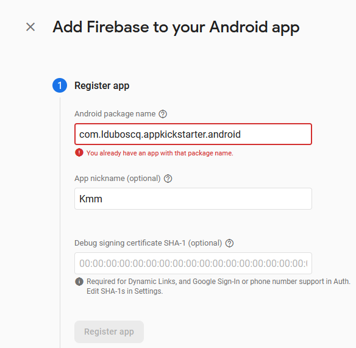

Add Firebase to an Android app

Enter your package name\, but alsoadd \.android at the end

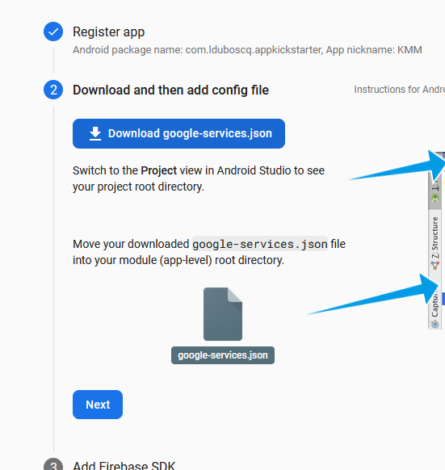

* Register App
* Download google\-services\.json
* Put it in the androidApp folder of your KMM project
* In androidApp/build\.gradle\.kts
  * Put this in plugins
    * id\("com\.google\.gms\.google\-services"\)
  * Put this in sourceSets
    * implementation\(platform\("com\.google\.firebase:firebase\-bom:32\.1\.1"\)\)

In build\.gradle\.kts in androidApp\, delete the word \.android from the package name in "applicationId"

In google\-services\.json\, delete \.android from the package name as well\.

Sync gradle and rebuild\.

This was a hack to get around an error having to do with the extra \.android that Kotlin Multiplatform adds\.

## Exercise 9 – Flutter and Firestore

Worth 0\.5%

In this exercise\, you will integrate Google's Firestore in your project from Exercise 7 and learn how to read and write data to the online database\.

Make sure to Git commit and push before making changes\.

## Firebase

* Follow the steps on the following slides to setup your flutter project to use Google's Firestore\.
* Additional info:
  * These links provide good information on how to connect your Flutter project to Firestore\.  The second link in particular is good to follow\. \(However\, it requires a bit more advanced knowledge
    * [https://firebase\.google\.com/codelabs/firebase\-get\-to\-know\-flutter](https://firebase.google.com/codelabs/firebase-get-to-know-flutter)
    * [https://firebase\.google\.com/codelabs/get\-started\-firebase\-emulators\-and\-flutter\##0](https://firebase.google.com/codelabs/get-started-firebase-emulators-and-flutter#0)
    * [https://firebase\.google\.com/docs/firestore/quickstart\##dart](https://firebase.google.com/docs/firestore/quickstart#dart)
      * Go to Dart/Flutter tab
  * The second codelab walks you through initial setup similar to what is the next slides\.
    * Key difference is that I recommend that you install firebase cli using npm\, not the indicated method
    * This will let things run more easily from the Terminal in Android Studio \(the other approach has setting\-the\-path issues\)\.

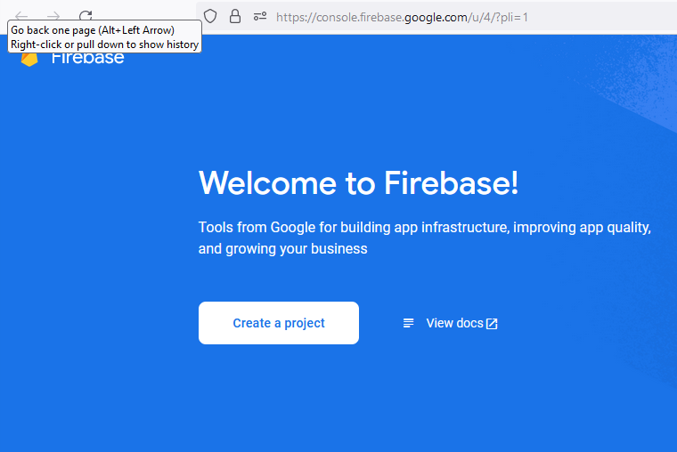

## Add a Project

[https://console\.firebase\.google\.com/u/0/?pli=1](https://console.firebase.google.com/u/0/?pli=1)

Give it a name

Say "no" to analytics \(otherwise there are more/unnecessary steps to setup\)

In the build menu on the left panel\, select "Firestore Database"

Choose "Create Database"

Choose Test Mode

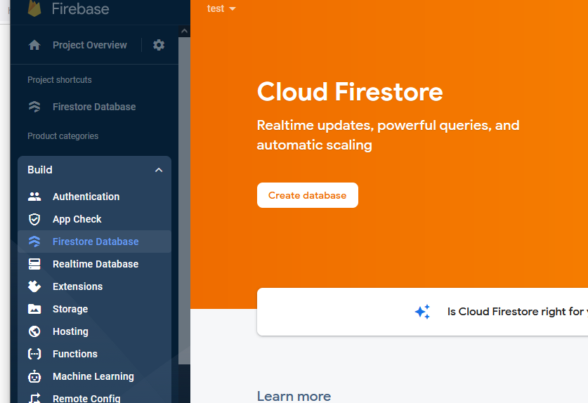

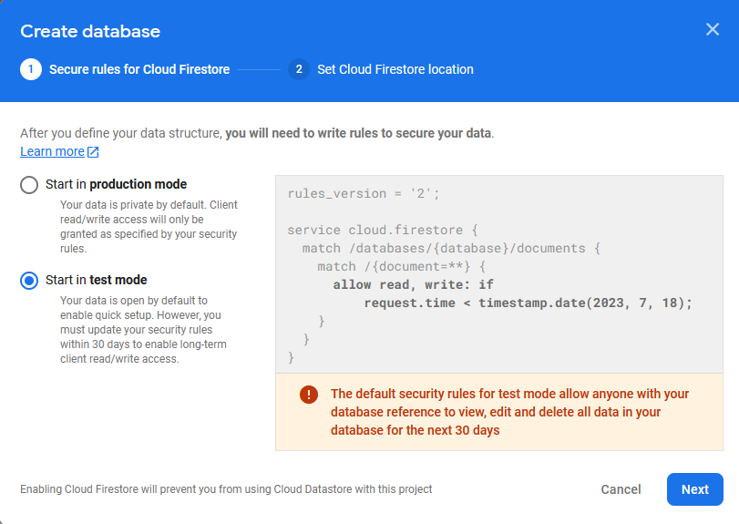

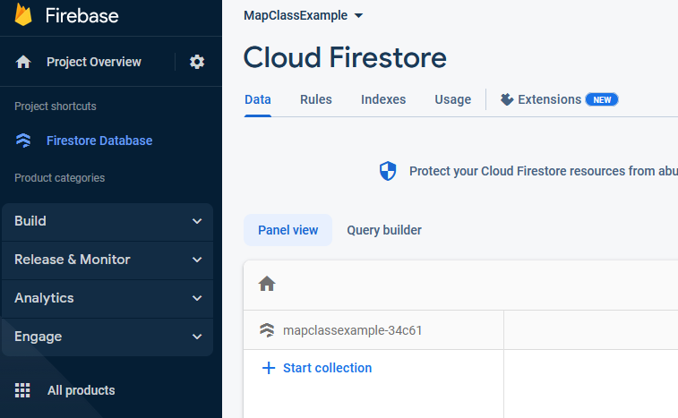

On the Firebase project page\, click the Flutter icon

This will walk you through some steps

to set things up\.

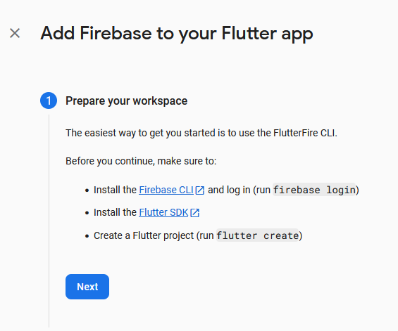

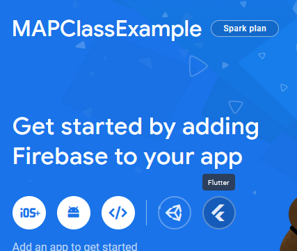

* Click the "npm" tab and follow instructions to install the CLI using npm\.  In a terminal in your Android Studio\, type:
  * npm install \-g firebase\-tools
  * If you don't have Node\.js installed\, then follow instructions to do so first\.
* Go to the next step \("Continue to login in and test the CLI"\)
* Login to firebase\.  In the terminal\, type the following:
  * Firebase login
* You may get a security error\.  In that case\, type the following in the terminal first\, then login again\.
  * Set\-ExecutionPolicy \-Scope Process \-ExecutionPolicy Bypass
  * From: https://www\.petenetlive\.com/KB/Article/0001417\##:~:text=Execute%20the%20following%20command%3B%20Set\-ExecutionPolicy%20\-Scope%20Process%20\-ExecutionPolicy\,if%20you%20are%20running%20a%20lot%20of%20scripts\.
* Eventually this should prompt you to provide the Firebase CLI with access to your google account in the web browser\.  Click 'Allow'

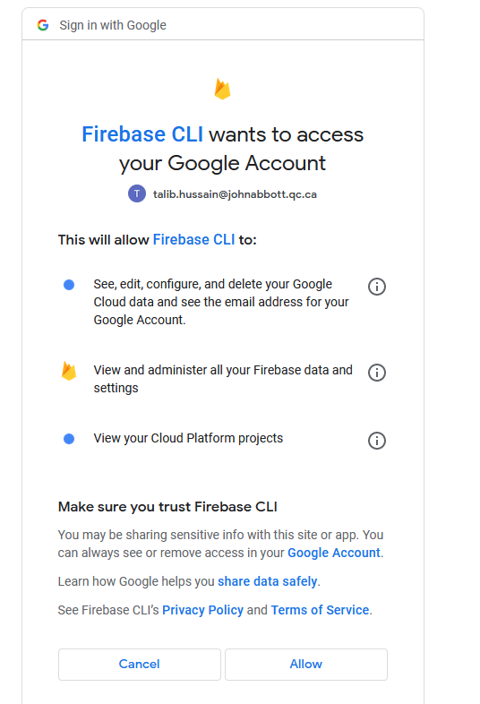

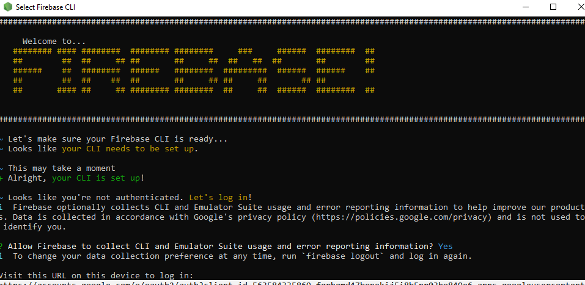

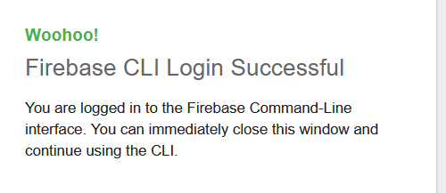

* Continue to follow directions for Step 2 on the "Add Firebase to your Flutter App page"
  * From the terminal in Android Studio: Install and run the FlutterFire CLI
    * From any directory\, run this command: dart pub global activate flutterfire\_cli
  * Add flutterfire to your path
    * E\.g\.\, Environment variables on PC\.
    * E\.g\.\, For me it is: C:\\Users\\Main\\AppData\\Local\\Pub\\Cache\\bin
    * For you it will have a different username  \(not "Main"\)
  * After setting the new path\, restart android studio so it will recognize the new path\.
  * Then\, at the root of your Flutter project directory\, run this command:
    * flutterfire configure \-\-project== __mapclassexample\-34c61__
    * The part in bold above will be different for your project\.  Copy the details of the above line from your webpage since it is specific to your project\.
  * This automatically registers your per\-platform apps with Firebase and adds a lib/firebase\_options\.dart configuration file to your Flutter project\.

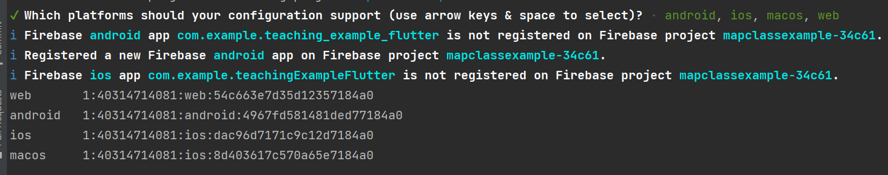

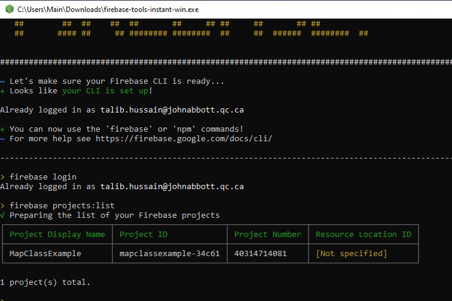

* Back in your terminal window\, make sure you are in the root folder of your project
  * Or\, open a new terminal window in Android Studio and you should be in the right root folder automatically\.
* Type 'firebase init'
  * Make sure the folder in the prompt is correct and say Y if it is\.
  * Choose both Firebase Realtime and Firestore\.
    * You can also choose emulators which should save setup time later on\.
  * [https://firebase\.google\.com/docs/database/rtdb\-vs\-firestore](https://firebase.google.com/docs/database/rtdb-vs-firestore)

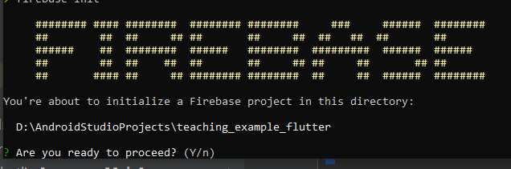

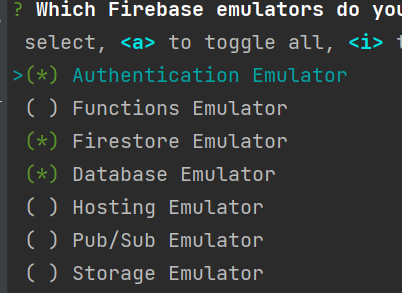

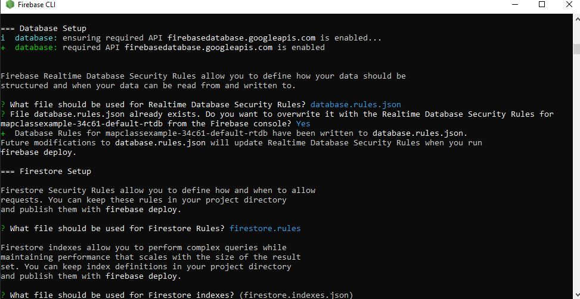

If you chose to add emulators now\, you should see a prompt like the following:

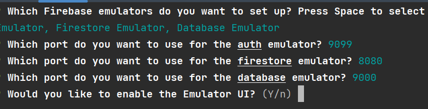

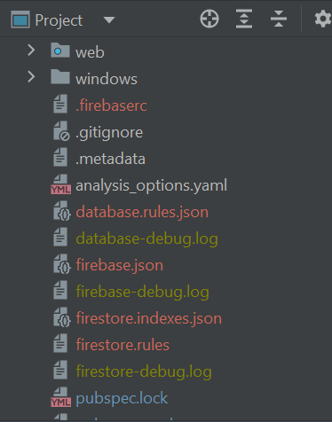

If you've done everything properly\, you should see a number of firebase related files in your flutter project

You may need to shift to "Project" view \(not Android\) in order to see them more easily\.

You may or may not see a banner near the top saying to get dependencies\.  If so\, Click "Get dependencies"\.

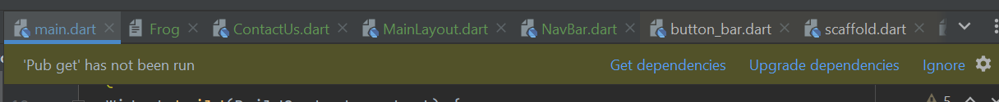

* Type the following in the terminal
  * flutter pub add cloud\_firestore
* You may get the following message:
  * _Building with plugins requires _  _symlink_  _ support\._
  * _Please enable Developer Mode in your system settings\. Run_
  * _  start _  _ms\-settings:developers_
  * _to open settings\._
* On PC\, type "developer settings" in the search box /Cortana and activate Developer Mode
* On Mac\, following any indicated instructions\.

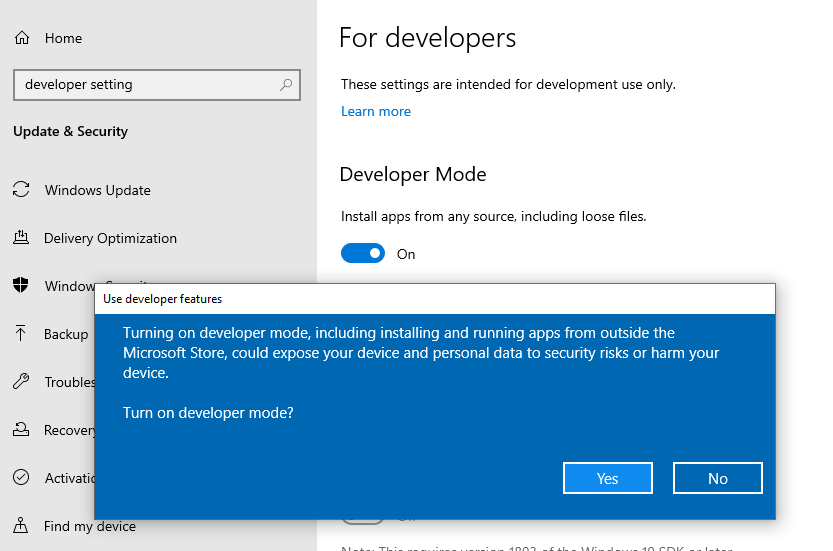

Capture a screenshot showing the file structure of your project with all the files added by the installation/configuration process above\.

## Now, let's write and read some data

* We are roughly following the coding approach on this page beginning at the "Initialize Cloud Firestore" section\.
  * [https://firebase\.google\.com/docs/firestore/quickstart\##dart](https://firebase.google.com/docs/firestore/quickstart#dart)
* In your main\.dart\, you need to initialize Firebase as follows:
  * import 'package:firebase\_core/firebase\_core\.dart';
  * void main\(\) async \{
  * await Firebase\.initializeApp\(
  * options: DefaultFirebaseOptions\.currentPlatform\,
  * \);
  * runApp\(MyApp\(\)\);
  * \}
* Create a new folder in lib called model \(i\.e\.\, lib/model\)
* Create a file called XXXRepository \(e\.g\.\, UserRepository\) in the model folder

* In your repository\, create an "add" function\.
  * void readData \(\) async \{
  * var db = FirebaseFirestore\.instance;
  * await db\.collection\("users"\)\.get\(\)\.then\(\(event\) \{
  * for \(var doc in event\.docs\) \{
  * print\("$\{doc\.id\} => $\{doc\.data\(\)\}"\);
  * \}
  * \}\);
  * \}

* Create write function
  * void writeData\(\) \{
  * var db = FirebaseFirestore\.instance;
  * // Create a new user with a first and last name
  * final user = \<String\, dynamic>\{
  * "first": "Ada"\,
  * "last": "Lovelace"\,
  * "born": 1815
  * \};
  * // Add a new document with a generated ID
  * db\.collection\("users"\)\.add\(user\)\.then\(\(DocumentReference doc\) =>
  * print\('DocumentSnapshot added with ID: $\{doc\.id\}'\)\);

## Wrap-Up Exercise 9

Take screenshots of your database on Firestore and the console outputs

Upload together with other screenshots for Exercise 9 to Lea\.

Commit and push changes to git\.

## Groupwork

