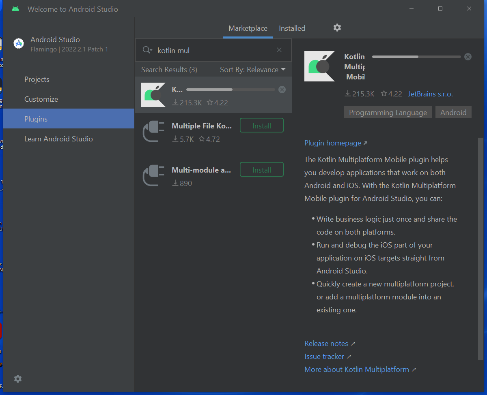
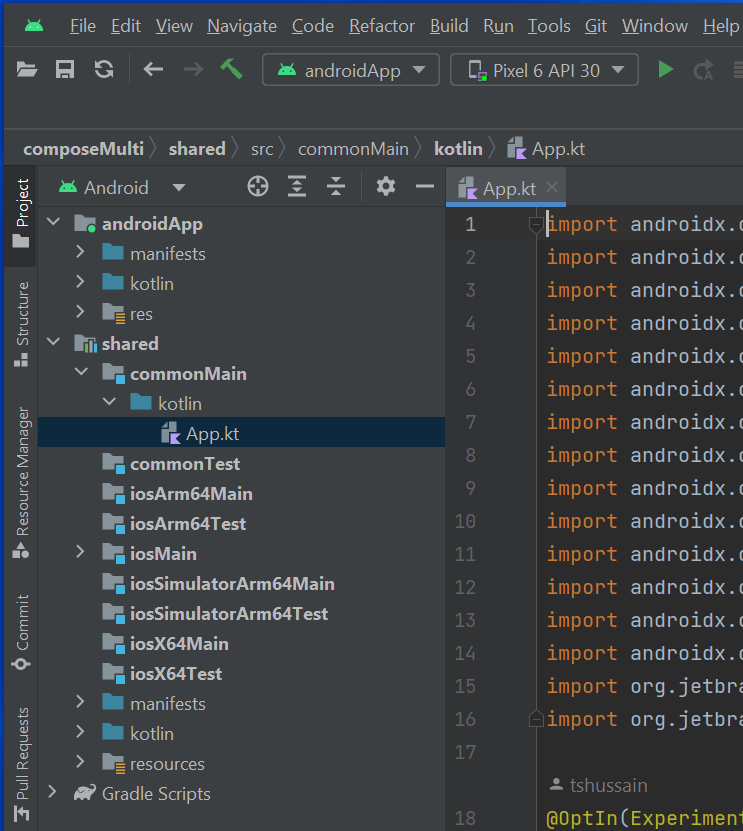
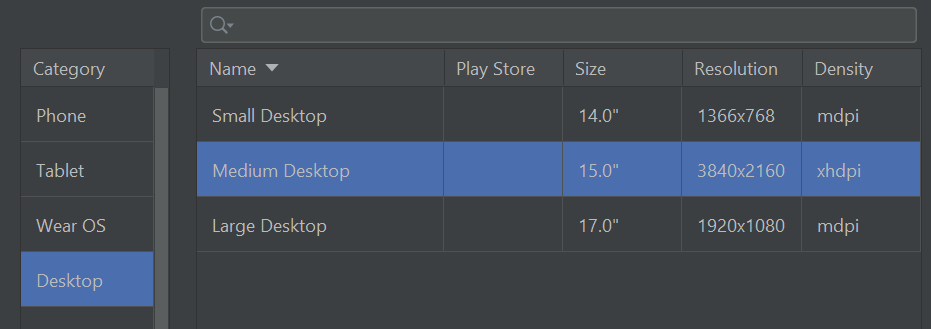

Worth 0\.5%

At key points, capture screenshots as indicated\. Zip those up and upload to Lea\.

## Setup

- [https://kotlinlang\.org/docs/multiplatform\-mobile\-setup\.html](https://kotlinlang.org/docs/multiplatform-mobile-setup.html)
  - Just Step 1\.
- Install Android Studio
  - [https://developer\.android\.com/studio](https://developer.android.com/studio)
  - Choose standard setup when asked
- Install JDK
  - [https://www\.oracle\.com/ca\-en/java/technologies/downloads/](https://www.oracle.com/ca-en/java/technologies/downloads/)
- In Android Studio, install these plugins:
  - Kotlin Multiplatform Mobile Plugin \(then Restart IDE\)
  - Compose Multiplatform Plugin
- On Mac at home: Xcode, Homebrew, kdoctor, cocoapods \(see next slide\)
  - Macs at JAC should be properly setup…
- Make sure you have a GitHub account and are signed in\.

Mac instructions \(Only on your own home machine\)

- Install Java JDK: [https://www\.oracle\.com/ca\-en/java/technologies/downloads/](https://www.oracle.com/ca-en/java/technologies/downloads/)
- Install Homebrew from terminal:
  - /bin/bash \-c "$\(curl \-fsSL [https://raw\.githubusercontent\.com/Homebrew/install/HEAD/install\.sh\)"](https://raw.githubusercontent.com/Homebrew/install/HEAD/install.sh)%22)
- Optional: Run a recommended sudo command \(shown on screen after homebrew install\)
- Install kdoctor from terminal
  - brew install kdoctor
- Optional if you are on your own Mac: Run recommended sudo/setup commands \(shown on screen after kdoctor command\)
  - sudo chown \-R $\(whoami\) /usr/local/share/zsh /usr/local/share/zsh/site\-functions /usr/local/var/homebrew/locks
  - chmod u\+w /usr/local/share/zsh /usr/local/share/zsh/site\-functions /usr/local/var/homebrew/locks
  - sudo chown \-R $\(whoami\) /usr/local/var/homebrew
- Open Xcode \(because it needs to be launched at least once\)
- Run the following sudo command in a terminal to get rid of "first launch" warning in kdoctor if it still appears:
  - sudo xcode\-select \-s /Applications/Xcode\.app/Contents/Developer
  - \(from [https://github\.com/JetBrains/compose\-multiplatform/issues/3186\)](https://github.com/JetBrains/compose-multiplatform/issues/3186))
- sudo gem install activesupport \-v 6\.1\.7\.3
- sudo gem install cocoapods
- Run kdoctor in the terminal\. You will probably get the following notice
  - ✖ CocoaPods requires your terminal to be using UTF\-8 encoding\.    Consider adding the following to ~/\.bash_profile    export LC_ALL=en_US\.UTF\-8
- In your user folder \(cd ~\), create a \.bash_profile with the contents:    export LC_ALL=en_US\.UTF\-8
- Upgrade Android Studio to the latest version \(Flamingo 2022\.2\.1\) if you have an older version installed\.

On a Mac with M1 chip, you need to use rvm:

[https://jeffreymorgan\.io/articles/ruby\-on\-macos\-with\-rvm/](https://jeffreymorgan.io/articles/ruby-on-macos-with-rvm/)

[https://rvm\.io/rvm/install](https://rvm.io/rvm/install)

[https://kotlinlang\.org/docs/native\-cocoapods\.html\##22e3fe9e](https://kotlinlang.org/docs/native-cocoapods.html#22e3fe9e)

## Compose Multiplatform

- [https://www\.jetbrains\.com/lp/compose\-multiplatform/](https://www.jetbrains.com/lp/compose-multiplatform/)
- Since Compose Multiplatform is in Alpha for iOS, we'll grab a template project that JetBrains has created for us\.
- Go to [https://github\.com/JetBrains/compose\-multiplatform\-ios\-android\-template\##readme](https://github.com/JetBrains/compose-multiplatform-ios-android-template#readme)
  - Choose "Use this Template"
  - Then "Create a new repository"
  - Give the repository a name
  - Suggest you make it "Private"

## Load project in Studio

Copy the git clone link for your project\.

In Android Studio, create a new project by "Get Project from Version Control"

It will take some time to build the project

## Let's Explore

- Open the Project pane and explore the directory structure
- Notice the 'shared' folder – This will hold our code that will be in common for both platforms \(Android and iOS\)
- If you are all setup properly,you should be able to click thegreen Run arrow\.
  - Note: You need to have anemulator installed
  - If not, load Device Manager paneand "Create Device"
- You should see your app runningin the emulator in the "Running Devices" tab
- Click the "Hello World" button

##

## Similarity to React

- Notice the rough similarity to React JSX
  - Nested UI components
    - @Composable indicates a UI component much like a JSK component
  - Named "properties" on components
    - Really are named parameters to functions in Kotlin
  - "Single Activity" design pattern
    - Similar in rough concept to single page app design of React
  - State management and re\-render UI when state changes

##

- That sure doesn't look like Java…
- fun?
- var?
- Where are the semi\-colons?
- … ExperimentalResourceApi – yikes\!
  - Welcome to alpha/beta…

## Let's also run it as a Desktop App!

- Device Manager – Create Device
- Pick a desktop and complete the steps\.
  - It may take a while to download\.
- Then Change the run target and run\.

##

Capture screenshot showing both the desktop and Android emulator running\.

Save with a name like "Lab1_a"

## Let's run it as an iOS App…

- If you're running a PC, sign in to a Mac computer online using Splashtop
  - Use chat to say which computer you are using so no 2 people are on the same machine\.
  - Teacher is on BH408\-01\.
- Open a terminal and run kdoctor
- It should give you all green checkmarks except perhaps the following:
  - ✖ CocoaPods requires your terminal to be using UTF\-8 encoding\.    Consider adding the following to ~/\.bash_profile    export LC_ALL=en_US\.UTF\-8
  - If so, then in your user folder \(cd ~\), create a \.bash_profile with the contents:    export LC_ALL=en_US\.UTF\-8
- Open Android Studio and follow the earlier instructions to pull down the sample project\. Run against an iPhone device\.

##

- Capture screenshot showing the iOS emulator
  - If you can, try to get all 3 emulators running on the same screen… cool\.
- Save with a name like "Lab1_b"
- Upload Lab1_a & Lab1_b to Lea\.

