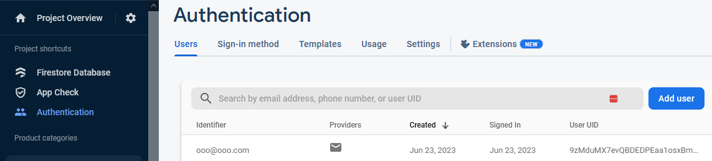

Before starting: Make sure you have committed & pushed!

We need to add the firebase_auth plugin

- flutter pub add firebase_auth
- If you haven't already from the earlier exercise, also:
  - flutter pub add firebase_core
  - flutter pub add provider

At the top of the files that access the auth capabilities, you will need to import the package

- import 'package:firebase_auth/firebase_auth.dart';

We won't be using emulators per se, but be aware that they are available, which will let you develop offline if needed.

## Setup on Firebase online

Go to your console.firebase.google.com and go to the authentication page in the build menu on the left

Click Get Started

##

Choose the email/password provider and enable it.

## Walkthrough of Link and Teacher Code

Mostly the same as the link

- [https://dev.to/raajeevchandran/firebase-authentication-and-keeping-users-logged-in-with-provider-in-flutter-9j5](https://dev.to/raajeevchandran/firebase-authentication-and-keeping-users-logged-in-with-provider-in-flutter-9j5)
- Teacher code in class materials: teaching_example_flutter_June23_withAuth

New way of accessing provider: context.watch / context.read

- Can also still use Provider.of

We'll rename the former "User" and "UserRepository" to be "Profile" and "ProfileRepository" to avoid confusion with an auth package provided "User" object

We'll create an "AuthRepository" that will perform our sign-in/sign-up operations using firebase auth.

We'll perform a joint operation when registering a user

- The "Profile" repository will have a handle on the "Auth" repository
- When adding a new user, the Profile repository will call the auth repository first and then create the profile if successful.
  - i.e., perform both asynchronous operations in a single method to avoid inconsistencies and simplify what we need to do in the UI widget.

Finally, once everything is setup, we can use the information about the currently authorized user to retrieve that user's profile information from the profile repository.

After addUser is updated and ProfileRepository is properly connected to the AuthRepository, clicking on your register link should resuly in a new user being created in Firebase.

In your console.firebase.google.com, click on Authentication on the menu on the left and look at the Users tab. You should see your new user.

## Exercise 11 Wrap-Up

Capture screenshot of your online authentication database showing created users

Capture screenshots of your app showing logged in and logged out status.

If you have other gated content (e.g., UserGrid), capture screenshots showing those before and after log in

Zip up your screenshots and upload to Lea.

