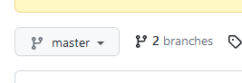

Worth 0.5%

Let's learn about making and merging branches in Git.

Create a branch [Git -> New Branch] Call it Branch1.

Create another branch. Call it Branch2.

Make some changes in Branch2 and commit them. When done, push your changes.

- Make several changes and several commits. Name the commits something like "branch 2 – change 1", etc.

Switch to Branch1 [Git -> Branches -> Choose Branch1 -> "Checkout"]

Make some changes in Branch1 and commit them. When done, push your changes.

- Make some changes in the exact same place as the changes you made in branch 2, and some that are in different places.
- Again, make multiple commits with naming like "branch 1 – change 1", etc.

Merge your Branch1 into main (may be called master). This will be a "fast-forward merge".

- Switch to main [Git -> Branches -> Main/Master -> Checkout]
- Pull to make sure you have all the latest (there should be no changes)
- Merge your Branch1 into main [Git -> Merge -> Select Branch1 from pull-down and click Merge]

Since this is a "fast-forward", there should be no issues. If you click commit, it will say there are no files to commit. Why? Because main now includes the last committed changes from Branch1 – there are no uncommitted changes.

- It is still a good idea to run your code to make sure everything works and that you didn't introduce an unintentional error in your branch or in the merge.
- If there are issues, then fix the issues, commit the changes.

Assuming no issues (code compiles and runs), push main

- We want the remote repository to be updated with the merge.
- Note: Do NOT push until issues are resolved – All your edits to main are still local and you can still "fix" things without affecting your teammates.

Now, switch to Branch2 ("checkout" that branch)

Merge main into branch 2 [Git -> Merge -> Choose Main/Master from pull-down and click merge]

You should see a popup indicating that there are some conflicts

Resolve the merge conflicts by choosing the "Merge" button in the pop-up window

This will bring up 3 files in an editor view showing the changes from your branch on one side, the changes in main on the other, and a merged view in the middle. Use the >> and/or << (in green below) to bring the conflicted lines into the merged version. Or, just type what you really want to have in the merged code and dismiss the conflicting changes using the X (in red below)

- Capture a screenshot of your 3-way merge editor view (should look similar to the next slide but with your code changes)

## Exercise 12

When you have resolved all conflicts in the files, click "Apply"

Commit the merges (still in Branch2)

- Provide a meaningful commit message (e.g. "Merged branch2 with main")

Verify the code compiles and runs

- This is particularly important here since it was not a fast-forward merge.
- Commit (but don't push) changes until issues are resolved.

Assuming no issues (code compiles and runs), push Branch2

- Note: Do NOT push until issues are resolved – All your edits to main are still local and you can still "fix" things without affecting your teammates.

Merge your Branch2 into main

- Switch to main
- Pull to make sure you have all the latest (there should be no changes)
- Merge your Branch2 into main

Verify your code works. Assuming no issues, push main

Explore the git history [Git -> Show Git Log]

- You should see the two different sets of commits as nodes in "branches" that have "merged" back together.
- The specific commit messages from each branch will align with the corresponding "node".

## Exercise 12 Wrap-Up

Capture a screenshot of your Git History from Android Studio

Go to your Github page. Click on the "branches" icon (circled in red).

Capture a screenshot showing the list of branches

Finally, click the "View Branch Activity" icon (circled in green above) on that branches page

Take a screenshot of the list of commits. These should be the same as what you saw in Android Studio.

- If they are not, then you forgot to push!

Zip up your screenshots and submit to Lea.

## Main…

It is possible that your local git setup may still default to using "master". You can change that default to use "main" if you wish. You would need to do this before creating your team's project.

Type the following into the terminal:

- git config --global init.defaultBranch main

If you've already setup the project in GitHub, you can rename the branch.

- In GitHub, Click the "edit button" next to the "master" branch name on the branches page.
- Enter "main" as the new name.

Then, the easiest thing to do is to re-clone your entire project in Android Studio

- Move your old project to a temporary location
- In Android Studio, File –> New Project from Version Control and enter the clone URL from GitHub.
- Pub get and rebuild.
- Alternatively, you can try deleting local branches, but it might not work out…
  - [https://stackoverflow.com/questions/65606404/can-i-change-the-default-git-branch-in-android-studio](https://stackoverflow.com/questions/65606404/can-i-change-the-default-git-branch-in-android-studio)

